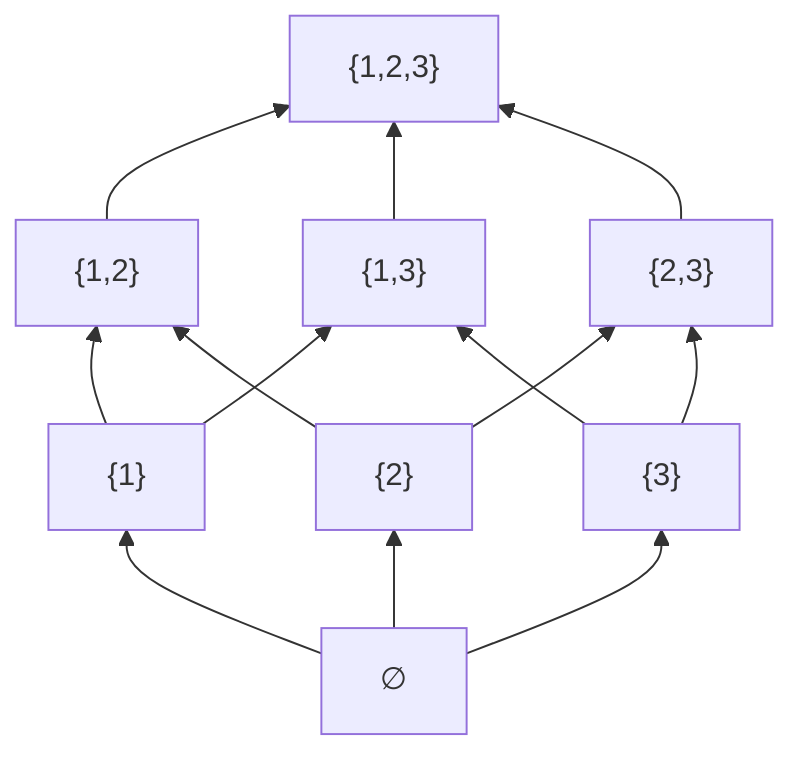
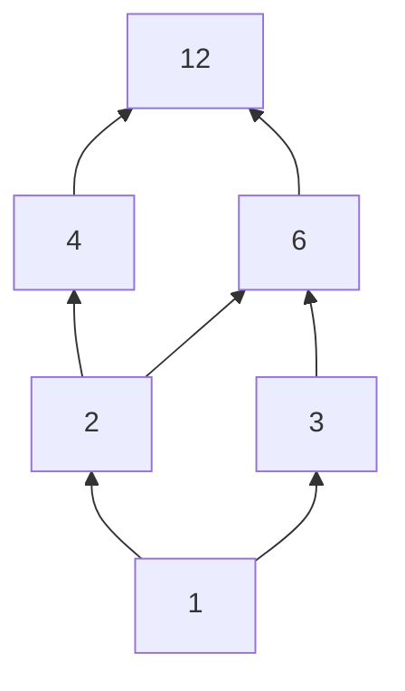

## Learning Objectives

- Define a partial order as a relation that is reflexive, antisymmetric, and transitive, and verify all three properties on a concrete example.
- Distinguish a partial order from a total order by identifying comparable versus incomparable pairs of elements.
- Draw and interpret a Hasse diagram for a finite poset, including correctly identifying its minimal, maximal, least, and greatest elements.
- Determine whether a subset of a poset has an upper bound, lower bound, least upper bound (join), or greatest lower bound (meet).
- Explain why "comes before" relationships in real systems (task scheduling, type hierarchies, set containment) are naturally partial rather than total orders.

## Context & Motivation

Not every notion of "comes before" needs to compare every pair of things to everything else. Two tasks in a build system might genuinely have no ordering constraint between them — task A doesn't need to happen before task B, and B doesn't need to happen before A, because they're independent — while other pairs are strictly ordered (compile before link). Two sets, {1,2} and {3,4}, are simply incomparable under "subset of" — neither is contained in the other — while {1,2} and {1,2,3} are comparable, with the first before the second. This is exactly the situation a **total order** (like ≤ on the integers, where any two numbers can always be compared) cannot capture, because a total order insists every pair be comparable. A **partial order** relaxes that requirement: it keeps reflexivity, antisymmetry, and transitivity — the structural backbone of "comes before" — while dropping the requirement that every pair be comparable at all. Some pairs simply aren't ordered relative to each other, and the theory is built to handle that as the normal case, not an exception.

This generalization is what makes partial orders indispensable in computer science specifically, in a way total orders are not. A dependency graph between build targets, a subtype hierarchy in a type system, the divides relation on the integers, set containment among a family of sets, and the specification for a topological sort algorithm are all, formally, partial orders — and the entire reason topological sort is a non-trivial algorithm (rather than just "sort the numbers") is that its input is only *partially* ordered: there can be several valid orderings consistent with the constraints, and the algorithm's job is to find any one of them. MIT 6.042 treats partial orders as the natural next step after equivalence relations for exactly this reason: equivalence relations formalize "counts as the same," and partial orders formalize "comes before," and between the two of them most of the relational structure that shows up across computer science is accounted for.

The **Hasse diagram** — a simplified drawing of a partial order that omits the self-loops (implied by reflexivity) and the "shortcut" edges (implied by transitivity), keeping only the direct, non-redundant "covers" relationships, drawn bottom-to-top — is the visual tool this concept leans on most heavily, precisely because a poset's raw definition as a set of ordered pairs quickly becomes unreadable for anything beyond a handful of elements, while the diagram makes structure (chains, antichains, bounds) visible at a glance.

## Core Theory

### Definition: partial order and poset

A relation ⪯ on a set A is a **partial order** if it is:

1. **Reflexive:** ∀a ∈ A, a ⪯ a.
2. **Antisymmetric:** ∀a, b ∈ A, (a ⪯ b ∧ b ⪯ a) → a = b.
3. **Transitive:** ∀a, b, c ∈ A, (a ⪯ b ∧ b ⪯ c) → a ⪯ c.

A set A together with a partial order ⪯ on it is called a **partially ordered set**, or **poset**, written (A, ⪯). The symbol ⪯ is deliberately chosen to evoke ≤ without claiming to be numeric comparison — it's read "precedes" or "is below," and a ⪯ b does not imply b ⪯ a is false; it simply says nothing at all about the reverse direction unless a = b.

### Comparability, total orders, and chains

Two elements a, b ∈ A are **comparable** if a ⪯ b or b ⪯ a (or both, which by antisymmetry forces a = b); otherwise they are **incomparable**. A partial order in which *every* pair of elements is comparable is called a **total order** (or linear order) — so every total order is a partial order, but not every partial order is total; "partial" signals that comparability is not guaranteed, not that comparability never happens. A subset of A in which every pair is comparable (whether or not the whole poset is total) is called a **chain**; a subset in which every pair is incomparable is called an **antichain**. These two ideas — chain and antichain — are the two extremes a subset of a poset can sit between, and both will reappear directly when the pigeonhole principle later in this curriculum discusses Dilworth's-theorem-flavored counting arguments over posets.

### Hasse diagrams: drawing only the essential structure

Because reflexivity guarantees every self-loop and transitivity guarantees every "shortcut" edge implied by shorter paths, drawing a poset's full relation as a directed graph is needlessly cluttered — most of the edges carry no new information. A **Hasse diagram** keeps only the **covering relation**: a covers b (written b ⋖ a) if b ⪯ a, b ≠ a, and there is no c with b ⪯ c ⪯ a and c ≠ a, c ≠ b — i.e., a is the immediate next element above b with nothing strictly between them. The diagram is drawn with b physically below a whenever b ⋖ a, connected by a single edge, and with the convention that "higher on the page" always means "further along in the order" (so no self-loops and no arrowheads are needed — position and an implicit upward direction encode everything).

This is the Hasse diagram for (P({1,2,3}), ⊆) — the power set of a 3-element set, ordered by subset containment (drawn "bottom to top" using `graph BT` so ∅ sits at the bottom and {1,2,3} at the top, matching the usual convention). Notice {1} and {2} are incomparable (neither contains the other), so there's no edge connecting them directly nor any path between them without passing through a common ancestor like {1,2} — this diagram is exactly the same structure Example 1 in "Power Sets and Cartesian Products" enumerated as a flat list of 8 subsets, now organized to show which subsets contain which.

### Minimal, maximal, least, and greatest elements

An element m ∈ A is **minimal** if no element is strictly below it (∄x ∈ A with x ⪯ m and x ≠ m); it is **maximal** if no element is strictly above it. A poset can have several minimal elements and several maximal elements simultaneously — in the diagram above, {1}, {2}, {3} would all be minimal if ∅ weren't present, but with ∅ included, ∅ is the unique minimal element.

An element ℓ is the **least** element if ℓ ⪯ a for *every* a ∈ A (not just "nothing is below it," but "it is below everything") — and a least element, if it exists, is automatically unique (if ℓ and ℓ′ were both least, ℓ ⪯ ℓ′ and ℓ′ ⪯ ℓ, so by antisymmetry ℓ = ℓ′) and automatically minimal (nothing can be strictly below something that's already below everything). The **greatest** element is defined symmetrically. In the diagram above, ∅ is both minimal and least (there's exactly one bottom element, and it's below everything), and {1,2,3} is both maximal and greatest.

The distinction matters because minimal/maximal are purely local (nothing directly below/above), while least/greatest are global (below/above literally everything) — and a poset can have multiple minimal elements with no least element at all, precisely when the minimal elements are pairwise incomparable to each other.

### Upper bounds, lower bounds, joins, and meets

For a subset S ⊆ A, an element u ∈ A (not necessarily in S) is an **upper bound** of S if s ⪯ u for every s ∈ S. The **least upper bound**, or **join**, of S — written ⋁S — is an upper bound of S that is ⪯ every other upper bound of S, if one exists; **lower bound** and **greatest lower bound** (the **meet**, ⋀S) are defined symmetrically. In (P({1,2,3}), ⊆), for S = {{1}, {2}}, the upper bounds are every set containing both {1} and {2}, i.e., {1,2} and {1,2,3}; the least of these is {1,2} itself, so ⋁S = {1,2} — which is exactly the set union {1} ∪ {2}. This is not a coincidence: for the subset-containment poset specifically, join is always set union and meet is always set intersection, one of the cleanest illustrations of how an abstract order-theoretic concept specializes to something completely concrete.

A poset in which every pair of elements has both a join and a meet is called a **lattice** — (P(A), ⊆) is always a lattice for any set A, with join = ∪ and meet = ∩, connecting this concept directly back to the set-operation identities studied earlier in this curriculum.

## Worked Examples

### Example 1 — verifying the three properties for "divides" on a finite set

**Problem:** Let A = {1, 2, 3, 4, 6, 12} and let a ⪯ b mean "a divides b" (a | b). Verify (A, ⪯) is a poset, and determine whether it is a total order.

**Reflexive:** every number divides itself (a = 1·a), so a | a holds for every a ∈ A.

**Antisymmetric:** suppose a | b and b | a. Then b = ka for some positive integer k, and a = jb for some positive integer j, so a = j(ka) = (jk)a, forcing jk = 1 (since a > 0), which for positive integers forces j = k = 1, hence a = b.

**Transitive:** suppose a | b and b | c. Then b = ka and c = jb for positive integers j, k, so c = j(ka) = (jk)a, meaning a | c.

All three hold, so (A, ⪯) is a poset. **Is it total?** Check 2 and 3: does 2 | 3? No (3/2 is not an integer). Does 3 | 2? No. So 2 and 3 are incomparable, and the order is **not total** — a single incomparable pair is enough to disqualify totality, exactly mirroring how a single counterexample disqualifies any other universally-quantified property.

### Example 2 — building the Hasse diagram and reading off bounds

**Problem:** For the poset in Example 1, draw the Hasse diagram and find the least upper bound and greatest lower bound of S = {4, 6}.

First, find the covering relation by checking, for each pair a | b with a ≠ b, whether some intermediate c ∈ A sits strictly between them. 1 | 2 with nothing between them in A: covers. 1 | 3, nothing between: covers. 2 | 4, nothing between (no element of A divides 4 other than 1, 2, 4 themselves): covers. 2 | 6? Yes 2 | 6, but 2 | 6 is *not* a cover, because 2 | 2... actually check if there's an intermediate: is there c with 2 | c | 6, c ≠ 2, 6? No element of A fits (3 does not satisfy 2 | 3). So 2 | 6 does cover directly too. 3 | 6, nothing between in A: covers. 4 | 12: check for intermediate — c with 4 | c | 12: no such c in A (8 isn't in A). Covers. 6 | 12: similarly covers directly.

Reading the diagram: for S = {4, 6}, the upper bounds are elements above both 4 and 6 — only 12 qualifies (12 is reachable upward from both). With only one upper bound, it is trivially the least one: **⋁S = 12**. The lower bounds are elements below both 4 and 6 — 1 and 2 both sit below both (1 → 2 → 4 and 1 → 2 → 6 upward, so 1 | 4, 1 | 6, 2 | 4, 2 | 6 all hold). Between the two lower bounds, 1 and 2, we have 1 | 2, so 2 is the greater of the two lower bounds: **⋀S = 2**. Both answers match direct number theory — 12 = lcm(4,6) and 2 = gcd(4,6) — illustrating that for the divides poset specifically, join is always lcm and meet is always gcd, the same pattern Core Theory noted for ∪/∩ on the subset poset.

### Example 3 — a poset with multiple minimal elements and no least element

**Problem:** Let A = {2, 3, 4, 9} ordered by divides. Determine the minimal and maximal elements, and state whether a least element exists.

Divisibility pairs within A: 2 | 4 (2 divides 4), 3 | 9 (3 divides 9); check all others: 2 | 3? No. 2 | 9? No. 3 | 4? No. 4 | 9? No. So the only relations (beyond reflexivity) are 2 | 4 and 3 | 9 — two separate, unconnected chains.

**Minimal elements:** an element with nothing strictly below it. 2 has nothing below it in A (no element of A other than 2 divides 2) — minimal. 3 similarly has nothing below it — minimal. 4 has 2 below it — not minimal. 9 has 3 below it — not minimal. So there are **two minimal elements: 2 and 3.**

**Maximal elements:** symmetrically, 4 and 9 have nothing above them in A, while 2 and 3 each have something above — **two maximal elements: 4 and 9.**

**Least element?** A least element would need to be ⪯ every other element, including both 3 and 4. But 2 does not divide 3, so 2 fails to be below 3 — 2 cannot be least. By the same argument 3 cannot be least either (3 does not divide 4). No candidate works, because **no least element exists** — exactly because the two minimal elements, 2 and 3, are incomparable to each other, and a poset can only have a least element when there is a single minimal element that is also comparable to everything else. This directly demonstrates the local/global distinction from Core Theory: minimality is easy to satisfy (four elements, two of them minimal), but "least" demands comparability to the *entire* set, which this poset's structure simply does not provide.

## Common Misconceptions & Pitfalls

- **Assuming every poset has a least or greatest element.** Example 3 shows a poset with two minimal elements and no least element at all — "minimal" only rules out something strictly smaller directly below, while "least" requires comparability with literally everything, a much stronger demand that many finite posets simply don't satisfy.
- **Confusing "not comparable" with "unrelated in every sense."** 2 and 3 being incomparable under divides doesn't mean they have no relationship to the poset structure at all — they can still share upper bounds (both divide 6) and lower bounds (both are divided by 1) even while neither directly precedes the other.
- **Drawing a Hasse diagram with redundant edges.** Including the edge 2 → 12 directly, when 2 → 4 → 12 (or 2 → 6 → 12) already implies it by transitivity, defeats the purpose of the diagram; a correct Hasse diagram includes only covering-relation edges, with every longer chain of edges representing the transitively implied comparisons instead of drawing them explicitly.
- **Believing "partial order" means "some pairs are ordered incorrectly" or "a weaker, defective version of a real order."** "Partial" here is a technical term meaning "not necessarily total" (not every pair need be comparable) — it does not mean the order is somehow wrong or incomplete in a deficient sense; a partial order that isn't total is often the mathematically correct and complete model of the situation (genuinely independent build tasks really are incomparable, and forcing a total order onto them would misrepresent the actual dependency structure).
- **Assuming the join of a set is always just the maximum of some numeric comparison.** Join and meet are order-theoretic notions defined relative to the specific ⪯ in question — for divides they turn out to equal lcm and gcd, and for subset containment they turn out to equal ∪ and ∩, but they are not, in general, "the bigger/smaller of the two elements" in any naive numeric sense; they must be computed relative to whatever the actual partial order is.

## Summary

A partial order is a relation that is reflexive, antisymmetric, and transitive, capturing "comes before" without requiring every pair of elements to be comparable — the defining relaxation that distinguishes it from a total order, where comparability is guaranteed for every pair. A poset's Hasse diagram strips away the redundant self-loops and transitively-implied edges, keeping only the covering relation, and makes concepts like chains, antichains, minimal/maximal elements, and least/greatest elements visually immediate rather than requiring a pair-by-pair check of the raw relation. Least and greatest elements, when they exist, are automatically unique and automatically minimal/maximal respectively, but many posets have several minimal elements and no least element at all — precisely when those minimal elements are mutually incomparable. Upper and lower bounds, and their tightest versions (join and meet), generalize familiar operations — lcm/gcd for divides, ∪/∩ for subset containment — into a single unifying order-theoretic vocabulary that applies uniformly across every poset, whether or not it happens to be a total order.

## Documentation Links

- [Lehman, Leighton & Meyer — Mathematics for Computer Science (full text)](https://people.csail.mit.edu/meyer/mcs.pdf) — doc
- [ACM/IEEE CS2013 Curriculum Guidelines](https://www.acm.org/binaries/content/assets/education/cs2013_web_final.pdf) — doc
