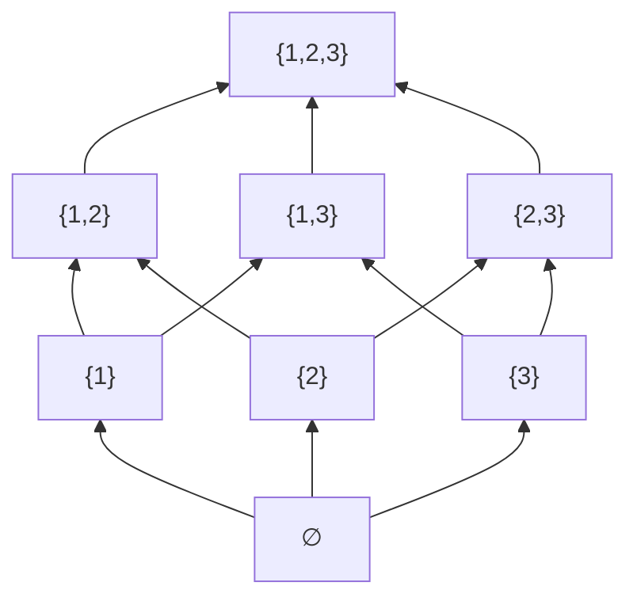
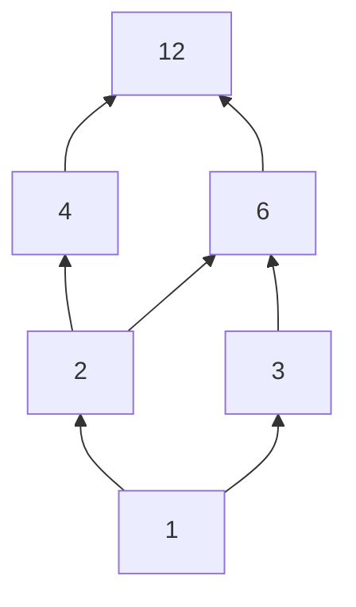

## Objetivos de Aprendizagem

- Definir uma ordem parcial como uma relação reflexiva, antissimétrica e transitiva, e verificar as três propriedades num exemplo concreto.
- Distinguir uma ordem parcial de uma ordem total identificando pares de elementos comparáveis versus incomparáveis.
- Desenhar e interpretar um diagrama de Hasse para um poset finito, incluindo identificar corretamente seus elementos mínimos, máximos, menor e maior.
- Determinar se um subconjunto de um poset tem um limitante superior, limitante inferior, supremo (junção) ou ínfimo (encontro).
- Explicar por que relações de "vem antes" em sistemas reais (agendamento de tarefas, hierarquias de tipos, contenção de conjuntos) são naturalmente ordens parciais, não totais.

## Contexto e Motivação

Nem toda noção de "vem antes" precisa comparar todo par de coisas com tudo mais. Duas tarefas num sistema de build podem genuinamente não ter restrição de ordem entre elas: a tarefa A não precisa acontecer antes de B, e B não precisa acontecer antes de A, porque são independentes, enquanto outros pares são estritamente ordenados (compilar antes de linkar). Dois conjuntos, {1,2} e {3,4}, são simplesmente incomparáveis sob "subconjunto de", nenhum está contido no outro, enquanto {1,2} e {1,2,3} são comparáveis, com o primeiro antes do segundo. Essa é exatamente a situação que uma **ordem total** (como ≤ nos inteiros, onde quaisquer dois números sempre podem ser comparados) não consegue capturar, porque uma ordem total insiste que todo par seja comparável. Uma **ordem parcial** relaxa essa exigência: mantém reflexividade, antissimetria e transitividade (a espinha dorsal estrutural de "vem antes") enquanto abandona a exigência de que todo par seja comparável de forma alguma. Alguns pares simplesmente não são ordenados um em relação ao outro, e a teoria é construída para tratar isso como o caso normal, não uma exceção.

Essa generalização é o que torna ordens parciais indispensáveis na Ciência da Computação especificamente, de um jeito que ordens totais não são. Um grafo de dependências entre alvos de build, uma hierarquia de subtipos num sistema de tipos, a relação de divisibilidade nos inteiros, contenção de conjuntos entre uma família de conjuntos, e a especificação do algoritmo de ordenação topológica são todos, formalmente, ordens parciais, e toda a razão de ordenação topológica ser um algoritmo não trivial (em vez de simplesmente "ordenar os números") é que sua entrada é só *parcialmente* ordenada: pode haver várias ordenações válidas consistentes com as restrições, e o trabalho do algoritmo é achar uma delas. O 6.042 do MIT trata ordens parciais como o próximo passo natural depois de relações de equivalência exatamente por essa razão: relações de equivalência formalizam "conta como o mesmo", e ordens parciais formalizam "vem antes", e entre as duas grande parte da estrutura relacional que aparece pela Ciência da Computação está coberta.

O **diagrama de Hasse** (um desenho simplificado de uma ordem parcial que omite os laços próprios, implicados pela reflexividade, e as arestas de "atalho", implicadas pela transitividade, mantendo só as relações de "cobertura" diretas e não redundantes, desenhadas de baixo pra cima) é a ferramenta visual sobre a qual este conceito se apoia mais fortemente, precisamente porque a definição crua de um poset como um conjunto de pares ordenados rapidamente fica ilegível para qualquer coisa além de um punhado de elementos, enquanto o diagrama torna estrutura (cadeias, anticadeias, limitantes) visível num relance.

## Teoria Central

### Definição: ordem parcial e poset

Uma relação ⪯ num conjunto A é uma **ordem parcial** se é:

1. **Reflexiva:** ∀a ∈ A, a ⪯ a.
2. **Antissimétrica:** ∀a, b ∈ A, (a ⪯ b ∧ b ⪯ a) → a = b.
3. **Transitiva:** ∀a, b, c ∈ A, (a ⪯ b ∧ b ⪯ c) → a ⪯ c.

Um conjunto A junto com uma ordem parcial ⪯ nele se chama um **conjunto parcialmente ordenado**, ou **poset**, escrito (A, ⪯). O símbolo ⪯ é escolhido deliberadamente para evocar ≤ sem afirmar ser comparação numérica; se lê "precede" ou "está abaixo de", e a ⪯ b não implica que b ⪯ a é falso; simplesmente não diz nada sobre a direção reversa a menos que a = b.

### Comparabilidade, ordens totais e cadeias

Dois elementos a, b ∈ A são **comparáveis** se a ⪯ b ou b ⪯ a (ou ambos, o que por antissimetria força a = b); caso contrário são **incomparáveis**. Uma ordem parcial na qual *todo* par de elementos é comparável se chama uma **ordem total** (ou ordem linear); então toda ordem total é uma ordem parcial, mas nem toda ordem parcial é total; "parcial" sinaliza que comparabilidade não é garantida, não que comparabilidade nunca acontece. Um subconjunto de A no qual todo par é comparável (quer o poset inteiro seja total ou não) se chama uma **cadeia**; um subconjunto no qual todo par é incomparável se chama uma **anticadeia**. Essas duas ideias (cadeia e anticadeia) são os dois extremos entre os quais um subconjunto de um poset pode ficar, e ambas vão reaparecer diretamente quando o princípio da casa dos pombos mais adiante neste currículo discutir argumentos de contagem no estilo do teorema de Dilworth sobre posets.

### Diagramas de Hasse: desenhando só a estrutura essencial

Como reflexividade garante todo laço próprio e transitividade garante toda aresta de "atalho" implicada por caminhos mais curtos, desenhar a relação completa de um poset como um grafo dirigido fica desnecessariamente poluído; a maioria das arestas não carrega informação nova. Um **diagrama de Hasse** mantém só a **relação de cobertura**: a cobre b (escrito b ⋖ a) se b ⪯ a, b ≠ a, e não existe c com b ⪯ c ⪯ a e c ≠ a, c ≠ b, ou seja, a é o elemento imediatamente seguinte acima de b sem nada estritamente entre eles. O diagrama é desenhado com b fisicamente abaixo de a sempre que b ⋖ a, conectados por uma única aresta, e com a convenção de que "mais alto na página" sempre significa "mais adiante na ordem" (então não são necessários laços próprios nem pontas de seta; posição e uma direção implícita para cima codificam tudo).

Este é o diagrama de Hasse de (P({1,2,3}), ⊆), o conjunto das partes de um conjunto de 3 elementos, ordenado por contenção de subconjunto (desenhado "de baixo pra cima" usando `graph BT` para que ∅ fique embaixo e {1,2,3} em cima, correspondendo à convenção usual). Note que {1} e {2} são incomparáveis (nenhum contém o outro), então não há aresta conectando-os diretamente nem caminho entre eles sem passar por um ancestral comum como {1,2}; este diagrama é exatamente a mesma estrutura que o Exemplo 1 em "Conjunto das Partes e Produtos Cartesianos" enumerou como uma lista plana de 8 subconjuntos, agora organizada pra mostrar quais subconjuntos contêm quais.

### Elementos mínimos, máximos, menor e maior

Um elemento m ∈ A é **mínimo** se nenhum elemento está estritamente abaixo dele (∄x ∈ A com x ⪯ m e x ≠ m); é **máximo** se nenhum elemento está estritamente acima dele. Um poset pode ter vários elementos mínimos e vários máximos simultaneamente; no diagrama acima, {1}, {2}, {3} seriam todos mínimos se ∅ não estivesse presente, mas com ∅ incluído, ∅ é o único elemento mínimo.

Um elemento ℓ é o elemento **menor** se ℓ ⪯ a para *todo* a ∈ A (não só "nada está abaixo dele", mas "ele está abaixo de tudo"), e um elemento menor, se existe, é automaticamente único (se ℓ e ℓ′ fossem ambos menores, ℓ ⪯ ℓ′ e ℓ′ ⪯ ℓ, então por antissimetria ℓ = ℓ′) e automaticamente mínimo (nada pode estar estritamente abaixo de algo que já está abaixo de tudo). O elemento **maior** é definido simetricamente. No diagrama acima, ∅ é tanto mínimo quanto menor (existe exatamente um elemento de fundo, e ele está abaixo de tudo), e {1,2,3} é tanto máximo quanto maior.

A distinção importa porque mínimo/máximo são puramente locais (nada diretamente abaixo/acima), enquanto menor/maior são globais (abaixo/acima de literalmente tudo), e um poset pode ter múltiplos elementos mínimos sem nenhum elemento menor, precisamente quando os elementos mínimos são incomparáveis entre si.

### Limitantes superiores, limitantes inferiores, junções e encontros

Para um subconjunto S ⊆ A, um elemento u ∈ A (não necessariamente em S) é um **limitante superior** de S se s ⪯ u para todo s ∈ S. O **supremo**, ou **junção**, de S, escrito ⋁S, é um limitante superior de S que é ⪯ todo outro limitante superior de S, se um existe; **limitante inferior** e **ínfimo** (o **encontro**, ⋀S) são definidos simetricamente. Em (P({1,2,3}), ⊆), para S = {{1}, {2}}, os limitantes superiores são todo conjunto que contém tanto {1} quanto {2}, ou seja, {1,2} e {1,2,3}; o menor desses é o próprio {1,2}, então ⋁S = {1,2}, que é exatamente a união de conjuntos {1} ∪ {2}. Isso não é coincidência: para o poset de contenção de subconjunto especificamente, junção sempre é união de conjuntos e encontro sempre é interseção de conjuntos, uma das ilustrações mais claras de como um conceito abstrato de teoria de ordem se especializa em algo completamente concreto.

Um poset no qual todo par de elementos tem tanto junção quanto encontro se chama uma **reticulado**; (P(A), ⊆) é sempre um reticulado para qualquer conjunto A, com junção = ∪ e encontro = ∩, conectando este conceito diretamente de volta às identidades de operações de conjunto estudadas anteriormente neste currículo.

## Exemplos Resolvidos

### Exemplo 1: verificando as três propriedades para "divide" num conjunto finito

**Problema:** sejam A = {1, 2, 3, 4, 6, 12} e a ⪯ b significando "a divide b" (a | b). Verifique que (A, ⪯) é um poset, e determine se é uma ordem total.

**Reflexiva:** todo número divide a si mesmo (a = 1·a), então a | a vale para todo a ∈ A.

**Antissimétrica:** suponha a | b e b | a. Então b = ka para algum inteiro positivo k, e a = jb para algum inteiro positivo j, então a = j(ka) = (jk)a, forçando jk = 1 (já que a > 0), o que para inteiros positivos força j = k = 1, logo a = b.

**Transitiva:** suponha a | b e b | c. Então b = ka e c = jb para inteiros positivos j, k, então c = j(ka) = (jk)a, significando a | c.

As três valem, então (A, ⪯) é um poset. **É total?** Checar 2 e 3: 2 | 3? Não (3/2 não é inteiro). 3 | 2? Não. Então 2 e 3 são incomparáveis, e a ordem **não é total**; um único par incomparável basta pra desqualificar totalidade, espelhando exatamente como um único contraexemplo desqualifica qualquer outra propriedade quantificada universalmente.

### Exemplo 2: construindo o diagrama de Hasse e lendo limitantes

**Problema:** para o poset do Exemplo 1, desenhe o diagrama de Hasse e ache o supremo e o ínfimo de S = {4, 6}.

Primeiro, ache a relação de cobertura checando, para cada par a | b com a ≠ b, se algum c intermediário em A fica estritamente entre eles. 1 | 2 sem nada entre eles em A: cobre. 1 | 3, nada entre: cobre. 2 | 4, nada entre (nenhum elemento de A divide 4 além do próprio 1, 2, 4): cobre. 2 | 6? Sim 2 | 6, mas 2 | 6 *não* é uma cobertura direta se houver intermediário: existe c com 2 | c | 6, c ≠ 2, 6? Nenhum elemento de A se encaixa (3 não satisfaz 2 | 3). Então 2 | 6 de fato cobre diretamente também. 3 | 6, nada entre em A: cobre. 4 | 12: checar intermediário, c com 4 | c | 12: nenhum c assim em A (8 não está em A). Cobre. 6 | 12: similarmente cobre diretamente.

Lendo o diagrama: para S = {4, 6}, os limitantes superiores são elementos acima tanto de 4 quanto de 6; só 12 se qualifica (12 é alcançável para cima a partir dos dois). Com só um limitante superior, ele é trivialmente o menor deles: **⋁S = 12**. Os limitantes inferiores são elementos abaixo tanto de 4 quanto de 6; 1 e 2 ficam ambos abaixo dos dois (1 → 2 → 4 e 1 → 2 → 6 pra cima, então 1 | 4, 1 | 6, 2 | 4, 2 | 6 todos valem). Entre os dois limitantes inferiores, 1 e 2, temos 1 | 2, então 2 é o maior dos dois limitantes inferiores: **⋀S = 2**. As duas respostas correspondem diretamente à teoria dos números: 12 = mmc(4,6) e 2 = mdc(4,6), ilustrando que para o poset de divisibilidade especificamente, junção sempre é mmc e encontro sempre é mdc, o mesmo padrão que a Teoria Central notou para ∪/∩ no poset de subconjuntos.

### Exemplo 3: um poset com múltiplos elementos mínimos e sem elemento menor

**Problema:** seja A = {2, 3, 4, 9} ordenado por divide. Determine os elementos mínimos e máximos, e declare se existe um elemento menor.

Pares de divisibilidade dentro de A: 2 | 4 (2 divide 4), 3 | 9 (3 divide 9); checando todos os outros: 2 | 3? Não. 2 | 9? Não. 3 | 4? Não. 4 | 9? Não. Então as únicas relações (além da reflexividade) são 2 | 4 e 3 | 9, duas cadeias separadas e desconectadas.

**Elementos mínimos:** um elemento sem nada estritamente abaixo dele. 2 não tem nada abaixo dele em A (nenhum elemento de A além do próprio 2 divide 2): mínimo. 3 similarmente não tem nada abaixo: mínimo. 4 tem 2 abaixo dele: não é mínimo. 9 tem 3 abaixo dele: não é mínimo. Então existem **dois elementos mínimos: 2 e 3.**

**Elementos máximos:** simetricamente, 4 e 9 não têm nada acima deles em A, enquanto 2 e 3 cada um tem algo acima: **dois elementos máximos: 4 e 9.**

**Elemento menor?** Um elemento menor precisaria ser ⪯ todo outro elemento, incluindo tanto 3 quanto 4. Mas 2 não divide 3, então 2 falha em estar abaixo de 3; 2 não pode ser o menor. Pelo mesmo argumento 3 também não pode ser o menor (3 não divide 4). Nenhum candidato funciona, porque **nenhum elemento menor existe**, exatamente porque os dois elementos mínimos, 2 e 3, são incomparáveis entre si, e um poset só pode ter um elemento menor quando há um único elemento mínimo que também é comparável a tudo mais. Isso demonstra diretamente a distinção local/global da Teoria Central: minimalidade é fácil de satisfazer (quatro elementos, dois deles mínimos), mas "menor" exige comparabilidade com o conjunto *inteiro*, o que a estrutura deste poset simplesmente não fornece.

## Equívocos Comuns e Armadilhas

- **Assumir que todo poset tem um elemento menor ou maior.** O Exemplo 3 mostra um poset com dois elementos mínimos e nenhum elemento menor de forma alguma; "mínimo" só descarta algo estritamente menor diretamente abaixo, enquanto "menor" exige comparabilidade com literalmente tudo, uma exigência bem mais forte que muitos posets finitos simplesmente não satisfazem.
- **Confundir "não comparável" com "sem relação alguma em qualquer sentido".** 2 e 3 serem incomparáveis sob divide não significa que não têm relação nenhuma com a estrutura do poset; ainda podem compartilhar limitantes superiores (ambos dividem 6) e limitantes inferiores (ambos são divididos por 1) mesmo que nenhum preceda diretamente o outro.
- **Desenhar um diagrama de Hasse com arestas redundantes.** Incluir a aresta 2 → 12 diretamente, quando 2 → 4 → 12 (ou 2 → 6 → 12) já a implica por transitividade, derrota o propósito do diagrama; um diagrama de Hasse correto inclui só arestas de relação de cobertura, com toda cadeia mais longa de arestas representando as comparações implicadas transitivamente em vez de desenhá-las explicitamente.
- **Acreditar que "ordem parcial" significa "alguns pares estão ordenados incorretamente" ou "uma versão mais fraca e defeituosa de uma ordem de verdade".** "Parcial" aqui é um termo técnico significando "não necessariamente total" (nem todo par precisa ser comparável); não significa que a ordem esteja de algum jeito errada ou incompleta num sentido deficiente; uma ordem parcial que não é total costuma ser o modelo matematicamente correto e completo da situação (tarefas de build genuinamente independentes de fato são incomparáveis, e forçar uma ordem total sobre elas distorceria a estrutura de dependência real).
- **Assumir que a junção de um conjunto é sempre só o máximo de alguma comparação numérica.** Junção e encontro são noções de teoria de ordem definidas em relação ao ⪯ específico em questão; para divide acabam sendo iguais a mmc e mdc, e para contenção de subconjunto acabam sendo iguais a ∪ e ∩, mas não são, em geral, "o maior/menor dos dois elementos" em nenhum sentido numérico ingênuo; precisam ser computados em relação à ordem parcial real que estiver em jogo.

## Resumo

Uma ordem parcial é uma relação reflexiva, antissimétrica e transitiva, capturando "vem antes" sem exigir que todo par de elementos seja comparável, o relaxamento definidor que a distingue de uma ordem total, onde comparabilidade é garantida para todo par. O diagrama de Hasse de um poset remove os laços próprios redundantes e as arestas implicadas transitivamente, mantendo só a relação de cobertura, e torna conceitos como cadeias, anticadeias, elementos mínimos/máximos e menor/maior visualmente imediatos em vez de exigir uma checagem par a par da relação crua. Elementos menor e maior, quando existem, são automaticamente únicos e automaticamente mínimos/máximos respectivamente, mas muitos posets têm vários elementos mínimos e nenhum elemento menor de forma alguma, precisamente quando esses elementos mínimos são mutuamente incomparáveis. Limitantes superiores e inferiores, e suas versões mais apertadas (junção e encontro), generalizam operações familiares (mmc/mdc para divide, ∪/∩ para contenção de subconjunto) num único vocabulário unificador de teoria de ordem que se aplica uniformemente a todo poset, quer aconteça de ser uma ordem total ou não.

## Documentation Links

- [Lehman, Leighton & Meyer — Mathematics for Computer Science (full text)](https://people.csail.mit.edu/meyer/mcs.pdf) — doc
- [ACM/IEEE CS2013 Curriculum Guidelines](https://www.acm.org/binaries/content/assets/education/cs2013_web_final.pdf) — doc
