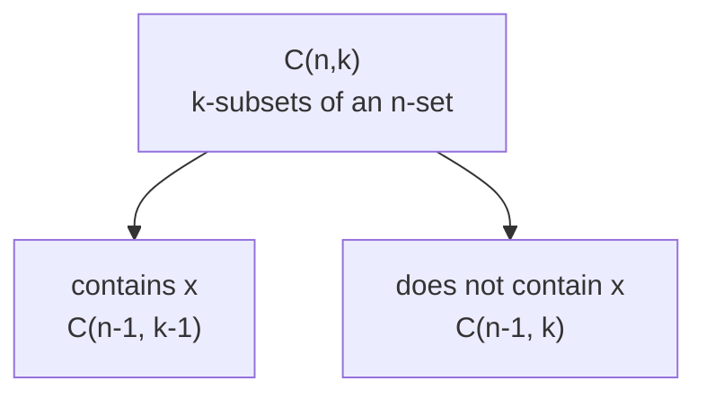

## Learning Objectives

- Derive the formula for the number of permutations of n distinct objects taken k at a time, P(n,k) = n!/(n−k)!, from the multiplication principle.
- Derive the formula for the number of combinations C(n,k) = n!/(k!(n−k)!) by relating it to P(n,k) and explaining the role of the k! correction.
- Distinguish problems where order matters (permutations) from problems where it does not (combinations), given a counting scenario stated in words.
- Apply the formulas to solve counting problems involving selections, arrangements, and simple restrictions (fixed positions, forbidden adjacencies).
- Prove basic identities involving binomial coefficients (e.g., C(n,k) = C(n,n−k), Pascal's identity) using a combinatorial argument rather than algebraic manipulation alone.

## Context & Motivation

Counting is one of the oldest and most practically load-bearing branches of discrete mathematics, and permutations and combinations are the two counting tools that get reused more than any others, precisely because "how many ways can this be arranged" and "how many ways can this be chosen" are two of the most common questions any combinatorial or probabilistic argument reduces to. Before any formula is written down, the crucial first skill this topic teaches is a single yes/no question that determines everything else about how to count: does the order of selection matter to the problem being asked? Assigning first, second, and third place in a race is a permutation problem — swapping two names changes the outcome. Choosing a 3-person committee from a group is a combination problem — the same three people chosen in a different order are still the same committee. Confusing these two is the single most common error in introductory combinatorics, and the entire apparatus of this topic exists to make the distinction precise and mechanical rather than a matter of intuition.

These ideas trace directly to the ACM/IEEE CS2013 curriculum guidelines, which list combinatorics — specifically permutations, combinations, and the counting principles behind them — as core discrete-structures material every computer science curriculum is expected to cover, because these counting tools resurface constantly in analysis of algorithms (how many orderings of an array must a sorting algorithm's worst-case analysis consider?), in probability (computing a probability by counting favorable outcomes over total outcomes almost always means counting permutations or combinations of some finite set), and in combinatorial optimization and cryptography (key-space sizes are combination or permutation counts). The ACM/IEEE Curricular Mapping for Discrete Structures likewise treats this pairing as one topic because the two ideas are so tightly coupled — combinations are literally permutations with the ordering "divided back out" — that teaching one without the other leaves the relationship between them, which is often the actual insight a problem requires, invisible.

What makes this topic rewarding rather than merely mechanical is that almost every formula here can be derived, not just memorized, from one underlying idea: the multiplication principle (if a first choice can be made in m ways and, independently, a second choice in n ways, the pair of choices can be made in m · n ways). Everything from P(n,k) to C(n,k) to more elaborate counting arguments falls out of applying that one principle carefully and correctly — which is exactly why worked derivations, not just formula recitation, are the heart of this material.

## Core Theory

### The multiplication principle and factorials

**Multiplication principle.** If a procedure consists of a sequence of k independent stages, and stage i can be completed in nᵢ ways regardless of how earlier stages were completed, then the whole procedure can be completed in n₁ · n₂ ⋯ n_k ways.

This single principle gives the count of *all* orderings of n distinct objects directly: choosing what goes in position 1 can be done in n ways; having fixed position 1, position 2 can be filled in n − 1 ways (one object is used up); position 3 in n − 2 ways; and so on down to position n, with exactly 1 object left. The total is

n · (n − 1) · (n − 2) ⋯ 2 · 1 = n!

read "n factorial," with the convention 0! = 1 (there is exactly one way to arrange zero objects — the empty arrangement). This n! is the number of **permutations of n distinct objects**, and every other counting formula in this topic is a variation on this same multiplication-principle argument.

### Permutations: P(n,k)

**Definition.** P(n,k) denotes the number of ways to arrange k objects, in order, chosen from a set of n distinct objects (k ≤ n).

**Derivation.** By the same reasoning as above, position 1 can be filled in n ways, position 2 in n − 1 ways (one object used), …, position k in n − k + 1 ways (k − 1 objects already used). By the multiplication principle:

P(n,k) = n · (n − 1) · (n − 2) ⋯ (n − k + 1)

This product has exactly k terms. Multiplying and dividing by (n − k)! (the product of all the terms that would continue the sequence down to 1) gives the closed form:

P(n,k) = n! / (n − k)!

Sanity checks: P(n,n) = n!/0! = n! (arranging all n objects — matches the full-arrangement count above), and P(n,0) = n!/n! = 1 (there is exactly one way to arrange zero objects out of n: do nothing).

### Combinations: C(n,k)

**Definition.** C(n,k), also written (n choose k) or ⁿCₖ, denotes the number of ways to choose a subset of k objects from a set of n distinct objects, where order does **not** matter.

**Derivation, via P(n,k).** Every k-element *permutation* can be produced in exactly two independent stages: first choose *which* k objects to include (a combination — C(n,k) ways), then arrange those k chosen objects in some order (k! ways, by the full-arrangement formula applied to k objects). By the multiplication principle:

P(n,k) = C(n,k) · k!

Solving for C(n,k):

C(n,k) = P(n,k) / k! = n! / (k! (n − k)!)

The intuition behind dividing by k! is exactly this: P(n,k) counts every ordered arrangement, and each *set* of k chosen objects has been counted k! times over — once for every order those same k objects could have been arranged in — so dividing by k! collapses those k! duplicate orderings back down to the single underlying set.

### Two identities, proved combinatorially

**Symmetry:** C(n,k) = C(n, n−k). Algebraically this follows immediately from the formula (swap k and n−k in n!/(k!(n−k)!) and the expression is unchanged), but the combinatorial proof is more illuminating: choosing which k objects to *include* in a subset is exactly equivalent to choosing which n−k objects to *exclude* — the two choices are in perfect bijection, so they must be counted by the same number.

**Pascal's identity:** C(n,k) = C(n−1, k−1) + C(n−1, k). Combinatorial proof: fix one particular object, call it x, among the n objects. Any k-subset either contains x or does not. If it contains x, the remaining k − 1 elements must be chosen from the other n − 1 objects: C(n−1, k−1) ways. If it does not contain x, all k elements must be chosen from the other n − 1 objects: C(n−1, k) ways. These two cases are mutually exclusive and exhaust every k-subset, so by the addition principle their counts sum to the total, C(n,k). This identity is exactly the recurrence that generates Pascal's triangle, where each entry is the sum of the two entries above it.



### Permutations and combinations with repetition, briefly

Two variants are worth flagging, since they change the formula entirely. **Permutations of a multiset** (n objects with repeated types, n₁ of type 1, n₂ of type 2, …, n_r of type r) number n! / (n₁! n₂! ⋯ n_r!) — the same "divide out the overcounted orderings" logic as C(n,k), but dividing out the internal rearrangements of *each* repeated type independently. **Combinations with repetition** (choosing k items from n types, with unlimited repeats allowed and order irrelevant) number C(n + k − 1, k) — derived via a "stars and bars" argument, representing a selection as k indistinguishable stars separated by n − 1 bars marking type boundaries, and counting the arrangements of that combined sequence of n + k − 1 symbols.

## Worked Examples

### Example 1 — arranging a subset: order matters

**Problem:** A committee of 8 people must elect a president, vice-president, and treasurer (three distinct roles, no person holding two roles). How many ways can this be done?

**Reasoning.** This is a permutation problem: filling three *distinct, ordered* roles from 8 people, where assigning Alice-president/Bob-VP is a different outcome from Bob-president/Alice-VP. Directly by the multiplication principle: 8 choices for president, then 7 remaining for VP, then 6 remaining for treasurer:

8 · 7 · 6 = 336

Checking against the formula: P(8,3) = 8!/(8−3)! = 8!/5! = 8 · 7 · 6 = 336. ✓.

### Example 2 — choosing a subset: order does not matter

**Problem:** From the same committee of 8 people, how many different 3-person subcommittees can be formed (no distinct roles — just three members)?

**Reasoning.** Now order does not matter: {Alice, Bob, Carol} is the same subcommittee no matter which member is "listed first." This is C(8,3):

C(8,3) = 8! / (3! · 5!) = (8 · 7 · 6) / (3 · 2 · 1) = 336 / 6 = 56

Comparing directly to Example 1: the 336 ordered role-assignments collapse into 56 distinct subcommittees, each counted exactly 3! = 6 times over (once per ordering of the same 3 people into the 3 roles) — 56 · 6 = 336, confirming the P(n,k) = C(n,k) · k! relationship directly on these numbers.

**Sanity check by brute enumeration:**

```python
from itertools import combinations, permutations

people = ['A','B','C','D','E','F','G','H']

n_subcommittees = len(list(combinations(people, 3)))
n_role_assignments = len(list(permutations(people, 3)))

print(n_subcommittees, n_role_assignments)   # 56 336
assert n_subcommittees == 56
assert n_role_assignments == 336
```

### Example 3 — a restriction: counting arrangements with a constraint

**Problem:** How many ways can the 8 letters of the word "COMPUTE" — wait, that word has 7 distinct letters — be arranged so that the letters C and O are always adjacent to each other (in either order)?

**Reasoning.** "COMPUTE" has 7 distinct letters: C, O, M, P, U, T, E. Step 1 — treat the adjacent pair "CO" (or "OC") as a single glued block. This reduces the counting problem to arranging 6 objects: the glued block, plus M, P, U, T, E — a full arrangement of 6 distinct objects, 6! ways. Step 2 — within the glued block, C and O can appear in either order (CO or OC): 2 ways, independent of how the 6 objects were arranged. By the multiplication principle:

6! · 2 = 720 · 2 = 1440

**Sanity check by brute enumeration**, treating the 7 letters as distinguishable positions and directly counting arrangements where C and O end up in adjacent positions:

```python
from itertools import permutations

letters = list("COMPUTE")
count = 0
for perm in set(permutations(letters)):
    idx_c = perm.index('C')
    idx_o = perm.index('O')
    if abs(idx_c - idx_o) == 1:
        count += 1

print(count)   # 1440
assert count == 1440
```

This confirms the "glue the adjacent pair, then multiply by the internal orderings of the glued block" technique, which generalizes directly to any fixed-adjacency counting restriction.

## Common Misconceptions & Pitfalls

- **"If a problem says 'choose,' it's always a combination."** The word "choose" in everyday English is not a reliable signal — "choose a president, then a VP" is still order-sensitive (a permutation), because the two choices fill distinct roles, even though each individual choice sounds like a "combination" in ordinary speech. The real test is always: does swapping the order of two selected elements produce a *different* valid outcome? If yes, it's a permutation count; if no, it's a combination count.
- **"C(n,k) and P(n,k) are unrelated formulas to memorize separately."** As Core Theory derives, C(n,k) is P(n,k) divided by k! — the two are not independent facts but a single relationship (choose, then arrange, equals arrange directly), and forgetting this connection makes it easy to apply the wrong one under time pressure without a way to double check.
- **"C(n,0) and C(n,n) are edge cases that need separate handling."** Both fall directly out of the formula: C(n,0) = n!/(0! · n!) = 1 (one way to choose nothing — the empty subset) and C(n,n) = n!/(n! · 0!) = 1 (one way to choose everything). No special-casing is needed if 0! = 1 is taken seriously as a convention, not an exception.
- **"An adjacency restriction (Example 3) means subtracting the 'bad' arrangements from the total."** That approach works but is often much harder than directly counting the constrained arrangements by gluing, as done above; complementary counting (total minus bad) is a valid general technique but is not automatically the easiest route, and choosing between "count directly" and "count the complement" is itself a skill worth developing per-problem.
- **"Pascal's identity is just an algebra fact, not worth a combinatorial proof."** The algebraic proof (expanding factorials and combining fractions) works but obscures *why* the identity is true; the combinatorial proof — split on whether a fixed element is included — is the technique (a "combinatorial proof" or "bijective proof") that generalizes to prove many other binomial identities where direct algebra becomes intractable, so it is worth learning as a method, not just verifying this one instance.

## Summary

Permutations count ordered selections and combinations count unordered selections, and the single test that distinguishes them is whether swapping the order of two chosen elements changes the outcome. Both formulas derive from the multiplication principle: P(n,k) = n!/(n−k)! counts ordered k-selections by filling k positions one at a time with shrinking choices, and C(n,k) = n!/(k!(n−k)!) = P(n,k)/k! corrects for the k! redundant orderings within each unordered subset. Binomial-coefficient identities such as C(n,k) = C(n,n−k) and Pascal's identity C(n,k) = C(n−1,k−1) + C(n−1,k) are best proved combinatorially — by exhibiting a bijection or splitting on a fixed element's membership — rather than by algebraic manipulation alone, since the combinatorial argument is the technique that generalizes to harder identities. Restricted counting problems (fixed adjacencies, forbidden positions) are handled by decomposing the arrangement into independent stages — gluing adjacent elements, fixing required positions first — and applying the multiplication principle to the reduced problem, occasionally alongside complementary counting when it is the simpler route.

## Documentation Links

- [ACM/IEEE CS2013 Curriculum Guidelines](https://www.acm.org/binaries/content/assets/education/cs2013_web_final.pdf) — doc
- [ACM/IEEE Curricular Mapping — Discrete Structures](https://curricula.cs.luc.edu/12-discrete-structures/content.html) — doc
