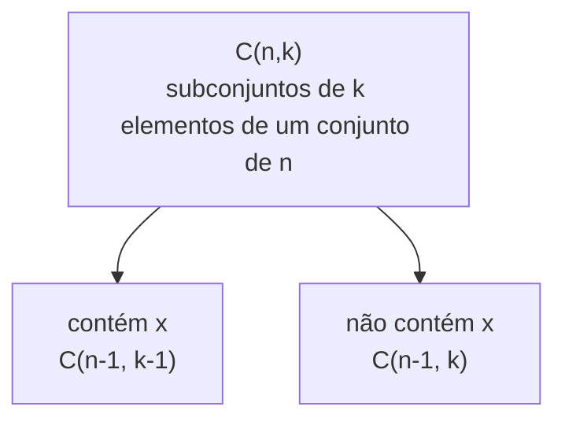

## Objetivos de Aprendizagem

- Derivar a fórmula do número de permutações de n objetos distintos tomados k de cada vez, P(n,k) = n!/(n−k)!, a partir do princípio multiplicativo.
- Derivar a fórmula do número de combinações C(n,k) = n!/(k!(n−k)!) relacionando-a a P(n,k) e explicando o papel da correção por k!.
- Distinguir problemas onde ordem importa (permutações) de problemas onde não importa (combinações), dado um cenário de contagem declarado em palavras.
- Aplicar as fórmulas para resolver problemas de contagem envolvendo seleções, arranjos e restrições simples (posições fixas, adjacências proibidas).
- Provar identidades básicas envolvendo coeficientes binomiais (por exemplo, C(n,k) = C(n,n−k), identidade de Pascal) usando um argumento combinatório em vez de só manipulação algébrica.

## Contexto e Motivação

Contagem é um dos ramos mais antigos e praticamente essenciais da matemática discreta, e permutações e combinações são as duas ferramentas de contagem mais reutilizadas de todas, precisamente porque "de quantas formas isso pode ser arranjado" e "de quantas formas isso pode ser escolhido" são duas das perguntas mais comuns às quais qualquer argumento combinatório ou probabilístico se reduz. Antes de qualquer fórmula ser escrita, a habilidade crucial que este tópico ensina primeiro é uma única pergunta sim/não que determina tudo o mais sobre como contar: a ordem da seleção importa para o problema sendo feito? Atribuir primeiro, segundo e terceiro lugar numa corrida é um problema de permutação, trocar dois nomes muda o resultado. Escolher um comitê de 3 pessoas de um grupo é um problema de combinação, as mesmas três pessoas escolhidas numa ordem diferente ainda são o mesmo comitê. Confundir os dois é o erro mais comum na combinatória introdutória, e todo o aparato deste tópico existe para tornar a distinção precisa e mecânica em vez de uma questão de intuição.

Essas ideias remontam diretamente às diretrizes curriculares ACM/IEEE CS2013, que listam combinatória (especificamente permutações, combinações e os princípios de contagem por trás delas) como material central de estruturas discretas que todo currículo de Ciência da Computação deve cobrir, porque essas ferramentas de contagem ressurgem constantemente na análise de algoritmos (quantos ordenamentos de um array a análise de pior caso de um algoritmo de ordenação precisa considerar?), em probabilidade (computar uma probabilidade contando resultados favoráveis sobre resultados totais quase sempre significa contar permutações ou combinações de algum conjunto finito), e em otimização combinatória e criptografia (tamanhos de espaço de chaves são contagens de combinação ou permutação). O Mapeamento Curricular ACM/IEEE para Estruturas Discretas da mesma forma trata esse par como um único tópico porque as duas ideias são tão fortemente acopladas (combinações são literalmente permutações com a ordenação "dividida de volta") que ensinar uma sem a outra deixa a relação entre elas, que costuma ser a real percepção que um problema exige, invisível.

O que torna este tópico gratificante em vez de meramente mecânico é que quase toda fórmula aqui pode ser derivada, não só decorada, a partir de uma única ideia subjacente: o princípio multiplicativo (se uma primeira escolha pode ser feita de m formas e, independentemente, uma segunda escolha de n formas, o par de escolhas pode ser feito de m · n formas). Tudo, de P(n,k) a C(n,k) a argumentos de contagem mais elaborados, cai diretamente de aplicar esse único princípio com cuidado e corretude, o que é exatamente por que derivações trabalhadas, não só recitação de fórmula, são o coração deste material.

## Teoria Central

### O princípio multiplicativo e fatoriais

**Princípio multiplicativo.** Se um procedimento consiste numa sequência de k etapas independentes, e a etapa i pode ser completada de nᵢ formas independentemente de como as etapas anteriores foram completadas, então o procedimento inteiro pode ser completado de n₁ · n₂ ⋯ n_k formas.

Esse único princípio dá a contagem de *todos* os ordenamentos de n objetos distintos diretamente: escolher o que vai na posição 1 pode ser feito de n formas; tendo fixado a posição 1, a posição 2 pode ser preenchida de n − 1 formas (um objeto foi usado); posição 3 de n − 2 formas; e assim por diante até a posição n, com exatamente 1 objeto restante. O total é

n · (n − 1) · (n − 2) ⋯ 2 · 1 = n!

lido "n fatorial", com a convenção 0! = 1 (existe exatamente uma forma de arranjar zero objetos, o arranjo vazio). Esse n! é o número de **permutações de n objetos distintos**, e toda outra fórmula de contagem deste tópico é uma variação desse mesmo argumento de princípio multiplicativo.

### Permutações: P(n,k)

**Definição.** P(n,k) denota o número de formas de arranjar k objetos, em ordem, escolhidos de um conjunto de n objetos distintos (k ≤ n).

**Derivação.** Pelo mesmo raciocínio de acima, a posição 1 pode ser preenchida de n formas, a posição 2 de n − 1 formas (um objeto usado), …, a posição k de n − k + 1 formas (k − 1 objetos já usados). Pelo princípio multiplicativo:

P(n,k) = n · (n − 1) · (n − 2) ⋯ (n − k + 1)

Esse produto tem exatamente k termos. Multiplicando e dividindo por (n − k)! (o produto de todos os termos que continuariam a sequência até 1) dá a forma fechada:

P(n,k) = n! / (n − k)!

Checagens de sanidade: P(n,n) = n!/0! = n! (arranjar todos os n objetos, corresponde à contagem de arranjo completo de acima), e P(n,0) = n!/n! = 1 (existe exatamente uma forma de arranjar zero objetos dentre n: não fazer nada).

### Combinações: C(n,k)

**Definição.** C(n,k), também escrito (n escolhe k) ou ⁿCₖ, denota o número de formas de escolher um subconjunto de k objetos de um conjunto de n objetos distintos, onde ordem **não** importa.

**Derivação, via P(n,k).** Toda *permutação* de k elementos pode ser produzida em exatamente duas etapas independentes: primeiro escolha *quais* k objetos incluir (uma combinação, C(n,k) formas), depois arranje esses k objetos escolhidos em alguma ordem (k! formas, pela fórmula de arranjo completo aplicada a k objetos). Pelo princípio multiplicativo:

P(n,k) = C(n,k) · k!

Resolvendo para C(n,k):

C(n,k) = P(n,k) / k! = n! / (k! (n − k)!)

A intuição por trás de dividir por k! é exatamente essa: P(n,k) conta todo arranjo ordenado, e cada *conjunto* de k objetos escolhidos foi contado k! vezes ao todo, uma vez para cada ordem em que esses mesmos k objetos poderiam ter sido arranjados, então dividir por k! colapsa essas k! ordenações duplicadas de volta para o único conjunto subjacente.

### Duas identidades, provadas combinatoriamente

**Simetria:** C(n,k) = C(n, n−k). Algebricamente isso decorre imediatamente da fórmula (troque k e n−k em n!/(k!(n−k)!) e a expressão fica inalterada), mas a prova combinatória é mais esclarecedora: escolher quais k objetos *incluir* num subconjunto é exatamente equivalente a escolher quais n−k objetos *excluir*, as duas escolhas estão em bijeção perfeita, então precisam ser contadas pelo mesmo número.

**Identidade de Pascal:** C(n,k) = C(n−1, k−1) + C(n−1, k). Prova combinatória: fixe um objeto particular, chame-o de x, dentre os n objetos. Todo subconjunto de k elementos ou contém x ou não contém. Se contém x, os k − 1 elementos restantes precisam ser escolhidos dentre os outros n − 1 objetos: C(n−1, k−1) formas. Se não contém x, todos os k elementos precisam ser escolhidos dentre os outros n − 1 objetos: C(n−1, k) formas. Esses dois casos são mutuamente exclusivos e esgotam todo subconjunto de k elementos, então pelo princípio da adição suas contagens somam ao total, C(n,k). Essa identidade é exatamente a recorrência que gera o triângulo de Pascal, onde cada entrada é a soma das duas entradas acima dela.



### Permutações e combinações com repetição, brevemente

Duas variantes valem a pena sinalizar, já que mudam a fórmula inteiramente. **Permutações de um multiconjunto** (n objetos com tipos repetidos, n₁ do tipo 1, n₂ do tipo 2, …, n_r do tipo r) somam n! / (n₁! n₂! ⋯ n_r!), a mesma lógica de "dividir para fora os ordenamentos supercontados" de C(n,k), mas dividindo para fora os rearranjos internos de *cada* tipo repetido independentemente. **Combinações com repetição** (escolher k itens dentre n tipos, com repetições ilimitadas permitidas e ordem irrelevante) somam C(n + k − 1, k), derivado via um argumento de "estrelas e barras", representando uma seleção como k estrelas indistinguíveis separadas por n − 1 barras marcando fronteiras de tipo, e contando os arranjos dessa sequência combinada de n + k − 1 símbolos.

## Exemplos Resolvidos

### Exemplo 1: arranjando um subconjunto: ordem importa

**Problema:** um comitê de 8 pessoas precisa eleger um presidente, um vice-presidente e um tesoureiro (três papéis distintos, nenhuma pessoa ocupando dois papéis). De quantas formas isso pode ser feito?

**Raciocínio.** Isso é um problema de permutação: preencher três papéis *distintos e ordenados* dentre 8 pessoas, onde atribuir Alice-presidente/Bob-vice é um resultado diferente de Bob-presidente/Alice-vice. Diretamente pelo princípio multiplicativo: 8 escolhas para presidente, depois 7 restantes para vice, depois 6 restantes para tesoureiro:

8 · 7 · 6 = 336

Checando contra a fórmula: P(8,3) = 8!/(8−3)! = 8!/5! = 8 · 7 · 6 = 336. ✓.

### Exemplo 2: escolhendo um subconjunto: ordem não importa

**Problema:** do mesmo comitê de 8 pessoas, quantos subcomitês diferentes de 3 pessoas podem ser formados (sem papéis distintos, só três membros)?

**Raciocínio.** Agora ordem não importa: {Alice, Bob, Carol} é o mesmo subcomitê não importa qual membro é "listado primeiro". Isso é C(8,3):

C(8,3) = 8! / (3! · 5!) = (8 · 7 · 6) / (3 · 2 · 1) = 336 / 6 = 56

Comparando diretamente com o Exemplo 1: as 336 atribuições ordenadas de papéis colapsam em 56 subcomitês distintos, cada um contado exatamente 3! = 6 vezes ao todo (uma vez para cada ordenamento das mesmas 3 pessoas nos 3 papéis), 56 · 6 = 336, confirmando a relação P(n,k) = C(n,k) · k! diretamente nesses números.

**Checagem de sanidade por enumeração por força bruta:**

```python
from itertools import combinations, permutations

pessoas = ['A','B','C','D','E','F','G','H']

n_subcomites = len(list(combinations(pessoas, 3)))
n_atribuicoes_papel = len(list(permutations(pessoas, 3)))

print(n_subcomites, n_atribuicoes_papel)   # 56 336
assert n_subcomites == 56
assert n_atribuicoes_papel == 336
```

### Exemplo 3: uma restrição: contando arranjos com uma condição

**Problema:** de quantas formas as 7 letras da palavra "COMPUTE" podem ser arranjadas de modo que as letras C e O estejam sempre adjacentes uma à outra (em qualquer ordem)?

**Raciocínio.** "COMPUTE" tem 7 letras distintas: C, O, M, P, U, T, E. Passo 1: trate o par adjacente "CO" (ou "OC") como um bloco único colado. Isso reduz o problema de contagem a arranjar 6 objetos: o bloco colado, mais M, P, U, T, E, um arranjo completo de 6 objetos distintos, 6! formas. Passo 2: dentro do bloco colado, C e O podem aparecer em qualquer ordem (CO ou OC): 2 formas, independente de como os 6 objetos foram arranjados. Pelo princípio multiplicativo:

6! · 2 = 720 · 2 = 1440

**Checagem de sanidade por enumeração por força bruta**, tratando as 7 letras como posições distinguíveis e contando diretamente arranjos onde C e O acabam em posições adjacentes:

```python
from itertools import permutations

letras = list("COMPUTE")
contagem = 0
for perm in set(permutations(letras)):
    idx_c = perm.index('C')
    idx_o = perm.index('O')
    if abs(idx_c - idx_o) == 1:
        contagem += 1

print(contagem)   # 1440
assert contagem == 1440
```

Isso confirma a técnica de "colar o par adjacente, depois multiplicar pelos ordenamentos internos do bloco colado", que generaliza diretamente para qualquer restrição de contagem de adjacência fixa.

## Equívocos Comuns e Armadilhas

- **"Se um problema diz 'escolher', é sempre uma combinação."** A palavra "escolher" no português do dia a dia não é um sinal confiável: "escolher um presidente, depois um vice" ainda é sensível a ordem (uma permutação), porque as duas escolhas preenchem papéis distintos, mesmo que cada escolha individual soe como uma "combinação" na fala comum. O teste real é sempre: trocar a ordem de dois elementos selecionados produz um resultado válido *diferente*? Se sim, é uma contagem de permutação; se não, é uma contagem de combinação.
- **"C(n,k) e P(n,k) são fórmulas não relacionadas para decorar separadamente."** Como a Teoria Central deriva, C(n,k) é P(n,k) dividido por k!, os dois não são fatos independentes mas uma única relação (escolher, depois arranjar, é igual a arranjar diretamente), e esquecer essa conexão torna fácil aplicar a errada sob pressão de tempo sem uma forma de checar.
- **"C(n,0) e C(n,n) são casos extremos que precisam de tratamento separado."** Os dois caem diretamente da fórmula: C(n,0) = n!/(0! · n!) = 1 (uma forma de escolher nada, o subconjunto vazio) e C(n,n) = n!/(n! · 0!) = 1 (uma forma de escolher tudo). Nenhum tratamento especial é necessário se 0! = 1 é levado a sério como convenção, não exceção.
- **"Uma restrição de adjacência (Exemplo 3) significa subtrair os arranjos 'ruins' do total."** Essa abordagem funciona mas costuma ser bem mais difícil que contar diretamente os arranjos restritos por colagem, como feito acima; contagem complementar (total menos ruim) é uma técnica geral válida mas não é automaticamente a rota mais fácil, e escolher entre "contar diretamente" e "contar o complemento" é ela mesma uma habilidade que vale a pena desenvolver por problema.
- **"A identidade de Pascal é só um fato algébrico, não vale a pena uma prova combinatória."** A prova algébrica (expandir fatoriais e combinar frações) funciona mas esconde *por que* a identidade é verdadeira; a prova combinatória (dividir em se um elemento fixo está incluído) é a técnica (uma "prova combinatória" ou "prova bijetiva") que generaliza para provar muitas outras identidades binomiais onde a álgebra direta se torna intratável, então vale a pena aprender como método, não só verificar esta instância.

## Resumo

Permutações contam seleções ordenadas e combinações contam seleções não ordenadas, e o único teste que as distingue é se trocar a ordem de dois elementos escolhidos muda o resultado. As duas fórmulas derivam do princípio multiplicativo: P(n,k) = n!/(n−k)! conta seleções ordenadas de k elementos preenchendo k posições uma de cada vez com escolhas decrescentes, e C(n,k) = n!/(k!(n−k)!) = P(n,k)/k! corrige pelos k! ordenamentos redundantes dentro de cada subconjunto não ordenado. Identidades de coeficientes binomiais como C(n,k) = C(n,n−k) e a identidade de Pascal C(n,k) = C(n−1,k−1) + C(n−1,k) são melhor provadas combinatoriamente (exibindo uma bijeção ou dividindo pela pertinência de um elemento fixo) em vez de só manipulação algébrica, já que o argumento combinatório é a técnica que generaliza para identidades mais difíceis. Problemas de contagem restritos (adjacências fixas, posições proibidas) são tratados decompondo o arranjo em etapas independentes (colando elementos adjacentes, fixando posições exigidas primeiro) e aplicando o princípio multiplicativo ao problema reduzido, ocasionalmente junto com contagem complementar quando é a rota mais simples.

## Documentation Links

- [ACM/IEEE CS2013 Curriculum Guidelines](https://www.acm.org/binaries/content/assets/education/cs2013_web_final.pdf) — doc
- [ACM/IEEE Curricular Mapping — Discrete Structures](https://curricula.cs.luc.edu/12-discrete-structures/content.html) — doc
