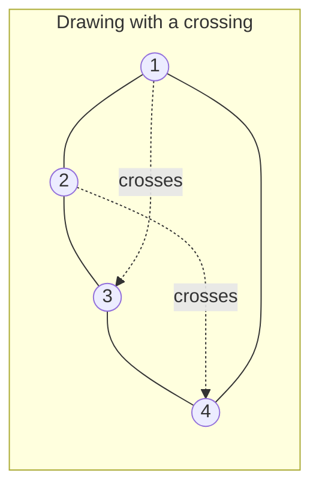
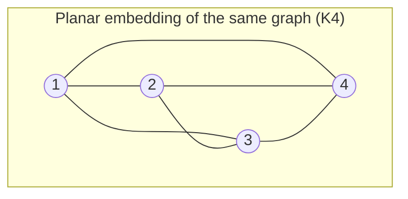

## Learning Objectives

- Define a planar graph and distinguish a graph *being* planar from a specific drawing of it *being* planar (a planar graph can still have non-planar-looking drawings).
- State Euler's formula for connected planar graphs and use it to compute one of vertices, edges, or faces given the other two.
- Derive, from Euler's formula, the upper bound on the number of edges a simple planar graph can have, and use that bound to prove a specific graph is *not* planar.
- Identify K₅ and K₃,₃ as the two smallest non-planar graphs and explain their role as the obstruction certifying non-planarity (Kuratowski's theorem, statement only).
- Apply the "every planar graph has a vertex of degree ≤ 5" consequence of Euler's formula to justify the Four Color Theorem's plausibility (statement only, proof out of scope).

## Context & Motivation

Every graph drawn so far in this discipline has been drawn on paper without much thought about *how* — vertices as dots, edges as lines connecting them, wherever it was convenient to put them. For most purposes that convenience is all that matters: a graph is defined purely by its vertices and which pairs are connected, not by where anyone happened to draw the dots. But one geometric question about a graph turns out to matter a great deal in practice, and has a clean, provable mathematical answer: can this graph be drawn on a flat plane so that no two edges cross? This is not a question about aesthetics — it is a question with hard consequences. A circuit board's traces cannot cross without a short circuit unless a bridge (a physical, more expensive layer) is added; a road map's intersections are exactly the crossing points a planner would rather minimize; a graph coloring problem (assigning colors to regions of a map so adjacent regions differ) is, underneath, a planar graph coloring problem, since a map's regions and their borders naturally form a planar graph.

The remarkable thing is that planarity is a genuine yes/no property of the abstract graph, not an accident of one particular drawing. The same graph might have one drawing with crossing edges and a completely different drawing with none — planarity asks whether *some* drawing with zero crossings exists at all, and it turns out this is decidable using nothing more than counting vertices, edges, and (once a planar drawing exists) faces, thanks to a formula discovered by Euler in the context of polyhedra and later recognized to apply to any connected planar graph. This single formula, almost absurdly simple to state, is powerful enough to prove entire families of graphs can *never* be drawn without crossings — no matter how cleverly someone tries — which is a much stronger and more useful claim than "I tried for a while and couldn't find a crossing-free drawing."

Historically, this chapter of discrete mathematics is also where graph theory connects most visibly to one of its most famous results, the Four Color Theorem — the (true, but famously hard to prove) claim that any planar map can be colored with only four colors so that no two adjacent regions share a color. The material here builds the machinery — Euler's formula and its edge-count consequence — that makes the *plausibility* of that theorem provable, even though its full proof (first done by computer-assisted case analysis in 1976) is well beyond this course's scope.

## Core Theory

### Planar embeddings versus planar graphs

A graph G is **planar** if there exists *some* way to draw it in the plane — assigning each vertex a point and each edge a curve between its endpoints' points — so that no two edges cross except at a shared endpoint. Such a drawing is called a **planar embedding** of G. The crucial subtlety: a graph can be planar while a *specific* drawing of it has crossings. Consider the 4-cycle with both diagonals added (K₄, the complete graph on 4 vertices): drawn as a square with both diagonals, the diagonals cross in the middle — but redrawing one vertex to sit *inside* the triangle formed by the other three removes every crossing. K₄ is planar; that first drawing simply wasn't a planar embedding of it, even though a planar embedding exists.

Both diagrams above represent the identical graph — same 4 vertices, same 6 edges — but only the second is drawn without crossings. Planarity is a property of the graph (does *some* crossing-free drawing exist), never a property of one drawing in isolation.

### Faces of a planar embedding

Given a planar embedding, the plane is divided into regions called **faces**: the bounded regions enclosed by edges, plus exactly one **outer** (unbounded) face extending to infinity. In the K₄ embedding above, there are 4 faces: the three small triangular regions inside, plus the one unbounded outer face. Every face is bordered by a closed walk of edges; an edge that borders two different faces contributes to both of their boundaries, while a "bridge" edge (one whose removal disconnects the graph) borders the same face on both sides.

### Euler's formula

For any **connected** planar graph drawn with a planar embedding having V vertices, E edges, and F faces (including the outer face):

**V − E + F = 2**

This is genuinely a theorem, not a definition, and it holds regardless of *which* planar embedding of G is chosen — different embeddings of the same planar graph can look different but always satisfy the same V, E, and (necessarily, by the formula) the same F.

**Sketch of proof, by induction on the number of edges.** Base case: a tree (E = V − 1, by the edge-count theorem from the Trees lesson) drawn in the plane has exactly F = 1 face (only the outer face — a tree has no cycle to enclose a bounded region), giving V − E + F = V − (V−1) + 1 = 2. ✓ Inductive step: take any connected planar graph G with a cycle (E ≥ V, so it is not a tree), and remove one edge e that lies on a cycle. Removing a cycle edge cannot disconnect the graph (the rest of the cycle still connects everything the removed edge used to). Removing e merges the two faces it used to separate into one, decreasing F by exactly 1, while E also decreases by 1 and V is unchanged. By the inductive hypothesis applied to this smaller graph, (V) − (E−1) + (F−1) = 2, which rearranges to exactly V − E + F = 2 for the original G. Repeating this edge-removal argument down to a spanning tree, then applying the base case, proves the formula for any connected planar graph. ∎

### The edge bound for simple planar graphs

Euler's formula, combined with one counting observation, produces the single most useful practical test for non-planarity. In a **simple** graph (no loops, no repeated edges) with V ≥ 3 vertices, every face is bordered by at least 3 edges (a face bordered by fewer than 3 edges would require a repeated edge or a loop). Since every edge borders exactly 2 faces (or the same face twice, for a bridge — but bridges only reduce the count further), summing "edges per face" over all faces counts each edge at most twice:

3F ≤ 2E, which rearranges to F ≤ 2E / 3.

Substituting into Euler's formula (V − E + F = 2, so F = 2 − V + E):

2 − V + E ≤ 2E / 3, which rearranges to **E ≤ 3V − 6**.

This is the key inequality: **any simple, connected planar graph with V ≥ 3 vertices has at most 3V − 6 edges.** A graph exceeding this bound cannot possibly be planar, no matter how it's drawn — this is a necessary condition for planarity, derived entirely from Euler's formula plus a face-degree counting argument, with no need to attempt (and fail at) an actual drawing.

### K₅ and K₃,₃: the two smallest non-planar graphs

**K₅** (the complete graph on 5 vertices, every pair connected) has V = 5, E = C(5,2) = 10. The bound gives 3V − 6 = 3(5) − 6 = 9. Since E = 10 > 9, K₅ violates the edge bound and is **not planar** — proved outright by the inequality, no drawing attempt required.

**K₃,₃** (the complete bipartite graph on two sets of 3 vertices each, every vertex in one set connected to every vertex in the other, none within a set) has V = 6, E = 3 × 3 = 9. The general bound gives 3(6) − 6 = 12, and 9 ≤ 12 — the general bound does *not* rule K₃,₃ out. But K₃,₃ is **bipartite** (its vertices split into two sets with no edges inside either set), and a bipartite simple graph has no odd cycles at all — every face in a bipartite planar embedding is therefore bordered by at least 4 edges, not just 3, tightening the bound to E ≤ 2V − 4. For K₃,₃: 2(6) − 4 = 8, and E = 9 > 8 — so K₃,₃ **is not planar** either, by this sharper, bipartite-specific version of the same counting argument.

**Kuratowski's theorem** (stated here without proof, well beyond this course's scope) says these two graphs are not just examples of non-planarity — they are the *only* fundamental obstructions: a graph is non-planar if and only if it contains a subgraph that is a "subdivision" of K₅ or K₃,₃ (roughly, K₅ or K₃,₃ with some edges replaced by paths through extra vertices). Every non-planar graph, no matter how large or complicated, hides a copy of one of these two smallest culprits somewhere inside it.

### Consequence: every planar graph has a low-degree vertex

Combining E ≤ 3V − 6 with the handshake-theorem fact that the sum of all vertex degrees equals 2E gives: if every vertex had degree ≥ 6, the sum of degrees would be ≥ 6V, forcing E ≥ 3V, which contradicts E ≤ 3V − 6 for any V ≥ 6. So **every simple planar graph has at least one vertex of degree ≤ 5.** This single fact is the seed of the Four Color Theorem's plausibility: a low-degree vertex can always be found, removed, colored last (after the rest of the graph is colored), and — because it has so few neighbors — a valid color from a small palette is always available for it. Turning "plausible" into an actual proof requires far more casework (originally handled by an exhaustive, computer-verified analysis of 1,936 unavoidable configurations), which is why the full Four Color Theorem is only stated, not proved, here.

## Worked Examples

### Example 1 — applying Euler's formula directly

**Problem:** A connected planar graph has 8 vertices and 12 edges. How many faces does any planar embedding of it have?

**Solution.** Euler's formula: V − E + F = 2, so F = 2 − V + E = 2 − 8 + 12 = 6. Any planar embedding of this graph — regardless of which one is drawn — has exactly 6 faces (5 bounded, 1 outer, in some combination depending on the specific embedding, but always totaling 6).

### Example 2 — proving a specific graph is not planar via the edge bound

**Problem:** A simple graph has 7 vertices and 17 edges. Can it be planar?

**Solution.** Apply the bound: for V = 7, the maximum possible edges in a simple planar graph is 3V − 6 = 3(7) − 6 = 15. The graph has 17 edges, which exceeds 15. By the edge-bound theorem, this graph **cannot be planar** — no drawing, however clever, can avoid crossings, because the inequality was derived purely from Euler's formula and face-counting, independent of any particular drawing attempt.

### Example 3 — checking the Petersen graph against both bounds

**Problem:** The Petersen graph has V = 10 vertices and E = 15 edges, and contains 5-cycles (so it is not bipartite). Does the general edge bound rule it out as non-planar? (The Petersen graph is, in fact, famously non-planar — but not because it fails this particular test, which is the point of this example: the bound is a one-directional test, sufficient to prove non-planarity when violated, but never sufficient by itself to prove planarity when satisfied.)

**Solution.** General bound: 3V − 6 = 3(10) − 6 = 24. Since E = 15 ≤ 24, the Petersen graph **satisfies** the edge bound comfortably — this test alone gives no information either way about whether it's planar. (The Petersen graph's actual non-planarity is instead established by finding a K₅ or K₃,₃ subdivision hidden inside it, per Kuratowski's theorem — a different, more delicate argument this course does not carry out in full.) The lesson: E ≤ 3V − 6 is a **necessary** condition for planarity, so violating it *proves* non-planarity (Example 2), but *satisfying* it never proves planarity — it only fails to rule it out.

## Common Misconceptions & Pitfalls

- **"If I can't find a crossing-free drawing after trying for a while, the graph must not be planar."** Planarity is about the *existence* of some crossing-free drawing, not about finding one by trial and error — K₄'s first drawing in Core Theory has crossings, yet K₄ is planar. Failing to find a planar embedding by hand proves nothing; only the edge-bound inequality (or an explicit Kuratowski subdivision) can prove non-planarity rigorously.
- **"E ≤ 3V − 6 being satisfied means the graph is planar."** Example 3's Petersen graph satisfies the bound comfortably while still being non-planar. The inequality is necessary but not sufficient — it can only be used to *rule out* planarity (when violated), never to *confirm* it (when satisfied).
- **"Euler's formula applies to any planar graph."** The formula V − E + F = 2 requires the graph to be **connected**. A disconnected planar graph with k connected components instead satisfies V − E + F = 1 + k (each additional component adds one more disconnected piece without adding a bounding relationship to the shared outer face) — applying the plain V − E + F = 2 formula to a disconnected graph gives a wrong face count.
- **"K₃,₃ fails the same 3V − 6 bound that catches K₅."** As Core Theory shows, K₃,₃'s edge count (9) is actually within the *general* bound 3V − 6 = 12; it takes the sharper, bipartite-specific bound (2V − 4 = 8) to catch it. Applying only the general bound to a bipartite graph and concluding "planar" from a passed test is a real gap — bipartite graphs need the tighter inequality to test correctly.
- **"The number of faces depends on which drawing you pick, so Euler's formula is just an approximation."** Euler's formula gives an *exact*, embedding-independent value for F once V and E are fixed for a connected planar graph — every valid planar embedding of the same graph produces the identical face count, because F is forced by the formula, not chosen freely by the drawer.

## Summary

A graph is planar if some drawing of it in the plane avoids edge crossings entirely — a property of the abstract graph, never of one particular drawing, since the same planar graph can have both crossing and crossing-free drawings. For any connected planar embedding, Euler's formula V − E + F = 2 relates vertices, edges, and faces exactly, and is provable by induction via repeated edge removal down to a spanning tree. Combining Euler's formula with a face-degree counting argument yields the edge bound E ≤ 3V − 6 for simple planar graphs (tightened to E ≤ 2V − 4 for bipartite graphs), which is strong enough to prove specific graphs — K₅ and K₃,₃ chief among them — cannot possibly be planar, without needing to attempt any drawing. Kuratowski's theorem elevates these two graphs from mere examples to the complete characterization of non-planarity: every non-planar graph contains a subdivision of one or the other. The same machinery shows every planar graph has a vertex of degree at most 5, the seed fact behind the Four Color Theorem's plausibility, though its full proof lies outside this course.

## Documentation Links

- [Lehman, Leighton & Meyer — Mathematics for Computer Science (full text)](https://people.csail.mit.edu/meyer/mcs.pdf) — doc
- [ACM/IEEE CS2013 Curriculum Guidelines](https://www.acm.org/binaries/content/assets/education/cs2013_web_final.pdf) — doc
