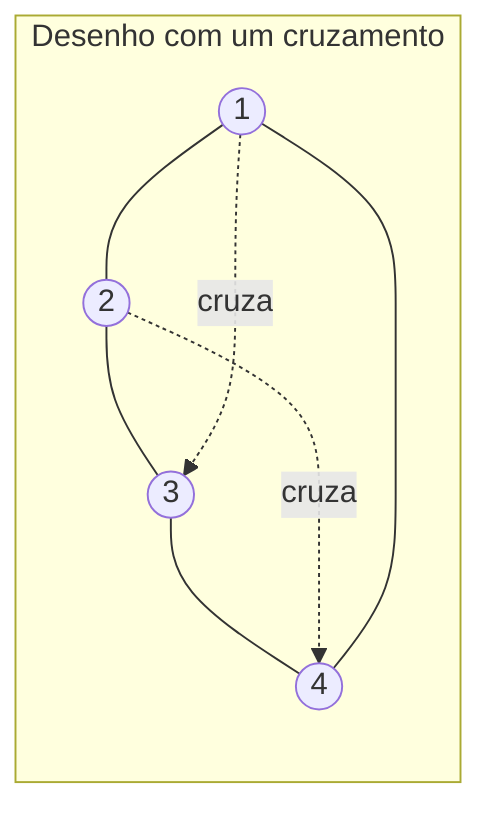
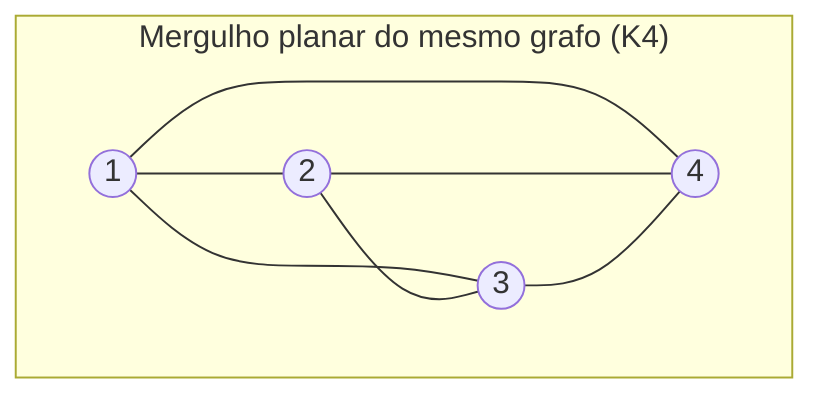

## Objetivos de Aprendizagem

- Definir grafo planar e distinguir um grafo *ser* planar de um desenho específico dele *ser* planar (um grafo planar ainda pode ter desenhos que não parecem planares).
- Declarar a fórmula de Euler para grafos planares conexos e usá-la para computar um de vértices, arestas ou faces dado os outros dois.
- Derivar, a partir da fórmula de Euler, o limite superior no número de arestas que um grafo planar simples pode ter, e usar esse limite para provar que um grafo específico *não* é planar.
- Identificar K₅ e K₃,₃ como os dois menores grafos não planares e explicar seu papel como a obstrução que certifica não-planaridade (teorema de Kuratowski, só o enunciado).
- Aplicar a consequência "todo grafo planar tem um vértice de grau ≤ 5" da fórmula de Euler para justificar a plausibilidade do Teorema das Quatro Cores (só o enunciado, prova fora de escopo).

## Contexto e Motivação

Todo grafo desenhado até agora nesta disciplina foi desenhado no papel sem muita preocupação com *como*: vértices como pontos, arestas como linhas conectando-os, onde quer que fosse conveniente colocá-los. Para a maioria dos propósitos essa conveniência é tudo que importa: um grafo é definido puramente por seus vértices e quais pares estão conectados, não por onde alguém aconteceu de desenhar os pontos. Mas uma pergunta geométrica sobre um grafo acaba importando muito na prática, e tem uma resposta matemática limpa e provável: este grafo pode ser desenhado num plano de forma que nenhuma duas arestas se cruzem? Essa não é uma pergunta sobre estética; é uma pergunta com consequências duras. As trilhas de uma placa de circuito não podem se cruzar sem um curto-circuito a menos que uma ponte (uma camada física, mais cara) seja adicionada; os cruzamentos de um mapa de estradas são exatamente os pontos de cruzamento que um planejador preferiria minimizar; um problema de coloração de grafo (atribuir cores a regiões de um mapa de forma que regiões adjacentes difiram) é, por baixo, um problema de coloração de grafo planar, já que as regiões de um mapa e suas fronteiras naturalmente formam um grafo planar.

A coisa notável é que planaridade é uma propriedade genuína de sim/não do grafo abstrato, não um acidente de um desenho particular. O mesmo grafo pode ter um desenho com arestas se cruzando e um desenho completamente diferente sem nenhuma; planaridade pergunta se *algum* desenho com zero cruzamentos existe, e acontece que isso é decidível usando nada mais que contar vértices, arestas e (uma vez que um desenho planar exista) faces, graças a uma fórmula descoberta por Euler no contexto de poliedros e depois reconhecida como aplicável a qualquer grafo planar conexo. Essa única fórmula, quase absurdamente simples de declarar, é poderosa o bastante para provar que famílias inteiras de grafos *nunca* podem ser desenhadas sem cruzamentos, não importa quão engenhosamente alguém tente, o que é uma afirmação muito mais forte e útil que "tentei por um tempo e não consegui achar um desenho sem cruzamentos".

Historicamente, este capítulo da matemática discreta é também onde a teoria dos grafos se conecta mais visivelmente a um de seus resultados mais famosos, o Teorema das Quatro Cores, a afirmação (verdadeira, mas famosamente difícil de provar) de que qualquer mapa planar pode ser colorido com apenas quatro cores de forma que nenhuma duas regiões adjacentes compartilhem uma cor. O material aqui constrói o maquinário (a fórmula de Euler e sua consequência de contagem de arestas) que torna a *plausibilidade* daquele teorema provável, mesmo que sua prova completa (primeiro feita por análise de casos assistida por computador em 1976) esteja bem além do escopo deste curso.

## Teoria Central

### Mergulhos planares versus grafos planares

Um grafo G é **planar** se existe *alguma* forma de desenhá-lo no plano (atribuindo a cada vértice um ponto e a cada aresta uma curva entre os pontos de suas extremidades) de forma que nenhuma duas arestas se cruzem exceto num ponto final compartilhado. Tal desenho se chama um **mergulho planar** de G. A sutileza crucial: um grafo pode ser planar enquanto um desenho *específico* dele tem cruzamentos. Considere o ciclo de 4 com as duas diagonais adicionadas (K₄, o grafo completo em 4 vértices): desenhado como um quadrado com as duas diagonais, as diagonais se cruzam no meio, mas redesenhar um vértice para ficar *dentro* do triângulo formado pelos outros três remove todo cruzamento. K₄ é planar; aquele primeiro desenho simplesmente não era um mergulho planar dele, mesmo um mergulho planar existindo.

Os dois diagramas acima representam o grafo idêntico (mesmos 4 vértices, mesmas 6 arestas), mas só o segundo é desenhado sem cruzamentos. Planaridade é uma propriedade do grafo (existe *algum* desenho sem cruzamentos), nunca uma propriedade de um desenho isolado.

### Faces de um mergulho planar

Dado um mergulho planar, o plano é dividido em regiões chamadas **faces**: as regiões limitadas fechadas por arestas, mais exatamente uma face **externa** (ilimitada) que se estende ao infinito. No mergulho de K₄ acima, há 4 faces: as três pequenas regiões triangulares internas, mais a face externa ilimitada. Toda face é fronteirada por um passeio fechado de arestas; uma aresta que fronteira duas faces diferentes contribui para as fronteiras das duas, enquanto uma aresta "ponte" (cuja remoção desconecta o grafo) fronteira a mesma face nos dois lados.

### A fórmula de Euler

Para qualquer grafo planar **conexo** desenhado com um mergulho planar tendo V vértices, E arestas e F faces (incluindo a face externa):

**V − E + F = 2**

Isso é genuinamente um teorema, não uma definição, e vale independentemente de *qual* mergulho planar de G é escolhido; mergulhos diferentes do mesmo grafo planar podem parecer diferentes mas sempre satisfazem o mesmo V, o mesmo E, e (necessariamente, pela fórmula) o mesmo F.

**Esboço de prova, por indução sobre o número de arestas.** Caso base: uma árvore (E = V − 1, pelo teorema de contagem de arestas da lição de Árvores) desenhada no plano tem exatamente F = 1 face (só a face externa; uma árvore não tem ciclo para fechar uma região limitada), dando V − E + F = V − (V−1) + 1 = 2. ✓ Passo indutivo: tome qualquer grafo planar conexo G com um ciclo (E ≥ V, então não é uma árvore), e remova uma aresta e que está num ciclo. Remover uma aresta de ciclo não pode desconectar o grafo (o resto do ciclo ainda conecta tudo que a aresta removida costumava conectar). Remover e mescla as duas faces que ela costumava separar numa só, diminuindo F em exatamente 1, enquanto E também diminui em 1 e V permanece inalterado. Pela hipótese indutiva aplicada a esse grafo menor, (V) − (E−1) + (F−1) = 2, que se rearranja para exatamente V − E + F = 2 para o G original. Repetir esse argumento de remoção de aresta até chegar numa árvore geradora, e então aplicar o caso base, prova a fórmula para qualquer grafo planar conexo. ∎

### O limite de arestas para grafos planares simples

A fórmula de Euler, combinada com uma observação de contagem, produz o teste prático mais útil para não-planaridade. Num grafo **simples** (sem laços, sem arestas repetidas) com V ≥ 3 vértices, toda face é fronteirada por pelo menos 3 arestas (uma face fronteirada por menos de 3 arestas exigiria uma aresta repetida ou um laço). Como toda aresta fronteira exatamente 2 faces (ou a mesma face duas vezes, para uma ponte, mas pontes só diminuem a contagem ainda mais), somar "arestas por face" sobre todas as faces conta cada aresta no máximo duas vezes:

3F ≤ 2E, que se rearranja para F ≤ 2E / 3.

Substituindo na fórmula de Euler (V − E + F = 2, então F = 2 − V + E):

2 − V + E ≤ 2E / 3, que se rearranja para **E ≤ 3V − 6**.

Essa é a desigualdade chave: **qualquer grafo planar simples e conexo com V ≥ 3 vértices tem no máximo 3V − 6 arestas.** Um grafo que excede esse limite não pode ser planar de jeito nenhum, não importa como seja desenhado; essa é uma condição necessária para planaridade, derivada inteiramente da fórmula de Euler mais um argumento de contagem de grau de face, sem necessidade de tentar (e falhar em) um desenho de fato.

### K₅ e K₃,₃: os dois menores grafos não planares

**K₅** (o grafo completo em 5 vértices, todo par conectado) tem V = 5, E = C(5,2) = 10. O limite dá 3V − 6 = 3(5) − 6 = 9. Como E = 10 > 9, K₅ viola o limite de arestas e **não é planar**, provado diretamente pela desigualdade, sem exigir tentativa de desenho.

**K₃,₃** (o grafo bipartido completo em dois conjuntos de 3 vértices cada, todo vértice de um conjunto conectado a todo vértice do outro, nenhum dentro de um conjunto) tem V = 6, E = 3 × 3 = 9. O limite geral dá 3(6) − 6 = 12, e 9 ≤ 12; o limite geral *não* descarta K₃,₃. Mas K₃,₃ é **bipartido** (seus vértices se dividem em dois conjuntos sem arestas dentro de qualquer um deles), e um grafo simples bipartido não tem ciclos ímpares de forma alguma; toda face num mergulho planar bipartido é portanto fronteirada por pelo menos 4 arestas, não só 3, apertando o limite para E ≤ 2V − 4. Para K₃,₃: 2(6) − 4 = 8, e E = 9 > 8, então K₃,₃ **também não é planar**, por essa versão mais precisa, específica para bipartidos, do mesmo argumento de contagem.

O **teorema de Kuratowski** (declarado aqui sem prova, bem além do escopo deste curso) diz que esses dois grafos não são apenas exemplos de não-planaridade, são as *únicas* obstruções fundamentais: um grafo é não planar se e somente se contém um subgrafo que é uma "subdivisão" de K₅ ou K₃,₃ (aproximadamente, K₅ ou K₃,₃ com algumas arestas substituídas por caminhos através de vértices extras). Todo grafo não planar, não importa quão grande ou complicado, esconde uma cópia de um desses dois menores culpados em algum lugar dentro dele.

### Consequência: todo grafo planar tem um vértice de grau baixo

Combinar E ≤ 3V − 6 com o fato do teorema do aperto de mãos de que a soma de todos os graus de vértices é igual a 2E dá: se todo vértice tivesse grau ≥ 6, a soma dos graus seria ≥ 6V, forçando E ≥ 3V, o que contradiz E ≤ 3V − 6 para qualquer V ≥ 6. Então **todo grafo planar simples tem pelo menos um vértice de grau ≤ 5.** Esse único fato é a semente da plausibilidade do Teorema das Quatro Cores: um vértice de grau baixo sempre pode ser encontrado, removido, colorido por último (depois que o resto do grafo é colorido), e, por ter tão poucos vizinhos, uma cor válida de uma paleta pequena sempre está disponível para ele. Transformar "plausível" numa prova de fato exige muito mais análise de casos (originalmente tratada por uma análise exaustiva, verificada por computador, de 1.936 configurações inevitáveis), que é por que o Teorema das Quatro Cores completo é só declarado, não provado, aqui.

## Exemplos Resolvidos

### Exemplo 1: aplicando a fórmula de Euler diretamente

**Problema:** um grafo planar conexo tem 8 vértices e 12 arestas. Quantas faces tem qualquer mergulho planar dele?

**Solução.** Fórmula de Euler: V − E + F = 2, então F = 2 − V + E = 2 − 8 + 12 = 6. Qualquer mergulho planar deste grafo, independentemente de qual seja desenhado, tem exatamente 6 faces (5 limitadas, 1 externa, nalguma combinação dependendo do mergulho específico, mas sempre totalizando 6).

### Exemplo 2: provando que um grafo específico não é planar via o limite de arestas

**Problema:** um grafo simples tem 7 vértices e 17 arestas. Ele pode ser planar?

**Solução.** Aplique o limite: para V = 7, o número máximo possível de arestas num grafo planar simples é 3V − 6 = 3(7) − 6 = 15. O grafo tem 17 arestas, que excede 15. Pelo teorema do limite de arestas, este grafo **não pode ser planar**; nenhum desenho, por mais engenhoso que seja, pode evitar cruzamentos, porque a desigualdade foi derivada puramente da fórmula de Euler e contagem de faces, independente de qualquer tentativa de desenho particular.

### Exemplo 3: checando o grafo de Petersen contra os dois limites

**Problema:** o grafo de Petersen tem V = 10 vértices e E = 15 arestas, e contém ciclos de 5 (então não é bipartido). O limite geral de arestas o descarta como não planar? (O grafo de Petersen é, de fato, famosamente não planar, mas não porque falha este teste particular, que é o ponto deste exemplo: o limite é um teste unidirecional, suficiente para provar não-planaridade quando violado, mas nunca suficiente sozinho para provar planaridade quando satisfeito.)

**Solução.** Limite geral: 3V − 6 = 3(10) − 6 = 24. Como E = 15 ≤ 24, o grafo de Petersen **satisfaz** o limite de arestas confortavelmente; esse teste sozinho não dá informação nenhuma sobre se ele é planar. (A não-planaridade real do grafo de Petersen é estabelecida em vez disso achando uma subdivisão de K₅ ou K₃,₃ escondida dentro dele, pelo teorema de Kuratowski, um argumento diferente e mais delicado que este curso não realiza por completo.) A lição: E ≤ 3V − 6 é uma condição **necessária** para planaridade, então violá-la *prova* não-planaridade (Exemplo 2), mas *satisfazê-la* nunca prova planaridade, só falha em descartá-la.

## Equívocos Comuns e Armadilhas

- **"Se eu não conseguir achar um desenho sem cruzamentos depois de tentar por um tempo, o grafo deve não ser planar."** Planaridade é sobre a *existência* de algum desenho sem cruzamentos, não sobre achar um por tentativa e erro; o primeiro desenho de K₄ na Teoria Central tem cruzamentos, e ainda assim K₄ é planar. Falhar em achar um mergulho planar à mão não prova nada; só a desigualdade do limite de arestas (ou uma subdivisão explícita de Kuratowski) pode provar não-planaridade rigorosamente.
- **"E ≤ 3V − 6 ser satisfeito significa que o grafo é planar."** O grafo de Petersen do Exemplo 3 satisfaz o limite confortavelmente enquanto ainda é não planar. A desigualdade é necessária mas não suficiente; ela só pode ser usada para *descartar* planaridade (quando violada), nunca para *confirmá-la* (quando satisfeita).
- **"A fórmula de Euler se aplica a qualquer grafo planar."** A fórmula V − E + F = 2 exige que o grafo seja **conexo**. Um grafo planar desconexo com k componentes conexos satisfaz em vez disso V − E + F = 1 + k (cada componente adicional adiciona mais um pedaço desconectado sem adicionar uma relação de fronteira à face externa compartilhada); aplicar a fórmula simples V − E + F = 2 a um grafo desconexo dá uma contagem de faces errada.
- **"K₃,₃ falha o mesmo limite 3V − 6 que pega K₅."** Como a Teoria Central mostra, a contagem de arestas de K₃,₃ (9) na verdade está dentro do limite *geral* 3V − 6 = 12; é preciso o limite mais preciso, específico para bipartidos (2V − 4 = 8), para pegá-lo. Aplicar só o limite geral a um grafo bipartido e concluir "planar" a partir de um teste passado é uma lacuna real; grafos bipartidos precisam da desigualdade mais apertada para testar corretamente.
- **"O número de faces depende de qual desenho você escolhe, então a fórmula de Euler é só uma aproximação."** A fórmula de Euler dá um valor *exato*, independente do mergulho, para F uma vez que V e E são fixados para um grafo planar conexo; todo mergulho planar válido do mesmo grafo produz a contagem de faces idêntica, porque F é forçado pela fórmula, não escolhido livremente por quem desenha.

## Resumo

Um grafo é planar se algum desenho dele no plano evita cruzamentos de arestas completamente, uma propriedade do grafo abstrato, nunca de um desenho particular, já que o mesmo grafo planar pode ter tanto desenhos com cruzamento quanto sem cruzamento. Para qualquer mergulho planar conexo, a fórmula de Euler V − E + F = 2 relaciona vértices, arestas e faces exatamente, e é provável por indução via remoção repetida de arestas até chegar numa árvore geradora. Combinar a fórmula de Euler com um argumento de contagem de grau de face produz o limite de arestas E ≤ 3V − 6 para grafos planares simples (apertado para E ≤ 2V − 4 para grafos bipartidos), forte o bastante para provar que grafos específicos (K₅ e K₃,₃ principalmente) não podem ser planares, sem precisar tentar nenhum desenho. O teorema de Kuratowski eleva esses dois grafos de meros exemplos à caracterização completa de não-planaridade: todo grafo não planar contém uma subdivisão de um ou outro. O mesmo maquinário mostra que todo grafo planar tem um vértice de grau no máximo 5, o fato semente por trás da plausibilidade do Teorema das Quatro Cores, ainda que sua prova completa esteja fora deste curso.

## Documentation Links

- [Lehman, Leighton & Meyer — Mathematics for Computer Science (full text)](https://people.csail.mit.edu/meyer/mcs.pdf) — doc
- [ACM/IEEE CS2013 Curriculum Guidelines](https://www.acm.org/binaries/content/assets/education/cs2013_web_final.pdf) — doc
