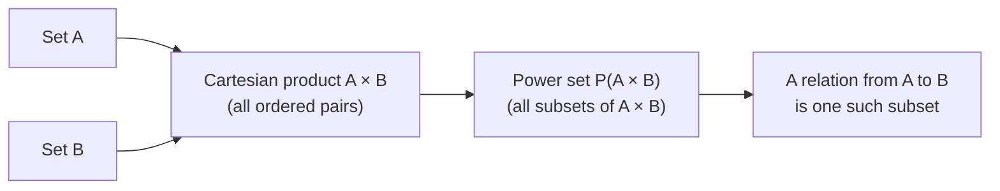

## Learning Objectives

- Explain what the power set of a set is, and prove that a finite set with n elements has exactly 2ⁿ subsets.
- Construct the Cartesian product of two (or more) sets and explain why its elements are ordered pairs, not unordered pairs.
- Distinguish an element of a set from a subset of a set, and a subset from an element of a power set — a distinction that trips up almost everyone the first time.
- Compare |A × B| and |P(A)| for finite sets A and B, and derive each cardinality formula from first principles.
- Identify how power sets and Cartesian products underlie the later definitions of relations and functions.

## Context & Motivation

Sets, unions, intersections, and complements let you combine and compare collections of elements, but they don't yet let you talk about two things that discrete mathematics — and computer science built on top of it — needs constantly: the collection of *all possible subsets* of a set, and the pairing of elements drawn from two (possibly different) sets. Both of these turn out to be constructions on sets themselves, meaning they slot into the same framework you already have, but each opens a door that the basic set operations alone cannot.

The power set answers a question that comes up the moment you start reasoning about possibility or choice: given a set of options, what are *all* the ways of selecting some of them? A menu with n dishes has 2ⁿ possible orders (including ordering nothing and ordering everything); a set of n boolean feature flags has 2ⁿ possible configurations; a set of n propositional variables has 2ⁿ possible truth assignments. Every one of these is, formally, "the power set of a set of size n," and the fact that its size is always exactly 2ⁿ — never approximately, always exactly — is one of the first genuinely satisfying theorems discrete math offers, because the proof is short, constructive, and immediately memorable (MIT 6.042 opens its treatment of sets with exactly this fact for a reason).

The Cartesian product answers a different but equally load-bearing question: how do you formally combine an element of one set with an element of another, in a way where *order matters* and where you can name, unambiguously, "the first coordinate" and "the second coordinate"? This is not a small technicality. Without a rigorous notion of an ordered pair, you cannot define what a *relation* is (a relation will turn out to be nothing more than a subset of a Cartesian product), and without relations you cannot define a *function* in full generality, nor talk about graphs, nor coordinates, nor databases (a row in a relational database table is literally an element of a Cartesian product of column domains — the word "relational" in "relational database" is not a coincidence, it is inherited directly from this exact mathematical object). Everything from "a point in the plane" to "an edge in a directed graph" to "a key-value pair" is, underneath, an element of some Cartesian product. This concept is the quiet foundation the next four concepts in this curriculum are built directly on top of.

## Core Theory

### The power set: definition and notation

For a set A, the **power set** of A, written P(A) or 2^A, is the set of *all* subsets of A:

P(A) = { S : S ⊆ A }

Two facts about this definition surprise people the first time they see it. First, ∅ ∈ P(A) for every set A, because the empty set is a subset of every set (vacuously — there is no element of ∅ that fails to be in A). Second, A ∈ P(A) as well, because every set is a subset of itself. So for A = {1, 2}:

P(A) = { ∅, {1}, {2}, {1, 2} }

Notice the elements of P(A) are themselves *sets* — some of them sets of numbers, one of them the empty set. P(A) is a set whose elements are subsets of A, not elements of A. This is the single most important thing to internalize about power sets before doing anything else with them.

### Why |P(A)| = 2^|A|: two proofs, two intuitions

**Proof by direct correspondence (bijective argument).** Fix a listing of A's elements, a₁, a₂, …, aₙ. Every subset S ⊆ A can be encoded as a length-n string of bits b₁b₂…bₙ, where bᵢ = 1 if aᵢ ∈ S and bᵢ = 0 otherwise. This is a genuine bijection: every subset produces exactly one bit string, and every bit string decodes to exactly one subset (include aᵢ precisely when bᵢ = 1). Since there are exactly 2ⁿ distinct bit strings of length n (two choices, independently, for each of n positions), there are exactly 2ⁿ subsets. This is also why P(A) is sometimes written 2^A — the notation literally encodes "2 choices per element, |A| elements."

**Proof by induction on |A|.** Base case: |A| = 0 means A = ∅, and P(∅) = {∅}, a set with exactly one element, and 2⁰ = 1. Inductive step: suppose every set of size k has a power set of size 2^k. Let A have k + 1 elements; pick any element x ∈ A and let A′ = A \ {x}, so |A′| = k. Every subset of A either excludes x (in which case it's a subset of A′, and there are 2^k of these by the inductive hypothesis) or includes x (in which case it's {x} unioned with some subset of A′, and there are also 2^k of these, by the same correspondence). These two cases are disjoint and exhaustive, so |P(A)| = 2^k + 2^k = 2^(k+1), completing the induction.

Both proofs generalize past finite sets in ways worth knowing about even if a full treatment belongs to a later course: Cantor's theorem shows |P(A)| > |A| for *every* set A, finite or infinite, using a diagonalization argument — meaning even for an infinite set, its power set is a strictly "bigger" infinity. That result is what shows there is no single largest infinite cardinality.

### The Cartesian product: ordered pairs, not sets of two elements

For sets A and B, the **Cartesian product** A × B is:

A × B = { (a, b) : a ∈ A ∧ b ∈ B }

The critical word is *ordered*. (a, b) is not the same object as the set {a, b} — {a, b} equals {b, a} always, but (a, b) = (b, a) only when a = b. Formally, an ordered pair can be defined purely in terms of sets (the Kuratowski definition: (a, b) := {{a}, {a, b}}), which is worth knowing exists precisely to reassure you that "ordered pair" isn't a new primitive notion smuggled in from outside set theory — it's set theory all the way down. In practice you can just treat (a, b) as the familiar coordinate-pair notation and never touch the Kuratowski encoding again.

For A = {1, 2} and B = {x, y}:

A × B = { (1, x), (1, y), (2, x), (2, y) }

while

B × A = { (x, 1), (x, 2), (y, 1), (y, 2) }

Notice A × B ≠ B × A whenever A and B are both non-empty and different — the Cartesian product is not commutative, in sharp contrast to A ∪ B and A ∩ B, which are. This asymmetry is exactly the point: the first coordinate always comes from A and the second always from B, and that distinction is what will let a relation or a function later distinguish "domain" from "codomain."

### Cardinality of a Cartesian product, and generalizing to n sets

For finite sets, |A × B| = |A| · |B|: each of the |A| choices for the first coordinate can be paired independently with each of the |B| choices for the second, giving |A| · |B| total ordered pairs — the same counting principle (often called the multiplication principle) that will reappear throughout combinatorics. The construction generalizes directly to any finite number of sets:

A₁ × A₂ × ⋯ × Aₙ = { (a₁, a₂, …, aₙ) : aᵢ ∈ Aᵢ for each i }

with |A₁ × A₂ × ⋯ × Aₙ| = |A₁| · |A₂| ⋯ |Aₙ|. The special case A × A × ⋯ × A (n copies) is written Aⁿ, so ℝ² is exactly the Cartesian product ℝ × ℝ — "the plane" is, formally, nothing but a Cartesian product of the real line with itself, and a "triple" (a, b, c) is an element of A × B × C.

### How the two constructions relate to each other

Power sets and Cartesian products look unrelated at first glance — one builds subsets, the other builds ordered pairs — but they combine immediately in the very next concept in this curriculum: a **relation** from A to B is defined as *any subset* of A × B, i.e., any element of P(A × B). So P and × are not independent tools you'll use in separate contexts; the second is fed directly into the first to produce the object (a relation) that everything else in this unit — equivalence relations, partial orders, functions — is built from.

## Worked Examples

### Example 1 — computing a power set exhaustively and checking the count

**Problem:** Write out P({a, b, c}) and verify its size matches 2ⁿ.

List subsets by size, from smallest to largest, to avoid missing any: size 0 gives ∅ (1 subset); size 1 gives {a}, {b}, {c} (3 subsets); size 2 gives {a, b}, {a, c}, {b, c} (3 subsets); size 3 gives {a, b, c} (1 subset). Collecting all of them:

P({a, b, c}) = { ∅, {a}, {b}, {c}, {a, b}, {a, c}, {b, c}, {a, b, c} }

Counting the list gives 8 subsets, and 2³ = 8, confirming the formula. Notice the counts by size — 1, 3, 3, 1 — are exactly the binomial coefficients C(3,0), C(3,1), C(3,2), C(3,3); summing "choose k elements out of n, for every k from 0 to n" is another, purely combinatorial way to see why |P(A)| = 2ⁿ, since Σₖ C(n,k) = 2ⁿ is itself a standard identity. This connects power sets directly forward to the combinatorics content later in this curriculum.

### Example 2 — building a Cartesian product and reading off its structure

**Problem:** Let Grades = {A, B, C} and Semesters = {Fall, Spring}. Compute Grades × Semesters, and determine how many ordered pairs (g, s) exist where g is not "C".

First, construct the full product directly from the definition — every element of Grades paired with every element of Semesters, first coordinate always from Grades:

Grades × Semesters = { (A, Fall), (A, Spring), (B, Fall), (B, Spring), (C, Fall), (C, Spring) }

That's |Grades| · |Semesters| = 3 · 2 = 6 pairs, matching the product formula. For the second part, restrict attention to pairs whose first coordinate isn't "C": that eliminates (C, Fall) and (C, Spring), leaving { (A, Fall), (A, Spring), (B, Fall), (B, Spring) } — 4 pairs. This is worth noting explicitly: a "restricted" subset of a Cartesian product picked out by some condition on the coordinates is *itself* an element of P(Grades × Semesters) — in fact it is exactly what the next concept in this curriculum calls a relation. Every time you filter a Cartesian product by a condition, you are constructing a relation, whether or not you've named it that yet.

### Example 3 — a subtlety: elements versus subsets, made concrete with power sets of power sets

**Problem:** Let A = {1, 2}. Determine, with justification, whether each of the following is true: (a) {1} ∈ P(A); (b) {1} ⊆ P(A); (c) ∅ ∈ P(P(A)).

(a) {1} ∈ P(A) asks whether {1} is an *element* of P(A), i.e., whether {1} is one of the subsets of A. Since {1} ⊆ A, yes, {1} is a valid subset of A, so {1} ∈ P(A) is **true**.

(b) {1} ⊆ P(A) asks whether {1} is a *subset* of P(A), which requires every element of {1} — namely the number 1 itself — to be an element of P(A). But P(A) = {∅, {1}, {2}, {1,2}} contains sets, not the raw number 1. Since 1 ∉ P(A), the statement {1} ⊆ P(A) is **false**. This is exactly the confusion flagged in the Learning Objectives: {1} plays two different roles in (a) and (b) — an element of P(A) in one, a would-be subset of P(A) in the other — and only one of those roles is actually correct here.

(c) P(P(A)) is the power set of P(A) = {∅, {1}, {2}, {1,2}}, a set with 4 elements, so P(P(A)) has 2⁴ = 16 elements, one of which is always ∅ itself (∅ is a subset of every set, including P(A)). So ∅ ∈ P(P(A)) is **true** — and note this ∅ sits at a different "level" than the ∅ that is itself an element of P(A); nesting power sets like this is exactly how set theory builds up increasingly large infinite cardinalities from Cantor's theorem, layer by layer.

## Common Misconceptions & Pitfalls

- **Confusing ∈ and ⊆ when a power set is involved.** As Example 3 shows concretely, {1} ∈ P(A) and {1} ⊆ P(A) ask genuinely different questions with genuinely different (here, opposite) answers. The rule of thumb: X ∈ P(A) always means exactly the same thing as X ⊆ A — that equivalence is the entire definition of a power set — so translate any ∈ P(A) question back into a ⊆ A question before answering it.
- **Believing A × B and B × A are the same set.** They contain the same *number* of pairs when both sets are finite, but as ordered pairs, (1, x) ∈ A × B is a different object from (x, 1) ∈ B × A, and in general A × B ≠ B × A entirely (not merely "the elements are listed differently") whenever A ≠ B and both are non-empty. Only when A = B do A × B and B × A coincide as sets — the individual pairs (a, b) and (b, a) can still differ from each other, but every pair that's in one product is also in the other since both coordinates range over the same set.
- **Forgetting ∅ and A themselves belong to P(A).** It's common to enumerate P(A) by listing only the "proper" or "obviously interesting" subsets and skip ∅ and A, undercounting — the formula 2ⁿ only holds if both extremes are included.
- **Assuming the Cartesian product only makes sense for numbers, or only for two sets.** A × B is defined for *any* two sets — Grades × Semesters above pairs letters with season names, no numbers involved. And the construction extends immediately to any finite number of sets (A₁ × ⋯ × Aₙ), not just two; there's nothing privileged about the two-set case beyond it being the simplest one to state first.
- **Thinking |P(A)| grows the same way |A| does.** |P(A)| = 2^|A| is exponential, not linear — adding a single element to A *doubles* the number of subsets, since every existing subset now also has a version that includes the new element. Going from |A| = 20 to |A| = 21 changes |P(A)| from about a million to about two million, which surprises students who expect a modest, incremental change.

## Summary

The power set P(A) of a set A collects every subset of A, including ∅ and A itself, and for a finite set of size n, |P(A)| = 2ⁿ — provable either by a direct bit-string correspondence (each subset ↔ a length-n string of include/exclude decisions) or by induction on |A|, and connected to the combinatorial identity Σₖ C(n,k) = 2ⁿ. The Cartesian product A × B collects every *ordered* pair with first coordinate from A and second from B, with |A × B| = |A| · |B| for finite sets, and it is emphatically not commutative (A × B ≠ B × A in general) precisely because order is what the construction is for. The two ideas meet immediately at the boundary of this unit: a relation from A to B is defined as any element of P(A × B), i.e., any subset of the Cartesian product — meaning every relation, equivalence relation, partial order, and function studied from here on is, underneath its own name and notation, built directly out of these two constructions.

## Documentation Links

- [Lehman, Leighton & Meyer — Mathematics for Computer Science (full text)](https://people.csail.mit.edu/meyer/mcs.pdf) — doc
- [ACM/IEEE CS2013 Curriculum Guidelines](https://www.acm.org/binaries/content/assets/education/cs2013_web_final.pdf) — doc
