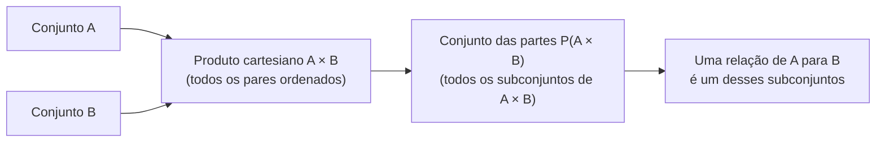

## Objetivos de Aprendizagem

- Explicar o que é o conjunto das partes de um conjunto, e provar que um conjunto finito com n elementos tem exatamente 2ⁿ subconjuntos.
- Construir o produto cartesiano de dois (ou mais) conjuntos e explicar por que seus elementos são pares ordenados, não pares não ordenados.
- Distinguir um elemento de um conjunto de um subconjunto de um conjunto, e um subconjunto de um elemento de um conjunto das partes, uma distinção que confunde quase todo mundo na primeira vez.
- Comparar |A × B| e |P(A)| para conjuntos finitos A e B, e derivar cada fórmula de cardinalidade a partir de princípios básicos.
- Identificar como conjuntos das partes e produtos cartesianos sustentam as definições posteriores de relações e funções.

## Contexto e Motivação

Conjuntos, uniões, interseções e complementos permitem combinar e comparar coleções de elementos, mas ainda não permitem falar de duas coisas de que a matemática discreta (e a Ciência da Computação construída em cima dela) precisa constantemente: a coleção de *todos os subconjuntos possíveis* de um conjunto, e o pareamento de elementos tirados de dois conjuntos (possivelmente diferentes). As duas acabam sendo construções sobre conjuntos em si, o que significa que se encaixam no mesmo arcabouço que você já tem, mas cada uma abre uma porta que as operações básicas de conjunto sozinhas não conseguem abrir.

O conjunto das partes responde uma pergunta que surge no momento em que você começa a raciocinar sobre possibilidade ou escolha: dado um conjunto de opções, quais são *todas* as formas de selecionar algumas delas? Um cardápio com n pratos tem 2ⁿ pedidos possíveis (incluindo não pedir nada e pedir tudo); um conjunto de n flags booleanas de funcionalidade tem 2ⁿ configurações possíveis; um conjunto de n variáveis proposicionais tem 2ⁿ atribuições de verdade possíveis. Cada um desses é, formalmente, "o conjunto das partes de um conjunto de tamanho n", e o fato de seu tamanho ser sempre exatamente 2ⁿ, nunca aproximadamente, sempre exatamente, é um dos primeiros teoremas genuinamente satisfatórios que a matemática discreta oferece, porque a prova é curta, construtiva e imediatamente memorável (o 6.042 do MIT abre seu tratamento de conjuntos com exatamente esse fato por uma razão).

O produto cartesiano responde uma pergunta diferente mas igualmente essencial: como você combina formalmente um elemento de um conjunto com um elemento de outro, de um jeito em que *a ordem importa* e onde você pode nomear, sem ambiguidade, "a primeira coordenada" e "a segunda coordenada"? Isso não é um detalhe técnico pequeno. Sem uma noção rigorosa de par ordenado, você não consegue definir o que é uma *relação* (uma relação vai acabar sendo nada mais que um subconjunto de um produto cartesiano), e sem relações você não consegue definir uma *função* em generalidade completa, nem falar de grafos, nem de coordenadas, nem de bancos de dados (uma linha numa tabela de banco de dados relacional é literalmente um elemento de um produto cartesiano de domínios de colunas; a palavra "relacional" em "banco de dados relacional" não é coincidência, é herdada diretamente deste objeto matemático exato). Tudo, de "um ponto no plano" a "uma aresta num grafo dirigido" a "um par chave-valor", é, por baixo, um elemento de algum produto cartesiano. Este conceito é o fundamento silencioso sobre o qual os próximos quatro conceitos deste currículo são construídos diretamente.

## Teoria Central

### O conjunto das partes: definição e notação

Para um conjunto A, o **conjunto das partes** de A, escrito P(A) ou 2^A, é o conjunto de *todos* os subconjuntos de A:

P(A) = { S : S ⊆ A }

Dois fatos sobre essa definição surpreendem as pessoas na primeira vez que veem. Primeiro, ∅ ∈ P(A) para todo conjunto A, porque o conjunto vazio é subconjunto de todo conjunto (vacuamente; não há elemento de ∅ que falhe em estar em A). Segundo, A ∈ P(A) também, porque todo conjunto é subconjunto de si mesmo. Então para A = {1, 2}:

P(A) = { ∅, {1}, {2}, {1, 2} }

Note que os elementos de P(A) são eles mesmos *conjuntos*, alguns deles conjuntos de números, um deles o conjunto vazio. P(A) é um conjunto cujos elementos são subconjuntos de A, não elementos de A. Essa é a coisa mais importante a internalizar sobre conjuntos das partes antes de fazer qualquer outra coisa com eles.

### Por que |P(A)| = 2^|A|: duas provas, duas intuições

**Prova por correspondência direta (argumento bijetivo).** Fixe uma listagem dos elementos de A, a₁, a₂, …, aₙ. Todo subconjunto S ⊆ A pode ser codificado como uma string de bits de comprimento n, b₁b₂…bₙ, onde bᵢ = 1 se aᵢ ∈ S e bᵢ = 0 caso contrário. Isso é uma bijeção genuína: todo subconjunto produz exatamente uma string de bits, e toda string de bits decodifica para exatamente um subconjunto (inclua aᵢ precisamente quando bᵢ = 1). Como existem exatamente 2ⁿ strings de bits distintas de comprimento n (duas escolhas, independentemente, para cada uma das n posições), existem exatamente 2ⁿ subconjuntos. É também por isso que P(A) às vezes é escrito 2^A: a notação literalmente codifica "2 escolhas por elemento, |A| elementos".

**Prova por indução sobre |A|.** Caso base: |A| = 0 significa A = ∅, e P(∅) = {∅}, um conjunto com exatamente um elemento, e 2⁰ = 1. Passo indutivo: suponha que todo conjunto de tamanho k tem um conjunto das partes de tamanho 2^k. Seja A com k + 1 elementos; escolha qualquer elemento x ∈ A e seja A′ = A \ {x}, então |A′| = k. Todo subconjunto de A ou exclui x (nesse caso é um subconjunto de A′, e existem 2^k desses pela hipótese indutiva) ou inclui x (nesse caso é {x} unido com algum subconjunto de A′, e também existem 2^k desses, pela mesma correspondência). Esses dois casos são disjuntos e exaustivos, então |P(A)| = 2^k + 2^k = 2^(k+1), completando a indução.

As duas provas generalizam para além de conjuntos finitos de formas que vale a pena conhecer mesmo que um tratamento completo pertença a um curso posterior: o teorema de Cantor mostra |P(A)| > |A| para *todo* conjunto A, finito ou infinito, usando um argumento de diagonalização, o que significa que mesmo para um conjunto infinito, seu conjunto das partes é um infinito estritamente "maior". Esse resultado é o que mostra que não existe uma única maior cardinalidade infinita.

### O produto cartesiano: pares ordenados, não conjuntos de dois elementos

Para conjuntos A e B, o **produto cartesiano** A × B é:

A × B = { (a, b) : a ∈ A ∧ b ∈ B }

A palavra crítica é *ordenado*. (a, b) não é o mesmo objeto que o conjunto {a, b}; {a, b} sempre é igual a {b, a}, mas (a, b) = (b, a) só quando a = b. Formalmente, um par ordenado pode ser definido puramente em termos de conjuntos (a definição de Kuratowski: (a, b) := {{a}, {a, b}}), o que vale a pena saber que existe precisamente pra tranquilizar você de que "par ordenado" não é uma noção primitiva nova contrabandeada de fora da teoria dos conjuntos; é teoria dos conjuntos até o fim. Na prática você pode simplesmente tratar (a, b) como a notação familiar de par de coordenadas e nunca mais tocar na codificação de Kuratowski.

Para A = {1, 2} e B = {x, y}:

A × B = { (1, x), (1, y), (2, x), (2, y) }

enquanto

B × A = { (x, 1), (x, 2), (y, 1), (y, 2) }

Note que A × B ≠ B × A sempre que A e B são ambos não vazios e diferentes; o produto cartesiano não é comutativo, em forte contraste com A ∪ B e A ∩ B, que são. Essa assimetria é exatamente o ponto: a primeira coordenada sempre vem de A e a segunda sempre vem de B, e essa distinção é o que vai permitir que uma relação ou função depois distinga "domínio" de "contradomínio".

### Cardinalidade de um produto cartesiano, e generalizando para n conjuntos

Para conjuntos finitos, |A × B| = |A| · |B|: cada uma das |A| escolhas para a primeira coordenada pode ser pareada independentemente com cada uma das |B| escolhas para a segunda, dando |A| · |B| pares ordenados no total, o mesmo princípio de contagem (muitas vezes chamado princípio multiplicativo) que vai reaparecer ao longo da combinatória. A construção generaliza diretamente para qualquer número finito de conjuntos:

A₁ × A₂ × ⋯ × Aₙ = { (a₁, a₂, …, aₙ) : aᵢ ∈ Aᵢ para cada i }

com |A₁ × A₂ × ⋯ × Aₙ| = |A₁| · |A₂| ⋯ |Aₙ|. O caso especial A × A × ⋯ × A (n cópias) é escrito Aⁿ, então ℝ² é exatamente o produto cartesiano ℝ × ℝ: "o plano" é, formalmente, nada mais que um produto cartesiano da reta real com ela mesma, e uma "tripla" (a, b, c) é um elemento de A × B × C.

### Como as duas construções se relacionam

Conjunto das partes e produto cartesiano parecem não relacionados à primeira vista, um constrói subconjuntos, o outro constrói pares ordenados, mas se combinam imediatamente no próximo conceito deste currículo: uma **relação** de A para B é definida como *qualquer subconjunto* de A × B, isto é, qualquer elemento de P(A × B). Então P e × não são ferramentas independentes que você vai usar em contextos separados; a segunda alimenta diretamente a primeira para produzir o objeto (uma relação) do qual tudo o mais nesta unidade (relações de equivalência, ordens parciais, funções) é construído.

## Exemplos Resolvidos

### Exemplo 1: computando um conjunto das partes exaustivamente e checando a contagem

**Problema:** escreva P({a, b, c}) e verifique que seu tamanho corresponde a 2ⁿ.

Liste subconjuntos por tamanho, do menor para o maior, para não perder nenhum: tamanho 0 dá ∅ (1 subconjunto); tamanho 1 dá {a}, {b}, {c} (3 subconjuntos); tamanho 2 dá {a, b}, {a, c}, {b, c} (3 subconjuntos); tamanho 3 dá {a, b, c} (1 subconjunto). Reunindo todos:

P({a, b, c}) = { ∅, {a}, {b}, {c}, {a, b}, {a, c}, {b, c}, {a, b, c} }

Contando a lista dá 8 subconjuntos, e 2³ = 8, confirmando a fórmula. Note que as contagens por tamanho (1, 3, 3, 1) são exatamente os coeficientes binomiais C(3,0), C(3,1), C(3,2), C(3,3); somar "escolha k elementos dentre n, para todo k de 0 a n" é outra forma, puramente combinatória, de ver por que |P(A)| = 2ⁿ, já que Σₖ C(n,k) = 2ⁿ é ela mesma uma identidade padrão. Isso conecta conjuntos das partes diretamente ao conteúdo de combinatória mais adiante neste currículo.

### Exemplo 2: construindo um produto cartesiano e lendo sua estrutura

**Problema:** sejam Notas = {A, B, C} e Semestres = {Outono, Primavera}. Compute Notas × Semestres, e determine quantos pares ordenados (n, s) existem onde n não é "C".

Primeiro, construa o produto completo diretamente da definição, todo elemento de Notas pareado com todo elemento de Semestres, primeira coordenada sempre de Notas:

Notas × Semestres = { (A, Outono), (A, Primavera), (B, Outono), (B, Primavera), (C, Outono), (C, Primavera) }

Isso é |Notas| · |Semestres| = 3 · 2 = 6 pares, correspondendo à fórmula do produto. Para a segunda parte, restrinja a atenção a pares cuja primeira coordenada não é "C": isso elimina (C, Outono) e (C, Primavera), deixando { (A, Outono), (A, Primavera), (B, Outono), (B, Primavera) }, 4 pares. Vale notar isso explicitamente: um subconjunto "restrito" de um produto cartesiano selecionado por alguma condição sobre as coordenadas é *ele mesmo* um elemento de P(Notas × Semestres); de fato é exatamente o que o próximo conceito deste currículo chama de relação. Toda vez que você filtra um produto cartesiano por uma condição, você está construindo uma relação, quer já tenha dado esse nome a ela ou não.

### Exemplo 3: uma sutileza: elementos versus subconjuntos, concretizada com conjuntos das partes de conjuntos das partes

**Problema:** seja A = {1, 2}. Determine, com justificativa, se cada uma das seguintes é verdadeira: (a) {1} ∈ P(A); (b) {1} ⊆ P(A); (c) ∅ ∈ P(P(A)).

(a) {1} ∈ P(A) pergunta se {1} é um *elemento* de P(A), isto é, se {1} é um dos subconjuntos de A. Como {1} ⊆ A, sim, {1} é um subconjunto válido de A, então {1} ∈ P(A) é **verdadeiro**.

(b) {1} ⊆ P(A) pergunta se {1} é um *subconjunto* de P(A), o que exige que todo elemento de {1}, ou seja, o próprio número 1, seja um elemento de P(A). Mas P(A) = {∅, {1}, {2}, {1,2}} contém conjuntos, não o número 1 cru. Como 1 ∉ P(A), a afirmação {1} ⊆ P(A) é **falsa**. Esta é exatamente a confusão sinalizada nos Objetivos de Aprendizagem: {1} desempenha dois papéis diferentes em (a) e (b), um elemento de P(A) num, um pretenso subconjunto de P(A) no outro, e só um desses papéis está de fato correto aqui.

(c) P(P(A)) é o conjunto das partes de P(A) = {∅, {1}, {2}, {1,2}}, um conjunto com 4 elementos, então P(P(A)) tem 2⁴ = 16 elementos, um dos quais é sempre o próprio ∅ (∅ é subconjunto de todo conjunto, incluindo P(A)). Então ∅ ∈ P(P(A)) é **verdadeiro**, e note que este ∅ fica num "nível" diferente do ∅ que é ele mesmo um elemento de P(A); aninhar conjuntos das partes assim é exatamente como a teoria dos conjuntos constrói cardinalidades infinitas cada vez maiores a partir do teorema de Cantor, camada por camada.

## Equívocos Comuns e Armadilhas

- **Confundir ∈ e ⊆ quando um conjunto das partes está envolvido.** Como o Exemplo 3 mostra concretamente, {1} ∈ P(A) e {1} ⊆ P(A) perguntam coisas genuinamente diferentes com respostas genuinamente diferentes (aqui, opostas). A regra prática: X ∈ P(A) sempre significa exatamente a mesma coisa que X ⊆ A, essa equivalência é a definição inteira de conjunto das partes, então traduza qualquer pergunta de ∈ P(A) de volta para uma pergunta de ⊆ A antes de responder.
- **Acreditar que A × B e B × A são o mesmo conjunto.** Eles contêm o mesmo *número* de pares quando os dois conjuntos são finitos, mas como pares ordenados, (1, x) ∈ A × B é um objeto diferente de (x, 1) ∈ B × A, e em geral A × B ≠ B × A completamente (não só "os elementos estão listados diferente") sempre que A ≠ B e ambos são não vazios. Só quando A = B é que A × B e B × A coincidem como conjuntos; os pares individuais (a, b) e (b, a) ainda podem diferir entre si, mas todo par que está num produto também está no outro já que as duas coordenadas percorrem o mesmo conjunto.
- **Esquecer que ∅ e o próprio A pertencem a P(A).** É comum enumerar P(A) listando só os subconjuntos "próprios" ou "obviamente interessantes" e pular ∅ e A, subcontando; a fórmula 2ⁿ só vale se os dois extremos forem incluídos.
- **Assumir que o produto cartesiano só faz sentido para números, ou só para dois conjuntos.** A × B é definido para *quaisquer* dois conjuntos; Notas × Semestres acima pareia letras com nomes de estação, sem números envolvidos. E a construção se estende imediatamente para qualquer número finito de conjuntos (A₁ × ⋯ × Aₙ), não só dois; não há nada de privilegiado no caso de dois conjuntos além de ser o mais simples de declarar primeiro.
- **Pensar que |P(A)| cresce do mesmo jeito que |A|.** |P(A)| = 2^|A| é exponencial, não linear; adicionar um único elemento a A *dobra* o número de subconjuntos, já que todo subconjunto existente agora também tem uma versão que inclui o novo elemento. Ir de |A| = 20 para |A| = 21 muda |P(A)| de cerca de um milhão para cerca de dois milhões, o que surpreende alunos que esperam uma mudança modesta e incremental.

## Resumo

O conjunto das partes P(A) de um conjunto A reúne todo subconjunto de A, incluindo ∅ e o próprio A, e para um conjunto finito de tamanho n, |P(A)| = 2ⁿ, provável tanto por uma correspondência direta com strings de bits (cada subconjunto ↔ uma string de decisões incluir/excluir de comprimento n) quanto por indução sobre |A|, e conectado à identidade combinatória Σₖ C(n,k) = 2ⁿ. O produto cartesiano A × B reúne todo par *ordenado* com primeira coordenada de A e segunda de B, com |A × B| = |A| · |B| para conjuntos finitos, e enfaticamente não é comutativo (A × B ≠ B × A em geral) precisamente porque ordem é para o que a construção serve. As duas ideias se encontram imediatamente na fronteira desta unidade: uma relação de A para B é definida como qualquer elemento de P(A × B), isto é, qualquer subconjunto do produto cartesiano, o que significa que toda relação, relação de equivalência, ordem parcial e função estudada daqui pra frente é, por baixo de seu próprio nome e notação, construída diretamente a partir dessas duas construções.

## Documentation Links

- [Lehman, Leighton & Meyer — Mathematics for Computer Science (full text)](https://people.csail.mit.edu/meyer/mcs.pdf) — doc
- [ACM/IEEE CS2013 Curriculum Guidelines](https://www.acm.org/binaries/content/assets/education/cs2013_web_final.pdf) — doc
