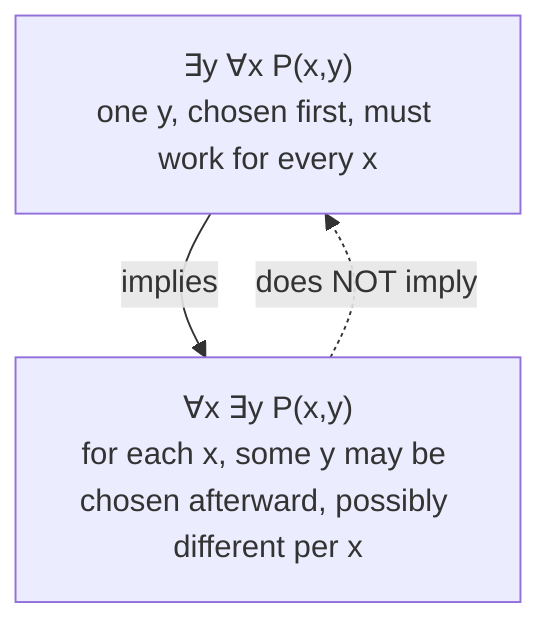

## Learning Objectives

- Define a predicate as a statement whose truth value depends on one or more free variables, and explain why a predicate alone is neither true nor false until its variables are bound.
- Translate universally and existentially quantified English statements into symbolic form (∀, ∃) and back, given an explicit domain of discourse.
- Evaluate the truth value of a quantified statement, including one with nested quantifiers, over a specified domain.
- Distinguish free from bound variables, and explain why the order of two different quantifiers (∀x∃y versus ∃y∀x) can change a statement's meaning and truth value.
- Compare a statement quantified over an empty domain against the same statement over a nonempty domain, and correctly evaluate the universally quantified case.

## Context & Motivation

Propositional logic, on its own, can express "it is raining" as a single indivisible atomic proposition `p`, but it has no way to express "every natural number is non-negative" without simply asserting one proposition for each natural number separately — an infinite, unmanageable list of atomic claims, one per number. What propositional logic is missing is the ability to talk *about a variable* — to say something is true of `x`, for a range of possible values of `x`, without picking one specific value first. A **predicate** fills exactly that gap: `P(x)` is a template — "x is non-negative," say — that becomes an ordinary true-or-false proposition only once `x` is replaced by a specific value, or once it is paired with a **quantifier** that says how many values of `x` (all of them, or at least one) the statement is being asserted for.

This is not a notational nicety; it is the mechanism that makes mathematics (and formal software specification) able to state general laws instead of listing cases. Stanford's CS103 course builds its entire treatment of formal reasoning on top of predicate logic for precisely this reason: a function's precondition ("for all valid inputs, ...") and postcondition ("there exists an output such that...") are quantified predicate-logic statements, whether or not the code comments say so explicitly. A loop invariant that must hold "for every iteration so far" is a universally quantified predicate. A search algorithm's correctness claim — "if the target is present, the algorithm finds *some* index where it occurs" — is existentially quantified. Learning to read and write `∀` and `∃` precisely is learning to state, unambiguously, exactly what a program or a mathematical claim promises, rather than gesturing at it with prose that quietly hides which quantifier was meant.

The single hardest habit to build here is one of order. Two quantifiers of different kinds, applied to the same two variables, do not commute — swapping their order can turn a true statement into a false one, or vice versa, and this exact confusion is one of the most common sources of incorrect proofs among students first learning predicate logic. Getting comfortable reading `∀x∃y` versus `∃y∀x` as making genuinely different claims — one saying "a suitable y can depend on which x you picked," the other saying "one single y works no matter what x is" — is the central skill this concept builds.

## Core Theory

### Predicates and domains of discourse

A **predicate** `P(x)` is an expression involving a variable `x` that becomes a proposition — something with a definite truth value — once `x` is assigned a specific value from an agreed-upon set called the **domain of discourse**. `P(x)`: "x is prime" is neither true nor false on its own; `P(7)` is true, `P(8)` is false. A predicate can take several variables — `Q(x, y)`: "x is divisible by y" — and becomes a proposition only once *every* variable is either assigned a value or bound by a quantifier. The domain of discourse must be specified (explicitly, or by clear convention) before any quantified statement about `P` can be evaluated, because the same predicate can be true over one domain and false over another — "every number is a perfect square" is false over the naturals but (vacuously, see below) true over the empty set.

### The universal quantifier

`∀x P(x)` ("for all x, P(x)") is true exactly when `P(x)` is true for *every* element `x` in the domain of discourse, and false as soon as even a single element fails it (a **counterexample**). Disproving a universal claim requires exactly one counterexample; proving one requires an argument that covers every element of the domain — direct verification if the domain is finite and small, a general argument otherwise. A universally quantified statement over an *empty* domain is true **vacuously** — there are no elements to violate it, so the claim "for all x in ∅, P(x)" holds trivially, however implausible `P` looks. This single fact trips up more students than perhaps any other quantifier rule, precisely because it runs against the intuition that "for all" should require *some* elements to actually check.

### The existential quantifier

`∃x P(x)` ("there exists an x such that P(x)") is true exactly when at least one element of the domain satisfies `P`, and false only if *no* element does. Proving an existential claim requires producing (or arguing for the existence of) just one **witness**; disproving one requires showing the predicate fails for every element of the domain — which is itself a universal claim, `∀x ¬P(x)` (the exact content of the *Negating Quantified Statements* concept). An existential statement over an empty domain is false — there is nothing to serve as a witness. Existential and universal quantification are thus each other's natural opposites in exactly this sense: proving one directly requires the proof technique that disproves the other.

### Free versus bound variables, and scope

A variable is **bound** if it falls within the scope of a quantifier that names it (`∀x` binds every unquantified occurrence of `x` in the expression that follows); a variable is **free** if no quantifier binds it. `∀x P(x, y)` has `x` bound and `y` free — the whole expression is still a predicate in `y`, not yet a full proposition, until `y` is also bound or assigned. A fully quantified statement, with every variable bound, is a complete proposition with a definite truth value; a statement with any free variable remaining is still a predicate.

### Nested quantifiers and the order-sensitivity of ∀ and ∃

When two different quantifiers apply to two different variables, their order is not interchangeable. `∀x∃y P(x,y)` says: for every `x`, *some* `y` (possibly depending on `x`) makes `P(x,y)` true — the witness `y` is allowed to change as `x` changes. `∃y∀x P(x,y)` says something strictly stronger: there is *one single* `y` that works for *every* `x` simultaneously. Every statement of the second form implies the first (if one `y` works for all `x`, then in particular each `x` has *a* `y` that works), but the converse fails in general — this is exactly why the two forms are not equivalent.

Two purely quantifier-only statements with the same predicate can also swap between two universals or two existentials of the same kind without changing meaning: `∀x∀y P(x,y) ≡ ∀y∀x P(x,y)`, and likewise `∃x∃y P(x,y) ≡ ∃y∃x P(x,y)` — order only matters when the two quantifiers are of *different* kinds.

### Translating English into quantified notation

| English pattern | Symbolic form |
|---|---|
| "Every x has property P" / "All x are P" | `∀x P(x)` |
| "Some x has property P" / "There is an x that is P" | `∃x P(x)` |
| "No x has property P" | `∀x ¬P(x)`  (equivalently `¬∃x P(x)`) |
| "Not every x has property P" | `¬∀x P(x)`  (equivalently `∃x ¬P(x)`) |
| "There is exactly one x with property P" | `∃!x P(x)`, shorthand for `∃x (P(x) ∧ ∀y (P(y) → y = x))` |

The uniqueness quantifier `∃!` is a convenient abbreviation, not a primitive — it unpacks into an existence claim conjoined with a uniqueness claim (any other object with the property must be the same object), which is worth knowing precisely because a proof of `∃!x P(x)` genuinely has two separate parts to establish.

## Worked Examples

### Example 1 — order-sensitive translation: "every student has taken some course"

**Problem:** let the domain for students be `S` and for courses be `C`, and let `T(s, c)` mean "student s has taken course c." Translate "every student has taken some course," and show why the naive alternative ordering says something different and stronger.

The intended reading allows different students to have taken different courses: `∀s ∈ S, ∃c ∈ C, T(s, c)` — for each student, *some* course (possibly a different one per student) has been taken. The reversed-order statement `∃c ∈ C, ∀s ∈ S, T(s, c)` claims something much stronger: there is a *single* course that every student in the school has taken — a shared, universal requirement. Both might happen to be true at a school with a mandatory first-year seminar, but they are logically distinct claims, and only the context ("every student has taken *some* course," with no mention of a shared one) licenses the first, weaker translation. Mistranslating "some" statements that depend on an earlier "every" as the stronger, order-swapped form is the single most common quantifier-translation error.

### Example 2 — domain changes the truth value

**Problem:** evaluate `∀x ∃y (x + y = 0)` first over the integers ℤ, then over the natural numbers ℕ (taking 0 ∈ ℕ, no negative numbers).

Over ℤ: for any integer `x`, choosing `y = −x` gives `x + y = 0`, and `−x` is itself an integer, so a valid witness always exists — the statement is true. Over ℕ: take `x = 3`. A witness `y` would need to satisfy `3 + y = 0`, i.e., `y = −3`, which is not a natural number — no valid witness exists for `x = 3`, so `∃y (x+y=0)` is false for that particular `x`, which makes the universally quantified statement false overall (one counterexample value of `x` is enough). The identical predicate and identical quantifier structure produce opposite truth values purely because the domain of discourse changed — confirming that no quantified statement can be evaluated, or even meaningfully stated, without first fixing the domain.

### Example 3 — existential-then-universal versus universal-then-existential

**Problem:** evaluate `∃x ∀y (x ≤ y)` and `∀y ∃x (x ≤ y)` over ℕ, and explain why they differ in difficulty even though both happen to be true.

`∃x ∀y (x ≤ y)`: does there exist a single natural number that is ≤ every natural number? Yes — `x = 0` works, since `0 ≤ y` for every `y ∈ ℕ`. This is the strong, "one witness serves everyone" form, and it happens to be true here only because ℕ has a least element. `∀y ∃x (x ≤ y)`: for every `y`, does some `x` (possibly depending on `y`) satisfy `x ≤ y`? Trivially yes — `x = y` itself always works, or `x = 0` works uniformly too. This weaker form is true for a much less interesting reason and would remain true even if ℕ had no least element at all, illustrating concretely that the strong form implies the weak one but demands considerably more to establish.

## Common Misconceptions & Pitfalls

- **Swapping ∀ and ∃ freely because "they're both quantifiers."** As Example 1 and the implication diagram show, `∀x∃y P(x,y)` and `∃y∀x P(x,y)` are not equivalent in general — only the direction `∃y∀x P → ∀x∃y P` holds, never the reverse.
- **Treating a universally quantified statement over an empty domain as automatically false or "undefined."** `∀x P(x)` over `∅` is vacuously *true* by the formal definition — there is no element to fail it. A claim like "every element of the empty set is a unicorn" is, formally, a true statement, however strange it reads in English.
- **Forgetting that a predicate with free variables isn't a proposition yet.** `P(x, y)` cannot be judged true or false on its own; only after every variable is bound (by a quantifier) or assigned a value does it become a proposition with a definite truth value. Writing "is `P(x,y)` true?" without specifying what happens to `x` and `y` is an ill-formed question.
- **Assuming the domain of discourse is "obviously" the same as in a previous problem.** The exact same predicate and quantifier structure can flip truth value purely from a change of domain, as in Example 2 — always state (or confirm) the domain before evaluating or translating a quantified claim.
- **Confusing `∃!` with plain `∃`.** `∃x P(x)` only claims at least one witness exists; `∃!x P(x)` additionally claims that witness is the *only* one. A proof of uniqueness (usually: assume two witnesses, show they must be equal) is a separate task from a proof of existence, and both are required to establish `∃!`.

## Summary

A predicate `P(x)` is a statement template that becomes a genuine proposition only once its variables are bound — by assignment, or by a quantifier. The universal quantifier `∀x P(x)` demands truth across the entire domain of discourse (false given one counterexample, vacuously true over an empty domain); the existential quantifier `∃x P(x)` demands only one witness (false only if none exists anywhere in the domain). Variables are free until a quantifier's scope binds them, and only a statement with every variable bound has a definite truth value. Two quantifiers of the *same* kind commute freely; two quantifiers of *different* kinds generally do not — `∃y∀x P(x,y)` (one shared witness) is strictly stronger than `∀x∃y P(x,y)` (a witness allowed to vary with x), and mistaking the weaker form for the stronger one (or vice versa) is the single most common error at this stage. Every quantified claim depends on its domain of discourse, and no such claim can be meaningfully evaluated, translated, or negated without that domain fixed first.

## Documentation Links

- [Lehman, Leighton & Meyer — Mathematics for Computer Science (full text)](https://people.csail.mit.edu/meyer/mcs.pdf) — doc
- [Stanford CS103 — Mathematical Foundations of Computing](https://web.stanford.edu/class/cs103/) — doc
