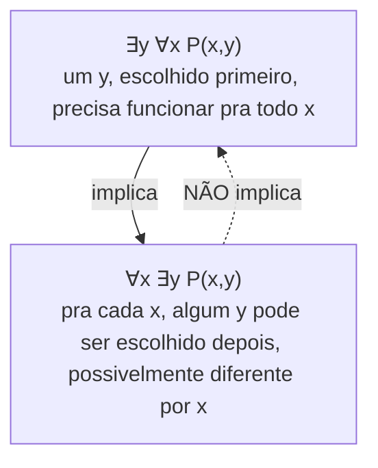

## Objetivos de Aprendizagem

- Definir predicado como uma afirmação cujo valor-verdade depende de uma ou mais variáveis livres, e explicar por que um predicado sozinho não é nem verdadeiro nem falso até suas variáveis serem vinculadas.
- Traduzir afirmações em português quantificadas universal e existencialmente para forma simbólica (∀, ∃) e vice-versa, dado um domínio de discurso explícito.
- Avaliar o valor-verdade de uma afirmação quantificada, incluindo uma com quantificadores aninhados, sobre um domínio especificado.
- Distinguir variáveis livres de variáveis vinculadas, e explicar por que a ordem de dois quantificadores diferentes (∀x∃y versus ∃y∀x) pode mudar o significado e o valor-verdade de uma afirmação.
- Comparar uma afirmação quantificada sobre um domínio vazio com a mesma afirmação sobre um domínio não vazio, e avaliar corretamente o caso quantificado universalmente.

## Contexto e Motivação

Lógica proposicional, sozinha, consegue expressar "está chovendo" como uma única proposição atômica indivisível `p`, mas não tem como expressar "todo número natural é não negativo" sem simplesmente afirmar uma proposição para cada número natural separadamente, uma lista infinita e inadministrável de afirmações atômicas, uma por número. O que falta à lógica proposicional é a capacidade de falar *sobre uma variável*, de dizer que algo é verdadeiro de `x`, para uma faixa de valores possíveis de `x`, sem escolher um valor específico primeiro. Um **predicado** preenche exatamente essa lacuna: `P(x)` é um molde ("x é não negativo", digamos) que se torna uma proposição comum, verdadeira ou falsa, só depois que `x` é substituído por um valor específico, ou depois de ser pareado com um **quantificador** que diz para quantos valores de `x` (todos eles, ou pelo menos um) a afirmação está sendo feita.

Isso não é um capricho de notação; é o mecanismo que permite que a matemática (e a especificação formal de software) declare leis gerais em vez de listar casos. O curso CS103 de Stanford constrói todo o seu tratamento de raciocínio formal em cima da lógica de predicados exatamente por essa razão: a pré-condição de uma função ("para toda entrada válida, ...") e a pós-condição ("existe uma saída tal que...") são afirmações quantificadas de lógica de predicados, quer os comentários do código digam isso explicitamente ou não. Um invariante de laço que precisa valer "em toda iteração até agora" é um predicado quantificado universalmente. A afirmação de corretude de um algoritmo de busca (se o alvo está presente, o algoritmo encontra *algum* índice onde ele ocorre) é quantificada existencialmente. Aprender a ler e escrever `∀` e `∃` com precisão é aprender a declarar, sem ambiguidade, exatamente o que um programa ou uma afirmação matemática promete, em vez de apontar vagamente com prosa que esconde silenciosamente qual quantificador era pretendido.

O hábito mais difícil de construir aqui é o de ordem. Dois quantificadores de tipos diferentes, aplicados às mesmas duas variáveis, não comutam; trocar sua ordem pode transformar uma afirmação verdadeira numa falsa, ou vice-versa, e essa confusão exata é uma das fontes mais comuns de provas incorretas entre alunos aprendendo lógica de predicados pela primeira vez. Ficar confortável lendo `∀x∃y` versus `∃y∀x` como fazendo afirmações genuinamente diferentes (uma dizendo "um y adequado pode depender de qual x você escolheu", a outra dizendo "um único y funciona não importa qual x seja") é a habilidade central que este conceito constrói.

## Teoria Central

### Predicados e domínios de discurso

Um **predicado** `P(x)` é uma expressão envolvendo uma variável `x` que se torna uma proposição (algo com um valor-verdade definido) uma vez que `x` recebe um valor específico de um conjunto combinado de antemão chamado **domínio de discurso**. `P(x)`: "x é primo" não é nem verdadeiro nem falso sozinho; `P(7)` é verdadeiro, `P(8)` é falso. Um predicado pode ter várias variáveis, `Q(x, y)`: "x é divisível por y", e se torna uma proposição só quando *toda* variável recebe um valor ou é vinculada por um quantificador. O domínio de discurso precisa ser especificado (explicitamente, ou por convenção clara) antes que qualquer afirmação quantificada sobre `P` possa ser avaliada, porque o mesmo predicado pode ser verdadeiro sobre um domínio e falso sobre outro: "todo número é um quadrado perfeito" é falso sobre os naturais mas (vacuamente, veja abaixo) verdadeiro sobre o conjunto vazio.

### O quantificador universal

`∀x P(x)` ("para todo x, P(x)") é verdadeiro exatamente quando `P(x)` é verdadeiro para *todo* elemento `x` no domínio de discurso, e falso assim que até um único elemento falha nele (um **contraexemplo**). Refutar uma afirmação universal exige exatamente um contraexemplo; prová-la exige um argumento que cubra todo elemento do domínio, verificação direta se o domínio é finito e pequeno, um argumento geral caso contrário. Uma afirmação quantificada universalmente sobre um domínio *vazio* é verdadeira **vacuamente**: não há elementos para violá-la, então a afirmação "para todo x em ∅, P(x)" vale trivialmente, por mais implausível que `P` pareça. Esse fato específico confunde mais alunos que talvez qualquer outra regra de quantificador, precisamente porque vai contra a intuição de que "para todo" deveria exigir *algum* elemento pra de fato checar.

### O quantificador existencial

`∃x P(x)` ("existe um x tal que P(x)") é verdadeiro exatamente quando pelo menos um elemento do domínio satisfaz `P`, e falso só se *nenhum* elemento satisfaz. Provar uma afirmação existencial exige produzir (ou argumentar pela existência de) apenas uma **testemunha**; refutar uma exige mostrar que o predicado falha para todo elemento do domínio, o que é ela mesma uma afirmação universal, `∀x ¬P(x)` (o conteúdo exato do conceito *Negando Afirmações Quantificadas*). Uma afirmação existencial sobre um domínio vazio é falsa: não há nada para servir de testemunha. Quantificação existencial e universal são, nesse sentido exato, opostos naturais uma da outra: provar uma diretamente exige a técnica de prova que refuta a outra.

### Variáveis livres versus vinculadas, e escopo

Uma variável é **vinculada** se cai dentro do escopo de um quantificador que a nomeia (`∀x` vincula toda ocorrência não quantificada de `x` na expressão que segue); uma variável é **livre** se nenhum quantificador a vincula. `∀x P(x, y)` tem `x` vinculado e `y` livre; a expressão inteira ainda é um predicado em `y`, ainda não uma proposição completa, até que `y` também seja vinculado ou receba um valor. Uma afirmação totalmente quantificada, com toda variável vinculada, é uma proposição completa com um valor-verdade definido; uma afirmação com alguma variável livre restante ainda é um predicado.

### Quantificadores aninhados e a sensibilidade à ordem de ∀ e ∃

Quando dois quantificadores diferentes se aplicam a duas variáveis diferentes, sua ordem não é intercambiável. `∀x∃y P(x,y)` diz: para todo `x`, *algum* `y` (possivelmente dependendo de `x`) torna `P(x,y)` verdadeiro; a testemunha `y` tem permissão de mudar conforme `x` muda. `∃y∀x P(x,y)` diz algo estritamente mais forte: existe *um único* `y` que funciona para *todo* `x` simultaneamente. Toda afirmação da segunda forma implica a primeira (se um `y` funciona para todo `x`, então em particular cada `x` tem *um* `y` que funciona), mas a recíproca falha em geral; é exatamente por isso que as duas formas não são equivalentes.

Duas afirmações puramente com quantificadores do mesmo tipo também podem trocar entre dois universais ou dois existenciais do mesmo tipo sem mudar o significado: `∀x∀y P(x,y) ≡ ∀y∀x P(x,y)`, e da mesma forma `∃x∃y P(x,y) ≡ ∃y∃x P(x,y)`; a ordem só importa quando os dois quantificadores são de tipos *diferentes*.

### Traduzindo português para notação quantificada

| Padrão em português | Forma simbólica |
|---|---|
| "Todo x tem a propriedade P" / "Todos os x são P" | `∀x P(x)` |
| "Algum x tem a propriedade P" / "Existe um x que é P" | `∃x P(x)` |
| "Nenhum x tem a propriedade P" | `∀x ¬P(x)`  (equivalentemente `¬∃x P(x)`) |
| "Nem todo x tem a propriedade P" | `¬∀x P(x)`  (equivalentemente `∃x ¬P(x)`) |
| "Existe exatamente um x com a propriedade P" | `∃!x P(x)`, abreviação de `∃x (P(x) ∧ ∀y (P(y) → y = x))` |

O quantificador de unicidade `∃!` é uma abreviação conveniente, não um primitivo; ele se desdobra numa afirmação de existência conjugada com uma afirmação de unicidade (qualquer outro objeto com a propriedade precisa ser o mesmo objeto), o que vale a pena saber precisamente porque uma prova de `∃!x P(x)` genuinamente tem duas partes separadas a estabelecer.

## Exemplos Resolvidos

### Exemplo 1: tradução sensível à ordem: "todo aluno cursou alguma disciplina"

**Problema:** seja o domínio para alunos `S` e para disciplinas `C`, e seja `T(s, c)` significando "o aluno s cursou a disciplina c". Traduza "todo aluno cursou alguma disciplina", e mostre por que a ordenação alternativa ingênua diz algo diferente e mais forte.

A leitura pretendida permite que alunos diferentes tenham cursado disciplinas diferentes: `∀s ∈ S, ∃c ∈ C, T(s, c)`, para cada aluno, *alguma* disciplina (possivelmente diferente por aluno) foi cursada. A afirmação com ordem invertida `∃c ∈ C, ∀s ∈ S, T(s, c)` afirma algo muito mais forte: existe uma *única* disciplina que todo aluno da escola cursou, uma exigência compartilhada e universal. As duas podem acontecer de ser verdadeiras numa escola com um seminário obrigatório de primeiro ano, mas são afirmações logicamente distintas, e só o contexto ("todo aluno cursou *alguma* disciplina", sem menção a uma compartilhada) licencia a primeira tradução, mais fraca. Traduzir mal afirmações de "algum" que dependem de um "todo" anterior como a forma mais forte, com ordem trocada, é o erro de tradução de quantificador mais comum.

### Exemplo 2: o domínio muda o valor-verdade

**Problema:** avalie `∀x ∃y (x + y = 0)` primeiro sobre os inteiros ℤ, depois sobre os números naturais ℕ (tomando 0 ∈ ℕ, sem números negativos).

Sobre ℤ: para qualquer inteiro `x`, escolher `y = −x` dá `x + y = 0`, e `−x` é ele mesmo um inteiro, então uma testemunha válida sempre existe; a afirmação é verdadeira. Sobre ℕ: tome `x = 3`. Uma testemunha `y` precisaria satisfazer `3 + y = 0`, ou seja, `y = −3`, que não é um número natural; nenhuma testemunha válida existe para `x = 3`, então `∃y (x+y=0)` é falso para esse `x` particular, o que torna a afirmação quantificada universalmente falsa no geral (um único valor de `x` contraexemplo basta). O predicado idêntico e a estrutura de quantificador idêntica produzem valores-verdade opostos puramente porque o domínio de discurso mudou, confirmando que nenhuma afirmação quantificada pode ser avaliada, ou mesmo declarada de forma significativa, sem primeiro fixar o domínio.

### Exemplo 3: existencial-depois-universal versus universal-depois-existencial

**Problema:** avalie `∃x ∀y (x ≤ y)` e `∀y ∃x (x ≤ y)` sobre ℕ, e explique por que diferem em dificuldade mesmo ambas acontecendo de ser verdadeiras.

`∃x ∀y (x ≤ y)`: existe um único número natural que é ≤ todo número natural? Sim, `x = 0` funciona, já que `0 ≤ y` para todo `y ∈ ℕ`. Esta é a forma forte, "uma testemunha serve pra todo mundo", e acontece de ser verdadeira aqui só porque ℕ tem um elemento mínimo. `∀y ∃x (x ≤ y)`: para todo `y`, algum `x` (possivelmente dependendo de `y`) satisfaz `x ≤ y`? Trivialmente sim, `x = y` ele mesmo sempre funciona, ou `x = 0` também funciona uniformemente. Esta forma mais fraca é verdadeira por uma razão bem menos interessante e continuaria verdadeira mesmo que ℕ não tivesse elemento mínimo algum, ilustrando concretamente que a forma forte implica a fraca mas exige consideravelmente mais para estabelecer.

## Equívocos Comuns e Armadilhas

- **Trocar ∀ e ∃ livremente porque "os dois são quantificadores".** Como o Exemplo 1 e o diagrama de implicação mostram, `∀x∃y P(x,y)` e `∃y∀x P(x,y)` não são equivalentes em geral; só a direção `∃y∀x P → ∀x∃y P` vale, nunca a reversa.
- **Tratar uma afirmação quantificada universalmente sobre um domínio vazio como automaticamente falsa ou "indefinida".** `∀x P(x)` sobre `∅` é vacuamente *verdadeira* pela definição formal; não há elemento para falhar nela. Uma afirmação como "todo elemento do conjunto vazio é um unicórnio" é, formalmente, uma afirmação verdadeira, por mais estranho que soe em português.
- **Esquecer que um predicado com variáveis livres ainda não é uma proposição.** `P(x, y)` não pode ser julgado verdadeiro ou falso sozinho; só depois que toda variável é vinculada (por um quantificador) ou recebe um valor ele se torna uma proposição com valor-verdade definido. Escrever "P(x,y) é verdadeiro?" sem especificar o que acontece com `x` e `y` é uma pergunta mal formulada.
- **Assumir que o domínio de discurso é "obviamente" o mesmo de um problema anterior.** O mesmo predicado exato e a mesma estrutura de quantificador podem inverter o valor-verdade puramente por uma mudança de domínio, como no Exemplo 2; sempre declare (ou confirme) o domínio antes de avaliar ou traduzir uma afirmação quantificada.
- **Confundir `∃!` com `∃` puro.** `∃x P(x)` só afirma que pelo menos uma testemunha existe; `∃!x P(x)` adicionalmente afirma que essa testemunha é a *única*. Uma prova de unicidade (geralmente: assuma duas testemunhas, mostre que precisam ser iguais) é uma tarefa separada de uma prova de existência, e ambas são exigidas para estabelecer `∃!`.

## Resumo

Um predicado `P(x)` é um molde de afirmação que se torna uma proposição genuína só quando suas variáveis são vinculadas, por atribuição, ou por um quantificador. O quantificador universal `∀x P(x)` exige verdade em todo o domínio de discurso (falso dado um contraexemplo, vacuamente verdadeiro sobre um domínio vazio); o quantificador existencial `∃x P(x)` exige só uma testemunha (falso só se nenhuma existe em lugar algum do domínio). Variáveis são livres até que o escopo de um quantificador as vincule, e só uma afirmação com toda variável vinculada tem um valor-verdade definido. Dois quantificadores do *mesmo* tipo comutam livremente; dois quantificadores de tipos *diferentes* geralmente não comutam; `∃y∀x P(x,y)` (uma testemunha compartilhada) é estritamente mais forte que `∀x∃y P(x,y)` (uma testemunha com permissão de variar com x), e confundir a forma mais fraca com a mais forte (ou vice-versa) é o erro mais comum nesta etapa. Toda afirmação quantificada depende de seu domínio de discurso, e nenhuma dessas afirmações pode ser avaliada, traduzida ou negada de forma significativa sem esse domínio fixado primeiro.

## Documentation Links

- [Lehman, Leighton & Meyer — Mathematics for Computer Science (full text)](https://people.csail.mit.edu/meyer/mcs.pdf) — doc
- [Stanford CS103 — Mathematical Foundations of Computing](https://web.stanford.edu/class/cs103/) — doc
