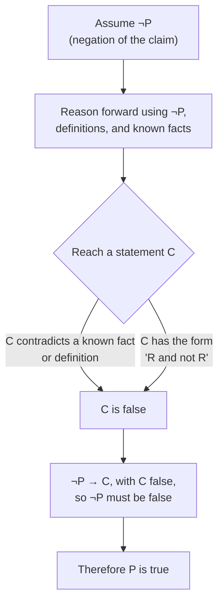

## Learning Objectives

- Explain the logical structure of a proof by contradiction and why deriving an impossibility from ¬P forces P to be true.
- Distinguish proof by contradiction from proof by contraposition, including cases where the two look superficially similar.
- Construct a proof by contradiction for an existence or non-existence claim, where no direct argument is readily available.
- Identify the specific "impossibility" reached at the end of a contradiction proof and explain which earlier assumption it refutes.
- Critique a flawed contradiction proof by locating the exact step where the derivation fails to actually produce a contradiction.

## Context & Motivation

Some claims resist both direct proof and proof by contraposition, because there is no forward chain of implications that obviously leads from a hypothesis to a conclusion, and no useful contrapositive to reason from either — this is especially common for claims that assert something does *not* exist, or that something is *impossible*, where there is no natural "P" to assume and reason forward from. Proof by contradiction handles exactly this shape of claim by a different route entirely: instead of proving a claim true by building up to it, it assumes the claim is *false*, and shows that this assumption leads somewhere logically untenable — a statement that contradicts a known fact, or a statement that contradicts itself. Since a false assumption cannot validly lead to an impossibility unless something is wrong with the assumption itself, and nothing else in the argument is in question, the assumption must be the flaw — which means the original claim, its negation, must be true.

This technique goes back to one of the oldest proofs in mathematics — Euclid's proof that there are infinitely many primes — and remains one of the most powerful tools available specifically because it applies to claims that are otherwise very hard to attack. Proving "there is no largest prime" directly would require exhibiting, for an arbitrary prime, a specific larger one with no obvious formula available; proving it by contradiction instead assumes a largest prime *does* exist, gives it a name, and uses that name to construct a number that both must and cannot be prime — a contradiction that could never have been reached if a largest prime genuinely existed. The technique converts a hard existence/impossibility question into an easier consistency question: does assuming the opposite lead anywhere logically stable?

Stanford's CS103 and MIT's 6.042 both treat contradiction as an indispensable technique precisely because so many foundational results in theoretical computer science are impossibility results — the undecidability of the halting problem, the non-existence of a general parity-checking constant-depth circuit, the fact that √2 is irrational (used to motivate why exact real-number arithmetic can't be represented by finite fractions) — and essentially all of these are proved by assuming the impossible thing is possible and deriving an absurdity from that assumption.

## Core Theory

### The logical shape of a proof by contradiction

To prove a statement P is true, assume ¬P (the negation of P) and derive, through a valid chain of logical steps, a statement C that is known to be false — either because C directly contradicts a hypothesis, a definition, or a previously established theorem, or because C has the form "R and not R" for some statement R (an outright logical contradiction, false under every possible assignment of truth values). Once ¬P → C is established, and C is known to be false, the only way for that implication to be valid is if ¬P is itself false — because a true hypothesis can never validly imply a false conclusion. Since ¬P is false, P is true. Symbolically:

¬P → C, and C is false (i.e., ¬C is true), therefore ¬P is false, therefore P is true.

This is a standard rule of inference (**modus tollens**) applied to the negation of the target claim: from ¬P → C and ¬C, conclude ¬(¬P), which simplifies to P. The entire technique reduces to this one logical move — everything else is domain-specific work in constructing the chain from ¬P to some concretely false C.

### Where "the contradiction" comes from

The false statement C reached at the end of the chain typically takes one of two forms in practice. The first is a **direct contradiction of a known fact**: the derivation shows that, under the assumption ¬P, some specific number would have to be, say, both even and odd, or both prime and composite, or some inequality would have to hold that is directly falsified by a computation. The second is a **self-contradiction**: the derivation shows ¬P implies both R and ¬R for some statement R internal to the argument — for instance, that some set both is and is not empty, or that some fraction is simultaneously in lowest terms and not in lowest terms. Either way, the essential requirement is that C be *unambiguously* false — "this seems unlikely" or "this would be strange" is not a contradiction; only a statement that is flatly, provably false counts.

### Contradiction versus contraposition: a frequent point of confusion

Proof by contraposition proves P → Q by proving the equivalent statement ¬Q → ¬P — it still assumes something (¬Q) and derives something else (¬P) through an ordinary forward argument; nothing is ever shown to be impossible. Proof by contradiction, by contrast, assumes the negation of the *entire* target statement (which might itself be a conditional, an existence claim, or anything else) and looks specifically for an outright impossibility, not merely a "next fact." The two are easy to conflate when the target is a conditional P → Q, because proof by contradiction applied to a conditional starts by assuming ¬(P → Q), which is logically equivalent to "P and ¬Q" — assume P holds and Q fails simultaneously, then derive an impossibility from having both at once. This looks superficially like a contrapositive proof (both involve assuming Q fails) but the goal is different: contraposition derives ¬P as an ordinary conclusion, while this contradiction approach derives an outright falsehood from P and ¬Q holding together.

### Proving non-existence and irrationality claims

Contradiction is the standard technique for two claim shapes that resist direct argument almost entirely. A **non-existence claim** ("there is no largest prime," "there is no rational number whose square is 2") assumes the object in question *does* exist, gives it a name, and derives an impossibility from the properties that name would have to satisfy. An **irrationality claim** (√2 is irrational) is a non-existence claim in disguise — "√2 is irrational" means "there do not exist integers a, b with b ≠ 0 and √2 = a/b" — and is proved the same way: assume such a and b exist, and derive a contradiction from their assumed properties (typically, that a fraction assumed to be in lowest terms turns out not to be).

## Worked Examples

### Example 1 — Euclid's proof that there are infinitely many primes

**Claim:** there is no largest prime number (equivalently, there are infinitely many primes).

*Proof.* Suppose, for the sake of contradiction, that there is a largest prime, call it p. Then the primes can be listed completely as p₁ = 2, p₂ = 3, p₃ = 5, ..., pₙ = p — a finite list containing every prime that exists. Consider the number:

N = (p₁ × p₂ × ... × pₙ) + 1

N is strictly greater than 1, so by the fundamental fact that every integer greater than 1 has at least one prime divisor, N has some prime divisor q. Since p₁ through pₙ is assumed to be the complete list of all primes, q must equal pᵢ for some i between 1 and n. But dividing N by pᵢ leaves a remainder of 1 (since N was constructed as the product of all the pⱼ, plus 1, and pᵢ divides that product exactly), so pᵢ does not divide N — contradicting that q = pᵢ divides N. This is an outright contradiction (pᵢ both does and does not divide N), so the assumption that a largest prime p exists must be false. Therefore there is no largest prime. ∎

The contradiction here is a self-contradiction of the second kind described in Core Theory: the assumption forces pᵢ to divide N (because pᵢ was assumed to be in the complete list of primes and N has a prime factor) and simultaneously forces pᵢ to not divide N (by direct computation of the remainder) — "R and not R" for R = "pᵢ divides N."

### Example 2 — √2 is irrational

**Claim:** √2 is not a rational number.

*Proof.* Suppose, for the sake of contradiction, that √2 is rational. Then by definition there exist integers a and b, with b ≠ 0, such that √2 = a/b, and without loss of generality this fraction is in lowest terms — that is, a and b share no common factor greater than 1 (any fraction can be reduced to such a form). Squaring both sides:

2 = a²/b²  ⟹  a² = 2b²

This shows a² is even (it equals 2 times an integer). By the result proved via contraposition elsewhere in this course (if n² is even, then n is even), a itself must be even, so a = 2k for some integer k. Substituting back:

(2k)² = 2b²  ⟹  4k² = 2b²  ⟹  b² = 2k²

This shows b² is even, so by the same fact, b is also even. But now both a and b are even, meaning they share the common factor 2 — directly contradicting the assumption that a/b was in lowest terms. This is a direct contradiction of a stated hypothesis (R = "a and b share no common factor greater than 1" is contradicted by both being even). Therefore the assumption that √2 is rational must be false, so √2 is irrational. ∎

This proof leans on a previously-established result (the even-square-implies-even-root fact) exactly as Core Theory describes — contradiction proofs are frequently built by combining an assumption with an already-proved lemma to reach the impossibility, rather than deriving everything from first principles within the same proof.

### Example 3 — a contradiction proof of a conditional statement

**Claim:** for all integers a and b, if a + b is odd, then a and b do not have the same parity (one is even, one is odd).

*Proof.* Suppose, for the sake of contradiction, that a + b is odd but a and b do have the same parity. There are two cases for "same parity": both even, or both odd.

Case 1: a and b are both even. Then a = 2j and b = 2k for integers j, k, so a + b = 2j + 2k = 2(j + k), which is even. This directly contradicts the assumption that a + b is odd.

Case 2: a and b are both odd. Then a = 2j + 1 and b = 2k + 1 for integers j, k, so a + b = 2j + 2k + 2 = 2(j + k + 1), which is even. This again directly contradicts the assumption that a + b is odd.

Both cases of "same parity" lead to a + b being even, contradicting the hypothesis that a + b is odd in both branches. Since same parity is impossible under the assumption, a and b must have different parity. ∎

This example shows contradiction combined with case analysis: the negation of the goal ("a and b have the same parity") splits naturally into two sub-cases, and each sub-case independently produces its own direct contradiction of the hypothesis — the overall proof is complete only once every sub-case has been shown to fail.

## Common Misconceptions & Pitfalls

- **"Reaching any strange-looking or unlikely statement counts as a contradiction."** Only a statement that is provably, unambiguously false counts — "b would have to be very large" or "this seems inconsistent with intuition" is not a contradiction; Example 2's contradiction works because "a and b share a common factor" directly and provably conflicts with the stated hypothesis "in lowest terms," not merely because the situation feels odd.
- **"Proof by contradiction and proof by contraposition are interchangeable descriptions of the same technique."** As Core Theory details, contraposition derives an ordinary conclusion (¬P) through a forward argument, whereas contradiction specifically hunts for an outright impossibility; a write-up that assumes ¬Q, derives ¬P, and stops has given a contrapositive proof, not a contradiction proof, even though both start by assuming a conclusion fails.
- **"Once a contradiction is reached anywhere in the argument, the entire proof is automatically valid."** The contradiction has to follow from the assumption ¬P by a genuinely valid chain of steps; a derivation containing its own separate error can "reach" a false statement for the wrong reason, which proves nothing about P — every step up to the contradiction must independently hold up to scrutiny.
- **"Contradiction proofs don't need 'without loss of generality' assumptions like reducing a fraction to lowest terms."** Example 2's proof depends critically on being allowed to assume a/b is already in lowest terms; skipping that step would make the final "a and b share a factor of 2" conclusion unremarkable rather than contradictory, since nothing would have been assumed about their factors in the first place.
- **"A proof by contradiction is the same as an indirect argument for existence — it doesn't tell you anything about the object except that it can't fail to exist."** This is true and is often raised as a weakness rather than a misconception: contradiction proofs of existence claims are typically non-constructive, establishing that an object must exist without producing it — this is a real, worth-noting limitation of the technique, not an error, and it is why constructive proofs are preferred when one is available.

## Summary

Proof by contradiction establishes a claim P by assuming its negation ¬P, reasoning forward using that assumption together with definitions and known facts, and arriving at a statement that is unambiguously false — either a direct contradiction of a known fact or a self-contradiction of the form "R and not R." Because a true hypothesis can never validly imply a false conclusion, reaching that impossibility forces ¬P itself to be false, and therefore P true (an application of modus tollens to ¬P → C). The technique is the standard tool for non-existence and irrationality claims, where no natural forward-reasoning direct proof exists, as Euclid's infinitude-of-primes proof and the classic √2-is-irrational proof both illustrate. It must be kept distinct from proof by contraposition — contraposition derives an ordinary conclusion via a forward argument, while contradiction specifically manufactures an outright impossibility — and every step leading to that impossibility must independently be as rigorously justified as in any other proof, since a contradiction reached through a flawed intermediate step proves nothing at all.

## Documentation Links

- [Lehman, Leighton & Meyer — Mathematics for Computer Science (full text)](https://people.csail.mit.edu/meyer/mcs.pdf) — doc
- [Stanford CS103 — Mathematical Foundations of Computing](https://web.stanford.edu/class/cs103/) — doc
