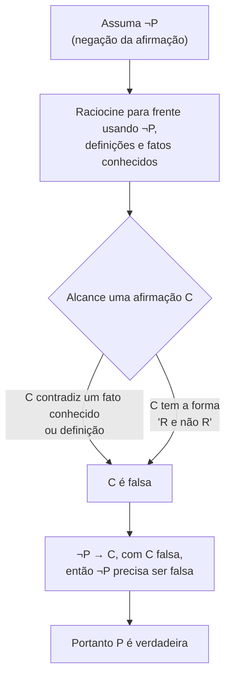

## Objetivos de Aprendizagem

- Explicar a estrutura lógica de uma prova por contradição e por que derivar uma impossibilidade a partir de ¬P força P a ser verdadeiro.
- Distinguir prova por contradição de prova por contraposição, incluindo casos onde as duas parecem superficialmente similares.
- Construir uma prova por contradição para uma afirmação de existência ou não existência, onde nenhum argumento direto está prontamente disponível.
- Identificar a "impossibilidade" específica alcançada no final de uma prova por contradição e explicar qual suposição anterior ela refuta.
- Criticar uma prova por contradição falha localizando o passo exato onde a derivação falha em de fato produzir uma contradição.

## Contexto e Motivação

Algumas afirmações resistem tanto à prova direta quanto à prova por contraposição, porque não há cadeia direta de implicações que obviamente leve de uma hipótese a uma conclusão, e nenhuma contrapositiva útil a partir da qual raciocinar tampouco; isso é especialmente comum para afirmações que afirmam que algo *não* existe, ou que algo é *impossível*, onde não há um "P" natural para assumir e raciocinar para frente. Prova por contradição trata exatamente dessa forma de afirmação por uma rota inteiramente diferente: em vez de provar uma afirmação verdadeira construindo até ela, assume que a afirmação é *falsa*, e mostra que essa suposição leva a algo logicamente insustentável, uma afirmação que contradiz um fato conhecido, ou uma afirmação que se contradiz a si mesma. Como uma suposição falsa não pode validamente levar a uma impossibilidade a menos que algo esteja errado com a própria suposição, e mais nada no argumento está em questão, a suposição precisa ser a falha, o que significa que a afirmação original, cuja negação é a suposição, precisa ser verdadeira.

Essa técnica remonta a uma das provas mais antigas da matemática (a prova de Euclides de que existem infinitos primos) e continua sendo uma das ferramentas mais poderosas disponíveis precisamente porque se aplica a afirmações que de resto são muito difíceis de atacar. Provar "não existe maior primo" diretamente exigiria exibir, para um primo arbitrário, um específico maior sem fórmula óbvia disponível; provar isso por contradição em vez disso assume que um maior primo *existe*, dá um nome a ele, e usa esse nome para construir um número que precisa tanto ser quanto não ser primo, uma contradição que nunca poderia ter sido alcançada se um maior primo genuinamente existisse. A técnica converte uma pergunta difícil de existência/impossibilidade numa pergunta mais fácil de consistência: assumir o oposto leva a algum lugar logicamente estável?

O CS103 de Stanford e o 6.042 do MIT tratam contradição como uma técnica indispensável precisamente porque tantos resultados fundacionais em Ciência da Computação teórica são resultados de impossibilidade (a indecidibilidade do problema da parada, a não existência de um circuito de profundidade constante genérico para checagem de paridade, o fato de √2 ser irracional, usado para motivar por que aritmética exata de números reais não pode ser representada por frações finitas), e essencialmente todos esses são provados assumindo que a coisa impossível é possível e derivando um absurdo dessa suposição.

## Teoria Central

### A forma lógica de uma prova por contradição

Para provar que uma afirmação P é verdadeira, assuma ¬P (a negação de P) e derive, através de uma cadeia válida de passos lógicos, uma afirmação C que é conhecida como falsa, seja porque C contradiz diretamente uma hipótese, uma definição, ou um teorema já estabelecido, seja porque C tem a forma "R e não R" para alguma afirmação R (uma contradição lógica direta, falsa sob toda atribuição possível de valores-verdade). Uma vez que ¬P → C é estabelecido, e C é conhecida como falsa, a única forma dessa implicação ser válida é se ¬P for ela mesma falsa, porque uma hipótese verdadeira nunca pode validamente implicar uma conclusão falsa. Como ¬P é falsa, P é verdadeira. Simbolicamente:

¬P → C, e C é falsa (isto é, ¬C é verdadeira), portanto ¬P é falsa, portanto P é verdadeira.

Essa é uma regra padrão de inferência (**modus tollens**) aplicada à negação da afirmação alvo: de ¬P → C e ¬C, conclui-se ¬(¬P), que simplifica para P. A técnica inteira se reduz a esse único movimento lógico; tudo o mais é trabalho específico do domínio na construção da cadeia de ¬P até algum C concretamente falso.

### De onde vem "a contradição"

A afirmação falsa C alcançada no final da cadeia tipicamente assume uma de duas formas na prática. A primeira é uma **contradição direta de um fato conhecido**: a derivação mostra que, sob a suposição ¬P, algum número específico teria que ser, digamos, tanto par quanto ímpar, ou tanto primo quanto composto, ou alguma desigualdade teria que valer que é diretamente falseada por um cálculo. A segunda é uma **autocontradição**: a derivação mostra que ¬P implica tanto R quanto ¬R para alguma afirmação R interna ao argumento, por exemplo, que algum conjunto tanto é quanto não é vazio, ou que alguma fração está simultaneamente em termos irredutíveis e não está. De qualquer forma, a exigência essencial é que C seja *sem ambiguidade* falsa; "isso parece improvável" ou "isso seria estranho" não é uma contradição; só uma afirmação que é categórica e provadamente falsa conta.

### Contradição versus contraposição: um ponto frequente de confusão

Prova por contraposição prova P → Q provando a afirmação equivalente ¬Q → ¬P; ela ainda assume algo (¬Q) e deriva outra coisa (¬P) através de um argumento comum para frente; nada é mostrado como impossível em nenhum momento. Prova por contradição, em contraste, assume a negação de *toda* a afirmação alvo (que pode ela mesma ser um condicional, uma afirmação de existência, ou qualquer outra coisa) e busca especificamente uma impossibilidade direta, não meramente um "próximo fato". As duas são fáceis de confundir quando o alvo é um condicional P → Q, porque prova por contradição aplicada a um condicional começa assumindo ¬(P → Q), que é logicamente equivalente a "P e ¬Q": assuma que P vale e Q falha simultaneamente, então derive uma impossibilidade de ter os dois ao mesmo tempo. Isso parece superficialmente uma prova contrapositiva (as duas envolvem assumir que Q falha) mas o objetivo é diferente: contraposição deriva ¬P como uma conclusão comum, enquanto essa abordagem por contradição deriva uma falsidade categórica a partir de P e ¬Q valendo juntos.

### Provando afirmações de não existência e irracionalidade

Contradição é a técnica padrão para duas formas de afirmação que resistem a argumento direto quase completamente. Uma **afirmação de não existência** ("não há maior primo", "não há número racional cujo quadrado é 2") assume que o objeto em questão *existe*, dá um nome a ele, e deriva uma impossibilidade a partir das propriedades que esse nome teria que satisfazer. Uma **afirmação de irracionalidade** (√2 é irracional) é uma afirmação de não existência disfarçada: "√2 é irracional" significa "não existem inteiros a, b com b ≠ 0 e √2 = a/b", e é provada da mesma forma: assuma que tais a e b existem, e derive uma contradição das propriedades assumidas deles (tipicamente, que uma fração assumida estar em termos irredutíveis acaba não estando).

## Exemplos Resolvidos

### Exemplo 1: a prova de Euclides de que existem infinitos primos

**Afirmação:** não há maior número primo (equivalentemente, existem infinitos primos).

*Prova.* Suponha, para efeito de contradição, que há um maior primo, chame-o de p. Então os primos podem ser listados completamente como p₁ = 2, p₂ = 3, p₃ = 5, ..., pₙ = p, uma lista finita contendo todo primo que existe. Considere o número:

N = (p₁ × p₂ × ... × pₙ) + 1

N é estritamente maior que 1, então pelo fato fundamental de que todo inteiro maior que 1 tem pelo menos um divisor primo, N tem algum divisor primo q. Como p₁ até pₙ é assumida a lista completa de todos os primos, q precisa ser igual a pᵢ para algum i entre 1 e n. Mas dividir N por pᵢ deixa um resto de 1 (já que N foi construído como o produto de todos os pⱼ, mais 1, e pᵢ divide esse produto exatamente), então pᵢ não divide N, contradizendo que q = pᵢ divide N. Isso é uma contradição direta (pᵢ tanto divide quanto não divide N), então a suposição de que um maior primo p existe precisa ser falsa. Portanto não há maior primo. ∎

A contradição aqui é uma autocontradição do segundo tipo descrito na Teoria Central: a suposição força pᵢ a dividir N (porque pᵢ foi assumido estar na lista completa de primos e N tem um fator primo) e simultaneamente força pᵢ a não dividir N (por cálculo direto do resto), "R e não R" para R = "pᵢ divide N".

### Exemplo 2: √2 é irracional

**Afirmação:** √2 não é um número racional.

*Prova.* Suponha, para efeito de contradição, que √2 é racional. Então por definição existem inteiros a e b, com b ≠ 0, tais que √2 = a/b, e sem perda de generalidade essa fração está em termos irredutíveis, isto é, a e b não compartilham nenhum fator comum maior que 1 (qualquer fração pode ser reduzida a tal forma). Elevando os dois lados ao quadrado:

2 = a²/b²  ⟹  a² = 2b²

Isso mostra que a² é par (é igual a 2 vezes um inteiro). Pelo resultado provado por contraposição em outro ponto deste curso (se n² é par, então n é par), o próprio a precisa ser par, então a = 2k para algum inteiro k. Substituindo de volta:

(2k)² = 2b²  ⟹  4k² = 2b²  ⟹  b² = 2k²

Isso mostra que b² é par, então pelo mesmo fato, b também é par. Mas agora tanto a quanto b são pares, significando que compartilham o fator comum 2, contradizendo diretamente a suposição de que a/b estava em termos irredutíveis. Isso é uma contradição direta de uma hipótese declarada (R = "a e b não compartilham nenhum fator comum maior que 1" é contradita por ambos serem pares). Portanto a suposição de que √2 é racional precisa ser falsa, então √2 é irracional. ∎

Esta prova se apoia num resultado já estabelecido (o fato de quadrado-par-implica-raiz-par) exatamente como a Teoria Central descreve; provas por contradição são frequentemente construídas combinando uma suposição com um lema já provado para alcançar a impossibilidade, em vez de derivar tudo a partir de princípios básicos dentro da mesma prova.

### Exemplo 3: uma prova por contradição de uma afirmação condicional

**Afirmação:** para todos os inteiros a e b, se a + b é ímpar, então a e b não têm a mesma paridade (um é par, um é ímpar).

*Prova.* Suponha, para efeito de contradição, que a + b é ímpar mas a e b têm a mesma paridade. Há dois casos para "mesma paridade": ambos pares, ou ambos ímpares.

Caso 1: a e b são ambos pares. Então a = 2j e b = 2k para inteiros j, k, então a + b = 2j + 2k = 2(j + k), que é par. Isso contradiz diretamente a suposição de que a + b é ímpar.

Caso 2: a e b são ambos ímpares. Então a = 2j + 1 e b = 2k + 1 para inteiros j, k, então a + b = 2j + 2k + 2 = 2(j + k + 1), que é par. Isso novamente contradiz diretamente a suposição de que a + b é ímpar.

Os dois casos de "mesma paridade" levam a a + b sendo par, contradizendo a hipótese de que a + b é ímpar nas duas ramificações. Como mesma paridade é impossível sob a suposição, a e b precisam ter paridade diferente. ∎

Este exemplo mostra contradição combinada com análise de casos: a negação do objetivo ("a e b têm a mesma paridade") se divide naturalmente em dois subcasos, e cada subcaso independentemente produz sua própria contradição direta da hipótese; a prova geral só está completa uma vez que todo subcaso tenha sido mostrado como falhando.

## Equívocos Comuns e Armadilhas

- **"Alcançar qualquer afirmação estranha ou improvável conta como uma contradição."** Só conta uma afirmação que é provadamente e sem ambiguidade falsa; "b teria que ser muito grande" ou "isso parece inconsistente com a intuição" não é uma contradição; a contradição do Exemplo 2 funciona porque "a e b compartilham um fator comum" conflita direta e provadamente com a hipótese declarada "em termos irredutíveis", não meramente porque a situação parece estranha.
- **"Prova por contradição e prova por contraposição são descrições intercambiáveis da mesma técnica."** Como a Teoria Central detalha, contraposição deriva uma conclusão comum (¬P) através de um argumento para frente, enquanto contradição busca especificamente uma impossibilidade direta; um texto que assume ¬Q, deriva ¬P, e para, deu uma prova contrapositiva, não uma prova por contradição, mesmo que as duas comecem assumindo que uma conclusão falha.
- **"Uma vez que uma contradição é alcançada em qualquer ponto do argumento, a prova inteira é automaticamente válida."** A contradição precisa decorrer da suposição ¬P por uma cadeia genuinamente válida de passos; uma derivação contendo seu próprio erro separado pode "alcançar" uma afirmação falsa pela razão errada, o que não prova nada sobre P; todo passo até a contradição precisa independentemente resistir a escrutínio.
- **"Provas por contradição não precisam de suposições 'sem perda de generalidade' como reduzir uma fração a termos irredutíveis."** A prova do Exemplo 2 depende criticamente de ter permissão de assumir que a/b já está em termos irredutíveis; pular esse passo tornaria a conclusão final "a e b compartilham um fator de 2" banal em vez de contraditória, já que nada teria sido assumido sobre seus fatores em primeiro lugar.
- **"Uma prova por contradição é o mesmo que um argumento indireto para existência; ela não diz nada sobre o objeto exceto que ele não pode deixar de existir."** Isso é verdade e é frequentemente levantado como uma fraqueza em vez de um equívoco: provas por contradição de afirmações de existência tipicamente são não construtivas, estabelecendo que um objeto precisa existir sem produzi-lo; essa é uma limitação real e digna de nota da técnica, não um erro, e é por isso que provas construtivas são preferidas quando uma está disponível.

## Resumo

Prova por contradição estabelece uma afirmação P assumindo sua negação ¬P, raciocinando para frente usando essa suposição junto com definições e fatos conhecidos, e chegando a uma afirmação que é sem ambiguidade falsa, seja uma contradição direta de um fato conhecido, seja uma autocontradição da forma "R e não R". Como uma hipótese verdadeira nunca pode validamente implicar uma conclusão falsa, alcançar essa impossibilidade força a própria ¬P a ser falsa, e portanto P verdadeira (uma aplicação de modus tollens a ¬P → C). A técnica é a ferramenta padrão para afirmações de não existência e irracionalidade, onde nenhuma prova direta natural de raciocínio para frente existe, como tanto a prova de Euclides da infinitude dos primos quanto a prova clássica de que √2 é irracional ilustram. Ela precisa ser mantida distinta de prova por contraposição: contraposição deriva uma conclusão comum via um argumento para frente, enquanto contradição fabrica especificamente uma impossibilidade direta, e todo passo levando a essa impossibilidade precisa independentemente ser tão rigorosamente justificado quanto em qualquer outra prova, já que uma contradição alcançada através de um passo intermediário falho não prova nada.

## Documentation Links

- [Lehman, Leighton & Meyer — Mathematics for Computer Science (full text)](https://people.csail.mit.edu/meyer/mcs.pdf) — doc
- [Stanford CS103 — Mathematical Foundations of Computing](https://web.stanford.edu/class/cs103/) — doc
