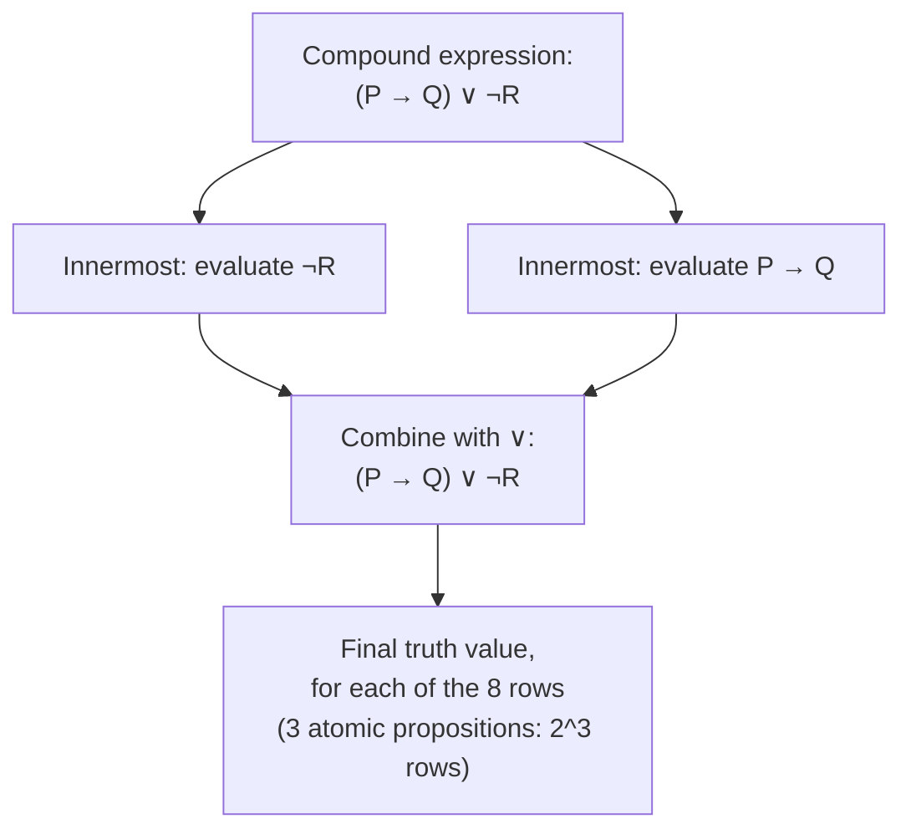

## Learning Objectives

- Identify whether a sentence qualifies as a proposition, and explain why some grammatically valid sentences do not.
- State the precise truth-table definition of each of the five basic connectives: ¬, ∧, ∨, →, ↔.
- Construct the truth table for a compound proposition built from several connectives, including tracking operator precedence.
- Explain why → is defined the way it is, including why a false hypothesis makes a conditional "vacuously" true.
- Evaluate the truth value of a compound proposition given specific truth values for its atomic components.

## Context & Motivation

Ordinary language is full of ambiguity that mathematics and computer science cannot tolerate: "or" sometimes means "one or the other, not both" and sometimes means "at least one, possibly both"; "if... then..." gets used loosely enough in casual speech that people say things like "if pigs could fly, I'd be rich" without meaning to assert anything at all about pigs or their aerodynamic properties. Propositional logic exists to strip that ambiguity out entirely, by fixing, once and for all, an exact and unambiguous meaning for each of a small handful of logical connectives — meanings precise enough that the truth value of any compound statement built from them is fully and mechanically determined by the truth values of its parts. This is not merely a philosophical nicety: it is the substrate every proof technique in this course rests on. "If P then Q," the conditional at the heart of direct proof and contraposition, only supports the reasoning built on it because → has one specific, fixed meaning, and every step in a rigorous proof that invokes "and," "or," "not," or "if...then" is implicitly leaning on the exact truth-table definition of that connective, whether or not the proof-writer ever draws the table out explicitly.

The payoff of this formalism shows up directly in software: a Boolean expression in an `if` statement, the guard condition on a loop, the WHERE clause of a database query, a circuit's logic gates — all of these are literal implementations of propositional connectives, and bugs in all of them very often trace back to exactly the kind of ambiguity propositional logic eliminates. A programmer who treats `A OR B` as exclusive-or when the language's `||` operator is inclusive-or has made precisely the mistake that a truth table, laid out explicitly, would have caught immediately. Understanding connectives at the level of their truth tables, rather than at the level of loose English intuition, is what lets someone reason confidently and correctly about compound conditions of arbitrary complexity — in a proof, in code, or in a specification.

Stanford's CS103 and MIT's 6.042J both start their logic units here for exactly this reason: propositional logic is the smallest formal system in the entire course, and yet nearly everything downstream — logical equivalence, quantified statements, proof techniques themselves — is stated using its connectives and depends on their meanings being fixed with total precision rather than left to intuition.

## Core Theory

### Propositions: what counts, and what doesn't

A **proposition** is a declarative sentence that is unambiguously either true or false — not both, and not something in between, and not dependent on unresolved context. "17 is a prime number" is a proposition (true). "2 + 2 = 5" is a proposition (false). "n + 1 = 5" is *not* a proposition on its own, because its truth value depends on the value of the free variable n — it becomes a proposition only once n is fixed to a specific value (a **predicate**, treated separately elsewhere in this course, is exactly this kind of sentence-with-a-variable). Questions ("Is 17 prime?"), commands ("Prove that 17 is prime"), and sentences that are simply not truth-evaluable ("This sentence is false" — the liar paradox, which cannot consistently be assigned either truth value) are also not propositions, for related but distinct reasons: the first two are not the right grammatical category to have a truth value at all, and the third has the right grammatical form but fails to settle on a consistent truth value under either assignment.

Propositions are conventionally named with letters — P, Q, R, and so on — and are combined into **compound propositions** using logical connectives. The truth value of a compound proposition is always fully determined by the truth values of its components together with the meaning of the connectives combining them — never by anything about the components' content or subject matter.

### The five basic connectives, defined by truth table

Each connective is defined completely and exclusively by its truth table — there is no other authority on what it means. For unary negation:

| P | ¬P |
|---|-----|
| T | F |
| F | T |

For the four binary connectives, over all four combinations of P and Q:

| P | Q | P ∧ Q (and) | P ∨ Q (or) | P → Q (implies) | P ↔ Q (iff) |
|---|---|-------------|------------|-------------------|----------------|
| T | T | T | T | T | T |
| T | F | F | T | F | F |
| F | T | F | T | T | F |
| F | F | F | F | T | T |

**Conjunction** (∧, "and") is true exactly when both operands are true. **Disjunction** (∨, "or") is true when at least one operand is true — this is *inclusive* or, true even when both are true, in contrast with the "either... or..." of everyday speech, which is frequently exclusive. **Conditional** (→, "if... then...") is false in exactly one case: when P is true and Q is false; in every other combination, including both false, it is true. **Biconditional** (↔, "if and only if") is true exactly when P and Q share the same truth value, true-true or false-false.

### Why the conditional is defined the way it is

The conditional's truth table is the one that most often surprises newcomers, specifically its bottom two rows: P → Q is defined to be **true** whenever P is false, regardless of Q's truth value. This is called being **vacuously true**, and it is not an arbitrary convention — it is exactly what makes the conditional match its intended logical role. "If P then Q" is meant to assert that whenever P holds, Q is guaranteed to hold too; the *only* way to break that guarantee is to find a case where P holds and Q fails (row 2: P true, Q false — the only row where P → Q is false). If P never holds at all, the guarantee is never actually tested, and so it is never violated — hence "true," not because anything positive was demonstrated about Q, but because there was no case available to falsify the claim. "If n is a prime number greater than 1000000 and n is also even, then n is divisible by 6" is vacuously true for any n that fails to be an even prime greater than a million (which is every n, since 2 is the only even prime), regardless of what "divisible by 6" would mean in that case — the hypothesis simply never fires.

This convention is exactly what licenses direct proof's basic move: to prove P → Q, a direct proof assumes P and only has to handle the case where P is true, because when P is false the implication is automatically true no matter what — there is nothing left to check.

### Building compound propositions: precedence and full evaluation

Connectives combine into larger expressions, and evaluating one requires both operator precedence (to know how an unparenthesized expression like ¬P ∧ Q → R groups) and a systematic evaluation over every combination of the atomic propositions involved. The standard precedence, from tightest-binding to loosest, is: ¬ first, then ∧, then ∨, then →, then ↔ — so ¬P ∧ Q → R parses as ((¬P) ∧ Q) → R, and explicit parentheses are used liberally in practice specifically to avoid relying on a reader remembering this ordering.

A compound proposition built from n atomic propositions has 2ⁿ possible combinations of truth values to check, and a full truth table lists every one of them, evaluating the compound expression column by column, connective by connective, working from the innermost sub-expressions outward — exactly mirroring how the expression would be parsed.

## Worked Examples

### Example 1 — evaluating a compound proposition for specific truth values

**Problem:** given P is true, Q is false, and R is true, find the truth value of (P ∧ ¬Q) → R.

Step 1 — evaluate the innermost negation: ¬Q, with Q false, gives ¬Q = true.

Step 2 — evaluate the conjunction: P ∧ ¬Q, with P = true and ¬Q = true, gives P ∧ ¬Q = true (both operands true).

Step 3 — evaluate the conditional: (P ∧ ¬Q) → R, with the antecedent true (from Step 2) and R = true, gives true → true = true, by the top row of the conditional's truth table.

So (P ∧ ¬Q) → R evaluates to true under this assignment. Note that this single evaluation says nothing about whether the expression is true under *every* assignment — that would require the full truth table, covering all 2³ = 8 combinations of P, Q, R, not just this one.

### Example 2 — constructing a full truth table for a three-connective expression

**Problem:** construct the complete truth table for ¬P ∨ (Q ∧ R).

By the precedence rules, this parses as (¬P) ∨ (Q ∧ R) — negation binds first, then the conjunction inside the parentheses, then the disjunction combining the two. With three atomic propositions, there are 2³ = 8 rows to fill in, built up column by column:

| P | Q | R | ¬P | Q ∧ R | ¬P ∨ (Q ∧ R) |
|---|---|---|-----|-------|-----------------|
| T | T | T | F | T | T |
| T | T | F | F | F | F |
| T | F | T | F | F | F |
| T | F | F | F | F | F |
| F | T | T | T | T | T |
| F | T | F | T | F | T |
| F | F | T | T | F | T |
| F | F | F | T | F | T |

Reading off the pattern: whenever P is false, ¬P is true, and the disjunction is automatically true regardless of Q and R (the bottom four rows) — this is disjunction's own version of a "short-circuit," analogous to how `||` in code can skip evaluating its right operand once the left one is true. Whenever P is true, ¬P is false, and the whole expression's truth value falls entirely on Q ∧ R, which is true only in the single row where both Q and R are true (row 1) — matching conjunction's requirement that both operands hold.

### Example 3 — why the conditional's "vacuous truth" rows matter, worked concretely

**Problem:** determine the truth value of "if 7 is even, then 7 = 8," and explain why the answer is not paradoxical despite both the hypothesis and conclusion being obviously false claims about 7.

The proposition is P → Q with P = "7 is even" (false) and Q = "7 = 8" (also false). By the truth table's bottom row (P false, Q false), P → Q evaluates to true. This can feel wrong at first glance — the sentence sounds like it's asserting something false about 7 — but the conditional is not asserting that 7 is even, nor that 7 equals 8; it is only asserting that *if* the first held, the second would too, and since the first (P) never holds, there is no scenario in which the guarantee is tested and found wanting. Contrast this with "if 7 is odd, then 7 = 8": here P = "7 is odd" is true, and Q = "7 = 8" is false, landing in the *one* row of the truth table where the conditional is false — this is the version that is actually a false claim, because it asserts a guarantee (given a number is odd, it equals 8) that a real case (P true) directly falsifies.

This distinction — which specific row of the four is occupied — is precisely why direct proofs of P → Q only ever need to handle the case P is true: the other three rows of the table are true automatically, by definition of the connective, with nothing left to verify.

## Common Misconceptions & Pitfalls

- **"'Or' should mean exclusive or, matching how it's used in casual speech ('coffee or tea')."** The logical ∨ defined here is inclusive: P ∨ Q is true even when both P and Q are true, as the truth table's top row shows explicitly. Exclusive or (XOR) is a distinct connective, true when exactly one of P, Q holds and false when both agree — using ∨ where XOR was intended is a common and consequential mistake, both in proofs and in code (`if (a || b)` is not equivalent to "exactly one of a, b").
- **"A false hypothesis makes a conditional meaningless or undefined, not true."** As Example 3 shows concretely, P → Q is defined to be true, not undefined and not false, whenever P is false — this is not a gap in the definition, it is the definition, and it is exactly what licenses treating "P is false" as a case direct proofs never have to separately check.
- **"P → Q and Q → P mean the same thing, or at least usually agree."** The truth table shows they can disagree: with P false and Q true, P → Q is true (bottom-middle row) while Q → P is false (Q true, P false lands on the row where the conditional is false) — this is exactly the converse pitfall covered in the direct-proof material, and it is visible directly from the truth table without needing any specific example.
- **"Any grammatically well-formed declarative sentence is a proposition."** "This sentence is false" has the grammatical shape of a declarative sentence but is not a proposition, because no consistent truth value can be assigned to it (assuming it's true makes it false, and vice versa) — propositions require not just declarative grammar but an actual, unambiguous, resolvable truth value.
- **"Building a truth table for n propositions means checking a few representative cases."** A full truth table is only complete when all 2ⁿ combinations are listed — Example 2's table needed all 8 rows for its 3 propositions, not a handful of "typical" ones, because a compound proposition's status (e.g., whether it's a tautology, discussed elsewhere in this course) can hinge on exactly the row that was skipped.

## Summary

A proposition is a declarative sentence with a single, unambiguous truth value, and propositional logic combines propositions using five basic connectives — ¬, ∧, ∨, →, ↔ — each defined completely and exclusively by its truth table, with no room left for the looser, context-dependent meanings those same words carry in everyday language. Disjunction is inclusive (true when both operands are true), and the conditional is true in every row except the one where the hypothesis is true and the conclusion is false — making it vacuously true whenever the hypothesis is false, a property that is not an edge-case oddity but the exact feature that licenses direct proof's core move of only needing to check the case where the hypothesis actually holds. Evaluating a compound proposition, whether for one specific assignment of truth values or across the full 2ⁿ-row truth table needed to characterize it completely, requires respecting connective precedence (¬, then ∧, then ∨, then →, then ↔) and building up from the innermost sub-expressions outward. These truth-table definitions are not a side topic to proof-writing — they are the precise semantics every "and," "or," "not," and "if...then" inside a rigorous proof is silently relying on.

## Documentation Links

- [Lehman, Leighton & Meyer — Mathematics for Computer Science (full text)](https://people.csail.mit.edu/meyer/mcs.pdf) — doc
- [Stanford CS103 — Mathematical Foundations of Computing](https://web.stanford.edu/class/cs103/) — doc
