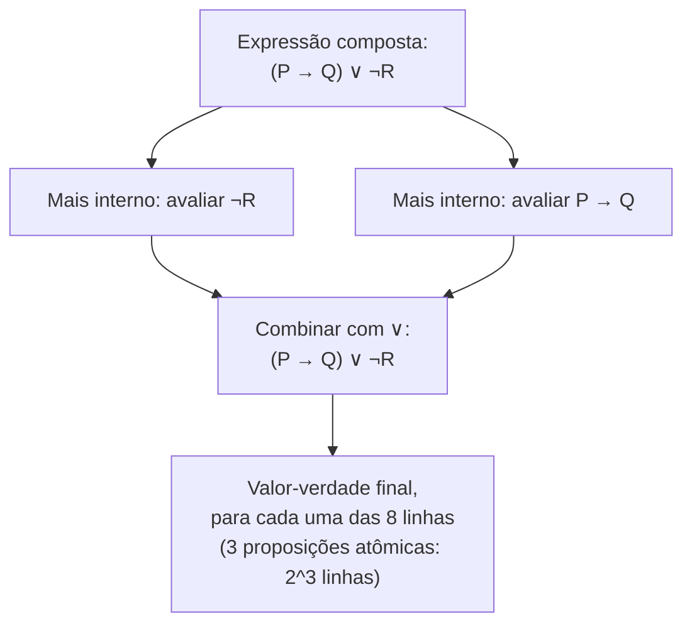

## Objetivos de Aprendizagem

- Identificar se uma sentença se qualifica como uma proposição, e explicar por que algumas sentenças gramaticalmente válidas não se qualificam.
- Declarar a definição precisa, por tabela-verdade, de cada um dos cinco conectivos básicos: ¬, ∧, ∨, →, ↔.
- Construir a tabela-verdade de uma proposição composta construída a partir de vários conectivos, incluindo o controle da precedência de operadores.
- Explicar por que → é definido do jeito que é, incluindo por que uma hipótese falsa torna um condicional "vacuamente" verdadeiro.
- Avaliar o valor-verdade de uma proposição composta dados valores-verdade específicos para seus componentes atômicos.

## Contexto e Motivação

A linguagem comum está cheia de ambiguidade que a matemática e a Ciência da Computação não podem tolerar: "ou" às vezes significa "um ou o outro, não ambos" e às vezes significa "pelo menos um, possivelmente ambos"; "se... então..." é usado de forma solta o bastante na fala casual que as pessoas dizem coisas como "se porcos pudessem voar, eu seria rico" sem pretender afirmar nada de fato sobre porcos ou suas propriedades aerodinâmicas. A lógica proposicional existe para remover essa ambiguidade por completo, fixando, de uma vez por todas, um significado exato e sem ambiguidade para cada um de um pequeno punhado de conectivos lógicos, significados precisos o suficiente para que o valor-verdade de qualquer afirmação composta construída a partir deles seja completa e mecanicamente determinado pelos valores-verdade de suas partes. Isso não é apenas um capricho filosófico: é o substrato sobre o qual toda técnica de prova deste curso se apoia. "Se P então Q", o condicional no coração da prova direta e da contraposição, só sustenta o raciocínio construído sobre ele porque → tem um significado específico e fixo, e todo passo numa prova rigorosa que invoca "e", "ou", "não" ou "se... então" está implicitamente se apoiando na definição exata, por tabela-verdade, daquele conectivo, quer quem escreve a prova desenhe a tabela explicitamente ou não.

O retorno desse formalismo aparece diretamente em software: uma expressão booleana num `if`, a condição de guarda de um laço, a cláusula WHERE de uma consulta de banco de dados, as portas lógicas de um circuito (todos esses são implementações literais de conectivos proposicionais), e bugs em todos eles frequentemente remontam exatamente ao tipo de ambiguidade que a lógica proposicional elimina. Um programador que trata `A OR B` como um ou-exclusivo quando o operador `||` da linguagem é um ou-inclusivo cometeu precisamente o erro que uma tabela-verdade, exposta explicitamente, teria pego de imediato. Entender conectivos no nível de suas tabelas-verdade, em vez do nível de intuição solta em português ou inglês, é o que permite raciocinar com confiança e corretude sobre condições compostas de complexidade arbitrária, seja numa prova, em código, ou numa especificação.

O CS103 de Stanford e o 6.042J do MIT começam suas unidades de lógica exatamente aqui por essa razão: lógica proposicional é o menor sistema formal em todo o curso, e ainda assim quase tudo que vem depois (equivalência lógica, afirmações quantificadas, as próprias técnicas de prova) é declarado usando seus conectivos e depende de seus significados serem fixados com precisão total em vez de deixados à intuição.

## Teoria Central

### Proposições: o que conta, e o que não conta

Uma **proposição** é uma sentença declarativa que é, sem ambiguidade, verdadeira ou falsa (não ambas, e não algo intermediário, e não dependente de contexto não resolvido). "17 é um número primo" é uma proposição (verdadeira). "2 + 2 = 5" é uma proposição (falsa). "n + 1 = 5" *não* é uma proposição sozinha, porque seu valor-verdade depende do valor da variável livre n (ela se torna uma proposição só quando n é fixado num valor específico; um **predicado**, tratado separadamente em outro ponto deste curso, é exatamente esse tipo de sentença-com-variável). Perguntas ("17 é primo?"), comandos ("Prove que 17 é primo") e sentenças que simplesmente não têm valor-verdade avaliável ("Esta sentença é falsa", o paradoxo do mentiroso, que não pode ter nenhum dos dois valores-verdade atribuído consistentemente) também não são proposições, por razões relacionadas mas distintas: as duas primeiras não pertencem à categoria gramatical certa para ter um valor-verdade, e a terceira tem a forma gramatical certa mas falha em se estabelecer num valor-verdade consistente sob qualquer atribuição.

Proposições são convencionalmente nomeadas com letras (P, Q, R, e assim por diante) e são combinadas em **proposições compostas** usando conectivos lógicos. O valor-verdade de uma proposição composta é sempre completamente determinado pelos valores-verdade de seus componentes junto com o significado dos conectivos que os combinam, nunca por qualquer coisa sobre o conteúdo ou assunto dos componentes.

### Os cinco conectivos básicos, definidos por tabela-verdade

Cada conectivo é definido completa e exclusivamente por sua tabela-verdade; não há outra autoridade sobre o que ele significa. Para a negação unária:

| P | ¬P |
|---|-----|
| V | F |
| F | V |

Para os quatro conectivos binários, sobre todas as quatro combinações de P e Q:

| P | Q | P ∧ Q (e) | P ∨ Q (ou) | P → Q (implica) | P ↔ Q (se e somente se) |
|---|---|-------------|------------|-------------------|----------------|
| V | V | V | V | V | V |
| V | F | F | V | F | F |
| F | V | F | V | V | F |
| F | F | F | F | V | V |

A **conjunção** (∧, "e") é verdadeira exatamente quando ambos os operandos são verdadeiros. A **disjunção** (∨, "ou") é verdadeira quando pelo menos um operando é verdadeiro; este é o ou *inclusivo*, verdadeiro mesmo quando ambos são verdadeiros, em contraste com o "ou... ou..." da fala do dia a dia, que costuma ser exclusivo. O **condicional** (→, "se... então...") é falso em exatamente um caso: quando P é verdadeiro e Q é falso; em toda outra combinação, incluindo ambos falsos, ele é verdadeiro. O **bicondicional** (↔, "se e somente se") é verdadeiro exatamente quando P e Q compartilham o mesmo valor-verdade, verdadeiro-verdadeiro ou falso-falso.

### Por que o condicional é definido do jeito que é

A tabela-verdade do condicional é a que mais costuma surpreender iniciantes, especificamente suas duas linhas de baixo: P → Q é definido como **verdadeiro** sempre que P é falso, independentemente do valor-verdade de Q. Isso se chama ser **vacuamente verdadeiro**, e não é uma convenção arbitrária, é exatamente o que faz o condicional corresponder ao seu papel lógico pretendido. "Se P então Q" pretende afirmar que sempre que P vale, Q está garantido a valer também; a *única* forma de quebrar essa garantia é achar um caso onde P vale e Q falha (linha 2: P verdadeiro, Q falso, a única linha onde P → Q é falso). Se P nunca vale, a garantia nunca é de fato testada, e portanto nunca é violada; daí "verdadeiro", não porque algo positivo foi demonstrado sobre Q, mas porque não havia caso disponível para falsear a afirmação. "Se n é um número primo maior que 1000000 e n também é par, então n é divisível por 6" é vacuamente verdadeiro para todo n que falha em ser um primo par maior que um milhão (o que é todo n, já que 2 é o único primo par), independentemente do que "divisível por 6" significaria nesse caso; a hipótese simplesmente nunca dispara.

Essa convenção é exatamente o que licencia o movimento básico da prova direta: para provar P → Q, uma prova direta assume P e só precisa tratar o caso onde P é verdadeiro, porque quando P é falso a implicação é automaticamente verdadeira não importa o quê, não sobra nada para checar.

### Construindo proposições compostas: precedência e avaliação completa

Conectivos se combinam em expressões maiores, e avaliar uma delas exige tanto precedência de operadores (para saber como uma expressão sem parênteses como ¬P ∧ Q → R se agrupa) quanto uma avaliação sistemática sobre toda combinação das proposições atômicas envolvidas. A precedência padrão, da que se liga mais fortemente para a mais fraca, é: ¬ primeiro, depois ∧, depois ∨, depois →, depois ↔; então ¬P ∧ Q → R se analisa como ((¬P) ∧ Q) → R, e parênteses explícitos são usados livremente na prática especificamente para evitar depender de o leitor lembrar dessa ordem.

Uma proposição composta construída a partir de n proposições atômicas tem 2ⁿ combinações possíveis de valores-verdade a checar, e uma tabela-verdade completa lista cada uma delas, avaliando a expressão composta coluna por coluna, conectivo por conectivo, trabalhando das subexpressões mais internas para fora, espelhando exatamente como a expressão seria analisada.

## Exemplos Resolvidos

### Exemplo 1: avaliando uma proposição composta para valores-verdade específicos

**Problema:** dado que P é verdadeiro, Q é falso e R é verdadeiro, encontre o valor-verdade de (P ∧ ¬Q) → R.

Passo 1: avaliar a negação mais interna: ¬Q, com Q falso, dá ¬Q = verdadeiro.

Passo 2: avaliar a conjunção: P ∧ ¬Q, com P = verdadeiro e ¬Q = verdadeiro, dá P ∧ ¬Q = verdadeiro (ambos os operandos verdadeiros).

Passo 3: avaliar o condicional: (P ∧ ¬Q) → R, com o antecedente verdadeiro (do Passo 2) e R = verdadeiro, dá verdadeiro → verdadeiro = verdadeiro, pela primeira linha da tabela-verdade do condicional.

Então (P ∧ ¬Q) → R avalia como verdadeiro sob essa atribuição. Note que essa única avaliação não diz nada sobre se a expressão é verdadeira sob *toda* atribuição; isso exigiria a tabela-verdade completa, cobrindo todas as 2³ = 8 combinações de P, Q, R, não só esta.

### Exemplo 2: construindo uma tabela-verdade completa para uma expressão com três conectivos

**Problema:** construa a tabela-verdade completa de ¬P ∨ (Q ∧ R).

Pelas regras de precedência, isso se analisa como (¬P) ∨ (Q ∧ R): a negação se liga primeiro, depois a conjunção dentro dos parênteses, depois a disjunção combinando as duas. Com três proposições atômicas, há 2³ = 8 linhas a preencher, construídas coluna por coluna:

| P | Q | R | ¬P | Q ∧ R | ¬P ∨ (Q ∧ R) |
|---|---|---|-----|-------|-----------------|
| V | V | V | F | V | V |
| V | V | F | F | F | F |
| V | F | V | F | F | F |
| V | F | F | F | F | F |
| F | V | V | V | V | V |
| F | V | F | V | F | V |
| F | F | V | V | F | V |
| F | F | F | V | F | V |

Lendo o padrão: sempre que P é falso, ¬P é verdadeiro, e a disjunção é automaticamente verdadeira independentemente de Q e R (as quatro linhas de baixo), esta é a própria versão de "curto-circuito" da disjunção, análoga a como `||` em código pode pular a avaliação do operando direito assim que o esquerdo é verdadeiro. Sempre que P é verdadeiro, ¬P é falso, e o valor-verdade da expressão inteira recai inteiramente sobre Q ∧ R, que é verdadeiro só na única linha onde tanto Q quanto R são verdadeiros (linha 1), correspondendo à exigência da conjunção de que ambos os operandos valham.

### Exemplo 3: por que as linhas de "verdade vácua" do condicional importam, resolvido concretamente

**Problema:** determine o valor-verdade de "se 7 é par, então 7 = 8", e explique por que a resposta não é paradoxal apesar de tanto a hipótese quanto a conclusão serem afirmações obviamente falsas sobre 7.

A proposição é P → Q com P = "7 é par" (falso) e Q = "7 = 8" (também falso). Pela última linha da tabela-verdade (P falso, Q falso), P → Q avalia como verdadeiro. Isso pode parecer errado à primeira vista (a sentença soa como se estivesse afirmando algo falso sobre 7), mas o condicional não está afirmando que 7 é par, nem que 7 é igual a 8; ele só está afirmando que *se* o primeiro valesse, o segundo valeria também, e como o primeiro (P) nunca vale, não há cenário em que a garantia seja testada e falhe. Compare com "se 7 é ímpar, então 7 = 8": aqui P = "7 é ímpar" é verdadeiro, e Q = "7 = 8" é falso, caindo na *única* linha da tabela-verdade onde o condicional é falso; esta é a versão que é de fato uma afirmação falsa, porque afirma uma garantia (dado que um número é ímpar, ele é igual a 8) que um caso real (P verdadeiro) falseia diretamente.

Essa distinção (qual linha específica dentre as quatro é ocupada) é precisamente por que provas diretas de P → Q só precisam tratar o caso onde P é verdadeiro: as outras três linhas da tabela são verdadeiras automaticamente, por definição do conectivo, sem nada a verificar.

## Equívocos Comuns e Armadilhas

- **"'Ou' deveria significar ou-exclusivo, correspondendo a como é usado na fala casual ('café ou chá')."** O ∨ lógico definido aqui é inclusivo: P ∨ Q é verdadeiro mesmo quando P e Q são ambos verdadeiros, como a primeira linha da tabela-verdade mostra explicitamente. Ou-exclusivo (XOR) é um conectivo distinto, verdadeiro quando exatamente um de P, Q vale e falso quando ambos concordam; usar ∨ onde XOR era pretendido é um erro comum e consequente, tanto em provas quanto em código (`if (a || b)` não é equivalente a "exatamente um de a, b").
- **"Uma hipótese falsa torna um condicional sem sentido ou indefinido, não verdadeiro."** Como o Exemplo 3 mostra concretamente, P → Q é definido como verdadeiro, não indefinido e não falso, sempre que P é falso; isso não é uma lacuna na definição, é a definição, e é exatamente o que licencia tratar "P é falso" como um caso que provas diretas nunca precisam checar separadamente.
- **"P → Q e Q → P significam a mesma coisa, ou pelo menos costumam concordar."** A tabela-verdade mostra que podem discordar: com P falso e Q verdadeiro, P → Q é verdadeiro (linha do meio de baixo) enquanto Q → P é falso (Q verdadeiro, P falso cai na linha onde o condicional é falso); esta é exatamente a armadilha da recíproca coberta no material de prova direta, e é visível diretamente na tabela-verdade sem precisar de nenhum exemplo específico.
- **"Qualquer sentença declarativa gramaticalmente bem formada é uma proposição."** "Esta sentença é falsa" tem a forma gramatical de uma sentença declarativa mas não é uma proposição, porque nenhum valor-verdade consistente pode ser atribuído a ela (assumir que é verdadeira a torna falsa, e vice-versa); proposições exigem não só gramática declarativa mas um valor-verdade real, sem ambiguidade e resolvível.
- **"Construir uma tabela-verdade para n proposições significa checar alguns casos representativos."** Uma tabela-verdade completa só está completa quando todas as 2ⁿ combinações estão listadas; a tabela do Exemplo 2 precisou de todas as 8 linhas para suas 3 proposições, não de um punhado de casos "típicos", porque o status de uma proposição composta (por exemplo, se é uma tautologia, discutido em outro ponto deste curso) pode depender exatamente da linha que foi pulada.

## Resumo

Uma proposição é uma sentença declarativa com um único valor-verdade sem ambiguidade, e a lógica proposicional combina proposições usando cinco conectivos básicos (¬, ∧, ∨, →, ↔), cada um definido completa e exclusivamente por sua tabela-verdade, sem espaço para os significados mais soltos e dependentes de contexto que essas mesmas palavras carregam na linguagem do dia a dia. A disjunção é inclusiva (verdadeira quando ambos os operandos são verdadeiros), e o condicional é verdadeiro em toda linha exceto aquela em que a hipótese é verdadeira e a conclusão é falsa, tornando-o vacuamente verdadeiro sempre que a hipótese é falsa, uma propriedade que não é uma excentricidade de caso extremo mas exatamente o recurso que licencia o movimento central da prova direta de só precisar checar o caso em que a hipótese de fato vale. Avaliar uma proposição composta, seja para uma atribuição específica de valores-verdade ou através da tabela-verdade completa de 2ⁿ linhas necessária para caracterizá-la completamente, exige respeitar a precedência dos conectivos (¬, depois ∧, depois ∨, depois →, depois ↔) e construir das subexpressões mais internas para fora. Essas definições por tabela-verdade não são um assunto à parte da escrita de provas: são a semântica precisa sobre a qual todo "e", "ou", "não" e "se... então" dentro de uma prova rigorosa se apoia silenciosamente.

## Documentation Links

- [Lehman, Leighton & Meyer — Mathematics for Computer Science (full text)](https://people.csail.mit.edu/meyer/mcs.pdf) — doc
- [Stanford CS103 — Mathematical Foundations of Computing](https://web.stanford.edu/class/cs103/) — doc
