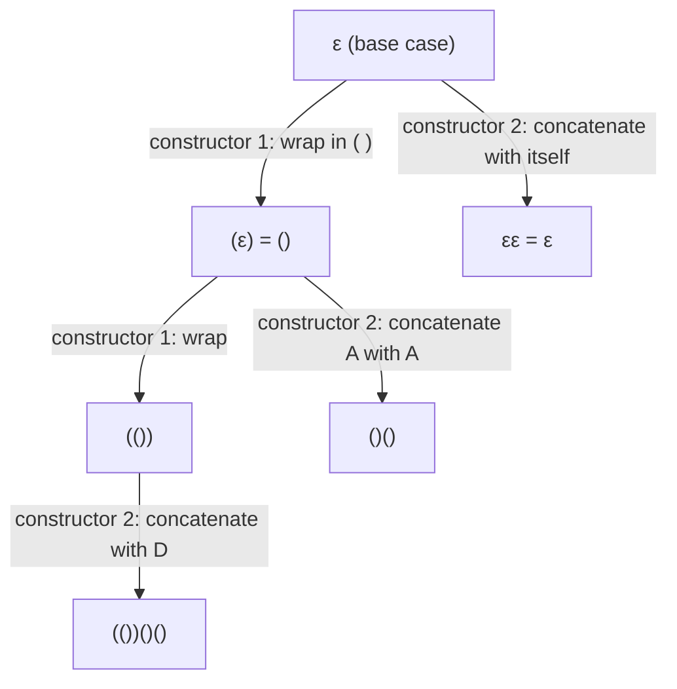

## Learning Objectives

- Write a recursive definition for a set or structure using a base case and one or more recursive (constructor) cases, and identify what makes such a definition well-founded.
- Distinguish a recursive definition of a structure from an inductive proof about that structure, while recognizing them as mirror images of the same underlying idea.
- Construct a structural induction proof — a base case matching the recursive definition's base case, and an inductive step matching each recursive constructor.
- Explain, with a specific side-by-side example, why proving a property of a recursively-defined structure by structural induction has the same shape as computing over that structure with a recursive function.
- Diagnose structural induction proofs that omit a constructor case or misapply the inductive hypothesis to a sub-structure the definition doesn't actually produce.

## Context & Motivation

Ordinary and strong induction, covered in the two preceding concepts, prove statements indexed by the natural numbers: P(0), P(1), P(2), and so on. But an enormous share of the objects computer scientists actually reason about — strings, lists, trees, well-formed arithmetic expressions, balanced parenthesizations — aren't naturally indexed by a single integer at all. They are, however, almost always built up the same way: start from some simple base objects, and repeatedly apply a small set of construction rules to build larger ones out of smaller ones. A **recursive definition** makes this construction process explicit and precise, specifying exactly which objects count as members of the set being defined. **Structural induction** is the proof technique that mirrors this construction exactly: to prove a property holds for every object the definition produces, prove it holds for the base objects, then prove that each construction rule preserves the property — that applying a rule to objects the property already holds for produces a new object the property also holds for.

This concept sits at a genuine joint in the curriculum: it is simultaneously the natural generalization of the induction techniques you've just seen, and it is exactly the mathematical formalization of recursion as a way to compute — a technique already introduced, as code, in this platform's `recursion` concept in the programming-computational-thinking discipline. That is not a loose analogy; it is the same underlying idea wearing two different hats. A recursive definition and a recursive function share an identical two-part shape — a base case simple enough to handle directly, and a rule for handling everything else by referring to a strictly smaller instance of the same kind of object — and a structural induction proof about a recursively-defined structure has that exact same two-part shape once more, base case matched to base case, constructor matched to constructor. Where recursion computes an answer by trusting a "recursive leap of faith" that the smaller call already returns the right value, structural induction proves a property by trusting an inductive hypothesis that the smaller sub-structure already has the property — the leap of faith and the inductive hypothesis are, formally, the same trust, applied to computing versus proving respectively.

MIT's 6.042 (Mathematics for Computer Science) treats recursive definitions and structural induction as the natural capstone of its induction unit for exactly this reason: once you have ordinary and strong induction on the integers in hand, extending the same reasoning to arbitrary recursively-built structures is a small conceptual step that pays for itself immediately — it is the tool that proves a compiler's parser is correct on every well-formed expression, that a recursive algorithm over a tree behaves correctly on every possible tree shape, or that a recursive function over a list produces the right answer for every list, no matter how it was constructed.

## Core Theory

### Recursive definitions: base cases and constructor rules

A recursive definition of a set S specifies:

1. **Base case:** one or more explicitly listed "smallest" objects that belong to S with no further justification needed.
2. **Constructor (recursive) rules:** one or more rules, each saying that if certain objects already known to be in S are combined in a specified way, the result is also in S.
3. **Closure (implicit):** nothing is in S unless it is produced by a finite number of applications of rules 1 and 2.

A classic example — the set of well-formed (balanced) parenthesizations:

- **Base case:** the empty string ε is well-formed.
- **Constructor 1:** if w is well-formed, then (w) is well-formed.
- **Constructor 2:** if w₁ and w₂ are both well-formed, then w₁w₂ (concatenation) is well-formed.

This precisely characterizes strings like `(())()` and `()(())` as well-formed, and rules out `(()` or `)(` — because no finite sequence of these three rules can ever produce them.

### Structural induction: the proof technique that mirrors the definition

To prove a property Q holds for every object in a recursively-defined set S, **structural induction** requires:

1. **Base case:** prove Q holds for every base object listed in S's definition.
2. **Inductive step:** for each constructor rule, assume Q holds for the smaller object(s) the rule combines (the **structural inductive hypothesis**), and prove Q holds for the object the rule constructs from them.

If both hold for every base object and every constructor, Q holds for every object in S — because every object in S is reachable from the base cases by some finite sequence of constructor applications, and each application preserves Q by the inductive step.

This is not a new axiom bolted onto ordinary induction; it can be derived from strong induction on the natural numbers by inducting on the *number of constructor applications* used to build a given object — but treating it as its own technique, matched directly to the shape of the recursive definition, is almost always far more natural in practice than translating everything into that integer count first.

### The exact correspondence with programming recursion

This is the connection promised above, made concrete rather than gestured at. Recall the `recursion` concept's very first worked example, `list_sum`, defined over a Python list:

```python
def list_sum(numbers):
    if not numbers:                       # base case: empty list
        return 0
    return numbers[0] + list_sum(numbers[1:])   # recursive case
```

This function's shape is a direct computational mirror of a recursive *definition* of lists themselves: a list is either the empty list `[]` (base case), or an element `x` followed by a smaller list `rest` (constructor: `[x] + rest`). `list_sum` handles the base case directly (`return 0`) and handles the constructor case by trusting the recursive call on `rest` — the smaller list — to already return the correct sum, then combining that trusted answer with `x`. That trust is exactly what the recursion concept calls the "recursive leap of faith."

Now suppose you want to *prove*, rather than merely trust, that `list_sum` is correct for every list — that it always returns the true sum of its elements. The proof is structural induction on the very same recursive definition of lists:

- **Base case:** show `list_sum([])` returns the true sum of the empty list, namely 0. Directly true, since `list_sum` returns `0` exactly when its input is empty.
- **Inductive step:** assume (the structural inductive hypothesis) that `list_sum(rest)` correctly returns the sum of `rest`, for some list `rest`. Show `list_sum([x] + rest)` correctly returns the sum of `[x] + rest`. Since `list_sum([x] + rest) = x + list_sum(rest)` by the function's own definition, and `list_sum(rest)` is the true sum of `rest` by the inductive hypothesis, `x + list_sum(rest)` is exactly `x` plus the true sum of `rest` — which is, by definition, the true sum of `[x] + rest`.

Notice the proof's two parts line up, step for step, with the function's two branches: the base case of the proof matches the base case of the code (`if not numbers`), and the inductive step of the proof matches the recursive case of the code (`numbers[0] + list_sum(numbers[1:])`), with the inductive hypothesis playing exactly the role the recursion concept called "trusting the smaller call." This is the real content of the claim that structural induction and recursion are "the same idea in two guises": one recurses on a structure to *compute* a value, trusting the smaller case; the other inducts on the same structure to *prove* a property, assuming the smaller case. The base-case/recursive-case skeleton, and the leap-of-faith/inductive-hypothesis trust, are identical in both — only the goal (compute an answer vs. prove a property) differs.

### Visualizing a recursively-built structure and its induction



Just as ordinary induction's domino chain shows truth propagating forward through consecutive integers, this tree shows the recursive definition growing the set S outward from its base case through repeated constructor applications — and a structural induction proof establishes Q at the root (base case) and shows each edge (constructor application) preserves Q, exactly mirroring the tree's own shape.

## Worked Examples

### Example 1 — every well-formed parenthesization has equal numbers of `(` and `)`

**Claim:** for every string w in the well-formed set defined above, the number of `(` characters in w equals the number of `)` characters.

Let Q(w) be "w has equal numbers of `(` and `)`."

**Base case:** w = ε. It has zero `(` and zero `)` — equal. Q(ε) holds.

**Inductive step, constructor 1:** assume Q(w) holds for some well-formed w (structural inductive hypothesis): w has, say, n opens and n closes. Constructor 1 builds (w) from w. The count of `(` in (w) is n + 1 (w's n opens, plus the one added), and the count of `)` is likewise n + 1 (w's n closes, plus the one added). These are equal, so Q((w)) holds.

**Inductive step, constructor 2:** assume Q(w₁) and Q(w₂) both hold: w₁ has n₁ opens and n₁ closes, w₂ has n₂ opens and n₂ closes. Constructor 2 builds w₁w₂ by concatenation. The total opens in w₁w₂ is n₁ + n₂, and the total closes is likewise n₁ + n₂ — equal. So Q(w₁w₂) holds.

Both constructors preserve Q, and Q holds at the base case, so by structural induction Q(w) holds for every well-formed w. ∎

### Example 2 — a recursively-defined binary tree's node count is always odd

**Definition:** a **full binary tree** (every node has either 0 or 2 children) is defined recursively: a single leaf node is a full binary tree (base case); if L and R are full binary trees, then a new root with left subtree L and right subtree R is a full binary tree (constructor).

**Claim:** every full binary tree has an odd number of nodes.

Let Q(T) be "T has an odd number of nodes."

**Base case:** T is a single leaf. It has 1 node, and 1 is odd. Q(leaf) holds.

**Inductive step:** assume Q(L) and Q(R) hold for full binary trees L and R (structural inductive hypothesis): L has 2p + 1 nodes and R has 2q + 1 nodes for some integers p, q ≥ 0. The constructed tree T has L's nodes, plus R's nodes, plus the new root: (2p + 1) + (2q + 1) + 1 = 2p + 2q + 3 = 2(p + q + 1) + 1 — which is of the form 2m + 1, i.e., odd.

So Q(T) holds. By structural induction, every full binary tree has an odd number of nodes. ∎

This mirrors, once again, how a recursive *function* computing the node count of such a tree would be written — `count(T) = 1 if T is a leaf else 1 + count(L) + count(R)` — with the inductive step here directly paralleling that function's recursive case, exactly as `list_sum`'s proof paralleled its code in Core Theory.

### Example 3 — evaluating and proving correctness for recursively-defined arithmetic expressions

**Definition:** the set of arithmetic expressions Expr is defined recursively: any integer literal n is an Expr (base case); if e₁ and e₂ are Expr, then (e₁ + e₂) and (e₁ × e₂) are Expr (constructors).

Define `eval` recursively to mirror this exactly: `eval(n) = n`; `eval((e₁ + e₂)) = eval(e₁) + eval(e₂)`; `eval((e₁ × e₂)) = eval(e₁) × eval(e₂)`.

**Claim:** `eval` always terminates and returns an integer, for every e ∈ Expr.

Let Q(e) be "`eval(e)` terminates and returns an integer."

**Base case:** e is a literal n. `eval(n) = n` returns immediately, and n is an integer. Q(n) holds.

**Inductive step, `+` constructor:** assume Q(e₁) and Q(e₂) hold: `eval(e₁)` and `eval(e₂)` both terminate and return integers, say a and b. Then `eval((e₁+e₂))` computes `eval(e₁)`, which terminates returning a; computes `eval(e₂)`, which terminates returning b; and returns a + b, an integer (integers are closed under addition). So `eval((e₁+e₂))` terminates and returns an integer — Q((e₁+e₂)) holds.

**Inductive step, `×` constructor:** identical argument, using closure of the integers under multiplication.

By structural induction, Q(e) holds for every e ∈ Expr — `eval` terminates with an integer result on every syntactically valid expression the grammar can produce. ∎

This is precisely the kind of correctness argument that justifies trusting a recursive-descent evaluator or parser: it terminates and behaves correctly not just on the examples you happened to test, but on every expression the recursive grammar can generate, because the proof's structure was built to track the grammar's own constructors one for one.

## Common Misconceptions & Pitfalls

- **"Structural induction is a completely different technique from ordinary induction — you have to learn it from scratch."** It's the same idea (base case anchors truth, inductive step propagates it) restructured to match a recursive definition's shape instead of the integers' successor structure; it can even be derived from strong induction on the count of constructor applications used to build an object. The mental model — anchor plus propagation — transfers directly.
- **"If a recursively-defined set has one base case and one constructor, you only need to check the constructor once, generically."** That's correct if there truly is only one constructor rule — but definitions with multiple constructors (like the parenthesization example's two rules) need a separate inductive-step argument for *each* constructor. Omitting one constructor case leaves the proof incomplete, even if every other case is airtight, exactly as omitting a branch in a recursive function leaves some inputs unhandled.
- **"The inductive hypothesis in a structural induction proof can be applied to any smaller object of the same type, not just the ones the constructor actually uses."** In Example 2, the hypothesis is available only for L and R — the specific subtrees the constructor combines — not for some other unrelated full binary tree of smaller size. The hypothesis is scoped exactly to what the constructor rule being analyzed actually consumes.
- **"Since structural induction proves properties and recursion computes values, they don't actually interact — you can master one without understanding the other."** The `list_sum` correspondence in Core Theory shows this is false in a specific, checkable way: the proof's base case and inductive step are not merely *similar* to the function's base case and recursive case, they are stated in terms of the exact same code (`list_sum([]) = 0`, `list_sum([x]+rest) = x + list_sum(rest)`) — understanding why the function is correct *is* running the structural induction argument, whether or not it's written out formally.
- **"A recursive definition is 'well-founded' automatically, just because it has a base case and a constructor."** A constructor that doesn't actually build something *larger* out of its inputs — e.g., a bogus rule "if w is well-formed, so is w" — would make the defined set ill-founded or would fail to guarantee every object is reachable by finitely many steps from the base case, since nothing forces progress. Legitimate recursive definitions require every constructor to strictly combine already-smaller pieces into something new, mirroring exactly the requirement (in the recursion concept) that a recursive function's recursive case must make real progress toward its base case.

## Summary

A recursive definition builds a set from explicit base objects using one or more constructor rules, with closure ensuring nothing belongs to the set except what those rules can reach in finitely many applications. Structural induction proves a property for every object in such a set by proving it for the base objects and showing each constructor rule preserves it, assuming the structural inductive hypothesis for the smaller pieces each constructor combines. This is not a new axiom but the same anchor-and-propagate logic behind ordinary and strong induction, reshaped to match a recursive definition's own branching structure rather than the integers' linear succession. Crucially, it is also the direct mathematical counterpart of recursion in programming: a recursive function's base case and recursive case are a computational recursive definition, and proving that function correct by structural induction — as shown step for step with `list_sum` — reuses the exact same base case and recursive case, with the "recursive leap of faith" that a smaller call returns the right value playing precisely the role of the structural inductive hypothesis that a smaller sub-structure already has the property being proved. Missing a constructor case, misapplying the hypothesis to an object the constructor doesn't actually produce, and assuming ill-founded constructors are automatically safe are the most common ways these proofs go wrong.

## Documentation Links

- [Lehman, Leighton & Meyer — Mathematics for Computer Science (full text)](https://people.csail.mit.edu/meyer/mcs.pdf) — doc
- [MIT 6.042J — Syllabus (OCW)](https://ocw.mit.edu/courses/6-042j-mathematics-for-computer-science-fall-2010/pages/syllabus/) — doc
