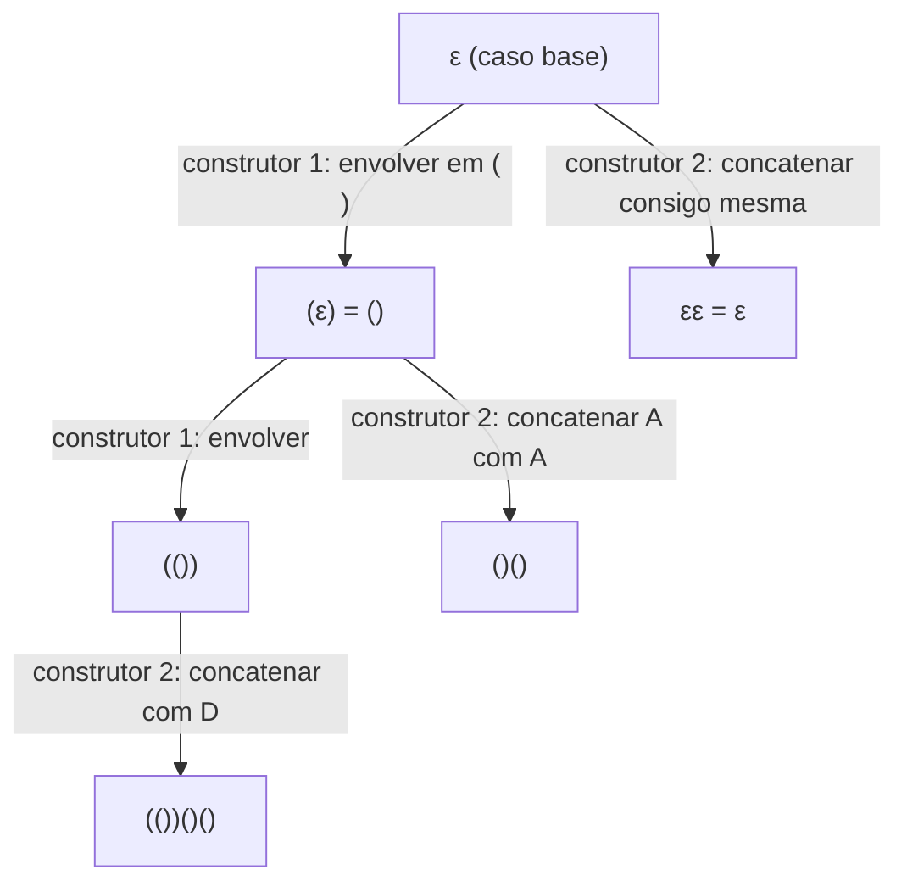

## Objetivos de Aprendizagem

- Escrever uma definição recursiva para um conjunto ou estrutura usando um caso base e uma ou mais regras recursivas (construtoras), e identificar o que torna tal definição bem fundamentada.
- Distinguir uma definição recursiva de uma estrutura de uma prova indutiva sobre essa estrutura, reconhecendo-as como imagens espelhadas da mesma ideia subjacente.
- Construir uma prova por indução estrutural: um caso base correspondendo ao caso base da definição recursiva, e um passo indutivo correspondendo a cada construtor recursivo.
- Explicar, com um exemplo específico lado a lado, por que provar uma propriedade de uma estrutura definida recursivamente por indução estrutural tem o mesmo formato que computar sobre essa estrutura com uma função recursiva.
- Diagnosticar provas por indução estrutural que omitem um caso de construtor ou aplicam mal a hipótese indutiva a uma subestrutura que a definição de fato não produz.

## Contexto e Motivação

Indução comum e forte, cobertas nos dois conceitos anteriores, provam afirmações indexadas pelos números naturais: P(0), P(1), P(2), e assim por diante. Mas uma parcela enorme dos objetos com que cientistas da computação de fato raciocinam (strings, listas, árvores, expressões aritméticas bem formadas, parenteizações balanceadas) não são naturalmente indexados por um único inteiro. Eles são, no entanto, quase sempre construídos da mesma forma: comece de alguns objetos base simples, e aplique repetidamente um pequeno conjunto de regras de construção para construir objetos maiores a partir de menores. Uma **definição recursiva** torna esse processo de construção explícito e preciso, especificando exatamente quais objetos contam como membros do conjunto sendo definido. **Indução estrutural** é a técnica de prova que espelha exatamente essa construção: para provar que uma propriedade vale para todo objeto que a definição produz, prove que ela vale para os objetos base, então prove que cada regra de construção preserva a propriedade, isto é, que aplicar uma regra a objetos para os quais a propriedade já vale produz um novo objeto para o qual a propriedade também vale.

Este conceito fica numa junção genuína do currículo: é simultaneamente a generalização natural das técnicas de indução que você acabou de ver, e é exatamente a formalização matemática da recursão como forma de computar, uma técnica já introduzida, como código, no conceito `Recursão` desta plataforma, na disciplina de pensamento computacional e programação. Isso não é uma analogia solta; é a mesma ideia subjacente vestindo dois chapéus diferentes. Uma definição recursiva e uma função recursiva compartilham um formato idêntico de duas partes (um caso base simples o bastante para tratar diretamente, e uma regra para tratar tudo mais referindo-se a uma instância estritamente menor do mesmo tipo de objeto), e uma prova por indução estrutural sobre uma estrutura definida recursivamente tem esse mesmo formato de duas partes de novo, caso base correspondendo a caso base, construtor correspondendo a construtor. Onde recursão computa uma resposta confiando num "salto de fé recursivo" de que a chamada menor já retorna o valor certo, indução estrutural prova uma propriedade confiando numa hipótese indutiva de que a subestrutura menor já tem a propriedade; o salto de fé e a hipótese indutiva são, formalmente, a mesma confiança, aplicada a computar versus provar respectivamente.

O 6.042 do MIT (Mathematics for Computer Science) trata definições recursivas e indução estrutural como o encerramento natural de sua unidade de indução exatamente por essa razão: uma vez que você tem indução comum e forte sobre os inteiros em mãos, estender o mesmo raciocínio para estruturas construídas recursivamente arbitrárias é um pequeno passo conceitual que se paga imediatamente; é a ferramenta que prova que o parser de um compilador é correto em toda expressão bem formada, que um algoritmo recursivo sobre uma árvore se comporta corretamente em toda forma de árvore possível, ou que uma função recursiva sobre uma lista produz a resposta certa para toda lista, não importa como foi construída.

## Teoria Central

### Definições recursivas: casos base e regras construtoras

Uma definição recursiva de um conjunto S especifica:

1. **Caso base:** um ou mais objetos "menores" explicitamente listados que pertencem a S sem nenhuma justificativa adicional necessária.
2. **Regras construtoras (recursivas):** uma ou mais regras, cada uma dizendo que se certos objetos já conhecidos como pertencentes a S são combinados de uma forma especificada, o resultado também está em S.
3. **Fechamento (implícito):** nada está em S a menos que seja produzido por um número finito de aplicações das regras 1 e 2.

Um exemplo clássico: o conjunto de parenteizações bem formadas (balanceadas):

- **Caso base:** a string vazia ε é bem formada.
- **Construtor 1:** se w é bem formada, então (w) é bem formada.
- **Construtor 2:** se w₁ e w₂ são ambas bem formadas, então w₁w₂ (concatenação) é bem formada.

Isso caracteriza precisamente strings como `(())()` e `()(())` como bem formadas, e exclui `(()` ou `)(`, porque nenhuma sequência finita dessas três regras jamais consegue produzi-las.

### Indução estrutural: a técnica de prova que espelha a definição

Para provar que uma propriedade Q vale para todo objeto num conjunto S definido recursivamente, **indução estrutural** exige:

1. **Caso base:** prove que Q vale para todo objeto base listado na definição de S.
2. **Passo indutivo:** para cada regra construtora, assuma que Q vale para o(s) objeto(s) menor(es) que a regra combina (a **hipótese indutiva estrutural**), e prove que Q vale para o objeto que a regra constrói a partir deles.

Se ambos valem para todo objeto base e todo construtor, Q vale para todo objeto em S, porque todo objeto em S é alcançável a partir dos casos base por alguma sequência finita de aplicações de construtor, e cada aplicação preserva Q pelo passo indutivo.

Isso não é um novo axioma acoplado à indução comum; pode ser derivado de indução forte sobre os números naturais, induzindo sobre o *número de aplicações de construtor* usadas para construir um dado objeto, mas tratá-la como sua própria técnica, correspondendo diretamente ao formato da definição recursiva, é quase sempre bem mais natural na prática do que traduzir tudo para essa contagem inteira primeiro.

### A correspondência exata com recursão em programação

Esta é a conexão prometida acima, tornada concreta em vez de apenas apontada. Relembre o primeiro exemplo resolvido do conceito `Recursão`, `list_sum`, definido sobre uma lista Python:

```python
def list_sum(numbers):
    if not numbers:                       # caso base: lista vazia
        return 0
    return numbers[0] + list_sum(numbers[1:])   # caso recursivo
```

O formato dessa função é um espelho computacional direto de uma *definição* recursiva das próprias listas: uma lista é ou a lista vazia `[]` (caso base), ou um elemento `x` seguido de uma lista menor `rest` (construtor: `[x] + rest`). `list_sum` trata o caso base diretamente (`return 0`) e trata o caso construtor confiando que a chamada recursiva em `rest` (a lista menor) já retorna a soma correta, então combinando essa resposta confiada com `x`. Essa confiança é exatamente o que o conceito de recursão chama de "salto de fé recursivo".

Agora suponha que você quer *provar*, em vez de meramente confiar, que `list_sum` é correta para toda lista, que ela sempre retorna a soma verdadeira de seus elementos. A prova é indução estrutural sobre essa mesma definição recursiva de listas:

- **Caso base:** mostre que `list_sum([])` retorna a soma verdadeira da lista vazia, a saber 0. Diretamente verdadeiro, já que `list_sum` retorna `0` exatamente quando sua entrada é vazia.
- **Passo indutivo:** assuma (a hipótese indutiva estrutural) que `list_sum(rest)` retorna corretamente a soma de `rest`, para alguma lista `rest`. Mostre que `list_sum([x] + rest)` retorna corretamente a soma de `[x] + rest`. Como `list_sum([x] + rest) = x + list_sum(rest)` pela própria definição da função, e `list_sum(rest)` é a soma verdadeira de `rest` pela hipótese indutiva, `x + list_sum(rest)` é exatamente `x` mais a soma verdadeira de `rest`, que é, por definição, a soma verdadeira de `[x] + rest`.

Note que as duas partes da prova se alinham, passo por passo, com os dois ramos da função: o caso base da prova corresponde ao caso base do código (`if not numbers`), e o passo indutivo da prova corresponde ao caso recursivo do código (`numbers[0] + list_sum(numbers[1:])`), com a hipótese indutiva desempenhando exatamente o papel que o conceito de recursão chamou de "confiar na chamada menor". Este é o conteúdo real da afirmação de que indução estrutural e recursão são "a mesma ideia em dois disfarces": uma recorre sobre uma estrutura para *computar* um valor, confiando no caso menor; a outra induz sobre a mesma estrutura para *provar* uma propriedade, assumindo o caso menor. O esqueleto caso-base/caso-recursivo, e a confiança salto-de-fé/hipótese-indutiva, são idênticos nas duas, só o objetivo (computar uma resposta versus provar uma propriedade) difere.

### Visualizando uma estrutura construída recursivamente e sua indução



Assim como a cadeia de dominós da indução comum mostra a verdade se propagando adiante através de inteiros consecutivos, esta árvore mostra a definição recursiva fazendo o conjunto S crescer para fora a partir de seu caso base através de aplicações repetidas de construtor, e uma prova por indução estrutural estabelece Q na raiz (caso base) e mostra que cada aresta (aplicação de construtor) preserva Q, espelhando exatamente o próprio formato da árvore.

## Exemplos Resolvidos

### Exemplo 1: toda parenteização bem formada tem números iguais de `(` e `)`

**Afirmação:** para toda string w no conjunto bem formado definido acima, o número de caracteres `(` em w é igual ao número de caracteres `)`.

Seja Q(w) "w tem números iguais de `(` e `)`".

**Caso base:** w = ε. Tem zero `(` e zero `)`, iguais. Q(ε) vale.

**Passo indutivo, construtor 1:** assuma que Q(w) vale para alguma w bem formada (hipótese indutiva estrutural): w tem, digamos, n aberturas e n fechamentos. O construtor 1 constrói (w) a partir de w. A contagem de `(` em (w) é n + 1 (as n aberturas de w, mais a adicionada), e a contagem de `)` é igualmente n + 1 (os n fechamentos de w, mais o adicionado). São iguais, então Q((w)) vale.

**Passo indutivo, construtor 2:** assuma que Q(w₁) e Q(w₂) valem ambas: w₁ tem n₁ aberturas e n₁ fechamentos, w₂ tem n₂ aberturas e n₂ fechamentos. O construtor 2 constrói w₁w₂ por concatenação. O total de aberturas em w₁w₂ é n₁ + n₂, e o total de fechamentos é igualmente n₁ + n₂, iguais. Então Q(w₁w₂) vale.

Os dois construtores preservam Q, e Q vale no caso base, então por indução estrutural Q(w) vale para toda w bem formada. ∎

### Exemplo 2: a contagem de nós de uma árvore binária definida recursivamente é sempre ímpar

**Definição:** uma **árvore binária cheia** (todo nó tem 0 ou 2 filhos) é definida recursivamente: um único nó folha é uma árvore binária cheia (caso base); se L e R são árvores binárias cheias, então uma nova raiz com subárvore esquerda L e subárvore direita R é uma árvore binária cheia (construtor).

**Afirmação:** toda árvore binária cheia tem um número ímpar de nós.

Seja Q(T) "T tem um número ímpar de nós".

**Caso base:** T é uma única folha. Tem 1 nó, e 1 é ímpar. Q(folha) vale.

**Passo indutivo:** assuma que Q(L) e Q(R) valem para árvores binárias cheias L e R (hipótese indutiva estrutural): L tem 2p + 1 nós e R tem 2q + 1 nós para alguns inteiros p, q ≥ 0. A árvore construída T tem os nós de L, mais os nós de R, mais a nova raiz: (2p + 1) + (2q + 1) + 1 = 2p + 2q + 3 = 2(p + q + 1) + 1, que é da forma 2m + 1, isto é, ímpar.

Então Q(T) vale. Por indução estrutural, toda árvore binária cheia tem um número ímpar de nós. ∎

Isso espelha, mais uma vez, como uma *função* recursiva computando a contagem de nós de tal árvore seria escrita, `contar(T) = 1 se T é folha senão 1 + contar(L) + contar(R)`, com o passo indutivo aqui correspondendo diretamente ao caso recursivo dessa função, exatamente como a prova de `list_sum` correspondeu ao seu código na Teoria Central.

### Exemplo 3: avaliando e provando corretude para expressões aritméticas definidas recursivamente

**Definição:** o conjunto de expressões aritméticas Expr é definido recursivamente: qualquer literal inteiro n é uma Expr (caso base); se e₁ e e₂ são Expr, então (e₁ + e₂) e (e₁ × e₂) são Expr (construtores).

Defina `avaliar` recursivamente para espelhar isso exatamente: `avaliar(n) = n`; `avaliar((e₁ + e₂)) = avaliar(e₁) + avaliar(e₂)`; `avaliar((e₁ × e₂)) = avaliar(e₁) × avaliar(e₂)`.

**Afirmação:** `avaliar` sempre termina e retorna um inteiro, para toda e ∈ Expr.

Seja Q(e) "`avaliar(e)` termina e retorna um inteiro".

**Caso base:** e é um literal n. `avaliar(n) = n` retorna imediatamente, e n é um inteiro. Q(n) vale.

**Passo indutivo, construtor `+`:** assuma que Q(e₁) e Q(e₂) valem: `avaliar(e₁)` e `avaliar(e₂)` terminam e retornam inteiros, digamos a e b. Então `avaliar((e₁+e₂))` computa `avaliar(e₁)`, que termina retornando a; computa `avaliar(e₂)`, que termina retornando b; e retorna a + b, um inteiro (os inteiros são fechados sob adição). Então `avaliar((e₁+e₂))` termina e retorna um inteiro, Q((e₁+e₂)) vale.

**Passo indutivo, construtor `×`:** argumento idêntico, usando o fechamento dos inteiros sob multiplicação.

Por indução estrutural, Q(e) vale para toda e ∈ Expr; `avaliar` termina com um resultado inteiro em toda expressão sintaticamente válida que a gramática pode produzir. ∎

Este é precisamente o tipo de argumento de corretude que justifica confiar num avaliador ou parser de descida recursiva: ele termina e se comporta corretamente não só nos exemplos que você acontece de testar, mas em toda expressão que a gramática recursiva pode gerar, porque a estrutura da prova foi construída para rastrear os próprios construtores da gramática um a um.

## Equívocos Comuns e Armadilhas

- **"Indução estrutural é uma técnica completamente diferente de indução comum; você precisa aprendê-la do zero."** É a mesma ideia (o caso base ancora a verdade, o passo indutivo a propaga) reestruturada para corresponder ao formato de uma definição recursiva em vez da estrutura de sucessor dos inteiros; pode até ser derivada de indução forte sobre a contagem de aplicações de construtor usadas para construir um objeto. O modelo mental (âncora mais propagação) se transfere diretamente.
- **"Se um conjunto definido recursivamente tem um caso base e um construtor, você só precisa checar o construtor uma vez, genericamente."** Isso está correto se de fato houver só uma regra construtora, mas definições com múltiplos construtores (como as duas regras do exemplo de parenteização) precisam de um argumento de passo indutivo separado para *cada* construtor. Omitir um caso de construtor deixa a prova incompleta, mesmo que todo outro caso seja inatacável, exatamente como omitir um ramo numa função recursiva deixa algumas entradas sem tratamento.
- **"A hipótese indutiva numa prova por indução estrutural pode ser aplicada a qualquer objeto menor do mesmo tipo, não só os que o construtor de fato usa."** No Exemplo 2, a hipótese está disponível só para L e R, as subárvores específicas que o construtor combina, não para alguma outra árvore binária cheia não relacionada de tamanho menor. A hipótese está delimitada exatamente ao que a regra construtora sendo analisada de fato consome.
- **"Já que indução estrutural prova propriedades e recursão computa valores, elas não interagem de fato; você pode dominar uma sem entender a outra."** A correspondência com `list_sum` na Teoria Central mostra que isso é falso de forma específica e checável: o caso base e o passo indutivo da prova não são meramente *parecidos* com o caso base e o caso recursivo da função, eles são declarados em termos do exato mesmo código (`list_sum([]) = 0`, `list_sum([x]+rest) = x + list_sum(rest)`); entender por que a função é correta *é* rodar o argumento de indução estrutural, quer esteja escrito formalmente ou não.
- **"Uma definição recursiva é 'bem fundamentada' automaticamente, só por ter um caso base e um construtor."** Um construtor que não constrói de fato algo *maior* a partir de suas entradas (por exemplo, uma regra falsa "se w é bem formada, w também é") tornaria o conjunto definido mal fundamentado ou falharia em garantir que todo objeto é alcançável em finitos passos a partir do caso base, já que nada força progresso. Definições recursivas legítimas exigem que todo construtor combine estritamente peças já menores em algo novo, espelhando exatamente a exigência (no conceito de recursão) de que o caso recursivo de uma função recursiva precisa fazer progresso real em direção ao seu caso base.

## Resumo

Uma definição recursiva constrói um conjunto a partir de objetos base explícitos usando uma ou mais regras construtoras, com fechamento garantindo que nada pertence ao conjunto exceto o que essas regras conseguem alcançar em finitas aplicações. Indução estrutural prova uma propriedade para todo objeto em tal conjunto provando-a para os objetos base e mostrando que cada regra construtora a preserva, assumindo a hipótese indutiva estrutural para as peças menores que cada construtor combina. Isso não é um novo axioma, mas a mesma lógica de ancorar e propagar por trás da indução comum e forte, remodelada para corresponder à própria estrutura ramificada de uma definição recursiva em vez da sucessão linear dos inteiros. Crucialmente, também é a contraparte matemática direta da recursão em programação: o caso base e o caso recursivo de uma função recursiva são uma definição recursiva computacional, e provar essa função correta por indução estrutural, como mostrado passo a passo com `list_sum`, reusa exatamente o mesmo caso base e caso recursivo, com o "salto de fé recursivo" de que uma chamada menor retorna o valor certo desempenhando precisamente o papel da hipótese indutiva estrutural de que uma subestrutura menor já tem a propriedade sendo provada. Faltar um caso de construtor, aplicar mal a hipótese a um objeto que o construtor não produz de fato, e assumir que construtores mal fundamentados são automaticamente seguros são as formas mais comuns dessas provas darem errado.

## Documentation Links

- [Lehman, Leighton & Meyer — Mathematics for Computer Science (full text)](https://people.csail.mit.edu/meyer/mcs.pdf) — doc
- [MIT 6.042J — Syllabus (OCW)](https://ocw.mit.edu/courses/6-042j-mathematics-for-computer-science-fall-2010/pages/syllabus/) — doc
