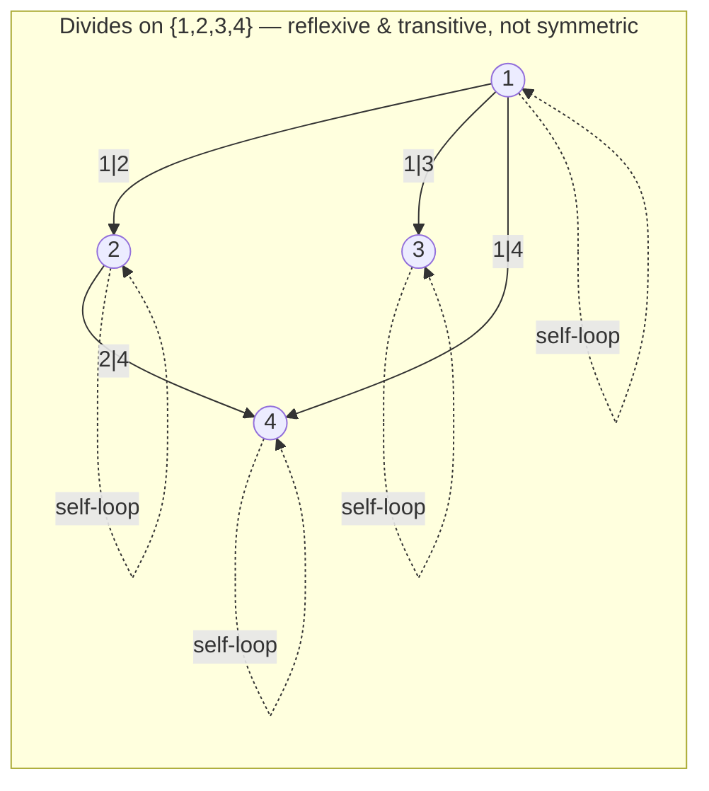

## Learning Objectives

- Define a binary relation on a set as a subset of a Cartesian product, and translate freely between set notation, arrow/graph notation, and infix notation (a R b).
- Determine whether a given relation is reflexive, symmetric, antisymmetric, and/or transitive, using the precise quantified definition of each property.
- Construct small counterexamples that show a relation fails a given property, rather than relying on informal intuition about what the relation "should" do.
- Represent a relation on a finite set as a directed graph and connect each of the four properties to a visual feature of that graph.
- Explain why the combination reflexive + symmetric + transitive is exactly the combination that defines an equivalence relation, previewing the next concept in this unit.

## Context & Motivation

Once you have the Cartesian product, a natural question follows immediately: not every pair (a, b) in A × B is one you actually care about — you usually care about *some* of them, the ones satisfying some condition that connects a to b. "x divides y," "x is a prerequisite for y," "x is friends with y," "x ≤ y," "x and y have the same remainder mod 5" — every one of these is, formally, nothing more than a subset of a Cartesian product, and that subset is called a **relation**. This single, spare definition — a relation is a set of ordered pairs, full stop — is deliberately more general than any of the specific examples that motivate it, and that generality is exactly the point: it lets one theory of "how elements relate to each other" cover graphs, orderings, equivalences, and functions all at once, as different special cases of a single object.

What makes relations worth an entire concept on their own, rather than just a one-line definition, is that most of the *interesting* relations you encounter share a small number of structural properties — reflexivity, symmetry, antisymmetry, transitivity — and once you know which of these properties a relation has, you already know a great deal about its behavior without inspecting a single specific pair. This is the same move discrete math makes over and over: characterize a huge family of examples by a short list of properties, then reason about the properties instead of the examples. MIT 6.042 introduces exactly this move under the heading "relations," precisely because the properties, not the individual relations, are what generalize into the equivalence relations and partial orders covered next in this curriculum.

There's also a very concrete computational payoff. A relation on a finite set can be represented directly as an adjacency matrix (an n × n grid of 0s and 1s, where entry (i, j) is 1 exactly when i R j) or as a set of pairs stored in memory — the same representation a directed graph uses for its edges. This is not a coincidence or a mere analogy: a relation on a finite set *is*, structurally, a directed graph, with an edge from a to b exactly when a R b. Every algorithm you will eventually study for graph reachability, cycle detection, or topological sorting is, underneath, reasoning about the properties of a relation. Understanding reflexivity, symmetry, and transitivity rigorously now is what makes those later algorithms make sense as more than memorized procedures.

## Core Theory

### Formal definition: a relation is a subset of a Cartesian product

A **binary relation** R from a set A to a set B is any subset R ⊆ A × B. When A = B, R is called a relation *on* A. Membership is usually written in infix form: a R b means (a, b) ∈ R. For example, if A = {1, 2, 3, 4} and R is "divides," then:

R = { (1,1), (1,2), (1,3), (1,4), (2,2), (2,4), (3,3), (4,4) }

and 1 R 4 (since 1 divides 4) while 3 R 4 is false (since 3 does not divide 4) — exactly what "(3,4) ∉ R" says.

A relation on a finite set A with |A| = n can equivalently be represented as an n × n **adjacency matrix** M, where M[i][j] = 1 if aᵢ R aⱼ and 0 otherwise, or as a **directed graph** with vertex set A and an edge from a to b exactly when a R b. All three representations — the set of pairs, the matrix, the graph — carry exactly the same information; which one is most convenient depends on what you're trying to compute (a matrix makes composing relations a matter of matrix multiplication over booleans; a graph makes reachability visually obvious).

### The four defining properties

Let R be a relation on a set A.

**Reflexive:** ∀a ∈ A, a R a. Every element relates to itself. On the graph representation, this means every vertex has a self-loop.

**Symmetric:** ∀a, b ∈ A, a R b → b R a. Whenever a relates to b, b relates back to a. On the graph, every edge a → b is matched by an edge b → a, so the graph is effectively undirected.

**Antisymmetric:** ∀a, b ∈ A, (a R b ∧ b R a) → a = b. This is easy to state backwards by accident, so read it carefully: it does *not* say "a never relates back to b" — it says that whenever *both* directions hold simultaneously, a and b must actually be the same element. Antisymmetric is not the negation of symmetric; a relation can be neither, and a relation where no two distinct elements relate in both directions at all (e.g., "<" on the integers, where a < b and b < a can never both hold) is vacuously antisymmetric.

**Transitive:** ∀a, b, c ∈ A, (a R b ∧ b R c) → a R c. If a chains to b and b chains to c, then a must chain directly to c as well. On the graph, this means every 2-step path a → b → c has a "shortcut" edge a → c already present.

Each property is a ∀-quantified implication (or, for reflexivity, a plain ∀ statement), and that structure dictates exactly how you prove or disprove it: proving a property means proving the implication for *arbitrary* a, b (and c, for transitivity) drawn from A; disproving it means exhibiting *one* concrete choice of elements for which the implication's hypothesis holds but its conclusion fails.

### Checking properties against the directed-graph picture

The self-loops on every vertex visualize reflexivity directly (every vertex reaches itself); the absence of a return edge from 2 back to 1 visualizes the failure of symmetry (1 R 2 holds but 2 R 1 does not, since 2 does not divide 1); and the presence of the direct edge 1 → 4 alongside the two-step path 1 → 2 → 4 visualizes transitivity holding for that particular triple.

### Composing relations, and why the properties compose the way they do

Given relations R ⊆ A × B and S ⊆ B × C, their **composition** S ∘ R ⊆ A × C is defined by: a (S∘R) c iff ∃ b ∈ B such that a R b and b S c. This is the same idea as function composition — it will reappear, specialized to functions, in the last concept of this unit — and it lets you restate transitivity elegantly: R (on a single set A) is transitive exactly when R ∘ R ⊆ R, i.e., composing R with itself never produces a pair that wasn't already in R. This reformulation is useful because it turns a property stated with quantifiers into a single set-containment check, which is often easier to verify computationally (via matrix multiplication of the adjacency matrix with itself, using boolean OR/AND in place of +/×).

### A relation need not have any, all, or a fixed combination of these properties

It's tempting to think of the four properties as somehow paired up or mutually exclusive, but they are logically independent axes. "≤" on the integers is reflexive, antisymmetric, and transitive, but not symmetric. "=" on any set is reflexive, symmetric, antisymmetric (vacuously — a=b and b=a together force a=b, trivially), and transitive, all at once. "Is a sibling of" (excluding oneself) on a set of people is symmetric and (typically) not reflexive, and it is *not* transitive in general (siblinghood via a shared parent doesn't chain past two levels without care about half-siblings). There is no shortcut that infers one property from another — each one must be checked against its own definition, independently, every time.

## Worked Examples

### Example 1 — full property check on a concrete relation

**Problem:** Let A = {1, 2, 3} and R = { (1,1), (2,2), (3,3), (1,2), (2,1) }. Determine which of reflexive, symmetric, antisymmetric, transitive hold, with justification for each.

**Reflexive?** Need (1,1), (2,2), (3,3) all in R. All three are present. **Reflexive: yes.**

**Symmetric?** Need: for every (a,b) ∈ R, (b,a) ∈ R too. Checking each pair: (1,1) ↔ (1,1) ✓; (2,2) ↔ (2,2) ✓; (3,3) ↔ (3,3) ✓; (1,2) ↔ (2,1), and (2,1) ∈ R ✓; (2,1) ↔ (1,2), and (1,2) ∈ R ✓. Every pair's reverse is also present. **Symmetric: yes.**

**Antisymmetric?** Need: whenever both (a,b) and (b,a) are in R, a = b. But (1,2) ∈ R and (2,1) ∈ R, with 1 ≠ 2 — this single pair already violates the property. **Antisymmetric: no**, witnessed by a = 1, b = 2.

**Transitive?** Need: whenever (a,b) and (b,c) are in R, (a,c) ∈ R too. Check every chain: (1,2) and (2,1) give (1,1) — present. (2,1) and (1,2) give (2,2) — present. (1,2) and (2,2) give (1,2) — present. (2,1) and (1,1) give (2,1) — present. Every other combination either doesn't chain (e.g., (1,2) and (3,3) share no middle element) or reduces to one of the cases already checked via the reflexive pairs. No violation is found. **Transitive: yes.**

This relation is reflexive, symmetric, and transitive but not antisymmetric — exactly the profile of an equivalence relation on {1,2} ∪ {3} treated as two separate classes, previewing the next concept directly.

### Example 2 — disproving a property with a minimal counterexample

**Problem:** Let A be the set of all people, and let R be "x is a parent of y." Determine whether R is reflexive, symmetric, or transitive.

**Reflexive?** The claim would be ∀x, x is a parent of x — nobody is their own parent, so this fails for *every* x, not just some. **Not reflexive**, and in fact this relation is what's sometimes called irreflexive (no element relates to itself at all), a stronger statement than merely "not reflexive."

**Symmetric?** The claim would be: if x is a parent of y, then y is a parent of x. Take x = Alice, y = Bob, with Alice a parent of Bob. Then Bob is certainly not a parent of Alice (parenthood only runs one direction across a generation). One counterexample suffices to falsify a ∀-statement. **Not symmetric.**

**Transitive?** The claim would be: if x is a parent of y and y is a parent of z, then x is a parent of z. Take x = grandparent, y = parent, z = child. x is a parent of y, and y is a parent of z, but x is a *grandparent*, not a parent, of z. **Not transitive** — one specific three-generation chain is enough to disprove the universal claim, even though the relation clearly does chain in some informal sense (it just chains into a different relation, "ancestor of," not into itself).

This example is worth sitting with because it shows disproving a universally-quantified property requires only a single well-chosen counterexample, while proving one requires an argument that covers every possible choice — the two directions are not symmetric in difficulty, a point that will matter again once formal proof-writing habits are checked against this material.

### Example 3 — antisymmetry from the definition, carefully, without confusing it with "not symmetric"

**Problem:** Let A = {1, 2, 3, 4} and let R be "≤". Show R is antisymmetric, and separately exhibit that R is not symmetric, to make clear these are different claims.

**Antisymmetric, proved directly:** Let a, b ∈ A be arbitrary with a R b and b R a, i.e., a ≤ b and b ≤ a. By the standard trichotomy property of ≤ on the integers, a ≤ b and b ≤ a together force a = b (this is, in fact, one of the defining properties of ≤ as a total order on the integers — a fact that will be named explicitly in the concept on partial orders). Since a, b were arbitrary subject only to the hypothesis, the implication holds for all a, b ∈ A. **∴ R is antisymmetric.**

**Not symmetric, disproved by counterexample:** Take a = 1, b = 2. Then a R b holds (1 ≤ 2), but b R a does not (2 ≤ 1 is false). This single pair is enough to falsify "∀a,b, a R b → b R a." **∴ R is not symmetric.**

The point of doing both halves side by side is that "antisymmetric" and "not symmetric" sound like they should be opposites but are not: ≤ is both antisymmetric *and* not symmetric simultaneously, and it's entirely possible (as Example 1 showed) for a relation to be symmetric and fail antisymmetric at the same time. The two properties are checking different things — antisymmetric asks what happens *only* when both directions hold at once; symmetric asks whether one direction always forces the other.

## Common Misconceptions & Pitfalls

- **Treating "antisymmetric" as the logical negation of "symmetric."** As Example 3 shows, ≤ is antisymmetric and simultaneously fails to be symmetric — these are not complementary properties, and a relation can independently have neither, one, or (in the trivial case of "=") both.
- **Believing a single confirming example proves a ∀-quantified property.** Checking that (1,1) ∈ R does not establish reflexivity if some other element a′ ∈ A has (a′,a′) ∉ R — reflexivity is a claim about *every* element of A, and a proof must cover all of them (or argue generically for an arbitrary element), not just the ones checked so far.
- **Assuming transitivity is "obviously true" for anything that sounds like it chains.** Example 2's "parent of" relation intuitively feels like it should chain, and it does chain — but into a *different* relation ("ancestor of"), not back into itself. Transitivity requires the conclusion a R c to land back in the *same* relation R being tested, not merely in some broader relationship the pair happens to satisfy.
- **Confusing "reflexive" with "every element relates to some other element."** Reflexivity is specifically about an element relating to *itself* (a R a), not about elements relating to anything at all. A relation where every element relates to some other element but never to itself (like strict "<") is not reflexive — it's the opposite, irreflexive.
- **Forgetting that a relation's properties depend on the ambient set A, not just the pairs listed.** "≤" restricted to {1, 2} is reflexive because (1,1) and (2,2) are both present and both needed — but "≤" restricted to {1, 2, 5}, if you forgot to include (5,5), would no longer be reflexive on that larger set even though the "same" comparison rule is being used. Reflexivity is always relative to a specific underlying set, and quietly changing that set changes which pairs reflexivity demands.

## Summary

A binary relation on a set A is any subset R ⊆ A × A — set notation, infix notation (a R b), adjacency-matrix notation, and directed-graph notation are four equivalent ways of describing the exact same object. Four properties classify how a relation behaves: reflexive (every element relates to itself), symmetric (every relation runs both ways), antisymmetric (the only way both directions can hold is if the two elements coincide), and transitive (two chained relations always produce a direct one). Each is a precisely quantified statement, proved for all elements at once and disproved by a single concrete counterexample — and the four properties are logically independent, appearing in every combination across different everyday relations. Composition of relations (S∘R, defined via an existentially-quantified middle element) gives transitivity a compact reformulation, R∘R ⊆ R, that connects relations forward to matrix and graph algorithms. The specific combination reflexive + symmetric + transitive, seen concretely in Example 1, is exactly the definition taken up next: an equivalence relation.

## Documentation Links

- [Lehman, Leighton & Meyer — Mathematics for Computer Science (full text)](https://people.csail.mit.edu/meyer/mcs.pdf) — doc
- [ACM/IEEE CS2013 Curriculum Guidelines](https://www.acm.org/binaries/content/assets/education/cs2013_web_final.pdf) — doc
