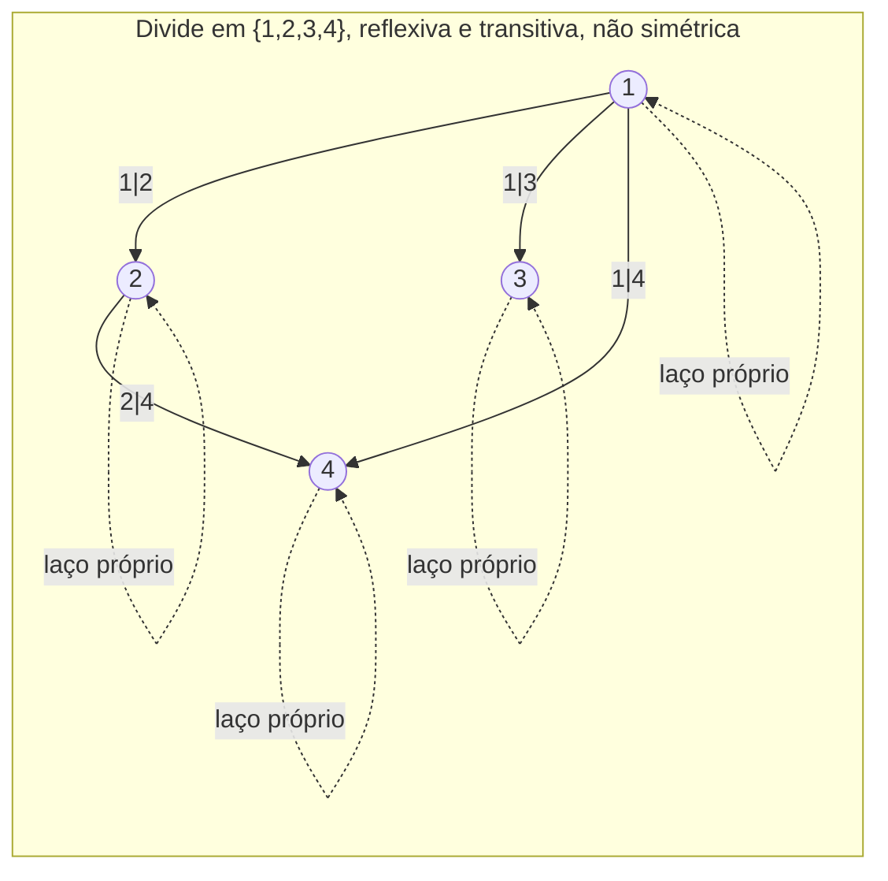

## Objetivos de Aprendizagem

- Definir uma relação binária num conjunto como um subconjunto de um produto cartesiano, e traduzir livremente entre notação de conjunto, notação de seta/grafo e notação infixa (a R b).
- Determinar se uma relação dada é reflexiva, simétrica, antissimétrica e/ou transitiva, usando a definição precisa e quantificada de cada propriedade.
- Construir contraexemplos pequenos que mostrem que uma relação falha numa dada propriedade, em vez de depender de intuição informal sobre o que a relação "deveria" fazer.
- Representar uma relação num conjunto finito como um grafo dirigido e conectar cada uma das quatro propriedades a uma característica visual desse grafo.
- Explicar por que a combinação reflexiva + simétrica + transitiva é exatamente a combinação que define uma relação de equivalência, adiantando o próximo conceito desta unidade.

## Contexto e Motivação

Uma vez que você tem o produto cartesiano, uma pergunta natural segue imediatamente: nem todo par (a, b) em A × B é um que você de fato se importa; geralmente você se importa com *alguns* deles, os que satisfazem alguma condição que conecta a a b. "x divide y", "x é pré-requisito de y", "x é amigo de y", "x ≤ y", "x e y têm o mesmo resto mod 5"; cada um desses é, formalmente, nada mais que um subconjunto de um produto cartesiano, e esse subconjunto se chama uma **relação**. Essa definição única e enxuta (uma relação é um conjunto de pares ordenados, ponto final) é deliberadamente mais geral que qualquer um dos exemplos específicos que a motivam, e essa generalidade é exatamente o ponto: ela permite que uma única teoria de "como elementos se relacionam entre si" cubra grafos, ordenações, equivalências e funções, todos de uma vez, como casos especiais diferentes de um único objeto.

O que faz relações valerem um conceito inteiro só delas, em vez de apenas uma definição de uma linha, é que a maioria das relações *interessantes* que você encontra compartilha um pequeno número de propriedades estruturais (reflexividade, simetria, antissimetria, transitividade), e uma vez que você sabe quais dessas propriedades uma relação tem, você já sabe uma quantidade e tanto sobre seu comportamento sem inspecionar um único par específico. Esse é o mesmo movimento que a matemática discreta faz repetidas vezes: caracterizar uma família enorme de exemplos por uma lista curta de propriedades, e então raciocinar sobre as propriedades em vez dos exemplos. O 6.042 do MIT introduz exatamente esse movimento sob o título "relações", precisamente porque as propriedades, não as relações individuais, são o que generaliza para as relações de equivalência e ordens parciais cobertas a seguir neste currículo.

Também há um retorno computacional bem concreto. Uma relação num conjunto finito pode ser representada diretamente como uma matriz de adjacência (uma grade n × n de 0s e 1s, onde a entrada (i, j) é 1 exatamente quando i R j) ou como um conjunto de pares armazenado na memória, a mesma representação que um grafo dirigido usa para suas arestas. Isso não é coincidência nem mera analogia: uma relação num conjunto finito *é*, estruturalmente, um grafo dirigido, com uma aresta de a para b exatamente quando a R b. Todo algoritmo que você vai eventualmente estudar para alcançabilidade em grafos, detecção de ciclos, ou ordenação topológica está, por baixo, raciocinando sobre as propriedades de uma relação. Entender reflexividade, simetria e transitividade com rigor agora é o que faz aqueles algoritmos posteriores fazerem sentido como mais que procedimentos decorados.

## Teoria Central

### Definição formal: uma relação é um subconjunto de um produto cartesiano

Uma **relação binária** R de um conjunto A para um conjunto B é qualquer subconjunto R ⊆ A × B. Quando A = B, R se chama uma relação *em* A. Pertinência geralmente se escreve em forma infixa: a R b significa (a, b) ∈ R. Por exemplo, se A = {1, 2, 3, 4} e R é "divide", então:

R = { (1,1), (1,2), (1,3), (1,4), (2,2), (2,4), (3,3), (4,4) }

e 1 R 4 (já que 1 divide 4) enquanto 3 R 4 é falso (já que 3 não divide 4), exatamente o que "(3,4) ∉ R" diz.

Uma relação num conjunto finito A com |A| = n pode ser equivalentemente representada como uma **matriz de adjacência** n × n M, onde M[i][j] = 1 se aᵢ R aⱼ e 0 caso contrário, ou como um **grafo dirigido** com conjunto de vértices A e uma aresta de a para b exatamente quando a R b. As três representações (o conjunto de pares, a matriz, o grafo) carregam exatamente a mesma informação; qual é mais conveniente depende do que você está tentando computar (uma matriz torna compor relações uma questão de multiplicação de matrizes sobre booleanos; um grafo torna alcançabilidade visualmente óbvia).

### As quatro propriedades definidoras

Seja R uma relação num conjunto A.

**Reflexiva:** ∀a ∈ A, a R a. Todo elemento se relaciona consigo mesmo. Na representação em grafo, isso significa que todo vértice tem um laço próprio.

**Simétrica:** ∀a, b ∈ A, a R b → b R a. Sempre que a se relaciona com b, b se relaciona de volta com a. No grafo, toda aresta a → b é correspondida por uma aresta b → a, então o grafo é efetivamente não dirigido.

**Antissimétrica:** ∀a, b ∈ A, (a R b ∧ b R a) → a = b. É fácil declarar isso ao contrário por acidente, então leia com cuidado: isso *não* diz "a nunca se relaciona de volta com b"; diz que sempre que *ambas* as direções valem simultaneamente, a e b precisam de fato ser o mesmo elemento. Antissimétrica não é a negação de simétrica; uma relação pode não ser nenhuma das duas, e uma relação onde nenhum par de elementos distintos se relaciona em ambas as direções de forma alguma (por exemplo, "<" nos inteiros, onde a < b e b < a nunca podem valer ao mesmo tempo) é vacuamente antissimétrica.

**Transitiva:** ∀a, b, c ∈ A, (a R b ∧ b R c) → a R c. Se a encadeia com b e b encadeia com c, então a precisa encadear diretamente com c também. No grafo, isso significa que todo caminho de 2 passos a → b → c já tem um "atalho" de aresta a → c presente.

Cada propriedade é uma implicação quantificada por ∀ (ou, para reflexividade, uma afirmação ∀ simples), e essa estrutura dita exatamente como você prova ou refuta ela: provar uma propriedade significa provar a implicação para a, b (e c, para transitividade) *arbitrários* tirados de A; refutá-la significa exibir *uma* escolha concreta de elementos para a qual a hipótese da implicação vale mas sua conclusão falha.

### Checando propriedades contra a imagem do grafo dirigido

Os laços próprios em todo vértice visualizam reflexividade diretamente (todo vértice alcança a si mesmo); a ausência de uma aresta de retorno de 2 de volta para 1 visualiza a falha de simetria (1 R 2 vale mas 2 R 1 não, já que 2 não divide 1); e a presença da aresta direta 1 → 4 junto com o caminho de dois passos 1 → 2 → 4 visualiza transitividade valendo para essa tripla particular.

### Compondo relações, e por que as propriedades compõem do jeito que compõem

Dadas relações R ⊆ A × B e S ⊆ B × C, sua **composição** S ∘ R ⊆ A × C é definida por: a (S∘R) c sse ∃ b ∈ B tal que a R b e b S c. Essa é a mesma ideia da composição de funções (vai reaparecer, especializada para funções, no último conceito desta unidade), e permite reformular transitividade elegantemente: R (num único conjunto A) é transitiva exatamente quando R ∘ R ⊆ R, ou seja, compor R consigo mesma nunca produz um par que já não estivesse em R. Essa reformulação é útil porque transforma uma propriedade declarada com quantificadores numa única checagem de contenção de conjunto, que costuma ser mais fácil de verificar computacionalmente (via multiplicação de matrizes da matriz de adjacência consigo mesma, usando OU/E booleano no lugar de +/×).

### Uma relação não precisa ter nenhuma, todas, ou uma combinação fixa dessas propriedades

É tentador pensar nas quatro propriedades como de algum jeito pareadas ou mutuamente exclusivas, mas são eixos logicamente independentes. "≤" nos inteiros é reflexiva, antissimétrica e transitiva, mas não simétrica. "=" em qualquer conjunto é reflexiva, simétrica, antissimétrica (vacuamente; a=b e b=a juntas forçam a=b, trivialmente) e transitiva, tudo ao mesmo tempo. "É irmão de" (excluindo a si mesmo) num conjunto de pessoas é simétrica e (tipicamente) não reflexiva, e *não* é transitiva em geral (irmandade via um pai compartilhado não encadeia além de dois níveis sem cuidado com meio-irmãos). Não há atalho que infira uma propriedade a partir de outra; cada uma precisa ser checada contra sua própria definição, independentemente, toda vez.

## Exemplos Resolvidos

### Exemplo 1: checagem completa de propriedades numa relação concreta

**Problema:** sejam A = {1, 2, 3} e R = { (1,1), (2,2), (3,3), (1,2), (2,1) }. Determine quais de reflexiva, simétrica, antissimétrica, transitiva valem, com justificativa para cada uma.

**Reflexiva?** Precisa de (1,1), (2,2), (3,3) todos em R. Os três estão presentes. **Reflexiva: sim.**

**Simétrica?** Precisa: para todo (a,b) ∈ R, (b,a) ∈ R também. Checando cada par: (1,1) ↔ (1,1) ✓; (2,2) ↔ (2,2) ✓; (3,3) ↔ (3,3) ✓; (1,2) ↔ (2,1), e (2,1) ∈ R ✓; (2,1) ↔ (1,2), e (1,2) ∈ R ✓. O reverso de todo par também está presente. **Simétrica: sim.**

**Antissimétrica?** Precisa: sempre que tanto (a,b) quanto (b,a) estão em R, a = b. Mas (1,2) ∈ R e (2,1) ∈ R, com 1 ≠ 2; esse único par já viola a propriedade. **Antissimétrica: não**, testemunhado por a = 1, b = 2.

**Transitiva?** Precisa: sempre que (a,b) e (b,c) estão em R, (a,c) ∈ R também. Checando toda cadeia: (1,2) e (2,1) dão (1,1), presente. (2,1) e (1,2) dão (2,2), presente. (1,2) e (2,2) dão (1,2), presente. (2,1) e (1,1) dão (2,1), presente. Toda outra combinação ou não encadeia (por exemplo, (1,2) e (3,3) não compartilham elemento do meio) ou se reduz a um dos casos já checados via os pares reflexivos. Nenhuma violação é encontrada. **Transitiva: sim.**

Essa relação é reflexiva, simétrica e transitiva mas não antissimétrica, exatamente o perfil de uma relação de equivalência em {1,2} ∪ {3} tratado como duas classes separadas, adiantando o próximo conceito diretamente.

### Exemplo 2: refutando uma propriedade com um contraexemplo mínimo

**Problema:** seja A o conjunto de todas as pessoas, e seja R "x é pai/mãe de y". Determine se R é reflexiva, simétrica, ou transitiva.

**Reflexiva?** A afirmação seria ∀x, x é pai/mãe de x; ninguém é pai/mãe de si mesmo, então isso falha para *todo* x, não só alguns. **Não reflexiva**, e de fato essa relação é o que às vezes se chama irreflexiva (nenhum elemento se relaciona consigo mesmo de forma alguma), uma afirmação mais forte que meramente "não reflexiva".

**Simétrica?** A afirmação seria: se x é pai/mãe de y, então y é pai/mãe de x. Tome x = Alice, y = Bob, com Alice pai/mãe de Bob. Então Bob certamente não é pai/mãe de Alice (parentalidade só corre numa direção através de uma geração). Um contraexemplo basta para falsear uma afirmação-∀. **Não simétrica.**

**Transitiva?** A afirmação seria: se x é pai/mãe de y e y é pai/mãe de z, então x é pai/mãe de z. Tome x = avô/avó, y = pai/mãe, z = filho/filha. x é pai/mãe de y, e y é pai/mãe de z, mas x é *avô/avó*, não pai/mãe, de z. **Não transitiva**; uma cadeia específica de três gerações basta para refutar a afirmação universal, mesmo que a relação claramente encadeie em algum sentido informal (ela só encadeia numa relação diferente, "ancestral de", não nela mesma).

Vale a pena se debruçar sobre esse exemplo porque ele mostra que refutar uma propriedade quantificada universalmente exige só um contraexemplo bem escolhido, enquanto prová-la exige um argumento que cubra toda escolha possível; as duas direções não são simétricas em dificuldade, um ponto que vai importar de novo quando hábitos de escrita de prova formal forem checados contra este material.

### Exemplo 3: antissimetria a partir da definição, com cuidado, sem confundir com "não simétrica"

**Problema:** sejam A = {1, 2, 3, 4} e R "≤". Mostre que R é antissimétrica, e separadamente exiba que R não é simétrica, para deixar claro que são afirmações diferentes.

**Antissimétrica, provada diretamente:** sejam a, b ∈ A arbitrários com a R b e b R a, isto é, a ≤ b e b ≤ a. Pela propriedade padrão de tricotomia de ≤ nos inteiros, a ≤ b e b ≤ a juntas forçam a = b (isso é, de fato, uma das propriedades definidoras de ≤ como uma ordem total nos inteiros, um fato que vai ser nomeado explicitamente no conceito sobre ordens parciais). Como a, b eram arbitrários sujeitos só à hipótese, a implicação vale para todo a, b ∈ A. **∴ R é antissimétrica.**

**Não simétrica, refutada por contraexemplo:** tome a = 1, b = 2. Então a R b vale (1 ≤ 2), mas b R a não vale (2 ≤ 1 é falso). Esse único par basta pra falsear "∀a,b, a R b → b R a." **∴ R não é simétrica.**

O propósito de fazer as duas metades lado a lado é que "antissimétrica" e "não simétrica" soam como se deveriam ser opostas mas não são: ≤ é tanto antissimétrica *quanto* não simétrica simultaneamente, e é inteiramente possível (como o Exemplo 1 mostrou) que uma relação seja simétrica e falhe em ser antissimétrica ao mesmo tempo. As duas propriedades checam coisas diferentes: antissimétrica pergunta o que acontece *só* quando ambas as direções valem de uma vez; simétrica pergunta se uma direção sempre força a outra.

## Equívocos Comuns e Armadilhas

- **Tratar "antissimétrica" como a negação lógica de "simétrica".** Como o Exemplo 3 mostra, ≤ é antissimétrica e simultaneamente falha em ser simétrica; essas não são propriedades complementares, e uma relação pode independentemente não ter nenhuma, ter uma, ou (no caso trivial de "=") ter as duas.
- **Acreditar que um único exemplo confirmador prova uma propriedade quantificada por ∀.** Checar que (1,1) ∈ R não estabelece reflexividade se algum outro elemento a′ ∈ A tem (a′,a′) ∉ R; reflexividade é uma afirmação sobre *todo* elemento de A, e uma prova precisa cobrir todos eles (ou argumentar genericamente para um elemento arbitrário), não só os checados até agora.
- **Assumir que transitividade é "obviamente verdadeira" para qualquer coisa que soe como se encadeasse.** A relação "pai/mãe de" do Exemplo 2 intuitivamente parece que deveria encadear, e de fato encadeia, mas numa relação *diferente* ("ancestral de"), não de volta em si mesma. Transitividade exige que a conclusão a R c caia de volta na *mesma* relação R sendo testada, não meramente em algum relacionamento mais amplo que o par acontece de satisfazer.
- **Confundir "reflexiva" com "todo elemento se relaciona com algum outro elemento".** Reflexividade é especificamente sobre um elemento se relacionar consigo *mesmo* (a R a), não sobre elementos se relacionarem com qualquer coisa. Uma relação onde todo elemento se relaciona com algum outro elemento mas nunca consigo mesmo (como "<" estrito) não é reflexiva; é o oposto, irreflexiva.
- **Esquecer que as propriedades de uma relação dependem do conjunto ambiente A, não só dos pares listados.** "≤" restrito a {1, 2} é reflexiva porque (1,1) e (2,2) estão ambos presentes e ambos são necessários; mas "≤" restrito a {1, 2, 5}, se você esquecesse de incluir (5,5), não seria mais reflexiva naquele conjunto maior mesmo usando a "mesma" regra de comparação. Reflexividade é sempre relativa a um conjunto subjacente específico, e mudar esse conjunto silenciosamente muda quais pares reflexividade exige.

## Resumo

Uma relação binária num conjunto A é qualquer subconjunto R ⊆ A × A; notação de conjunto, notação infixa (a R b), notação de matriz de adjacência e notação de grafo dirigido são quatro formas equivalentes de descrever exatamente o mesmo objeto. Quatro propriedades classificam como uma relação se comporta: reflexiva (todo elemento se relaciona consigo mesmo), simétrica (toda relação corre nas duas direções), antissimétrica (a única forma das duas direções valerem é se os dois elementos coincidem), e transitiva (duas relações encadeadas sempre produzem uma direta). Cada uma é uma afirmação precisamente quantificada, provada para todos os elementos de uma vez e refutada por um único contraexemplo concreto, e as quatro propriedades são logicamente independentes, aparecendo em toda combinação através de diferentes relações do dia a dia. Composição de relações (S∘R, definida via um elemento do meio quantificado existencialmente) dá a transitividade uma reformulação compacta, R∘R ⊆ R, que conecta relações adiante a algoritmos de matriz e grafo. A combinação específica reflexiva + simétrica + transitiva, vista concretamente no Exemplo 1, é exatamente a definição tratada a seguir: uma relação de equivalência.

## Documentation Links

- [Lehman, Leighton & Meyer — Mathematics for Computer Science (full text)](https://people.csail.mit.edu/meyer/mcs.pdf) — doc
- [ACM/IEEE CS2013 Curriculum Guidelines](https://www.acm.org/binaries/content/assets/education/cs2013_web_final.pdf) — doc
