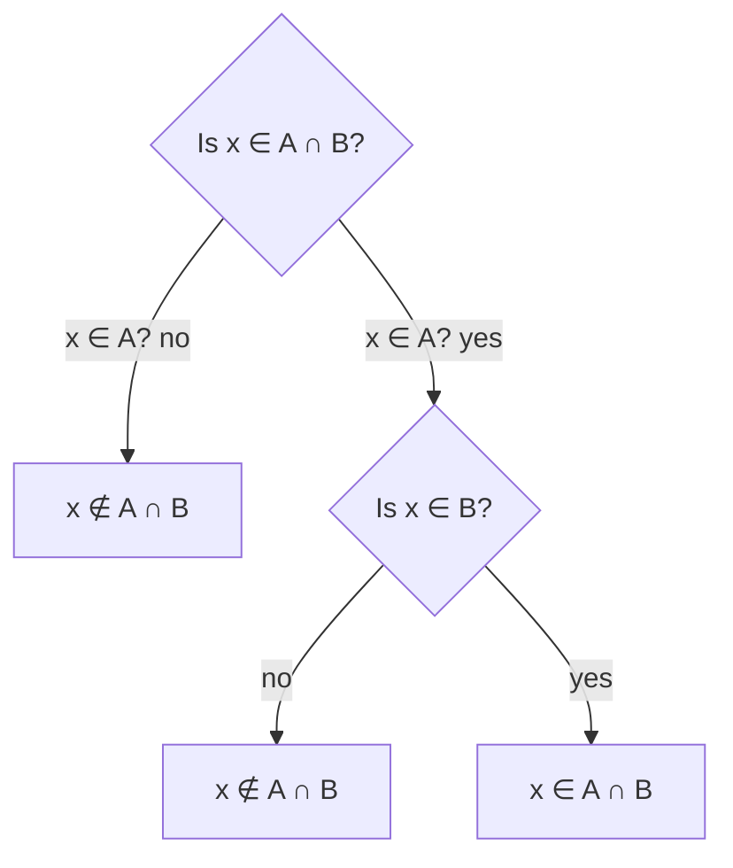

## Learning Objectives

- Define set membership and set equality via the axiom of extensionality, and state the formal, predicate-logic definition of the subset relation.
- Distinguish ∈ (membership) from ⊆ (subset) and correctly evaluate both for sets that themselves contain sets as elements.
- Compute the union, intersection, difference, and complement of explicitly given sets, and state each operation's formal definition using a quantified predicate.
- Prove a subset relationship between two described sets using an element-chasing argument, and prove set equality via the mutual-subset (double-inclusion) technique.
- Compute the power set and cardinality of a finite set, and state the relationship |𝒫(A)| = 2^|A|.

## Context & Motivation

Sets are the substrate almost everything else in this discipline is built on top of: a relation is a set of ordered pairs, a function is a particular kind of relation, a graph is a set of vertices together with a set of edges, and a database table is, at bottom, a set of rows. Before any of those structures can be reasoned about precisely, the basic vocabulary of set membership, containment, and combination has to be pinned down with the same rigor that propositional and predicate logic were pinned down with in the earlier concepts of this course — because "a collection of things" sounds intuitively obvious right up until questions like "is {1} an element of {1, 2}, or a subset of it, or both, or neither?" show that intuition alone gives inconsistent answers depending on who's asked.

Mathematics for Computer Science treats sets as the first major payoff of predicate logic, for a direct reason: every set operation and every set relationship (subset, equality, disjointness) is *defined* in terms of a quantified predicate over membership. "A ⊆ B" is not a new primitive idea requiring its own separate intuition — it is shorthand for the predicate-logic statement `∀x (x ∈ A → x ∈ B)`, which is exactly why the tools built in the *Predicates and Quantifiers* concept transfer here directly, rather than needing to be relearned from scratch. This is also why "proof by picture" — pointing at a Venn diagram and declaring two sets equal because the diagram looks right — is not accepted as a rigorous argument in this discipline: a genuine proof of set equality has to trace back to the quantified membership definitions, an element at a time, which is exactly the technique this concept builds and the next concept (*Venn Diagrams and Set Identities*) formalizes into full identity proofs.

The CS2013 curriculum guidelines place sets and their operations at the very foundation of the discrete structures area precisely because so much of computer science — type systems (a type is a set of values), databases (relational algebra is set algebra), and formal language theory (a language is a set of strings) — is set theory wearing different notation. Getting comfortable with the formal definitions here, rather than only the informal picture, pays off directly the first time any of those subjects needs a rigorous argument rather than an illustrative diagram.

## Core Theory

### Sets, membership, and extensionality

A **set** is an unordered collection of distinct objects, called its **elements** or **members**. Membership is written `x ∈ A` ("x is an element of A"); its negation is `x ∉ A`. A set can be described by listing its elements (**roster notation**, `{1, 2, 3}`) or by a defining predicate (**set-builder notation**, `{x ∈ ℤ : x > 0}`, "the set of integers greater than zero"). Two sets are **equal** exactly when they have the same elements — this is the **axiom of extensionality**: `A = B` if and only if `∀x (x ∈ A ↔ x ∈ B)`. Order and repetition carry no meaning: `{1, 2, 3} = {3, 2, 1} = {1, 1, 2, 3, 3}`, all denote the identical set, because all three have exactly the same members.

### The subset relation, formally

`A ⊆ B` ("A is a subset of B") is defined as `∀x (x ∈ A → x ∈ B)` — every element of A is also an element of B. `A` is a **proper subset** of `B`, written `A ⊂ B`, if `A ⊆ B` and additionally `A ≠ B` (there is some element of B not in A). Because subset is defined as a universally quantified implication, extensionality gives an immediate and extremely important consequence: `A = B` if and only if `A ⊆ B` and `B ⊆ A` — proving set equality reduces to two separate subset proofs, one in each direction, a technique called **double inclusion** or **mutual subset**, used throughout the rest of set theory (and used again for every identity in *Venn Diagrams and Set Identities*).

### The empty set and the universal set

The **empty set**, `∅`, contains no elements. For any set A, `∅ ⊆ A` — vacuously true, since `∀x (x ∈ ∅ → x ∈ A)` has no element of `∅` to serve as a counterexample to the implication, exactly the vacuous-truth phenomenon covered for `∀` in *Predicates and Quantifiers*. The **universal set**, `U`, denotes the ambient domain of discourse a particular discussion is fixed to (all integers, all strings over an alphabet, all people in a database) — every set under discussion in that context is implicitly a subset of `U`, and the complement operation below is only well-defined relative to a fixed `U`.

### The four basic operations

| Operation | Notation | Definition |
|---|---|---|
| Union | `A ∪ B` | `{x : x ∈ A ∨ x ∈ B}` |
| Intersection | `A ∩ B` | `{x : x ∈ A ∧ x ∈ B}` |
| Difference | `A \ B` | `{x : x ∈ A ∧ x ∉ B}` |
| Complement | `Aᶜ` (relative to U) | `{x ∈ U : x ∉ A}`, equivalently `U \ A` |

Each operation's defining predicate is directly a propositional-logic connective applied to the two membership predicates `x ∈ A` and `x ∈ B` — union is literally "or," intersection is literally "and," difference is "and, but not," and complement is "not." This is exactly why every equivalence law from *Logical Equivalence and Tautologies* (commutativity, associativity, distributivity, De Morgan's) has a direct set-theoretic counterpart: proving a set identity and proving the corresponding propositional equivalence are, underneath the notation, the same argument.



### Power sets and cardinality

For a finite set `A` with `n` elements, its **cardinality** is `|A| = n`. The **power set** `𝒫(A)` is the set of *all* subsets of A, including `∅` and A itself. `𝒫({a, b}) = {∅, {a}, {b}, {a, b}}` — four subsets for a 2-element set. In general, `|𝒫(A)| = 2^|A|`, because building an arbitrary subset amounts to making an independent binary "in or out" decision for each of the `n` elements, and there are `2ⁿ` ways to make `n` independent binary decisions — the identical combinatorial fact underlying why `n` propositional variables produce `2ⁿ` rows in a truth table.

## Worked Examples

### Example 1 — proving a subset relationship by element-chasing

**Problem:** let `A = {n ∈ ℤ : n is a multiple of 6}` and `B = {n ∈ ℤ : n is a multiple of 3}`. Prove `A ⊆ B`.

By the formal definition, proving `A ⊆ B` means proving `∀x (x ∈ A → x ∈ B)`. Let `x` be an arbitrary element of `A` (this is the standard opening move for a universally quantified proof — see *Direct Proof and Contraposition*). By definition of `A`, `x` is a multiple of 6, so `x = 6k` for some integer `k`. Then `x = 6k = 3(2k)`, and since `2k` is an integer, `x` is a multiple of 3 — that is, `x ∈ B`. Since `x` was an arbitrary element of `A`, this shows `∀x (x ∈ A → x ∈ B)`, i.e., `A ⊆ B`. Note the proof does *not* show `B ⊆ A` — and indeed it's false: `9 ∈ B` (a multiple of 3) but `9 ∉ A` (not a multiple of 6) — so `A` is a *proper* subset of `B`.

### Example 2 — computing a power set and verifying its cardinality

**Problem:** compute `𝒫({a, b, c})` and confirm `|𝒫({a,b,c})| = 2³ = 8`.

Every subset is determined by an independent in/out choice for each of `a`, `b`, `c`:
```
∅, {a}, {b}, {c}, {a,b}, {a,c}, {b,c}, {a,b,c}
```
That is 8 subsets in total: one of size 0 (the empty set), three of size 1, three of size 2, and one of size 3 (the set itself) — matching `2³ = 8` exactly, and matching the general binomial count `C(3,0) + C(3,1) + C(3,2) + C(3,3) = 1+3+3+1 = 8`. A common error here is omitting `∅` or `{a,b,c}` itself from the list, on the mistaken assumption that a "proper" subset is what's being asked for — the power set always includes both the empty set and the full set as members.

### Example 3 — proving A \ B = A ∩ Bᶜ by double inclusion

**Problem:** prove the identity `A \ B = A ∩ Bᶜ` (relative to a fixed universal set U containing both A and B), using element-chasing in both directions.

*(⊆) Let x ∈ A \ B.* By definition of difference, `x ∈ A` and `x ∉ B`. Since `x ∉ B` and `x ∈ U`, by definition of complement `x ∈ Bᶜ`. So `x ∈ A` and `x ∈ Bᶜ`, i.e., `x ∈ A ∩ Bᶜ`. This shows `A \ B ⊆ A ∩ Bᶜ`.

*(⊇) Let x ∈ A ∩ Bᶜ.* By definition of intersection, `x ∈ A` and `x ∈ Bᶜ`. By definition of complement, `x ∈ Bᶜ` means `x ∉ B`. So `x ∈ A` and `x ∉ B`, which is exactly the definition of `x ∈ A \ B`. This shows `A ∩ Bᶜ ⊆ A \ B`.

Both directions hold, so by extensionality (equality via mutual subset), `A \ B = A ∩ Bᶜ`. Notice each direction is a direct translation of one membership definition into another — no picture was needed, and the argument holds for *any* sets A, B, U, not merely ones small enough to draw.

## Common Misconceptions & Pitfalls

- **Confusing ∈ and ⊆.** `{1} ∈ {1, 2}` is **false** — `{1, 2}`'s elements are the numbers `1` and `2`, not the set `{1}`. But `{1} ⊆ {1, 2}` is **true** — every element of `{1}` (just the number `1`) is indeed an element of `{1, 2}`. The two symbols answer entirely different questions: "is this object one of the elements?" versus "is every element of this set also an element of that one?"
- **Doubting that ∅ ⊆ A for every set A, including A = ∅ itself.** The claim `∀x (x ∈ ∅ → x ∈ A)` is vacuously true precisely because there is no `x ∈ ∅` to check — this holds regardless of what `A` is, a direct instance of the vacuous-truth phenomenon for `∀` covered in *Predicates and Quantifiers*.
- **Treating A ⊆ B and B ⊆ A as somehow both being able to hold "loosely" without forcing A = B.** They cannot hold together unless A and B are the exact same set — that is precisely what the extensionality/double-inclusion equivalence states, and it is the entire justification for why proving equality means proving both subset directions, never just one.
- **Miscounting a power set by treating it as "the proper subsets" or forgetting the empty set.** As Example 2 shows, `𝒫(A)` always contains both `∅` and `A` itself as members; omitting either produces an undercount that will not match `2^|A|`.
- **Forgetting that complement is only defined relative to a fixed universal set U.** `Aᶜ` means different things depending on whether `U` is "all integers" or "all real numbers" — `{n ∈ ℤ : n is even}ᶜ` relative to ℤ is the odd integers, but the same set's complement relative to ℝ would additionally include every non-integer real number. Any use of complement without a stated or clearly implied `U` is ambiguous.

## Summary

A set is fully determined by its elements (extensionality: `A = B ↔ ∀x (x ∈ A ↔ x ∈ B)`), and every core set relationship reduces to a quantified statement about membership: `A ⊆ B` is `∀x (x ∈ A → x ∈ B)`, and set equality reduces to proving that subset relationship in both directions (double inclusion). The four basic operations — union, intersection, difference, complement — are each defined by applying a propositional connective (∨, ∧, "and not," ¬) to membership predicates, which is exactly why the equivalence laws from propositional logic reappear as set identities in the next concept. The empty set is a subset of every set, vacuously; the power set of an `n`-element set has `2ⁿ` subsets, since each element independently is or isn't included; and ∈ (membership) and ⊆ (subset) answer categorically different questions that must never be conflated, especially once sets of sets enter the picture.

## Documentation Links

- [Lehman, Leighton & Meyer — Mathematics for Computer Science (full text)](https://people.csail.mit.edu/meyer/mcs.pdf) — doc
- [ACM/IEEE CS2013 Curriculum Guidelines](https://www.acm.org/binaries/content/assets/education/cs2013_web_final.pdf) — doc
