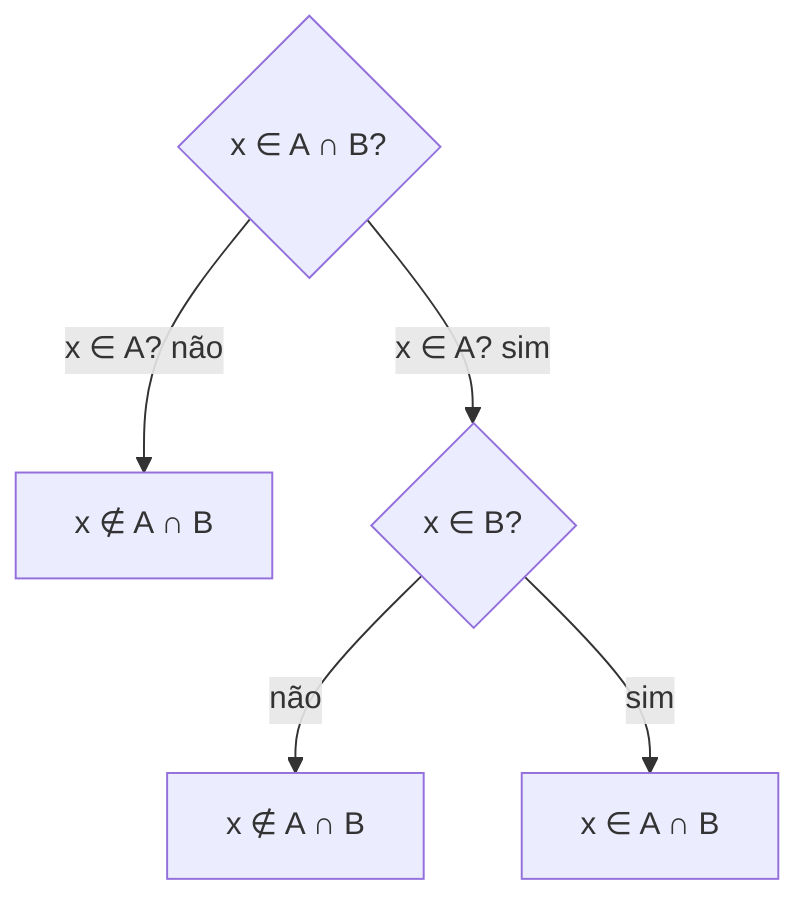

## Objetivos de Aprendizagem

- Definir pertinência e igualdade de conjuntos via o axioma da extensionalidade, e declarar a definição formal, em lógica de predicados, da relação de subconjunto.
- Distinguir ∈ (pertinência) de ⊆ (subconjunto) e avaliar corretamente as duas para conjuntos que eles mesmos contêm conjuntos como elementos.
- Computar a união, interseção, diferença e complemento de conjuntos dados explicitamente, e declarar a definição formal de cada operação usando um predicado quantificado.
- Provar uma relação de subconjunto entre dois conjuntos descritos usando um argumento de perseguição de elemento, e provar igualdade de conjuntos via a técnica de subconjunto mútuo (dupla inclusão).
- Computar o conjunto das partes e a cardinalidade de um conjunto finito, e declarar a relação |𝒫(A)| = 2^|A|.

## Contexto e Motivação

Conjuntos são o substrato sobre o qual quase tudo mais nesta disciplina é construído: uma relação é um conjunto de pares ordenados, uma função é um tipo particular de relação, um grafo é um conjunto de vértices junto com um conjunto de arestas, e uma tabela de banco de dados é, no fundo, um conjunto de linhas. Antes que qualquer dessas estruturas possa ser raciocinada com precisão, o vocabulário básico de pertinência, contenção e combinação de conjuntos precisa ser fixado com o mesmo rigor com que a lógica proposicional e de predicados foi fixada nos conceitos anteriores deste curso, porque "uma coleção de coisas" soa intuitivamente óbvio até que perguntas como "{1} é um elemento de {1, 2}, ou um subconjunto dele, ou ambos, ou nenhum?" mostrem que a intuição sozinha dá respostas inconsistentes dependendo de quem é perguntado.

Mathematics for Computer Science trata conjuntos como o primeiro grande retorno da lógica de predicados, por uma razão direta: toda operação de conjunto e toda relação de conjunto (subconjunto, igualdade, disjunção) é *definida* em termos de um predicado quantificado sobre pertinência. "A ⊆ B" não é uma ideia primitiva nova exigindo sua própria intuição separada; é abreviação da afirmação de lógica de predicados `∀x (x ∈ A → x ∈ B)`, o que é exatamente por que as ferramentas construídas no conceito *Predicados e Quantificadores* se transferem aqui diretamente, em vez de precisarem ser reaprendidas do zero. É também por isso que "prova por figura" (apontar para um diagrama de Venn e declarar dois conjuntos iguais porque o diagrama parece certo) não é aceita como argumento rigoroso nesta disciplina: uma prova genuína de igualdade de conjuntos precisa remontar às definições quantificadas de pertinência, um elemento de cada vez, que é exatamente a técnica que este conceito constrói e que o próximo conceito (*Diagramas de Venn e Identidades de Conjuntos*) formaliza em provas de identidade completas.

As diretrizes curriculares CS2013 colocam conjuntos e suas operações bem no fundamento da área de estruturas discretas precisamente porque tanto da Ciência da Computação (sistemas de tipos, onde um tipo é um conjunto de valores; bancos de dados, onde álgebra relacional é álgebra de conjuntos; e teoria de linguagens formais, onde uma linguagem é um conjunto de strings) é teoria dos conjuntos vestindo notação diferente. Ficar confortável com as definições formais aqui, não só a figura informal, compensa diretamente na primeira vez que qualquer um desses assuntos precisar de um argumento rigoroso em vez de um diagrama ilustrativo.

## Teoria Central

### Conjuntos, pertinência e extensionalidade

Um **conjunto** é uma coleção não ordenada de objetos distintos, chamados seus **elementos** ou **membros**. Pertinência se escreve `x ∈ A` ("x é um elemento de A"); sua negação é `x ∉ A`. Um conjunto pode ser descrito listando seus elementos (**notação de lista**, `{1, 2, 3}`) ou por um predicado definidor (**notação de construtor de conjunto**, `{x ∈ ℤ : x > 0}`, "o conjunto dos inteiros maiores que zero"). Dois conjuntos são **iguais** exatamente quando têm os mesmos elementos; este é o **axioma da extensionalidade**: `A = B` se e somente se `∀x (x ∈ A ↔ x ∈ B)`. Ordem e repetição não carregam significado: `{1, 2, 3} = {3, 2, 1} = {1, 1, 2, 3, 3}`, todos denotam o mesmo conjunto idêntico, porque os três têm exatamente os mesmos membros.

### A relação de subconjunto, formalmente

`A ⊆ B` ("A é subconjunto de B") é definido como `∀x (x ∈ A → x ∈ B)`: todo elemento de A também é elemento de B. `A` é um **subconjunto próprio** de `B`, escrito `A ⊂ B`, se `A ⊆ B` e adicionalmente `A ≠ B` (existe algum elemento de B que não está em A). Como subconjunto é definido como uma implicação quantificada universalmente, extensionalidade dá uma consequência imediata e extremamente importante: `A = B` se e somente se `A ⊆ B` e `B ⊆ A`; provar igualdade de conjuntos se reduz a duas provas de subconjunto separadas, uma em cada direção, uma técnica chamada **dupla inclusão** ou **subconjunto mútuo**, usada ao longo do resto da teoria dos conjuntos (e usada de novo para toda identidade em *Diagramas de Venn e Identidades de Conjuntos*).

### O conjunto vazio e o conjunto universo

O **conjunto vazio**, `∅`, não contém elementos. Para qualquer conjunto A, `∅ ⊆ A`, vacuamente verdadeiro, já que `∀x (x ∈ ∅ → x ∈ A)` não tem elemento de `∅` para servir de contraexemplo à implicação, exatamente o fenômeno de verdade vácua para `∀` coberto em *Predicados e Quantificadores*. O **conjunto universo**, `U`, denota o domínio de discurso ambiente ao qual uma discussão particular está fixada (todos os inteiros, todas as strings sobre um alfabeto, todas as pessoas num banco de dados); todo conjunto em discussão nesse contexto é implicitamente um subconjunto de `U`, e a operação de complemento abaixo só é bem definida em relação a um `U` fixo.

### As quatro operações básicas

| Operação | Notação | Definição |
|---|---|---|
| União | `A ∪ B` | `{x : x ∈ A ∨ x ∈ B}` |
| Interseção | `A ∩ B` | `{x : x ∈ A ∧ x ∈ B}` |
| Diferença | `A \ B` | `{x : x ∈ A ∧ x ∉ B}` |
| Complemento | `Aᶜ` (relativo a U) | `{x ∈ U : x ∉ A}`, equivalentemente `U \ A` |

O predicado definidor de cada operação é diretamente um conectivo de lógica proposicional aplicado aos dois predicados de pertinência `x ∈ A` e `x ∈ B`: união é literalmente "ou", interseção é literalmente "e", diferença é "e, mas não", e complemento é "não". É exatamente por isso que toda lei de equivalência de *Equivalência Lógica e Tautologias* (comutatividade, associatividade, distributividade, De Morgan) tem uma contraparte direta em teoria dos conjuntos: provar uma identidade de conjuntos e provar a equivalência proposicional correspondente são, por baixo da notação, o mesmo argumento.



### Conjunto das partes e cardinalidade

Para um conjunto finito `A` com `n` elementos, sua **cardinalidade** é `|A| = n`. O **conjunto das partes** `𝒫(A)` é o conjunto de *todos* os subconjuntos de A, incluindo `∅` e o próprio A. `𝒫({a, b}) = {∅, {a}, {b}, {a, b}}`, quatro subconjuntos para um conjunto de 2 elementos. Em geral, `|𝒫(A)| = 2^|A|`, porque construir um subconjunto arbitrário equivale a fazer uma decisão binária independente de "dentro ou fora" para cada um dos `n` elementos, e existem `2ⁿ` formas de fazer `n` decisões binárias independentes, o mesmo fato combinatório que está por trás de por que `n` variáveis proposicionais produzem `2ⁿ` linhas numa tabela-verdade.

## Exemplos Resolvidos

### Exemplo 1: provando uma relação de subconjunto por perseguição de elemento

**Problema:** sejam `A = {n ∈ ℤ : n é múltiplo de 6}` e `B = {n ∈ ℤ : n é múltiplo de 3}`. Prove `A ⊆ B`.

Pela definição formal, provar `A ⊆ B` significa provar `∀x (x ∈ A → x ∈ B)`. Seja `x` um elemento arbitrário de `A` (este é o movimento de abertura padrão para uma prova quantificada universalmente; veja *Prova Direta e Contraposição*). Pela definição de `A`, `x` é múltiplo de 6, então `x = 6k` para algum inteiro `k`. Então `x = 6k = 3(2k)`, e como `2k` é um inteiro, `x` é múltiplo de 3, ou seja, `x ∈ B`. Como `x` era um elemento arbitrário de `A`, isso mostra `∀x (x ∈ A → x ∈ B)`, isto é, `A ⊆ B`. Note que a prova *não* mostra `B ⊆ A`, e de fato isso é falso: `9 ∈ B` (múltiplo de 3) mas `9 ∉ A` (não é múltiplo de 6), então `A` é um subconjunto *próprio* de `B`.

### Exemplo 2: computando um conjunto das partes e verificando sua cardinalidade

**Problema:** compute `𝒫({a, b, c})` e confirme `|𝒫({a,b,c})| = 2³ = 8`.

Todo subconjunto é determinado por uma escolha independente de dentro/fora para cada um de `a`, `b`, `c`:
```
∅, {a}, {b}, {c}, {a,b}, {a,c}, {b,c}, {a,b,c}
```
Isso é 8 subconjuntos no total: um de tamanho 0 (o conjunto vazio), três de tamanho 1, três de tamanho 2, e um de tamanho 3 (o próprio conjunto), correspondendo exatamente a `2³ = 8`, e correspondendo à contagem binomial geral `C(3,0) + C(3,1) + C(3,2) + C(3,3) = 1+3+3+1 = 8`. Um erro comum aqui é omitir `∅` ou o próprio `{a,b,c}` da lista, sob a suposição equivocada de que se está pedindo os subconjuntos "próprios"; o conjunto das partes sempre inclui tanto o conjunto vazio quanto o conjunto completo como membros.

### Exemplo 3: provando A \ B = A ∩ Bᶜ por dupla inclusão

**Problema:** prove a identidade `A \ B = A ∩ Bᶜ` (relativa a um conjunto universo fixo U contendo tanto A quanto B), usando perseguição de elemento nas duas direções.

*(⊆) Seja x ∈ A \ B.* Pela definição de diferença, `x ∈ A` e `x ∉ B`. Como `x ∉ B` e `x ∈ U`, pela definição de complemento `x ∈ Bᶜ`. Então `x ∈ A` e `x ∈ Bᶜ`, ou seja, `x ∈ A ∩ Bᶜ`. Isso mostra `A \ B ⊆ A ∩ Bᶜ`.

*(⊇) Seja x ∈ A ∩ Bᶜ.* Pela definição de interseção, `x ∈ A` e `x ∈ Bᶜ`. Pela definição de complemento, `x ∈ Bᶜ` significa `x ∉ B`. Então `x ∈ A` e `x ∉ B`, que é exatamente a definição de `x ∈ A \ B`. Isso mostra `A ∩ Bᶜ ⊆ A \ B`.

As duas direções valem, então por extensionalidade (igualdade via subconjunto mútuo), `A \ B = A ∩ Bᶜ`. Note que cada direção é uma tradução direta de uma definição de pertinência para outra; nenhuma figura foi necessária, e o argumento vale para *quaisquer* conjuntos A, B, U, não só os pequenos o bastante para desenhar.

## Equívocos Comuns e Armadilhas

- **Confundir ∈ e ⊆.** `{1} ∈ {1, 2}` é **falso**: os elementos de `{1, 2}` são os números `1` e `2`, não o conjunto `{1}`. Mas `{1} ⊆ {1, 2}` é **verdadeiro**: todo elemento de `{1}` (só o número `1`) é de fato um elemento de `{1, 2}`. Os dois símbolos respondem perguntas inteiramente diferentes: "este objeto é um dos elementos?" versus "todo elemento deste conjunto também é elemento daquele?"
- **Duvidar que ∅ ⊆ A para todo conjunto A, incluindo A = ∅ ele mesmo.** A afirmação `∀x (x ∈ ∅ → x ∈ A)` é vacuamente verdadeira precisamente porque não há `x ∈ ∅` para checar; isso vale independentemente do que `A` seja, uma instância direta do fenômeno de verdade vácua para `∀` coberto em *Predicados e Quantificadores*.
- **Tratar A ⊆ B e B ⊆ A como podendo de algum jeito valer "frouxamente" sem forçar A = B.** Elas não podem valer juntas a menos que A e B sejam exatamente o mesmo conjunto; isso é precisamente o que a equivalência de extensionalidade/dupla inclusão declara, e é toda a justificativa de por que provar igualdade significa provar as duas direções de subconjunto, nunca só uma.
- **Contar errado um conjunto das partes tratando-o como "os subconjuntos próprios" ou esquecendo o conjunto vazio.** Como o Exemplo 2 mostra, `𝒫(A)` sempre contém tanto `∅` quanto o próprio `A` como membros; omitir qualquer um dos dois produz uma subcontagem que não vai bater com `2^|A|`.
- **Esquecer que complemento só é definido em relação a um conjunto universo U fixo.** `Aᶜ` significa coisas diferentes dependendo de se `U` é "todos os inteiros" ou "todos os números reais": `{n ∈ ℤ : n é par}ᶜ` relativo a ℤ são os inteiros ímpares, mas o complemento do mesmo conjunto relativo a ℝ incluiria adicionalmente todo número real não inteiro. Qualquer uso de complemento sem um `U` declarado ou claramente implícito é ambíguo.

## Resumo

Um conjunto é completamente determinado por seus elementos (extensionalidade: `A = B ↔ ∀x (x ∈ A ↔ x ∈ B)`), e toda relação central de conjuntos se reduz a uma afirmação quantificada sobre pertinência: `A ⊆ B` é `∀x (x ∈ A → x ∈ B)`, e igualdade de conjuntos se reduz a provar essa relação de subconjunto nas duas direções (dupla inclusão). As quatro operações básicas (união, interseção, diferença, complemento) são cada uma definida aplicando um conectivo proposicional (∨, ∧, "e não", ¬) a predicados de pertinência, o que é exatamente por que as leis de equivalência da lógica proposicional reaparecem como identidades de conjuntos no próximo conceito. O conjunto vazio é subconjunto de todo conjunto, vacuamente; o conjunto das partes de um conjunto de `n` elementos tem `2ⁿ` subconjuntos, já que cada elemento independentemente está ou não incluído; e ∈ (pertinência) e ⊆ (subconjunto) respondem perguntas categoricamente diferentes que nunca devem ser confundidas, especialmente quando conjuntos de conjuntos entram em cena.

## Documentation Links

- [Lehman, Leighton & Meyer — Mathematics for Computer Science (full text)](https://people.csail.mit.edu/meyer/mcs.pdf) — doc
- [ACM/IEEE CS2013 Curriculum Guidelines](https://www.acm.org/binaries/content/assets/education/cs2013_web_final.pdf) — doc
