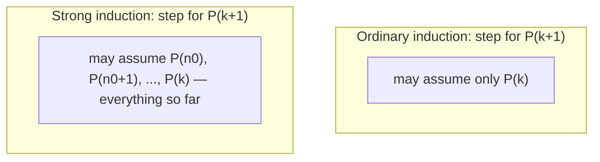

## Learning Objectives

- Explain the difference between ordinary (weak) induction's inductive hypothesis and strong induction's inductive hypothesis.
- Prove that strong induction and ordinary induction are logically equivalent proof techniques.
- Identify problem shapes — particularly those involving recurrences with more than one preceding term — where strong induction is necessary or substantially more natural than ordinary induction.
- Construct a complete strong induction proof, including a correctly scoped base case (or cases) and an inductive step that properly invokes the strong hypothesis.
- Diagnose proofs that misuse strong induction, such as invoking a case outside the range the hypothesis actually covers.

## Context & Motivation

Ordinary mathematical induction proves P(k+1) using only P(k) — the single case immediately before it. That works cleanly for statements like sum formulas, where each value builds directly on its immediate predecessor. But many important statements about integers, sequences, and recursively-defined objects don't decompose that neatly. Consider proving that every integer greater than 1 can be written as a product of primes. Given some n, the natural way to attack this is: if n itself is prime, done; if not, n = a × b for some 1 < a, b < n — but a and b are not "n − 1," they could be any smaller values at all. Ordinary induction, which only hands you the truth of the statement for n − 1, doesn't give you what you need to finish this proof. What you actually want is to assume the claim holds for *every* integer smaller than n, not just the one directly preceding it — and that is exactly what strong induction provides.

This exact shape — needing to reach back further than "one step before" — recurs throughout computer science, most visibly in the analysis of recurrences. The number of comparisons an optimally-implemented merge sort performs on an array of size n depends on the same quantity for arrays of size n/2, not n − 1. The Fibonacci recurrence F(n) = F(n−1) + F(n−2) depends on *two* preceding values, not one. Proofs about well-formed recursive data structures — parenthesizations, binary trees, arithmetic expressions — routinely need to reason about pieces of arbitrary smaller size, not a fixed offset. Stanford's CS103 and MIT's 6.042 both introduce strong induction directly after ordinary induction for this reason: it is presented as a natural extension precisely because so much of discrete mathematics and algorithm analysis needs the stronger form almost immediately.

It's worth being precise about what "strong" means here, because the name can mislead: strong induction does not let you prove anything ordinary induction cannot. The two techniques are logically equivalent — anything provable with one is provable with the other, sometimes with more awkward bookkeeping. What strong induction buys is not more proving power in principle, but a hypothesis that is more convenient to use whenever the natural argument depends on cases scattered arbitrarily below n, rather than tidily one step behind it.

## Core Theory

### The formal statement of strong induction

To prove ∀n ≥ n₀, P(n), strong induction says it suffices to establish:

1. **Base case(s):** P(n₀) is true (and, when the inductive step genuinely needs more than one prior value, additional base cases P(n₀), P(n₀+1), …, P(n₀+j) as needed).
2. **Inductive step:** for an arbitrary k ≥ n₀, assuming P(n₀), P(n₀+1), …, P(k) are *all* true (the **strong inductive hypothesis**), prove P(k+1).

Symbolically: [P(n₀) ∧ (∀k ≥ n₀, (∀i, n₀ ≤ i ≤ k, P(i)) → P(k+1))] → ∀n ≥ n₀, P(n). The difference from ordinary induction is entirely in what the inductive step is allowed to assume: not just P(k), but the truth of P at every value from the base case up through k.

### Why strong induction and ordinary induction are equivalent

The equivalence goes both directions, and both directions are short.

**Strong induction from ordinary induction:** define a new proposition Q(n) = "P(n₀) ∧ P(n₀+1) ∧ ⋯ ∧ P(n)" — the conjunction of P over the whole range so far. Q(n₀) is just P(n₀), the base case. The inductive step for Q — Q(k) → Q(k+1) — is exactly "P(n₀) through P(k) all true implies P(k+1) true" (since Q(k+1) = Q(k) ∧ P(k+1)), which is precisely the strong induction inductive step. Ordinary induction on Q therefore gives Q(n) for all n ≥ n₀, and since P(n) is one conjunct of Q(n), P(n) holds for all n ≥ n₀. This shows strong induction is a valid consequence of ordinary induction (and, transitively, of well-ordering).

**Ordinary induction from strong induction:** trivial — an ordinary inductive step "P(k) → P(k+1)" is a strong inductive step that simply chooses not to use the extra information available (P(n₀) through P(k−1)) that strong induction's hypothesis would have offered. Every ordinary induction proof is already a (needlessly modest) strong induction proof.

Because each simulates the other, neither is more powerful — the choice between them is purely about which one lets a specific proof's inductive step be written down more directly.

### Visualizing the difference in what each inductive step may assume

The reason strong induction feels more powerful in practice, despite being logically equivalent, is visible directly in this picture: a recurrence like F(n) = F(n−1) + F(n−2), or a factorization n = a × b with a, b arbitrary values below n, needs to reach into that whole reservoir of prior truths, not just the single most recent one.

### Base cases: how many, and why the count matters

A common bookkeeping mistake is under-covering the base cases needed by the inductive step. If the inductive step for P(k+1) invokes P(k−1) (two steps back, as in a Fibonacci-shaped recurrence), then the inductive step's argument is only valid once k − 1 ≥ n₀ — meaning k ≥ n₀ + 1, which means the inductive step only starts working from proving P(n₀ + 2) onward. P(n₀) and P(n₀ + 1) must then be verified directly, as separate base cases, since the inductive step's own logic doesn't reach down far enough to cover them. Getting the count of required base cases right means tracing exactly how far back the inductive step's own argument reaches, and confirming every value below that floor is checked directly.

## Worked Examples

### Example 1 — every integer n ≥ 2 has a prime factorization

**Claim:** every integer n ≥ 2 can be written as a product of one or more primes (a single prime counts as a trivial "product" of one factor).

Let P(n) be "n can be written as a product of primes."

**Base case (n = 2):** 2 is itself prime, so it is trivially a product of one prime. P(2) holds.

**Inductive step:** let k ≥ 2 be arbitrary, and assume the strong inductive hypothesis: P(2), P(3), …, P(k) all hold (every integer from 2 to k has a prime factorization). We must show P(k+1).

Case 1: k+1 is prime. Then it is trivially a product of one prime, so P(k+1) holds directly.

Case 2: k+1 is not prime. By definition of composite, k+1 = a × b for some integers a, b with 1 < a, b < k+1 — i.e., 2 ≤ a, b ≤ k. Since a and b both fall within the range covered by the strong inductive hypothesis, P(a) and P(b) both hold: a = p₁p₂⋯pᵢ and b = q₁q₂⋯qⱼ for primes pᵢ, qⱼ. Then k+1 = a × b = p₁p₂⋯pᵢq₁q₂⋯qⱼ, a product of primes. So P(k+1) holds in this case too.

Either way P(k+1) holds, so by strong induction, every integer n ≥ 2 has a prime factorization. ∎

This is the textbook example of why strong induction is needed rather than merely convenient: a and b are *not* k, and are not related to k by any fixed offset — they could be anywhere in [2, k], depending entirely on how k+1 happens to factor. Only the strong hypothesis, covering the whole range, reaches them.

### Example 2 — every amount of postage ≥ 12 cents can be made using only 4-cent and 5-cent stamps

**Claim:** for every integer n ≥ 12, n cents of postage can be formed using only 4-cent and 5-cent stamps (i.e., n = 4a + 5b for some non-negative integers a, b).

Let P(n) be "n = 4a + 5b for some a, b ≥ 0."

**Base cases:** since the inductive step below will reach back up to 4 steps (using n − 4), four consecutive base cases are needed: n = 12 (3 stamps of 4: 4+4+4), n = 13 (2 fours + 1 five: 4+4+5), n = 14 (1 four + 2 fives: 4+5+5), n = 15 (3 fives: 5+5+5). All four check out directly by inspection.

**Inductive step:** let k ≥ 15 be arbitrary, and assume the strong inductive hypothesis: P(12), P(13), …, P(k) all hold. We must show P(k+1).

Since k ≥ 15, k+1 ≥ 16, so k + 1 − 4 ≥ 12 — meaning k − 3 is within the range covered by the strong hypothesis, so P(k−3) holds: k − 3 = 4a + 5b for some a, b ≥ 0. Adding one more 4-cent stamp: k + 1 = 4(a+1) + 5b, which is a valid representation with a+1 ≥ 0 and b ≥ 0. So P(k+1) holds.

By strong induction (with the four base cases and this inductive step), every n ≥ 12 can be formed from 4-cent and 5-cent stamps. ∎

Note precisely why four base cases were required here: the inductive step reaches back to "k + 1 − 4," so it only becomes valid once k + 1 − 4 ≥ 12, i.e. k ≥ 15 — leaving n = 12, 13, 14, 15 uncovered by the step's own logic and requiring direct verification.

### Example 3 — the Fibonacci-like sequence a(n) satisfies a(n) < 2ⁿ

**Claim:** define a(1) = 1, a(2) = 2, and a(n) = a(n−1) + a(n−2) for n ≥ 3. Then a(n) < 2ⁿ for all n ≥ 1.

Let P(n) be "a(n) < 2ⁿ."

**Base cases:** P(1): a(1) = 1 < 2¹ = 2. ✓. P(2): a(2) = 2 < 2² = 4. ✓.

**Inductive step:** let k ≥ 2 be arbitrary, and assume the strong hypothesis: P(1), P(2), …, P(k) all hold. We must show P(k+1), i.e., a(k+1) < 2^(k+1).

By definition, a(k+1) = a(k) + a(k−1). Since k ≥ 2, both k and k−1 fall in the range [1, k] covered by the hypothesis (k−1 ≥ 1 since k ≥ 2), so a(k) < 2ᵏ and a(k−1) < 2^(k−1) both hold. Adding these: a(k+1) = a(k) + a(k−1) < 2ᵏ + 2^(k−1) < 2ᵏ + 2ᵏ = 2·2ᵏ = 2^(k+1).

So P(k+1) holds. By strong induction, a(n) < 2ⁿ for all n ≥ 1. ∎

This example makes visible exactly why ordinary induction would struggle here: the recurrence for a(k+1) genuinely needs *two* prior values (a(k) and a(k−1)), which is precisely the shape strong induction's hypothesis was built to supply directly.

## Common Misconceptions & Pitfalls

- **"Strong induction proves things ordinary induction can't."** As the equivalence argument in Core Theory shows, the two are interchangeable — anything strong induction proves, defining Q(n) as the conjunction of P over the range so far and applying ordinary induction to Q proves as well. Strong induction is a convenience for writing certain inductive steps naturally, not additional logical power.
- **"Since the strong hypothesis covers everything from the base case to k, you only need one base case no matter what the inductive step does."** Example 2's stamp problem needed four base cases (12 through 15) precisely because its inductive step reached back four values (to k+1−4). The number of base cases required is determined by how far back the inductive step's own logic reaches, not by a fixed convention — always trace this explicitly rather than assuming one base case suffices.
- **"In the inductive step, you can invoke P at any value, not just ones you've already covered."** A step for P(k+1) that invokes, say, P(k+5) — a value *larger* than k+1 — is invalid, because the strong hypothesis only grants P(i) for n₀ ≤ i ≤ k; nothing above k is available yet. Every invocation inside the inductive step must be checked against the actual bounds the hypothesis covers.
- **"If the recurrence for P(k+1) only references P(k), you should use strong induction anyway, just to be safe."** There is nothing wrong with reaching for strong induction reflexively, since ordinary induction is a special case of it — but when a recurrence genuinely only needs the immediately preceding value, ordinary induction communicates that fact more directly to a reader; reserving strong induction for when the argument actually needs it keeps proofs honest about their own structure.
- **"Case 2 of Example 1 (composite k+1 = a × b) needs P(k) specifically."** It's a common misreading to assume the inductive hypothesis used is always "P(k)" by name; in Example 1 the values actually invoked are P(a) and P(b), which are typically neither k nor k−1 but some pair of factors that could be almost anywhere in the covered range — the entire point of using the strong form here.

## Summary

Strong induction proves ∀n ≥ n₀, P(n) by establishing base case(s) and an inductive step where P(k+1) may be derived assuming P holds for *every* value from n₀ up to k, not just P(k) alone. It is logically equivalent to ordinary induction — provable from it by applying ordinary induction to the conjunction Q(n) = P(n₀) ∧ ⋯ ∧ P(n) — so the choice between the two techniques is about which one lets a given inductive step be written naturally, not about which one is more powerful. Strong induction is the natural fit whenever the inductive step needs to reach back to values that aren't a fixed distance from k+1 — prime factorizations reaching into arbitrary factor pairs, or recurrences like Fibonacci that depend on two or more preceding terms. The number of base cases required is dictated by how far back the inductive step's own logic reaches, and must be traced explicitly rather than assumed; every value the inductive step invokes must fall within the range the strong hypothesis actually covers.

## Documentation Links

- [Lehman, Leighton & Meyer — Mathematics for Computer Science (full text)](https://people.csail.mit.edu/meyer/mcs.pdf) — doc
- [Stanford CS103 — Mathematical Foundations of Computing](https://web.stanford.edu/class/cs103/) — doc
