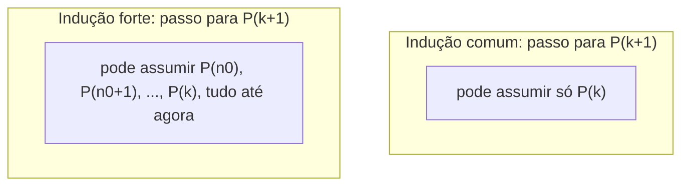

## Objetivos de Aprendizagem

- Explicar a diferença entre a hipótese indutiva da indução (fraca) comum e a hipótese indutiva da indução forte.
- Provar que indução forte e indução comum são tecnicas de prova logicamente equivalentes.
- Identificar formatos de problema (particularmente os que envolvem recorrências com mais de um termo anterior) onde indução forte é necessária ou substancialmente mais natural que indução comum.
- Construir uma prova completa por indução forte, incluindo um caso base (ou casos) corretamente delimitado e um passo indutivo que invoca a hipótese forte de forma apropriada.
- Diagnosticar provas que usam indução forte incorretamente, como invocar um caso fora da faixa que a hipótese de fato cobre.

## Contexto e Motivação

Indução matemática comum prova P(k+1) usando só P(k), o único caso imediatamente anterior. Isso funciona de forma limpa para afirmações como fórmulas de soma, onde cada valor se constrói diretamente sobre seu predecessor imediato. Mas muitas afirmações importantes sobre inteiros, sequências e objetos definidos recursivamente não se decompõem tão bem assim. Considere provar que todo inteiro maior que 1 pode ser escrito como um produto de primos. Dado algum n, a forma natural de atacar isso é: se o próprio n é primo, pronto; se não, n = a × b para alguns 1 < a, b < n, mas a e b não são "n − 1", eles poderiam ser quaisquer valores menores. Indução comum, que só entrega a verdade da afirmação para n − 1, não dá o que é preciso pra terminar essa prova. O que de fato se quer é assumir que a afirmação vale para *todo* inteiro menor que n, não só o que o precede diretamente, e é exatamente isso que indução forte fornece.

Esse formato exato (precisar alcançar mais longe que "um passo antes") recorre ao longo de toda a Ciência da Computação, mais visivelmente na análise de recorrências. O número de comparações que um merge sort implementado de forma ótima realiza num array de tamanho n depende da mesma quantidade para arrays de tamanho n/2, não n − 1. A recorrência de Fibonacci F(n) = F(n−1) + F(n−2) depende de *dois* valores anteriores, não um. Provas sobre estruturas de dados recursivas bem formadas (parenteizações, árvores binárias, expressões aritméticas) rotineiramente precisam raciocinar sobre pedaços de tamanho menor arbitrário, não um deslocamento fixo. O CS103 de Stanford e o 6.042 do MIT introduzem indução forte logo depois de indução comum por essa razão: ela é apresentada como uma extensão natural precisamente porque tanto da matemática discreta e da análise de algoritmos precisa da forma mais forte quase imediatamente.

Vale a pena ser preciso sobre o que "forte" significa aqui, porque o nome pode enganar: indução forte não permite provar nada que indução comum não consiga. As duas técnicas são logicamente equivalentes; qualquer coisa provável com uma é provável com a outra, às vezes com uma contabilidade mais estranha. O que indução forte compra não é mais poder de prova em princípio, mas uma hipótese mais conveniente de usar sempre que o argumento natural depende de casos espalhados arbitrariamente abaixo de n, em vez de arrumados um passo atrás.

## Teoria Central

### A afirmação formal da indução forte

Para provar ∀n ≥ n₀, P(n), indução forte diz que basta estabelecer:

1. **Caso(s) base:** P(n₀) é verdadeiro (e, quando o passo indutivo genuinamente precisa de mais de um valor anterior, casos base adicionais P(n₀), P(n₀+1), …, P(n₀+j) conforme necessário).
2. **Passo indutivo:** para um k ≥ n₀ arbitrário, assumindo que P(n₀), P(n₀+1), …, P(k) são *todos* verdadeiros (a **hipótese indutiva forte**), prove P(k+1).

Simbolicamente: [P(n₀) ∧ (∀k ≥ n₀, (∀i, n₀ ≤ i ≤ k, P(i)) → P(k+1))] → ∀n ≥ n₀, P(n). A diferença em relação à indução comum está inteiramente no que o passo indutivo tem permissão de assumir: não só P(k), mas a verdade de P em todo valor desde o caso base até k.

### Por que indução forte e indução comum são equivalentes

A equivalência vai nas duas direções, e as duas são curtas.

**Indução forte a partir de indução comum:** defina uma nova proposição Q(n) = "P(n₀) ∧ P(n₀+1) ∧ ⋯ ∧ P(n)", a conjunção de P sobre toda a faixa até agora. Q(n₀) é só P(n₀), o caso base. O passo indutivo para Q (Q(k) → Q(k+1)) é exatamente "P(n₀) até P(k) todos verdadeiros implica P(k+1) verdadeiro" (já que Q(k+1) = Q(k) ∧ P(k+1)), que é precisamente o passo indutivo da indução forte. Indução comum sobre Q portanto dá Q(n) para todo n ≥ n₀, e como P(n) é um dos conjuntos de Q(n), P(n) vale para todo n ≥ n₀. Isso mostra que indução forte é uma consequência válida da indução comum (e, transitivamente, do princípio da boa ordenação).

**Indução comum a partir de indução forte:** trivial. Um passo indutivo comum "P(k) → P(k+1)" é um passo indutivo forte que simplesmente escolhe não usar a informação extra disponível (P(n₀) até P(k−1)) que a hipótese da indução forte teria oferecido. Toda prova por indução comum já é uma prova por indução forte (desnecessariamente modesta).

Como cada uma simula a outra, nenhuma é mais poderosa; a escolha entre elas é puramente sobre qual delas permite que o passo indutivo de uma prova específica seja escrito de forma mais direta.

### Visualizando a diferença no que cada passo indutivo pode assumir

A razão pela qual indução forte parece mais poderosa na prática, apesar de ser logicamente equivalente, é visível diretamente nesta imagem: uma recorrência como F(n) = F(n−1) + F(n−2), ou uma fatoração n = a × b com a, b valores arbitrários abaixo de n, precisa alcançar todo aquele reservatório de verdades anteriores, não só a mais recente.

### Casos base: quantos, e por que a contagem importa

Um erro comum de contabilidade é subcobrir os casos base necessários para o passo indutivo. Se o passo indutivo para P(k+1) invoca P(k−1) (dois passos atrás, como numa recorrência tipo Fibonacci), então o argumento do passo indutivo só é válido a partir de k − 1 ≥ n₀, o que significa k ≥ n₀ + 1, o que significa que o passo indutivo só começa a funcionar a partir de provar P(n₀ + 2) em diante. P(n₀) e P(n₀ + 1) precisam então ser verificados diretamente, como casos base separados, já que a lógica do próprio passo indutivo não alcança tão para trás assim. Acertar a contagem de casos base necessários significa rastrear exatamente até onde o argumento do próprio passo indutivo alcança, e confirmar que todo valor abaixo desse piso é checado diretamente.

## Exemplos Resolvidos

### Exemplo 1: todo inteiro n ≥ 2 tem uma fatoração em primos

**Afirmação:** todo inteiro n ≥ 2 pode ser escrito como um produto de um ou mais primos (um único primo conta como um "produto" trivial de um fator).

Seja P(n) "n pode ser escrito como um produto de primos".

**Caso base (n = 2):** 2 é ele mesmo primo, então é trivialmente um produto de um primo. P(2) vale.

**Passo indutivo:** seja k ≥ 2 arbitrário, e assuma a hipótese indutiva forte: P(2), P(3), …, P(k) todos valem (todo inteiro de 2 a k tem uma fatoração em primos). Precisamos mostrar P(k+1).

Caso 1: k+1 é primo. Então é trivialmente um produto de um primo, então P(k+1) vale diretamente.

Caso 2: k+1 não é primo. Pela definição de composto, k+1 = a × b para alguns inteiros a, b com 1 < a, b < k+1, isto é, 2 ≤ a, b ≤ k. Como a e b caem ambos dentro da faixa coberta pela hipótese indutiva forte, P(a) e P(b) valem ambas: a = p₁p₂⋯pᵢ e b = q₁q₂⋯qⱼ para primos pᵢ, qⱼ. Então k+1 = a × b = p₁p₂⋯pᵢq₁q₂⋯qⱼ, um produto de primos. Então P(k+1) vale nesse caso também.

De qualquer forma P(k+1) vale, então por indução forte, todo inteiro n ≥ 2 tem uma fatoração em primos. ∎

Este é o exemplo clássico de por que indução forte é necessária e não meramente conveniente: a e b *não* são k, e não estão relacionados a k por nenhum deslocamento fixo; poderiam estar em qualquer lugar de [2, k], dependendo inteiramente de como k+1 acontece de se fatorar. Só a hipótese forte, cobrindo toda a faixa, os alcança.

### Exemplo 2: toda quantia de postagem ≥ 12 centavos pode ser feita usando só selos de 4 e 5 centavos

**Afirmação:** para todo inteiro n ≥ 12, n centavos de postagem podem ser formados usando só selos de 4 e 5 centavos (isto é, n = 4a + 5b para alguns inteiros não negativos a, b).

Seja P(n) "n = 4a + 5b para alguns a, b ≥ 0".

**Casos base:** como o passo indutivo abaixo vai alcançar até 4 passos atrás (usando n − 4), quatro casos base consecutivos são necessários: n = 12 (3 selos de 4: 4+4+4), n = 13 (2 quatros e 1 cinco: 4+4+5), n = 14 (1 quatro e 2 cincos: 4+5+5), n = 15 (3 cincos: 5+5+5). Os quatro conferem diretamente por inspeção.

**Passo indutivo:** seja k ≥ 15 arbitrário, e assuma a hipótese indutiva forte: P(12), P(13), …, P(k) todos valem. Precisamos mostrar P(k+1).

Como k ≥ 15, k+1 ≥ 16, então k + 1 − 4 ≥ 12, o que significa que k − 3 está dentro da faixa coberta pela hipótese forte, então P(k−3) vale: k − 3 = 4a + 5b para alguns a, b ≥ 0. Adicionando mais um selo de 4 centavos: k + 1 = 4(a+1) + 5b, que é uma representação válida com a+1 ≥ 0 e b ≥ 0. Então P(k+1) vale.

Por indução forte (com os quatro casos base e este passo indutivo), todo n ≥ 12 pode ser formado a partir de selos de 4 e 5 centavos. ∎

Note precisamente por que quatro casos base foram exigidos aqui: o passo indutivo alcança até "k + 1 − 4", então só se torna válido a partir de k + 1 − 4 ≥ 12, ou seja k ≥ 15, deixando n = 12, 13, 14, 15 descobertos pela lógica do próprio passo e exigindo verificação direta.

### Exemplo 3: a sequência tipo Fibonacci a(n) satisfaz a(n) < 2ⁿ

**Afirmação:** defina a(1) = 1, a(2) = 2, e a(n) = a(n−1) + a(n−2) para n ≥ 3. Então a(n) < 2ⁿ para todo n ≥ 1.

Seja P(n) "a(n) < 2ⁿ".

**Casos base:** P(1): a(1) = 1 < 2¹ = 2. ✓. P(2): a(2) = 2 < 2² = 4. ✓.

**Passo indutivo:** seja k ≥ 2 arbitrário, e assuma a hipótese forte: P(1), P(2), …, P(k) todos valem. Precisamos mostrar P(k+1), isto é, a(k+1) < 2^(k+1).

Por definição, a(k+1) = a(k) + a(k−1). Como k ≥ 2, tanto k quanto k−1 caem na faixa [1, k] coberta pela hipótese (k−1 ≥ 1 já que k ≥ 2), então a(k) < 2ᵏ e a(k−1) < 2^(k−1) valem ambos. Somando esses: a(k+1) = a(k) + a(k−1) < 2ᵏ + 2^(k−1) < 2ᵏ + 2ᵏ = 2·2ᵏ = 2^(k+1).

Então P(k+1) vale. Por indução forte, a(n) < 2ⁿ para todo n ≥ 1. ∎

Este exemplo torna visível exatamente por que indução comum lutaria aqui: a recorrência para a(k+1) genuinamente precisa de *dois* valores anteriores (a(k) e a(k−1)), que é precisamente o formato que a hipótese da indução forte foi construída para fornecer diretamente.

## Equívocos Comuns e Armadilhas

- **"Indução forte prova coisas que indução comum não consegue."** Como o argumento de equivalência na Teoria Central mostra, as duas são intercambiáveis; qualquer coisa que indução forte prova, definir Q(n) como a conjunção de P sobre a faixa até agora e aplicar indução comum a Q prova também. Indução forte é uma conveniência para escrever certos passos indutivos naturalmente, não poder lógico adicional.
- **"Já que a hipótese forte cobre tudo desde o caso base até k, você só precisa de um caso base não importa o que o passo indutivo faz."** O problema de selos do Exemplo 2 precisou de quatro casos base (12 a 15) precisamente porque seu passo indutivo alcançava quatro valores atrás (até k+1−4). O número de casos base exigidos é determinado por até onde a lógica do próprio passo indutivo alcança, não por uma convenção fixa; sempre rastreie isso explicitamente em vez de assumir que um caso base basta.
- **"No passo indutivo, você pode invocar P em qualquer valor, não só os que você já cobriu."** Um passo para P(k+1) que invoca, digamos, P(k+5), um valor *maior* que k+1, é inválido, porque a hipótese forte só concede P(i) para n₀ ≤ i ≤ k; nada acima de k está disponível ainda. Toda invocação dentro do passo indutivo precisa ser checada contra os limites reais que a hipótese cobre.
- **"Se a recorrência para P(k+1) só referencia P(k), você deveria usar indução forte mesmo assim, só por precaução."** Não há nada de errado em recorrer a indução forte reflexivamente, já que indução comum é um caso especial dela, mas quando uma recorrência genuinamente só precisa do valor imediatamente anterior, indução comum comunica esse fato mais diretamente a um leitor; reservar indução forte para quando o argumento de fato precisa dela mantém as provas honestas sobre sua própria estrutura.
- **"O Caso 2 do Exemplo 1 (composto k+1 = a × b) precisa de P(k) especificamente."** É uma leitura equivocada comum assumir que a hipótese indutiva usada é sempre "P(k)" pelo nome; no Exemplo 1 os valores de fato invocados são P(a) e P(b), que tipicamente não são nem k nem k−1 mas algum par de fatores que poderia estar quase em qualquer lugar da faixa coberta, o ponto inteiro de usar a forma forte aqui.

## Resumo

Indução forte prova ∀n ≥ n₀, P(n) estabelecendo caso(s) base e um passo indutivo onde P(k+1) pode ser derivado assumindo que P vale para *todo* valor de n₀ até k, não só P(k) sozinho. É logicamente equivalente à indução comum (provável a partir dela aplicando indução comum à conjunção Q(n) = P(n₀) ∧ ⋯ ∧ P(n)), então a escolha entre as duas técnicas é sobre qual delas permite que um dado passo indutivo seja escrito naturalmente, não sobre qual é mais poderosa. Indução forte é o encaixe natural sempre que o passo indutivo precisa alcançar valores que não estão a uma distância fixa de k+1: fatorações em primos alcançando pares de fatores arbitrários, ou recorrências como Fibonacci que dependem de dois ou mais termos anteriores. O número de casos base exigido é ditado por até onde a lógica do próprio passo indutivo alcança, e precisa ser rastreado explicitamente em vez de assumido; todo valor que o passo indutivo invoca precisa cair dentro da faixa que a hipótese forte de fato cobre.

## Documentation Links

- [Lehman, Leighton & Meyer — Mathematics for Computer Science (full text)](https://people.csail.mit.edu/meyer/mcs.pdf) — doc
- [Stanford CS103 — Mathematical Foundations of Computing](https://web.stanford.edu/class/cs103/) — doc
