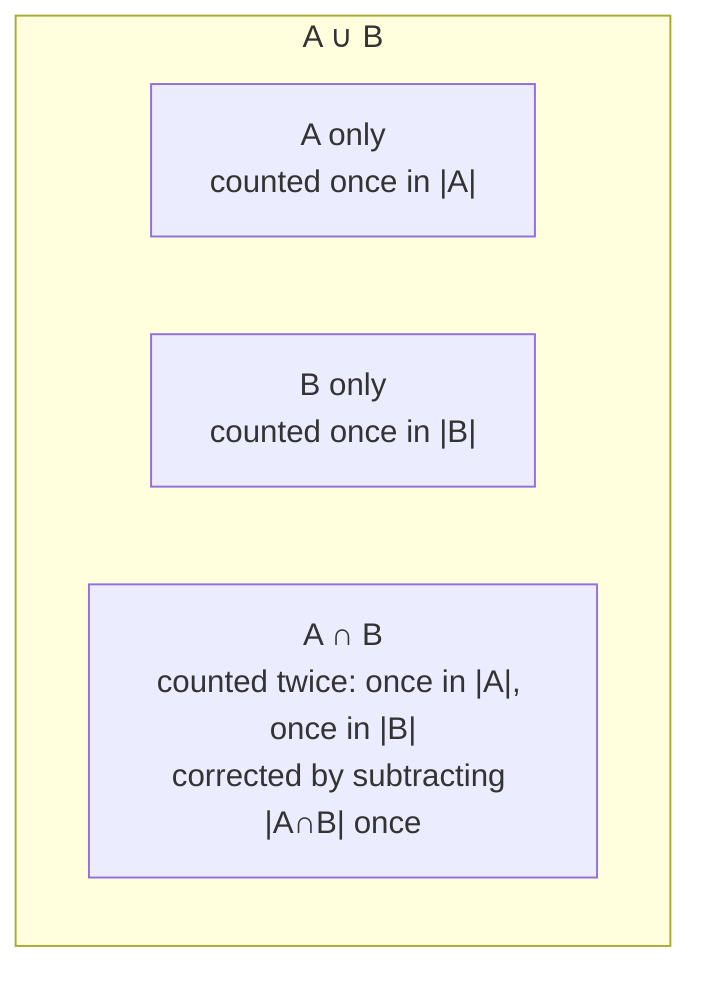

## Learning Objectives

- State the inclusion-exclusion formula for the union of two sets and three sets, and explain why naive addition over-counts.
- Derive the two-set and three-set formulas from first principles using a counting argument over set membership.
- Apply inclusion-exclusion to compute the size of a union of overlapping conditions (divisibility, forbidden properties) in a counting problem.
- Generalize the pattern to state the inclusion-exclusion formula for n sets using alternating sums over all possible intersections.
- Identify, in a proposed count, where a term has been omitted or double-counted, and correct it using the principle.

## Context & Motivation

Counting the size of a union of sets sounds like it should be as simple as adding their sizes — but the moment the sets overlap, plain addition over-counts every element that belongs to more than one set, once for each set it belongs to. The inclusion-exclusion principle is the precise, general fix for this over-counting: add the sizes of the individual sets, then subtract the sizes of their pairwise intersections (correcting for elements counted twice), then add back the sizes of their triple intersections (because the subtraction step over-corrected those), and so on, alternating sign with each deeper level of intersection. It is one of the cleanest instances in all of combinatorics of a general principle proved by a short, careful bookkeeping argument, and it resurfaces constantly: counting integers in a range divisible by at least one of several numbers, counting arrangements avoiding several types of forbidden pattern, computing probabilities of a union of overlapping events, and — closer to a computer science curriculum — analyzing the size of the union of several sets of inputs that each trigger some condition in a program's logic.

The ACM/IEEE CS2013 curriculum guidelines list inclusion-exclusion alongside basic counting as core discrete-structures content precisely because it is the tool of first resort whenever a counting problem is phrased as "how many things have property A, or property B, or property C" with overlapping properties — a phrasing that appears throughout probability, combinatorics, and number theory. Lehman, Leighton & Meyer's *Mathematics for Computer Science* develops the principle in full generality (arbitrary n, not just two or three sets) because the general alternating-sum formula, once understood, is not meaningfully harder to apply than the two-set special case — the two-set and three-set formulas below are best understood as the first two instances of one uniform pattern, not as separate rules to memorize independently.

What makes this topic pedagogically rewarding is that it forces genuine care about exactly what has been counted how many times at each stage — a skill that transfers directly to any combinatorial argument involving overlapping conditions, and a useful antidote to the common instinct to just add sizes and hope.

## Core Theory

### The two-set case

For two finite sets A and B:

|A ∪ B| = |A| + |B| − |A ∩ B|

**Derivation.** Consider any element x ∈ A ∪ B. It falls into exactly one of three mutually exclusive cases: x ∈ A only, x ∈ B only, or x ∈ A ∩ B (both). In the sum |A| + |B|, an element in "A only" is counted once (in |A|), an element in "B only" is counted once (in |B|), but an element in A ∩ B is counted **twice** — once in |A|, once in |B|. Subtracting |A ∩ B| removes exactly one of those two counts for each such element, leaving every element of A ∪ B counted exactly once. ∎



### The three-set case

For three finite sets A, B, C:

|A ∪ B ∪ C| = |A| + |B| + |C| − |A∩B| − |A∩C| − |B∩C| + |A∩B∩C|

**Derivation, by tracking multiplicity.** Take any element x ∈ A ∪ B ∪ C and check how many times it is counted at each stage of the formula, depending on which of A, B, C it belongs to.

- x in exactly one of A, B, C: counted once, in that single-set term. No pairwise or triple term includes it (it isn't in any intersection). Net count: 1. Correct.
- x in exactly two of the sets, say A and B (not C): counted once in |A|, once in |B| — net 2 so far from the single-set terms. The pairwise term −|A∩B| subtracts 1 (x is in A∩B), while −|A∩C| and −|B∩C| don't apply (x ∉ C). Net so far: 2 − 1 = 1. The triple term |A∩B∩C| doesn't apply (x ∉ C). Final net count: 1. Correct.
- x in all three A, B, C: counted once in each of |A|, |B|, |C| — net 3. All three pairwise terms apply (x is in every pairwise intersection), subtracting 3: net 3 − 3 = 0. The triple term +|A∩B∩C| adds back 1: net 0 + 1 = 1. Correct.

Every element of A ∪ B ∪ C ends up counted exactly once, regardless of how many of the three sets it belongs to. ∎ This case-by-case multiplicity check is exactly the technique that generalizes to prove the formula for any number of sets.

### The general n-set formula

For finite sets A₁, A₂, …, A_n:

|A₁ ∪ A₂ ∪ ⋯ ∪ A_n| = Σᵢ|Aᵢ| − Σᵢ<ⱼ|Aᵢ∩Aⱼ| + Σᵢ<ⱼ<ₖ|Aᵢ∩Aⱼ∩Aₖ| − ⋯ + (−1)ⁿ⁺¹|A₁∩A₂∩⋯∩A_n|

More compactly, summing over all nonempty subsets S ⊆ {1, …, n}:

|⋃ᵢAᵢ| = Σ_{∅≠S⊆{1,…,n}} (−1)^{|S|+1} |⋂_{i∈S} Aᵢ|

The pattern from the two- and three-set cases continues exactly: sum single-set sizes, subtract all pairwise intersection sizes, add back all triple intersection sizes, subtract all quadruple intersection sizes, and so on, with sign alternating as (−1)^{|S|+1} at each level of intersection depth |S|. The proof that this general formula counts every element of the union exactly once follows the identical multiplicity-tracking argument as the three-set case: an element belonging to exactly m of the n sets is counted C(m,1) − C(m,2) + C(m,3) − ⋯ ± C(m,m) times, and this alternating sum of binomial coefficients equals 1 for every m ≥ 1 (a consequence of the binomial theorem applied to (1−1)^m = 0, expanded and rearranged).

### A canonical application: counting via complementary divisibility

A frequent and highly practical use of inclusion-exclusion is counting integers in a range satisfying "divisible by at least one of" several divisors, using the fact that the count of multiples of d up to n is ⌊n/d⌋.

**Example setup.** The number of integers in {1, …, n} divisible by a, or by b, or by c, is:

⌊n/a⌋ + ⌊n/b⌋ + ⌊n/c⌋ − ⌊n/lcm(a,b)⌋ − ⌊n/lcm(a,c)⌋ − ⌊n/lcm(b,c)⌋ + ⌊n/lcm(a,b,c)⌋

using the fact that the multiples of both a and b are exactly the multiples of lcm(a,b), and similarly for the other intersections. This is the three-set formula applied directly, with A, B, C reinterpreted as "multiples of a," "multiples of b," "multiples of c."

## Worked Examples

### Example 1 — multiples of 3 or 5 up to 30

**Problem:** How many integers from 1 to 30 are divisible by 3 or by 5?

**Setup.** Let A = multiples of 3 in {1,…,30}, B = multiples of 5 in {1,…,30}. |A| = ⌊30/3⌋ = 10. |B| = ⌊30/5⌋ = 6. A ∩ B = multiples of lcm(3,5) = 15: |A∩B| = ⌊30/15⌋ = 2.

**Applying the formula.** |A ∪ B| = |A| + |B| − |A∩B| = 10 + 6 − 2 = 14.

**Verification by direct enumeration:**

```python
count = sum(1 for x in range(1, 31) if x % 3 == 0 or x % 5 == 0)
print(count)   # 14
assert count == 14
```

The two multiples of 15 (15 and 30) are exactly the elements that would have been double-counted by naively adding 10 + 6 = 16 — subtracting |A∩B| = 2 corrects this down to the true count of 14.

### Example 2 — three overlapping conditions: multiples of 2, 3, or 5 up to 100

**Problem:** How many integers from 1 to 100 are divisible by 2, 3, or 5?

**Setup.** A = multiples of 2, B = multiples of 3, C = multiples of 5, all within {1,…,100}.

|A| = ⌊100/2⌋ = 50
|B| = ⌊100/3⌋ = 33
|C| = ⌊100/5⌋ = 20
|A∩B| = ⌊100/lcm(2,3)⌋ = ⌊100/6⌋ = 16
|A∩C| = ⌊100/lcm(2,5)⌋ = ⌊100/10⌋ = 10
|B∩C| = ⌊100/lcm(3,5)⌋ = ⌊100/15⌋ = 6
|A∩B∩C| = ⌊100/lcm(2,3,5)⌋ = ⌊100/30⌋ = 3

**Applying the three-set formula:**

|A∪B∪C| = 50 + 33 + 20 − 16 − 10 − 6 + 3 = 74

**Verification:**

```python
count = sum(1 for x in range(1, 101) if x % 2 == 0 or x % 3 == 0 or x % 5 == 0)
print(count)   # 74
assert count == 74
```

Tracing one specific element illustrates the correction mechanism directly: x = 30 is divisible by all of 2, 3, and 5. It is counted once in each of |A|, |B|, |C| (net 3), subtracted once in each of |A∩B|, |A∩C|, |B∩C| (net 3 − 3 = 0), then added back once via |A∩B∩C| (net 0 + 1 = 1) — ending at exactly 1, as it must, since 30 is a single element of the union.

### Example 3 — surjections via inclusion-exclusion (a harder application)

**Problem:** How many functions from a 4-element set {1,2,3,4} to a 3-element set {a,b,c} are surjective (every element of {a,b,c} is hit by at least one element of the domain)?

**Setup.** Total functions from a 4-set to a 3-set: 3⁴ = 81 (each of the 4 domain elements independently maps to one of 3 codomain elements). A surjective function is one that is *not* missing any codomain element. Let Aₓ (for x ∈ {a,b,c}) be the set of functions that miss codomain element x entirely (map into the other two elements only). The functions that are **not** surjective are exactly A_a ∪ A_b ∪ A_c, so surjective count = 81 − |A_a ∪ A_b ∪ A_c|.

|A_a| = |A_b| = |A_c| = 2⁴ = 16 (functions into the remaining 2 elements). |A_a ∩ A_b| = functions missing both a and b, i.e., mapping everything to c alone = 1⁴ = 1, and similarly |A_a∩A_c| = |A_b∩A_c| = 1. |A_a∩A_b∩A_c| = functions missing all three, i.e., mapping nowhere = 0 (impossible, since the domain is nonempty and must map somewhere).

**Applying the three-set formula:**

|A_a∪A_b∪A_c| = 16+16+16 − 1−1−1 + 0 = 48 − 3 = 45

**Surjective count** = 81 − 45 = 36.

**Verification by direct enumeration:**

```python
from itertools import product

codomain = ['a', 'b', 'c']
count = 0
for f in product(codomain, repeat=4):
    if set(f) == set(codomain):     # every codomain element appears
        count += 1

print(count)   # 36
assert count == 36
```

This example shows inclusion-exclusion applied indirectly, through a complement — counting the "bad" (non-surjective) functions via the union of "misses element x" sets, then subtracting that union's size from the total.

## Common Misconceptions & Pitfalls

- **"|A∪B∪C| = |A|+|B|+|C| − |A∩B∩C|"** is a common but wrong shortcut — it subtracts only the triple intersection once and ignores the pairwise-only overlaps entirely. In Example 2, this wrong formula would give 50+33+20−3 = 100, far from the correct 74; the pairwise terms −16−10−6 are doing essential work that a single triple-intersection subtraction cannot replace.
- **"Once you subtract the pairwise intersections, you're done — the formula shouldn't need an 'add back' step."** The three-set derivation shows precisely why the add-back term is required: elements in all three sets are subtracted three times (once per pairwise term) after being added three times (once per single-set term), landing at net 0, not 1 — the +|A∩B∩C| term is what restores them to being counted exactly once, not an optional refinement.
- **"lcm(a,b) can be replaced by a·b when computing |A∩B| for divisibility problems."** This only holds when a and b are coprime; in general |multiples of a and b| = ⌊n / lcm(a,b)⌋, and lcm(a,b) = a·b / gcd(a,b) — using a·b directly when gcd(a,b) > 1 silently produces the wrong intersection size. (In Examples 1 and 2 above, all the pairs happened to be coprime, so lcm = product — this coincidence should not be mistaken for the general rule.)
- **"Inclusion-exclusion only applies to literal sets like multiples of a number."** Example 3 shows the principle applied to functions and the abstract property "misses a given codomain element" — the technique applies to any collection of conditions whose "satisfies condition i" sets can be sized and intersected, not just to number-theoretic divisibility.
- **"For n sets, you only need to go up to pairwise or triple intersections — deeper terms are usually negligible."** The general formula requires every level of intersection up to the full n-way intersection; dropping deeper terms is only valid when those intersections are actually empty (as with |A_a∩A_b∩A_c| = 0 in Example 3, which is a real fact about that specific problem, not a general license to truncate the formula).

## Summary

The inclusion-exclusion principle corrects the over-counting that plain addition produces when computing the size of a union of overlapping sets, by alternately subtracting and adding back the sizes of deeper intersections: |A∪B| = |A|+|B|−|A∩B| for two sets, and |A∪B∪C| = |A|+|B|+|C|−|A∩B|−|A∩C|−|B∩C|+|A∩B∩C| for three, generalizing to an alternating sum over all possible intersections for n sets. The correctness of each version is proved by tracking exactly how many times an element belonging to some fixed subset of the sets gets counted at each stage, and confirming that the alternating sum of inclusion and exclusion terms always nets to exactly 1. The technique applies directly to divisibility counting (via ⌊n/d⌋ and least common multiples), and, applied to a well-chosen complement, to harder problems such as counting surjective functions — in both cases, the discipline of the method is tracking precisely which condition's satisfaction each set represents and computing every required intersection, rather than truncating the sum early or reverting to naive addition.

## Documentation Links

- [ACM/IEEE CS2013 Curriculum Guidelines](https://www.acm.org/binaries/content/assets/education/cs2013_web_final.pdf) — doc
- [Lehman, Leighton & Meyer — Mathematics for Computer Science (full text)](https://people.csail.mit.edu/meyer/mcs.pdf) — doc
