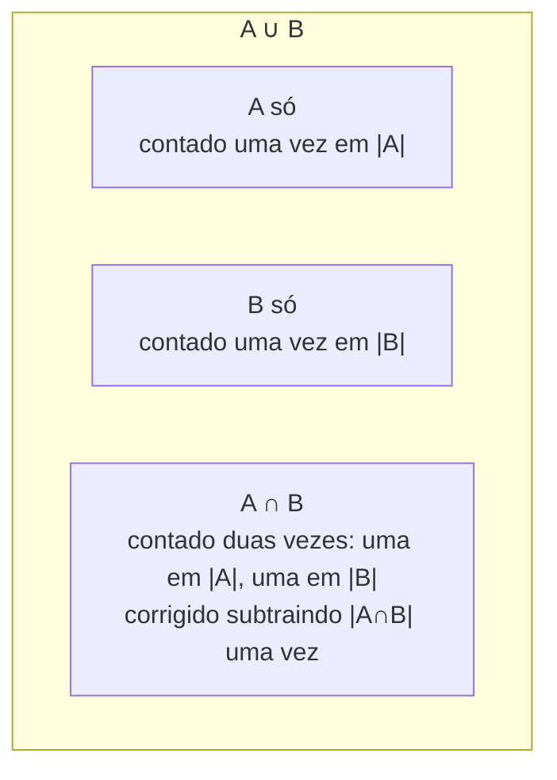

## Objetivos de Aprendizagem

- Declarar a fórmula de inclusão-exclusão para a união de dois conjuntos e de três conjuntos, e explicar por que a soma ingênua supercontam.
- Derivar as fórmulas de dois e três conjuntos a partir de princípios básicos usando um argumento de contagem sobre pertinência de conjunto.
- Aplicar inclusão-exclusão para computar o tamanho de uma união de condições sobrepostas (divisibilidade, propriedades proibidas) num problema de contagem.
- Generalizar o padrão para declarar a fórmula de inclusão-exclusão para n conjuntos usando somas alternadas sobre todas as interseções possíveis.
- Identificar, numa contagem proposta, onde um termo foi omitido ou contado duas vezes, e corrigi-la usando o princípio.

## Contexto e Motivação

Contar o tamanho de uma união de conjuntos soa como se devesse ser tão simples quanto somar seus tamanhos, mas no momento em que os conjuntos se sobrepõem, a soma simples superconta todo elemento que pertence a mais de um conjunto, uma vez para cada conjunto ao qual pertence. O princípio da inclusão-exclusão é a correção precisa e geral para essa supercontagem: some os tamanhos dos conjuntos individuais, depois subtraia os tamanhos de suas interseções aos pares (corrigindo elementos contados duas vezes), depois some de volta os tamanhos de suas interseções triplas (porque o passo de subtração supercorrigiu essas), e assim por diante, alternando o sinal a cada nível mais profundo de interseção. É uma das instâncias mais elegantes em toda a combinatória de um princípio geral provado por um argumento curto e cuidadoso de contabilidade, e ressurge constantemente: contar inteiros numa faixa divisíveis por pelo menos um de vários números, contar arranjos evitando vários tipos de padrão proibido, computar probabilidades de uma união de eventos sobrepostos, e, mais próximo de um currículo de Ciência da Computação, analisar o tamanho da união de vários conjuntos de entradas que cada uma dispara alguma condição na lógica de um programa.

As diretrizes curriculares ACM/IEEE CS2013 listam inclusão-exclusão junto com contagem básica como conteúdo central de estruturas discretas precisamente porque é a ferramenta de primeiro recurso sempre que um problema de contagem é formulado como "quantas coisas têm a propriedade A, ou a propriedade B, ou a propriedade C" com propriedades sobrepostas, uma formulação que aparece ao longo de probabilidade, combinatória e teoria dos números. Mathematics for Computer Science, de Lehman, Leighton & Meyer, desenvolve o princípio em generalidade completa (n arbitrário, não só dois ou três conjuntos) porque a fórmula geral de soma alternada, uma vez entendida, não é significativamente mais difícil de aplicar que o caso especial de dois conjuntos; as fórmulas de dois e três conjuntos abaixo são melhor entendidas como as duas primeiras instâncias de um padrão uniforme, não como regras separadas para decorar independentemente.

O que torna este tópico pedagogicamente gratificante é que ele exige cuidado genuíno sobre exatamente o que foi contado quantas vezes em cada etapa, uma habilidade que se transfere diretamente para qualquer argumento combinatório envolvendo condições sobrepostas, e um antídoto útil para o instinto comum de simplesmente somar tamanhos e esperar que dê certo.

## Teoria Central

### O caso de dois conjuntos

Para dois conjuntos finitos A e B:

|A ∪ B| = |A| + |B| − |A ∩ B|

**Derivação.** Considere qualquer elemento x ∈ A ∪ B. Ele cai em exatamente um de três casos mutuamente exclusivos: x ∈ A só, x ∈ B só, ou x ∈ A ∩ B (ambos). Na soma |A| + |B|, um elemento em "A só" é contado uma vez (em |A|), um elemento em "B só" é contado uma vez (em |B|), mas um elemento em A ∩ B é contado **duas vezes**: uma em |A|, uma em |B|. Subtrair |A ∩ B| remove exatamente uma dessas duas contagens para cada elemento assim, deixando todo elemento de A ∪ B contado exatamente uma vez. ∎



### O caso de três conjuntos

Para três conjuntos finitos A, B, C:

|A ∪ B ∪ C| = |A| + |B| + |C| − |A∩B| − |A∩C| − |B∩C| + |A∩B∩C|

**Derivação, rastreando multiplicidade.** Tome qualquer elemento x ∈ A ∪ B ∪ C e cheque quantas vezes ele é contado em cada etapa da fórmula, dependendo de a quais de A, B, C ele pertence.

- x em exatamente um de A, B, C: contado uma vez, naquele termo de conjunto único. Nenhum termo par ou triplo o inclui (não está em nenhuma interseção). Contagem líquida: 1. Correto.
- x em exatamente dois dos conjuntos, digamos A e B (não C): contado uma vez em |A|, uma vez em |B|, líquido 2 até agora dos termos de conjunto único. O termo par −|A∩B| subtrai 1 (x está em A∩B), enquanto −|A∩C| e −|B∩C| não se aplicam (x ∉ C). Líquido até agora: 2 − 1 = 1. O termo triplo |A∩B∩C| não se aplica (x ∉ C). Contagem líquida final: 1. Correto.
- x em todos os três A, B, C: contado uma vez em cada um de |A|, |B|, |C|, líquido 3. Os três termos pares se aplicam (x está em toda interseção par), subtraindo 3: líquido 3 − 3 = 0. O termo triplo +|A∩B∩C| soma 1 de volta: líquido 0 + 1 = 1. Correto.

Todo elemento de A ∪ B ∪ C acaba contado exatamente uma vez, independentemente de a quantos dos três conjuntos ele pertence. ∎ Essa checagem de multiplicidade caso a caso é exatamente a técnica que generaliza para provar a fórmula para qualquer número de conjuntos.

### A fórmula geral de n conjuntos

Para conjuntos finitos A₁, A₂, …, A_n:

|A₁ ∪ A₂ ∪ ⋯ ∪ A_n| = Σᵢ|Aᵢ| − Σᵢ<ⱼ|Aᵢ∩Aⱼ| + Σᵢ<ⱼ<ₖ|Aᵢ∩Aⱼ∩Aₖ| − ⋯ + (−1)ⁿ⁺¹|A₁∩A₂∩⋯∩A_n|

Mais compactamente, somando sobre todo subconjunto não vazio S ⊆ {1, …, n}:

|⋃ᵢAᵢ| = Σ_{∅≠S⊆{1,…,n}} (−1)^{|S|+1} |⋂_{i∈S} Aᵢ|

O padrão dos casos de dois e três conjuntos continua exatamente: some tamanhos de conjunto único, subtraia todos os tamanhos de interseção par, some de volta todos os tamanhos de interseção tripla, subtraia todos os tamanhos de interseção quádrupla, e assim por diante, com o sinal alternando como (−1)^{|S|+1} a cada nível de profundidade de interseção |S|. A prova de que essa fórmula geral conta todo elemento da união exatamente uma vez segue o argumento idêntico de rastreamento de multiplicidade do caso de três conjuntos: um elemento pertencente a exatamente m dos n conjuntos é contado C(m,1) − C(m,2) + C(m,3) − ⋯ ± C(m,m) vezes, e essa soma alternada de coeficientes binomiais é igual a 1 para todo m ≥ 1 (uma consequência do teorema binomial aplicado a (1−1)^m = 0, expandido e rearranjado).

### Uma aplicação canônica: contando via divisibilidade complementar

Um uso frequente e altamente prático de inclusão-exclusão é contar inteiros numa faixa satisfazendo "divisível por pelo menos um dos" vários divisores, usando o fato de que a contagem de múltiplos de d até n é ⌊n/d⌋.

**Configuração do exemplo.** O número de inteiros em {1, …, n} divisíveis por a, ou por b, ou por c, é:

⌊n/a⌋ + ⌊n/b⌋ + ⌊n/c⌋ − ⌊n/mmc(a,b)⌋ − ⌊n/mmc(a,c)⌋ − ⌊n/mmc(b,c)⌋ + ⌊n/mmc(a,b,c)⌋

usando o fato de que os múltiplos tanto de a quanto de b são exatamente os múltiplos de mmc(a,b), e similarmente para as outras interseções. Essa é a fórmula de três conjuntos aplicada diretamente, com A, B, C reinterpretados como "múltiplos de a", "múltiplos de b", "múltiplos de c".

## Exemplos Resolvidos

### Exemplo 1: múltiplos de 3 ou 5 até 30

**Problema:** quantos inteiros de 1 a 30 são divisíveis por 3 ou por 5?

**Configuração.** Sejam A = múltiplos de 3 em {1,…,30}, B = múltiplos de 5 em {1,…,30}. |A| = ⌊30/3⌋ = 10. |B| = ⌊30/5⌋ = 6. A ∩ B = múltiplos de mmc(3,5) = 15: |A∩B| = ⌊30/15⌋ = 2.

**Aplicando a fórmula.** |A ∪ B| = |A| + |B| − |A∩B| = 10 + 6 − 2 = 14.

**Verificação por enumeração direta:**

```python
contagem = sum(1 for x in range(1, 31) if x % 3 == 0 or x % 5 == 0)
print(contagem)   # 14
assert contagem == 14
```

Os dois múltiplos de 15 (15 e 30) são exatamente os elementos que teriam sido contados duas vezes ao somar ingenuamente 10 + 6 = 16; subtrair |A∩B| = 2 corrige isso para a contagem verdadeira de 14.

### Exemplo 2: três condições sobrepostas: múltiplos de 2, 3 ou 5 até 100

**Problema:** quantos inteiros de 1 a 100 são divisíveis por 2, 3 ou 5?

**Configuração.** A = múltiplos de 2, B = múltiplos de 3, C = múltiplos de 5, todos dentro de {1,…,100}.

|A| = ⌊100/2⌋ = 50
|B| = ⌊100/3⌋ = 33
|C| = ⌊100/5⌋ = 20
|A∩B| = ⌊100/mmc(2,3)⌋ = ⌊100/6⌋ = 16
|A∩C| = ⌊100/mmc(2,5)⌋ = ⌊100/10⌋ = 10
|B∩C| = ⌊100/mmc(3,5)⌋ = ⌊100/15⌋ = 6
|A∩B∩C| = ⌊100/mmc(2,3,5)⌋ = ⌊100/30⌋ = 3

**Aplicando a fórmula de três conjuntos:**

|A∪B∪C| = 50 + 33 + 20 − 16 − 10 − 6 + 3 = 74

**Verificação:**

```python
contagem = sum(1 for x in range(1, 101) if x % 2 == 0 or x % 3 == 0 or x % 5 == 0)
print(contagem)   # 74
assert contagem == 74
```

Rastrear um elemento específico ilustra o mecanismo de correção diretamente: x = 30 é divisível por 2, 3 e 5. É contado uma vez em cada um de |A|, |B|, |C| (líquido 3), subtraído uma vez em cada um de |A∩B|, |A∩C|, |B∩C| (líquido 3 − 3 = 0), depois somado de volta uma vez via |A∩B∩C| (líquido 0 + 1 = 1), terminando em exatamente 1, como precisa ser, já que 30 é um único elemento da união.

### Exemplo 3: sobrejeções via inclusão-exclusão (uma aplicação mais difícil)

**Problema:** quantas funções de um conjunto de 4 elementos {1,2,3,4} para um conjunto de 3 elementos {a,b,c} são sobrejetoras (todo elemento de {a,b,c} é atingido por pelo menos um elemento do domínio)?

**Configuração.** Funções totais de um conjunto de 4 para um de 3: 3⁴ = 81 (cada um dos 4 elementos do domínio independentemente mapeia para um dos 3 elementos do contradomínio). Uma função sobrejetora é uma que *não* deixa faltar nenhum elemento do contradomínio. Seja Aₓ (para x ∈ {a,b,c}) o conjunto das funções que perdem completamente o elemento do contradomínio x (mapeiam só para os outros dois elementos). As funções que **não** são sobrejetoras são exatamente A_a ∪ A_b ∪ A_c, então contagem sobrejetora = 81 − |A_a ∪ A_b ∪ A_c|.

|A_a| = |A_b| = |A_c| = 2⁴ = 16 (funções para os 2 elementos restantes). |A_a ∩ A_b| = funções perdendo tanto a quanto b, ou seja, mapeando tudo só para c = 1⁴ = 1, e similarmente |A_a∩A_c| = |A_b∩A_c| = 1. |A_a∩A_b∩A_c| = funções perdendo todos os três, ou seja, não mapeando para lugar nenhum = 0 (impossível, já que o domínio é não vazio e precisa mapear para algum lugar).

**Aplicando a fórmula de três conjuntos:**

|A_a∪A_b∪A_c| = 16+16+16 − 1−1−1 + 0 = 48 − 3 = 45

**Contagem sobrejetora** = 81 − 45 = 36.

**Verificação por enumeração direta:**

```python
from itertools import product

contradominio = ['a', 'b', 'c']
contagem = 0
for f in product(contradominio, repeat=4):
    if set(f) == set(contradominio):     # todo elemento do contradomínio aparece
        contagem += 1

print(contagem)   # 36
assert contagem == 36
```

Este exemplo mostra inclusão-exclusão aplicada indiretamente, através de um complemento: contando as funções "ruins" (não sobrejetoras) via a união dos conjuntos "perde o elemento x", depois subtraindo o tamanho dessa união do total.

## Equívocos Comuns e Armadilhas

- **"|A∪B∪C| = |A|+|B|+|C| − |A∩B∩C|"** é um atalho comum mas errado; subtrai só a interseção tripla uma vez e ignora completamente as sobreposições só-par. No Exemplo 2, essa fórmula errada daria 50+33+20−3 = 100, longe do correto 74; os termos pares −16−10−6 estão fazendo trabalho essencial que uma única subtração de interseção tripla não consegue substituir.
- **"Uma vez que você subtrai as interseções pares, terminou, a fórmula não deveria precisar de um passo de 'somar de volta'."** A derivação de três conjuntos mostra precisamente por que o termo de somar de volta é necessário: elementos em todos os três conjuntos são subtraídos três vezes (uma por termo par) depois de serem somados três vezes (uma por termo de conjunto único), pousando em líquido 0, não 1; o termo +|A∩B∩C| é o que os restaura a serem contados exatamente uma vez, não um refinamento opcional.
- **"mmc(a,b) pode ser substituído por a·b ao computar |A∩B| para problemas de divisibilidade."** Isso só vale quando a e b são coprimos; em geral |múltiplos de a e b| = ⌊n / mmc(a,b)⌋, e mmc(a,b) = a·b / mdc(a,b); usar a·b diretamente quando mdc(a,b) > 1 produz silenciosamente o tamanho de interseção errado. (Nos Exemplos 1 e 2 acima, todos os pares aconteceram de ser coprimos, então mmc = produto; essa coincidência não deve ser confundida com a regra geral.)
- **"Inclusão-exclusão só se aplica a conjuntos literais como múltiplos de um número."** O Exemplo 3 mostra o princípio aplicado a funções e à propriedade abstrata "perde um dado elemento do contradomínio"; a técnica se aplica a qualquer coleção de condições cujos conjuntos "satisfaz a condição i" possam ter tamanho e ser intersectados, não só a divisibilidade em teoria dos números.
- **"Para n conjuntos, você só precisa ir até interseções pares ou triplas, termos mais profundos costumam ser desprezíveis."** A fórmula geral exige todo nível de interseção até a interseção de n vias completa; descartar termos mais profundos só é válido quando essas interseções são de fato vazias (como com |A_a∩A_b∩A_c| = 0 no Exemplo 3, que é um fato real sobre aquele problema específico, não uma licença geral para truncar a fórmula).

## Resumo

O princípio da inclusão-exclusão corrige a supercontagem que a soma simples produz ao computar o tamanho de uma união de conjuntos sobrepostos, alternadamente subtraindo e somando de volta os tamanhos de interseções mais profundas: |A∪B| = |A|+|B|−|A∩B| para dois conjuntos, e |A∪B∪C| = |A|+|B|+|C|−|A∩B|−|A∩C|−|B∩C|+|A∩B∩C| para três, generalizando para uma soma alternada sobre todas as interseções possíveis para n conjuntos. A corretude de cada versão é provada rastreando exatamente quantas vezes um elemento pertencente a algum subconjunto fixo dos conjuntos é contado em cada etapa, e confirmando que a soma alternada de termos de inclusão e exclusão sempre resulta em exatamente 1. A técnica se aplica diretamente à contagem de divisibilidade (via ⌊n/d⌋ e mínimos múltiplos comuns), e, aplicada a um complemento bem escolhido, a problemas mais difíceis como contar funções sobrejetoras; nos dois casos, a disciplina do método é rastrear precisamente qual satisfação de condição cada conjunto representa e computar toda interseção exigida, em vez de truncar a soma cedo ou reverter para soma ingênua.

## Documentation Links

- [ACM/IEEE CS2013 Curriculum Guidelines](https://www.acm.org/binaries/content/assets/education/cs2013_web_final.pdf) — doc
- [Lehman, Leighton & Meyer — Mathematics for Computer Science (full text)](https://people.csail.mit.edu/meyer/mcs.pdf) — doc
