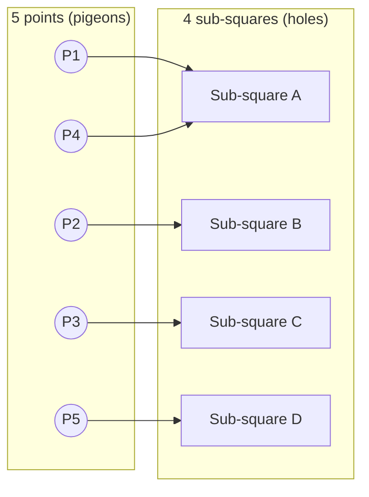

## Learning Objectives

- Explain the pigeonhole principle in both its basic and generalized forms, and state precisely what hypotheses are required for each.
- Identify, given a counting problem, what should play the role of "pigeons" and what should play the role of "holes" in order to apply the principle.
- Prove simple existence results (a repeated value, a repeated remainder, a repeated pair) using the pigeonhole principle rather than direct construction.
- Apply the generalized pigeonhole principle to derive a numeric guarantee (at least ⌈n/k⌉ pigeons in some hole) from a counting setup.
- Distinguish a valid pigeonhole argument from a plausible-looking but invalid one, by checking that the "holes" are genuinely fixed in number and mutually exclusive.

## Context & Motivation

The pigeonhole principle is disarmingly simple to state — if you place more than n items into n containers, at least one container ends up holding more than one item — and yet it belongs to a very small class of ideas in discrete mathematics that let you *prove something exists* without ever having to construct it or find where it is. This is exactly the kind of proof technique students underestimate the first time they see it, because the statement itself seems almost too obvious to be called a theorem. The power only becomes visible once you start using it to answer questions that otherwise look like they require exhaustive search: does some pair of people at a party of size n necessarily know the same number of other people? Must two of the first 27 English words that begin with the same two letters exist somewhere in a long enough text? Does some sequence of measurements necessarily repeat a value modulo some fixed number? In every one of these, the honest answer to "how would I find the repeated item?" is "I have no idea where it is, but I can guarantee it's there" — and that guarantee is precisely what pigeonhole proofs deliver.

This is also a foundational example, often one of the very first non-constructive proofs a student meets, of a broader theme that runs throughout discrete mathematics and theoretical computer science: existence proofs by counting. Stanford's CS103 (Mathematical Foundations of Computing) introduces the pigeonhole principle early for exactly this reason — it is a template for an entire family of arguments in which you never build the object you're claiming exists, you only show that there is *no room* for it not to exist. The same counting logic reappears, dressed differently, in hashing (a hash table with more keys than buckets is guaranteed to have a collision somewhere), in the analysis of algorithms bounded by a finite number of states, and in number theory (a sequence of remainders modulo m must eventually repeat, because there are only m possible remainders). Lehman, Leighton & Meyer's *Mathematics for Computer Science* (the MIT 6.042 text) devotes real space to this principle precisely because computer science is full of situations with a large, possibly unbounded, number of "pigeons" being funneled through a small, fixed number of "holes" — finite memory, finite states, finite buckets — and the guarantee that something must collide is often the entire content of the argument that follows.

What makes the principle genuinely subtle in practice, despite the simplicity of its statement, is recognizing the right pigeons and the right holes in an unfamiliar problem. The principle itself is a one-line piece of arithmetic; the actual mathematical work in any pigeonhole proof is almost always in setting up that correspondence correctly, and this course will spend real effort on exactly that skill.

## Core Theory

### The basic pigeonhole principle

**Statement.** If n + 1 or more objects (the "pigeons") are placed into n containers (the "holes"), then at least one container holds two or more objects.

**Proof (by contradiction).** Suppose, for the sake of contradiction, that every one of the n containers holds at most one object. Then the total number of objects placed is at most n · 1 = n. But n + 1 objects were placed, and n + 1 > n. This contradicts the assumption that n + 1 objects were actually placed into the containers. Hence the assumption that every container holds at most one object must be false — at least one container holds ≥ 2 objects. ∎

This proof is worth reading closely precisely because of how little it uses: no property of the objects, no property of the containers beyond there being exactly n of them, nothing about *which* container ends up overloaded. That total absence of structure is exactly what makes the principle apply so broadly — it works regardless of what the pigeons and holes actually represent.

### The generalized pigeonhole principle

The basic version only guarantees *some* container gets more than one object. Often a stronger, quantitative guarantee is needed.

**Statement.** If n objects are placed into k containers, then at least one container holds at least ⌈n/k⌉ objects, where ⌈·⌉ denotes the ceiling function (round up to the nearest integer).

**Proof (by contradiction).** Suppose every container holds strictly fewer than ⌈n/k⌉ objects, i.e., at most ⌈n/k⌉ − 1 objects. Then the total number of objects is at most

k · (⌈n/k⌉ − 1)

Since ⌈n/k⌉ − 1 < n/k, this total is strictly less than k · (n/k) = n. But n objects were placed — contradiction. Hence some container holds at least ⌈n/k⌉ objects. ∎

The basic principle is the special case k = n: with n + 1 objects into n containers, ⌈(n+1)/n⌉ = 2, recovering "some container holds at least 2."

### Recognizing pigeons and holes

The entire difficulty of applying this principle in a new setting is choosing what plays the two roles. A short checklist that resolves most cases:

- The **holes** must be a *fixed, finite* number of mutually exclusive categories that every pigeon is guaranteed to fall into exactly one of.
- The **pigeons** must be the objects being counted, and there must be *more* pigeons than holes (or, for the generalized form, a known total n against a known k).
- The mapping "pigeon → hole" should come from some property of the pigeon itself (its remainder mod m, its first two letters, its number of acquaintances), not from an arbitrary or externally chosen assignment.

For instance, in "any 5 points chosen inside a unit square, some two are within distance √2/2 of each other," the *holes* are four ¹⁄₂ × ¹⁄₂ sub-squares obtained by quartering the unit square, and the *pigeons* are the 5 points; each point falls in some sub-square (ties broken by convention), and 5 points into 4 sub-squares forces two points into the same sub-square, whose diagonal is √2/2 — bounding the distance between those two points.



Here sub-square A receives both P1 and P4 — the pigeonhole principle guarantees some such collision exists among the 5 mappings, even though nothing in the argument had to specify in advance *which* sub-square would be the crowded one.

### A stronger form: pigeonhole with structured containers

A useful variant arises when the containers themselves are indexed by remainders. **Claim:** among any n + 1 integers, two have the same remainder when divided by n. Proof: there are exactly n possible remainders (0, 1, …, n − 1) — the "holes" — and n + 1 integers — the "pigeons." By the basic principle, two integers share a remainder. This single fact underlies, among other things, the proof that any sequence of more than n consecutive Fibonacci numbers taken modulo n must eventually cycle (the Pisano period), since the *pair* of consecutive remainders (rₖ, rₖ₊₁) can only take n² distinct values, so among the first n² + 1 pairs, some pair of consecutive remainders repeats, and the deterministic recurrence forces the entire sequence to repeat from there on.

## Worked Examples

### Example 1 — same number of acquaintances at a party

**Problem:** At a party of n ≥ 2 people, "knowing" is a symmetric relation (if A knows B, then B knows A) and nobody knows themselves. Prove that at least two people at the party know exactly the same number of other people.

**Setup.** Each person's number of acquaintances (their "degree") can be any integer from 0 to n − 1, since a person knows at most all n − 1 others. That looks at first like n possible values (holes) for n people (pigeons) — no guaranteed collision yet.

**The key observation.** The values 0 and n − 1 cannot *both* occur among the n people. If some person X knows all n − 1 others (degree n − 1), then every other person knows at least X, so nobody can have degree 0. Conversely, if some person Y knows nobody (degree 0), then nobody can know all n − 1 others, since everyone fails to know Y. So the possible degree values actually available are either {0, 1, …, n − 2} or {1, 2, …, n − 1} — in either case, only n − 1 possible values.

**Applying the principle.** Now there are n people (pigeons) and only n − 1 possible degree values (holes). By the basic pigeonhole principle, two people must share the same degree. ∎

This example is the standard illustration of the principle's subtlety: the naive hole count (n possible degrees) does not force a collision, and the actual content of the proof is the extra argument that shrinks the hole count to n − 1.

### Example 2 — a subset with a divisibility relationship

**Problem:** Prove that any subset S of {1, 2, …, 2n} with |S| = n + 1 elements contains two distinct elements a, b such that a divides b.

**Setup.** Every positive integer m can be written uniquely as m = 2^k · q, where q is odd. Call q the *odd part* of m. Among {1, 2, …, 2n}, the odd part of any element is one of the n odd numbers 1, 3, 5, …, 2n − 1 — exactly n possible odd parts.

**Applying the principle.** The n + 1 elements of S (pigeons) each have an odd part drawn from these n possible values (holes). By the basic pigeonhole principle, two distinct elements a, b ∈ S share the same odd part q, so a = 2^i · q and b = 2^j · q for some i ≠ j. Without loss of generality i < j, so a = 2^i · q divides b = 2^j · q = 2^(j−i) · a. ∎

**Sanity check by brute enumeration (n = 4, so S ⊆ {1,…,8} with |S| = 5):**

```python
from itertools import combinations

universe = range(1, 9)          # {1, ..., 2n} with n = 4
n_plus_1 = 5

for S in combinations(universe, n_plus_1):
    found = any(a != b and b % a == 0 for a in S for b in S)
    assert found, f"counterexample found: {S}"

print("checked every 5-element subset of {1,...,8}: a divides b pair always exists")
```

Running this over all C(8,5) = 56 subsets confirms no counterexample exists — consistent with, though of course not a substitute for, the proof above.

### Example 3 — a repeated sum in a sequence

**Problem:** Given any 6 distinct integers chosen from {1, 2, …, 10}, prove that some two of them sum to 11.

**Setup.** Partition {1, …, 10} into the 5 pairs {1,10}, {2,9}, {3,8}, {4,7}, {5,6} — each pair sums to 11, and every element of {1,…,10} belongs to exactly one pair. These 5 pairs are the holes.

**Applying the principle.** The 6 chosen integers (pigeons) are distributed among these 5 pairs (holes), one pair per integer according to which pair it belongs to. By the basic pigeonhole principle, two of the 6 chosen integers fall into the same pair — and since that pair's two members are exactly the two numbers summing to 11, and the 6 integers are distinct, those two chosen integers must be exactly that pair's two members. Hence some two of the chosen integers sum to 11. ∎

## Common Misconceptions & Pitfalls

- **"The principle tells you which container is overloaded."** It does not — it only guarantees existence, not location. In Example 1, the proof never identifies *which* two people share a degree, only that some pair must. Treating a pigeonhole proof as constructive is a common misreading of what the theorem actually asserts.
- **"As long as there are 'more things than categories,' pigeonhole applies."** The categories must be fixed in advance and mutually exclusive, covering every pigeon exactly once. A frequent error is choosing holes that overlap (an object could belong to more than one) or that don't cover every pigeon — both break the counting argument that the proof by contradiction depends on. In Example 1, the naive holes {0, 1, …, n−1} are mutually exclusive and covering, but with n holes for n pigeons there is no forced collision — the whole difficulty of that problem was tightening the hole count to n − 1, not merely noticing "n things, n categories."
- **"⌈n/k⌉ rounds the wrong way, so I'll just use n/k."** The generalized principle needs the *ceiling*, not the plain quotient. With 10 pigeons and 3 holes, n/k = 3.33, and it is tempting to conclude "at least 3 in some hole" — true, but the ceiling gives the tight guarantee ⌈10/3⌉ = 4, and indeed 10 objects into 3 holes cannot avoid some hole reaching 4 (3+3+3 = 9 < 10). Using the floor or truncated quotient systematically under-states the guarantee.
- **"If pigeonhole doesn't immediately apply, the statement must be false."** Often a direct application of the basic principle fails only because the natural hole count is too generous (as in Example 1); the fix is almost always a sharper argument that reduces the number of holes or reclassifies the pigeons, not abandoning the technique.

## Summary

The pigeonhole principle states that n + 1 objects distributed among n containers force some container to hold at least two objects, and its generalized form sharpens this to a guarantee of at least ⌈n/k⌉ objects in some container when n objects fill k containers. Both versions are proved by a short argument by contradiction: assuming no container is overloaded forces a total count strictly less than the actual number of objects placed. The technique's real difficulty, and its real teaching value, lies not in the one-line arithmetic but in correctly identifying what plays the role of pigeons and what plays the role of holes in an unfamiliar problem — often requiring an auxiliary argument (shared degree bounds, odd parts, complementary pairs) to get the hole count down to something that forces the desired collision. As a non-constructive existence proof — one that guarantees an object exists without ever locating it — the pigeonhole principle is a template used throughout discrete mathematics and computer science, from collision guarantees in fixed-size hash tables to eventual repetition in any process with finitely many possible states.

## Documentation Links

- [Stanford CS103 — Mathematical Foundations of Computing](https://web.stanford.edu/class/cs103/) — doc
- [Lehman, Leighton & Meyer — Mathematics for Computer Science (full text)](https://people.csail.mit.edu/meyer/mcs.pdf) — doc
