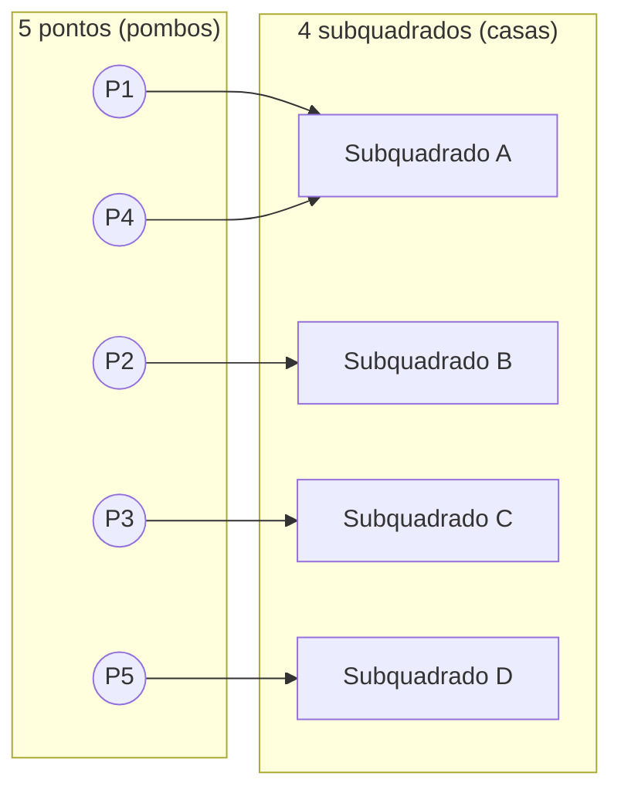

## Objetivos de Aprendizagem

- Explicar o princípio da casa dos pombos em suas formas básica e generalizada, e declarar com precisão quais hipóteses cada uma exige.
- Identificar, dado um problema de contagem, o que deve fazer o papel de "pombos" e o que deve fazer o papel de "casas" para aplicar o princípio.
- Provar resultados de existência simples (um valor repetido, um resto repetido, um par repetido) usando o princípio da casa dos pombos em vez de construção direta.
- Aplicar o princípio generalizado da casa dos pombos para derivar uma garantia numérica (pelo menos ⌈n/k⌉ pombos em alguma casa) a partir de uma configuração de contagem.
- Distinguir um argumento de casa dos pombos válido de um que parece plausível mas é inválido, checando se as "casas" são de fato fixas em número e mutuamente exclusivas.

## Contexto e Motivação

O princípio da casa dos pombos é desarmantemente simples de enunciar (se você colocar mais de n itens em n recipientes, pelo menos um recipiente acaba segurando mais de um item) e, ainda assim, pertence a uma classe muito pequena de ideias na matemática discreta que permitem *provar que algo existe* sem nunca precisar construí-lo ou achar onde está. É exatamente o tipo de técnica de prova que alunos subestimam na primeira vez que a veem, porque a afirmação em si parece quase óbvia demais para ser chamada de teorema. O poder só fica visível quando você começa a usá-la para responder perguntas que de outra forma parecem exigir busca exaustiva: algum par de pessoas numa festa de tamanho n necessariamente conhece o mesmo número de outras pessoas? Duas das primeiras 27 palavras em português que começam com as mesmas duas letras precisam existir em algum lugar de um texto longo o bastante? Alguma sequência de medições necessariamente repete um valor módulo algum número fixo? Em cada um desses casos, a resposta honesta para "como eu acharia o item repetido?" é "não faço ideia de onde está, mas posso garantir que está lá", e essa garantia é precisamente o que provas de casa dos pombos entregam.

Esse também é um exemplo fundacional, muitas vezes uma das primeiríssimas provas não construtivas que um aluno encontra, de um tema mais amplo que percorre a matemática discreta e a Ciência da Computação teórica: provas de existência por contagem. O CS103 de Stanford (Mathematical Foundations of Computing) introduz o princípio da casa dos pombos cedo exatamente por essa razão: é um molde para uma família inteira de argumentos nos quais você nunca constrói o objeto que está afirmando existir, você só mostra que não há *espaço* para ele não existir. A mesma lógica de contagem reaparece, vestida diferente, em hashing (uma tabela hash com mais chaves que buckets é garantida a ter uma colisão em algum lugar), na análise de algoritmos limitados por um número finito de estados, e em teoria dos números (uma sequência de restos módulo m precisa eventualmente repetir, porque só existem m restos possíveis). Mathematics for Computer Science, de Lehman, Leighton & Meyer (o texto do 6.042 do MIT), dedica espaço de verdade a esse princípio precisamente porque a Ciência da Computação está cheia de situações com um número grande, possivelmente sem limite, de "pombos" sendo canalizados por um número pequeno e fixo de "casas" (memória finita, estados finitos, buckets finitos), e a garantia de que algo precisa colidir é muitas vezes o conteúdo inteiro do argumento que segue.

O que torna o princípio genuinamente sutil na prática, apesar da simplicidade de seu enunciado, é reconhecer os pombos certos e as casas certas num problema desconhecido. O princípio em si é uma conta de uma linha; o trabalho matemático de fato em qualquer prova de casa dos pombos está quase sempre em montar essa correspondência corretamente, e este curso vai dedicar esforço de verdade exatamente a essa habilidade.

## Teoria Central

### O princípio básico da casa dos pombos

**Enunciado.** Se n + 1 ou mais objetos (os "pombos") são colocados em n recipientes (as "casas"), então pelo menos um recipiente segura dois ou mais objetos.

**Prova (por contradição).** Suponha, para efeito de contradição, que cada um dos n recipientes segura no máximo um objeto. Então o número total de objetos colocados é no máximo n · 1 = n. Mas n + 1 objetos foram colocados, e n + 1 > n. Isso contradiz a suposição de que n + 1 objetos foram de fato colocados nos recipientes. Logo a suposição de que todo recipiente segura no máximo um objeto precisa ser falsa: pelo menos um recipiente segura ≥ 2 objetos. ∎

Essa prova vale a pena ler com cuidado precisamente por quão pouco ela usa: nenhuma propriedade dos objetos, nenhuma propriedade dos recipientes além de existirem exatamente n deles, nada sobre *qual* recipiente acaba sobrecarregado. Essa ausência total de estrutura é exatamente o que faz o princípio se aplicar tão amplamente: ele funciona independentemente do que pombos e casas de fato representam.

### O princípio generalizado da casa dos pombos

A versão básica só garante que *algum* recipiente recebe mais de um objeto. Muitas vezes uma garantia mais forte e quantitativa é necessária.

**Enunciado.** Se n objetos são colocados em k recipientes, então pelo menos um recipiente segura pelo menos ⌈n/k⌉ objetos, onde ⌈·⌉ denota a função teto (arredondar pra cima até o inteiro mais próximo).

**Prova (por contradição).** Suponha que todo recipiente segura estritamente menos que ⌈n/k⌉ objetos, isto é, no máximo ⌈n/k⌉ − 1 objetos. Então o número total de objetos é no máximo

k · (⌈n/k⌉ − 1)

Como ⌈n/k⌉ − 1 < n/k, esse total é estritamente menor que k · (n/k) = n. Mas n objetos foram colocados, contradição. Logo algum recipiente segura pelo menos ⌈n/k⌉ objetos. ∎

O princípio básico é o caso especial k = n: com n + 1 objetos em n recipientes, ⌈(n+1)/n⌉ = 2, recuperando "algum recipiente segura pelo menos 2".

### Reconhecendo pombos e casas

Toda a dificuldade de aplicar esse princípio numa situação nova é escolher o que desempenha os dois papéis. Uma checklist curta que resolve a maioria dos casos:

- As **casas** precisam ser um número *fixo e finito* de categorias mutuamente exclusivas nas quais todo pombo é garantido a cair em exatamente uma.
- Os **pombos** precisam ser os objetos sendo contados, e precisa haver *mais* pombos que casas (ou, para a forma generalizada, um total conhecido n contra um k conhecido).
- O mapeamento "pombo → casa" deveria vir de alguma propriedade do próprio pombo (seu resto mod m, suas duas primeiras letras, seu número de conhecidos), não de uma atribuição arbitrária ou escolhida externamente.

Por exemplo, em "dados quaisquer 5 pontos escolhidos dentro de um quadrado unitário, algum par está a uma distância de √2/2 um do outro", as *casas* são quatro subquadrados ¹⁄₂ × ¹⁄₂ obtidos dividindo o quadrado unitário em quatro, e os *pombos* são os 5 pontos; cada ponto cai em algum subquadrado (empates resolvidos por convenção), e 5 pontos em 4 subquadrados forçam dois pontos no mesmo subquadrado, cuja diagonal é √2/2, limitando a distância entre esses dois pontos.



Aqui o subquadrado A recebe tanto P1 quanto P4: o princípio da casa dos pombos garante que alguma colisão assim existe entre os 5 mapeamentos, mesmo que nada no argumento tivesse que especificar de antemão *qual* subquadrado seria o lotado.

### Uma forma mais forte: casa dos pombos com recipientes estruturados

Uma variante útil surge quando os próprios recipientes são indexados por restos. **Afirmação:** entre quaisquer n + 1 inteiros, dois têm o mesmo resto ao serem divididos por n. Prova: existem exatamente n restos possíveis (0, 1, …, n − 1), as "casas", e n + 1 inteiros, os "pombos". Pelo princípio básico, dois inteiros compartilham um resto. Esse fato único sustenta, entre outras coisas, a prova de que qualquer sequência de mais de n números de Fibonacci consecutivos tomados módulo n precisa eventualmente ciclar (o período de Pisano), já que o *par* de restos consecutivos (rₖ, rₖ₊₁) só pode assumir n² valores distintos, então entre os primeiros n² + 1 pares, algum par de restos consecutivos se repete, e a recorrência determinística força a sequência inteira a se repetir a partir dali.

## Exemplos Resolvidos

### Exemplo 1: o mesmo número de conhecidos numa festa

**Problema:** numa festa com n ≥ 2 pessoas, "conhecer" é uma relação simétrica (se A conhece B, então B conhece A) e ninguém conhece a si mesmo. Prove que pelo menos duas pessoas na festa conhecem exatamente o mesmo número de outras pessoas.

**Configuração.** O número de conhecidos de cada pessoa (seu "grau") pode ser qualquer inteiro de 0 a n − 1, já que uma pessoa conhece no máximo todas as outras n − 1. Isso parece à primeira vista n valores possíveis (casas) para n pessoas (pombos), ainda sem colisão garantida.

**A observação-chave.** Os valores 0 e n − 1 não podem *ambos* ocorrer entre as n pessoas. Se alguma pessoa X conhece todas as outras n − 1 (grau n − 1), então toda outra pessoa conhece pelo menos X, então ninguém pode ter grau 0. Reciprocamente, se alguma pessoa Y não conhece ninguém (grau 0), então ninguém pode conhecer todas as outras n − 1, já que todo mundo falha em conhecer Y. Então os valores de grau de fato disponíveis são {0, 1, …, n − 2} ou {1, 2, …, n − 1}, em qualquer um dos casos, só n − 1 valores possíveis.

**Aplicando o princípio.** Agora existem n pessoas (pombos) e só n − 1 valores de grau possíveis (casas). Pelo princípio básico da casa dos pombos, duas pessoas precisam compartilhar o mesmo grau. ∎

Este exemplo é a ilustração padrão da sutileza do princípio: a contagem ingênua de casas (n graus possíveis) não força uma colisão, e o conteúdo real da prova é o argumento extra que encolhe a contagem de casas para n − 1.

### Exemplo 2: um subconjunto com uma relação de divisibilidade

**Problema:** prove que qualquer subconjunto S de {1, 2, …, 2n} com |S| = n + 1 elementos contém dois elementos distintos a, b tais que a divide b.

**Configuração.** Todo inteiro positivo m pode ser escrito de forma única como m = 2^k · q, onde q é ímpar. Chame q de *parte ímpar* de m. Entre {1, 2, …, 2n}, a parte ímpar de qualquer elemento é um dos n números ímpares 1, 3, 5, …, 2n − 1, exatamente n partes ímpares possíveis.

**Aplicando o princípio.** Os n + 1 elementos de S (pombos) cada um tem uma parte ímpar tirada desses n valores possíveis (casas). Pelo princípio básico da casa dos pombos, dois elementos distintos a, b ∈ S compartilham a mesma parte ímpar q, então a = 2^i · q e b = 2^j · q para algum i ≠ j. Sem perda de generalidade i < j, então a = 2^i · q divide b = 2^j · q = 2^(j−i) · a. ∎

**Checagem de sanidade por enumeração por força bruta (n = 4, então S ⊆ {1,…,8} com |S| = 5):**

```python
from itertools import combinations

universo = range(1, 9)          # {1, ..., 2n} com n = 4
n_mais_1 = 5

for S in combinations(universo, n_mais_1):
    encontrado = any(a != b and b % a == 0 for a in S for b in S)
    assert encontrado, f"contraexemplo encontrado: {S}"

print("checado todo subconjunto de 5 elementos de {1,...,8}: par a divide b sempre existe")
```

Rodar isso sobre todos os C(8,5) = 56 subconjuntos confirma que nenhum contraexemplo existe, consistente com, embora claro não seja um substituto para, a prova acima.

### Exemplo 3: uma soma repetida numa sequência

**Problema:** dados quaisquer 6 inteiros distintos escolhidos de {1, 2, …, 10}, prove que algum par deles soma 11.

**Configuração.** Particione {1, …, 10} nos 5 pares {1,10}, {2,9}, {3,8}, {4,7}, {5,6}, cada par soma 11, e todo elemento de {1,…,10} pertence a exatamente um par. Esses 5 pares são as casas.

**Aplicando o princípio.** Os 6 inteiros escolhidos (pombos) são distribuídos entre esses 5 pares (casas), um par por inteiro de acordo com a qual par ele pertence. Pelo princípio básico da casa dos pombos, dois dos 6 inteiros escolhidos caem no mesmo par, e como os dois membros daquele par são exatamente os dois números que somam 11, e os 6 inteiros são distintos, esses dois inteiros escolhidos precisam ser exatamente os dois membros daquele par. Logo algum par dos inteiros escolhidos soma 11. ∎

## Equívocos Comuns e Armadilhas

- **"O princípio diz qual recipiente está sobrecarregado."** Não diz; só garante existência, não localização. No Exemplo 1, a prova nunca identifica *quais* duas pessoas compartilham um grau, só que algum par precisa existir. Tratar uma prova de casa dos pombos como construtiva é uma leitura equivocada comum do que o teorema de fato afirma.
- **"Enquanto houver 'mais coisas que categorias', a casa dos pombos se aplica."** As categorias precisam ser fixadas de antemão e mutuamente exclusivas, cobrindo todo pombo exatamente uma vez. Um erro frequente é escolher casas que se sobrepõem (um objeto poderia pertencer a mais de uma) ou que não cobrem todo pombo; ambos quebram o argumento de contagem do qual a prova por contradição depende. No Exemplo 1, as casas ingênuas {0, 1, …, n−1} são mutuamente exclusivas e cobrem tudo, mas com n casas para n pombos não há colisão forçada; toda a dificuldade daquele problema foi apertar a contagem de casas para n − 1, não meramente notar "n coisas, n categorias".
- **"⌈n/k⌉ arredonda pro lado errado, então vou só usar n/k."** O princípio generalizado precisa do *teto*, não do quociente puro. Com 10 pombos e 3 casas, n/k = 3,33, e é tentador concluir "pelo menos 3 em alguma casa", verdadeiro, mas o teto dá a garantia apertada ⌈10/3⌉ = 4, e de fato 10 objetos em 3 casas não conseguem evitar que alguma casa chegue a 4 (3+3+3 = 9 < 10). Usar o piso ou o quociente truncado subestima sistematicamente a garantia.
- **"Se a casa dos pombos não se aplica imediatamente, a afirmação deve ser falsa."** Muitas vezes uma aplicação direta do princípio básico falha só porque a contagem natural de casas é generosa demais (como no Exemplo 1); a correção quase sempre é um argumento mais afiado que reduz o número de casas ou reclassifica os pombos, não abandonar a técnica.

## Resumo

O princípio da casa dos pombos afirma que n + 1 objetos distribuídos entre n recipientes forçam algum recipiente a segurar pelo menos dois objetos, e sua forma generalizada afia isso para uma garantia de pelo menos ⌈n/k⌉ objetos em algum recipiente quando n objetos preenchem k recipientes. As duas versões são provadas por um argumento curto por contradição: assumir que nenhum recipiente está sobrecarregado força uma contagem total estritamente menor que o número real de objetos colocados. A dificuldade real da técnica, e seu real valor pedagógico, está não na conta de uma linha mas em identificar corretamente o que desempenha o papel de pombos e o que desempenha o papel de casas num problema desconhecido, muitas vezes exigindo um argumento auxiliar (limites de grau compartilhado, partes ímpares, pares complementares) para reduzir a contagem de casas a algo que força a colisão desejada. Como uma prova de existência não construtiva, uma que garante que um objeto existe sem nunca localizá-lo, o princípio da casa dos pombos é um molde usado ao longo da matemática discreta e da Ciência da Computação, de garantias de colisão em tabelas hash de tamanho fixo a repetição eventual em qualquer processo com finitos estados possíveis.

## Documentation Links

- [Stanford CS103 — Mathematical Foundations of Computing](https://web.stanford.edu/class/cs103/) — doc
- [Lehman, Leighton & Meyer — Mathematics for Computer Science (full text)](https://people.csail.mit.edu/meyer/mcs.pdf) — doc
