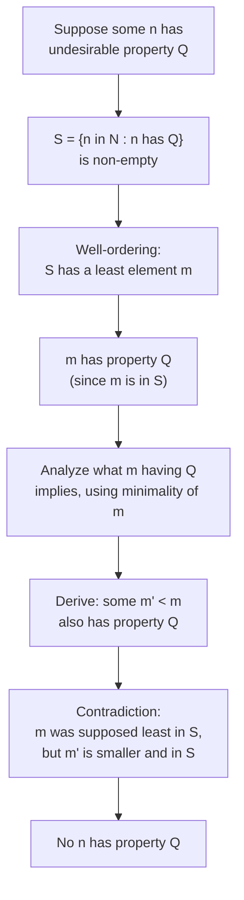

## Learning Objectives

- State the well-ordering principle precisely and identify which sets it applies to.
- Use the well-ordering principle to prove a non-existence claim by constructing a set that would have to have a least element, and deriving a contradiction from that.
- Explain, at a structural level, why mathematical induction is logically equivalent to the well-ordering principle over the natural numbers.
- Distinguish the well-ordering principle from the (false, in general) claim that every non-empty set of integers or reals has a least element.
- Construct a proof of a "smallest counterexample" style, identifying the minimal element the principle guarantees and deriving what must follow from its minimality.

## Context & Motivation

Underneath nearly every proof by induction, and underneath a surprisingly large fraction of number-theory proofs that never explicitly mention induction at all, sits one quiet structural fact about the natural numbers: however a non-empty collection of them is chosen, that collection always has a smallest member. This sounds almost too obvious to deserve a name — of course a set of non-negative integers has a least element, how could it not? — and that very obviousness is exactly why it goes unnoticed as the load-bearing assumption it actually is. It fails for other, superficially similar domains without any fuss: the set of all positive rational numbers has no least element (for any rational you name, half of it is smaller and still positive), and the set of all integers, positive and negative, has no least element either (there is always a smaller integer). The **well-ordering principle** is the precise statement of exactly which domain this property holds for, and it is the axiom — not merely a convenient fact, but a genuine starting assumption about the natural numbers — that everything built from "smallest counterexample" arguments and, ultimately, mathematical induction itself, rests on.

The reason this belongs early in a course on proof technique, before induction is introduced formally, is that it makes the *justification* for induction visible rather than leaving it as an unexplained rule to memorize. Students often absorb induction as "prove a base case, prove a step, done" without ever being shown *why* that recipe is valid — why proving those two things is enough to establish a claim for every natural number, rather than just an ever-growing list of individual cases. The well-ordering principle is precisely the missing piece: it can be used to prove the induction principle is valid, by assuming (for contradiction) that some natural number fails a claim despite the base case and step both holding, and using well-ordering to extract the *smallest* such failure — which the inductive step itself then rules out. Seeing that argument once is what turns induction from an accepted ritual into an understood consequence of a simpler underlying fact.

MIT's 6.042J introduces the well-ordering principle for exactly this reason, treating it as the axiomatic bedrock the entire induction and strong-induction machinery is erected on, and it recurs constantly in elementary number theory — the existence of a prime factorization, the termination of the Euclidean algorithm, and the correctness of the division algorithm (that any integer divided by a positive integer has a unique quotient and remainder) all lean on some version of "this set of non-negative integers must have a smallest element" at a key step.

## Core Theory

### Statement of the principle

**Well-ordering principle:** every non-empty subset of the non-negative integers (ℕ = {0, 1, 2, 3, ...}) has a least element. Formally: for every set S ⊆ ℕ with S ≠ ∅, there exists an element m ∈ S such that for all s ∈ S, m ≤ s.

Two words in that statement are carrying all the weight and are worth isolating explicitly. **Non-empty** matters because the empty set trivially has no least element (there is nothing to compare), so the principle says nothing about it — it is a statement about every non-empty subset, with no exception for the empty one because none is needed. **Non-negative integers** matters because the principle is false, and obviously so, for other ordered sets that otherwise look similar: it is not a generic fact about "any set of numbers," it is a specific structural fact about ℕ (and, by an easy extension, about any set bounded below within the integers).

### Why it fails outside ℕ, made concrete

Three quick counterexamples fix exactly where the principle stops applying, which is as important as the principle itself for using it correctly:

- The set of positive rational numbers {q ∈ ℚ : q > 0} is non-empty and has no least element: for any positive rational q, the rational q/2 is also positive and strictly smaller, so no candidate least element survives being halved.
- The full set of integers ℤ is non-empty and has no least element: for any integer n, n − 1 is a smaller integer, so the search for a minimum never terminates.
- The open interval of reals (0, 1) is non-empty and has no least element, for the same reason as the rationals — halving any candidate produces something smaller that is still in the set.

In every one of these, the underlying reason the principle fails is the same: the set is not bounded below by anything that forces a stopping point, or (in the rational/real cases) the set is "densely" infinite in a way that lets you always find something strictly smaller and still in the set. ℕ avoids both failure modes — it is bounded below by 0, and there is no integer strictly between n and n − 1, so descending from any element eventually exhausts the room to keep going smaller.

### Using well-ordering directly: the "smallest counterexample" method

The principle is most often used not to establish a positive existence claim, but to rule something out, via the following template: to prove that no non-negative integer has some undesirable property Q, suppose for contradiction that some non-negative integer *does* have property Q. Then the set S = {n ∈ ℕ : n has property Q} is non-empty, so by well-ordering, S has a least element m. Since m ∈ S, m has property Q. The proof then derives, from the specific meaning of Q and the minimality of m, that some strictly smaller non-negative integer m′ < m must *also* have property Q — but this contradicts m being the *least* element of S, since m′ would then belong to S and be smaller than m. This contradiction forces the original supposition to be false: no non-negative integer has property Q.

### Equivalence with mathematical induction

The well-ordering principle and the principle of mathematical induction are logically equivalent statements about ℕ — each can be derived from the other — which is why either can be taken as the starting axiom and the other proved as a consequence. The direction most useful for motivating induction (covered in full elsewhere in this course) goes: given the well-ordering principle, suppose induction's method failed on some claim P(n) — that is, suppose P(0) holds and "P(k) implies P(k+1)" holds for every k, but P(n) is nonetheless false for some n. The set of counterexamples S = {n ∈ ℕ : P(n) is false} would then be non-empty, so by well-ordering it has a least element m. Since P(0) holds, m ≠ 0, so m − 1 is a non-negative integer, and by minimality of m, m − 1 is not in S, meaning P(m − 1) holds. But the inductive step says P(m − 1) implies P(m), so P(m) holds — contradicting m being a counterexample. This shows no such m can exist, which is exactly the guarantee induction is supposed to provide. Seen this way, induction is not an independent axiom needing its own separate justification; it is the well-ordering principle applied to the specific set of counterexamples to whatever claim is being proved.

## Worked Examples

### Example 1 — every integer greater than 1 has a prime divisor

**Claim:** every integer n > 1 has at least one prime divisor.

*Proof.* Suppose, for the sake of contradiction, that some integer greater than 1 has no prime divisor. Let S be the set of all integers greater than 1 with no prime divisor; by assumption S is non-empty, so by the well-ordering principle, S has a least element m. Since m ∈ S, m > 1 and m has no prime divisor. In particular, m itself is not prime (if it were, m would be a divisor of itself and prime, contradicting "no prime divisor"), so since m > 1 and m is not prime, m is composite, meaning m = ab for some integers a, b with 1 < a < m and 1 < b < m. Since a < m and a > 1, and m is the *least* element of S, a cannot be in S — meaning a does have a prime divisor, say p. But then p divides a, and a divides m, so p divides m — meaning m does have a prime divisor after all, contradicting m ∈ S. This contradiction shows S must be empty, so every integer greater than 1 has a prime divisor. ∎

This is the template from Core Theory applied directly: the undesirable property Q is "has no prime divisor," the minimal counterexample m is shown to be composite (using its own definition), and the minimality of m is what allows concluding that a factor of m, being smaller, must fail to have property Q — supplying the prime divisor that contradicts m's membership in S.

### Example 2 — there is no positive integer strictly between 0 and 1

**Claim:** there is no integer n with 0 < n < 1.

*Proof.* Suppose, for the sake of contradiction, that some integer n satisfies 0 < n < 1. Let S = {n ∈ ℕ : 0 < n < 1}; this set is non-empty by assumption. By well-ordering, S has a least element m, with 0 < m < 1. Since 0 < m, m is a positive integer, so m ≥ 1 by the basic fact that the smallest positive integer is 1 (itself ultimately a consequence of well-ordering applied to the positive integers). But m < 1 was also assumed — so m ≥ 1 and m < 1 hold simultaneously, an outright contradiction. Therefore S is empty: no integer lies strictly between 0 and 1. ∎

This example is intentionally almost too simple — it isolates exactly how well-ordering forces a contradiction from a set that "shouldn't" have any elements, without the extra number-theoretic machinery Example 1 needed, making the mechanical shape of the argument easier to see on its own.

### Example 3 — the division algorithm: existence of quotient and remainder

**Claim:** for every integer a and every positive integer d, there exist integers q and r such that a = dq + r and 0 ≤ r < d.

*Proof (existence part).* Consider the set S = {a − dq : q ∈ ℤ, a − dq ≥ 0} — the set of all non-negative values obtainable by subtracting some multiple of d from a. First, S is non-empty: choosing q sufficiently negative (specifically q = −|a|) makes a − dq = a + d|a| as large as needed, and in particular non-negative, since d ≥ 1. By the well-ordering principle, S has a least element; call it r, achieved at some particular q. By construction, r = a − dq ≥ 0, and r ∈ S.

It remains to show r < d. Suppose instead r ≥ d. Then r − d = a − dq − d = a − d(q + 1) is still non-negative (since r ≥ d), so r − d ∈ S as well — but r − d < r, contradicting that r was the *least* element of S. This contradiction forces r < d. Taking this q and r, a = dq + r with 0 ≤ r < d, as required. ∎

This example shows well-ordering used to establish a positive existence claim rather than to rule something out — the set S is constructed specifically so that its least element *is* the object (the remainder r) the theorem is claiming exists, and the "less than d" bound is then pinned down by the same style of minimality-contradiction argument as Examples 1 and 2.

## Common Misconceptions & Pitfalls

- **"Every non-empty set of numbers has a least element — well-ordering is a general fact about numbers."** It is specifically a fact about the non-negative integers (or, by trivial extension, integers bounded below); the positive rationals and the full integers both fail it, as shown directly in Core Theory, so applying "well-ordering" to a set of rationals or arbitrary integers without first restricting to a subset of ℕ is an invalid step.
- **"The least element well-ordering guarantees can be found by starting at 0 and checking upward."** The principle only guarantees a least element *exists*; it says nothing computational about how to locate it, and in Example 1, for instance, the minimal counterexample m is reasoned about structurally (shown to be composite) without ever being searched for numerically.
- **"A 'least element' argument and an ordinary contradiction proof are unrelated techniques."** The smallest-counterexample method is a specific, very common flavor of proof by contradiction — the impossibility it reaches is always "m was assumed least, but a smaller element of the same set was just produced" — recognizing this connection helps in spotting when well-ordering is the right tool for a proof that otherwise looks like a generic contradiction argument.
- **"Well-ordering and induction are two separate, unrelated tools that happen to both apply to the natural numbers."** As Core Theory derives explicitly, the two are logically equivalent over ℕ — the standard proof that induction is valid *is* an application of well-ordering to the set of counterexamples to the claim being inducted on, so treating them as unconnected obscures why induction is trustworthy in the first place.
- **"Since ℕ starts at 0 (or 1, depending on convention), well-ordering only concerns the smallest possible cases, like 0 or 1."** The principle applies to every non-empty subset, not just to ℕ itself — the subset in a smallest-counterexample argument is usually some derived set of "bad" numbers scattered arbitrarily through ℕ, and the least element being extracted is the least *bad* number, which can be arbitrarily large, not literally 0 or 1.

## Summary

The well-ordering principle states that every non-empty subset of the non-negative integers has a least element — a fact so intuitive it is easy to overlook as an actual assumption, yet one that fails for the positive rationals and for the full set of integers, which shows it is a genuine structural property of ℕ specifically, not a generic fact about numbers. Its most common use is the smallest-counterexample method: assume some undesirable property is satisfied by at least one non-negative integer, extract the least such integer via well-ordering, and derive a contradiction by showing a strictly smaller integer must also satisfy the property, violating minimality — a pattern used to prove that every integer greater than 1 has a prime divisor, that no integer lies strictly between 0 and 1, and (constructively) that the division algorithm's quotient and remainder exist. Perhaps most importantly, well-ordering is logically equivalent to mathematical induction over ℕ: induction's validity can itself be proved by applying well-ordering to the set of counterexamples to whatever claim is being inducted on, which is exactly what makes induction a justified proof technique rather than an unexplained rule of thumb.

## Documentation Links

- [MIT 6.042J — Syllabus (OCW)](https://ocw.mit.edu/courses/6-042j-mathematics-for-computer-science-fall-2010/pages/syllabus/) — doc
- [Lehman, Leighton & Meyer — Mathematics for Computer Science (full text)](https://people.csail.mit.edu/meyer/mcs.pdf) — doc
