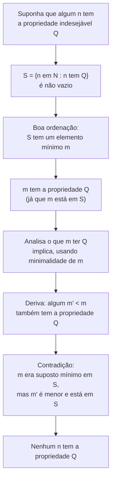

## Objetivos de Aprendizagem

- Declarar o princípio da boa ordenação com precisão e identificar a quais conjuntos ele se aplica.
- Usar o princípio da boa ordenação para provar uma afirmação de não existência, construindo um conjunto que teria que ter um elemento mínimo, e derivando uma contradição disso.
- Explicar, num nível estrutural, por que a indução matemática é logicamente equivalente ao princípio da boa ordenação sobre os números naturais.
- Distinguir o princípio da boa ordenação da afirmação (falsa, em geral) de que todo conjunto não vazio de inteiros ou reais tem um elemento mínimo.
- Construir uma prova no estilo "menor contraexemplo", identificando o elemento mínimo que o princípio garante e derivando o que precisa decorrer de sua minimalidade.

## Contexto e Motivação

Por baixo de quase toda prova por indução, e por baixo de uma fração surpreendentemente grande de provas de teoria dos números que nunca mencionam indução explicitamente, está um fato estrutural silencioso sobre os números naturais: seja como for que uma coleção não vazia deles seja escolhida, essa coleção sempre tem um menor membro. Isso soa quase óbvio demais para merecer um nome (claro que um conjunto de inteiros não negativos tem um elemento mínimo, como não teria?), e é exatamente essa obviedade que faz passar despercebido como a suposição de fato essencial que ele é. Ele falha para outros domínios, superficialmente parecidos, sem cerimônia: o conjunto de todos os números racionais positivos não tem elemento mínimo (para qualquer racional que você nomeie, a metade dele é menor e ainda positiva), e o conjunto de todos os inteiros, positivos e negativos, também não tem elemento mínimo (sempre há um inteiro menor). O **princípio da boa ordenação** é a declaração precisa de exatamente para qual domínio essa propriedade vale, e é o axioma (não meramente um fato conveniente, mas uma suposição de partida genuína sobre os números naturais) sobre o qual tudo construído a partir de argumentos de "menor contraexemplo" e, em última instância, a própria indução matemática, se apoia.

A razão de isso pertencer cedo num curso sobre técnica de prova, antes de indução ser introduzida formalmente, é que torna visível a *justificativa* para indução em vez de deixá-la como uma regra inexplicada a decorar. Alunos frequentemente absorvem indução como "prove um caso base, prove um passo, pronto" sem nunca ver *por que* essa receita é válida, por que provar essas duas coisas basta para estabelecer uma afirmação para todo número natural, em vez de apenas uma lista sempre crescente de casos individuais. O princípio da boa ordenação é precisamente a peça que falta: ele pode ser usado para provar que o princípio de indução é válido, assumindo (por contradição) que algum número natural falha numa afirmação apesar de o caso base e o passo valerem, e usando boa ordenação para extrair a *menor* dessas falhas, que o próprio passo indutivo então descarta. Ver esse argumento uma vez é o que transforma indução de um ritual aceito num consequência entendida de um fato subjacente mais simples.

O 6.042J do MIT introduz o princípio da boa ordenação exatamente por essa razão, tratando-o como o alicerce axiomático sobre o qual toda a maquinaria de indução e indução forte é erguida, e ele reaparece constantemente na teoria dos números elementar: a existência de uma fatoração em primos, a terminação do algoritmo de Euclides, e a corretude do algoritmo da divisão (que todo inteiro dividido por um inteiro positivo tem um quociente e resto únicos) todos se apoiam em alguma versão de "este conjunto de inteiros não negativos precisa ter um elemento mínimo" num passo chave.

## Teoria Central

### Declaração do princípio

**Princípio da boa ordenação:** todo subconjunto não vazio dos inteiros não negativos (ℕ = {0, 1, 2, 3, ...}) tem um elemento mínimo. Formalmente: para todo conjunto S ⊆ ℕ com S ≠ ∅, existe um elemento m ∈ S tal que para todo s ∈ S, m ≤ s.

Duas palavras nessa declaração carregam todo o peso e valem a pena isolar explicitamente. **Não vazio** importa porque o conjunto vazio trivialmente não tem elemento mínimo (não há nada para comparar), então o princípio não diz nada sobre ele; é uma afirmação sobre todo subconjunto não vazio, sem exceção para o vazio porque nenhuma é necessária. **Inteiros não negativos** importa porque o princípio é falso, e obviamente, para outros conjuntos ordenados que de resto parecem similares: não é um fato genérico sobre "qualquer conjunto de números", é um fato estrutural específico sobre ℕ (e, por uma extensão fácil, sobre qualquer conjunto limitado inferiormente dentro dos inteiros).

### Por que falha fora de ℕ, de forma concreta

Três contraexemplos rápidos fixam exatamente onde o princípio para de se aplicar, o que é tão importante quanto o próprio princípio para usá-lo corretamente:

- O conjunto dos números racionais positivos {q ∈ ℚ : q > 0} é não vazio e não tem elemento mínimo: para qualquer racional positivo q, o racional q/2 também é positivo e estritamente menor, então nenhum candidato a elemento mínimo sobrevive a ser dividido ao meio.
- O conjunto completo dos inteiros ℤ é não vazio e não tem elemento mínimo: para qualquer inteiro n, n − 1 é um inteiro menor, então a busca por um mínimo nunca termina.
- O intervalo aberto de reais (0, 1) é não vazio e não tem elemento mínimo, pela mesma razão dos racionais: dividir ao meio qualquer candidato produz algo menor que ainda está no conjunto.

Em cada um desses, a razão subjacente de o princípio falhar é a mesma: o conjunto não é limitado inferiormente por nada que force um ponto de parada, ou (nos casos racional/real) o conjunto é "densamente" infinito de um jeito que sempre permite achar algo estritamente menor e ainda no conjunto. ℕ evita os dois modos de falha: é limitado inferiormente por 0, e não há inteiro estritamente entre n e n − 1, então descer a partir de qualquer elemento eventualmente esgota o espaço para continuar diminuindo.

### Usando boa ordenação diretamente: o método do "menor contraexemplo"

O princípio é usado mais frequentemente não para estabelecer uma afirmação positiva de existência, mas para descartar algo, via o seguinte modelo: para provar que nenhum inteiro não negativo tem alguma propriedade indesejável Q, suponha por contradição que algum inteiro não negativo *de fato* tem a propriedade Q. Então o conjunto S = {n ∈ ℕ : n tem a propriedade Q} é não vazio, então por boa ordenação, S tem um elemento mínimo m. Como m ∈ S, m tem a propriedade Q. A prova então deriva, do significado específico de Q e da minimalidade de m, que algum inteiro não negativo estritamente menor m′ < m precisa *também* ter a propriedade Q, mas isso contradiz m ser o elemento *mínimo* de S, já que m′ pertenceria então a S e seria menor que m. Essa contradição força a suposição original a ser falsa: nenhum inteiro não negativo tem a propriedade Q.

### Equivalência com indução matemática

O princípio da boa ordenação e o princípio da indução matemática são afirmações logicamente equivalentes sobre ℕ (cada um pode ser derivado do outro), o que é por que qualquer um pode ser tomado como o axioma de partida e o outro provado como consequência. A direção mais útil para motivar indução (coberta por completo em outro ponto deste curso) vai assim: dado o princípio da boa ordenação, suponha que o método de indução falhasse em alguma afirmação P(n), isto é, suponha que P(0) vale e "P(k) implica P(k+1)" vale para todo k, mas P(n) mesmo assim é falso para algum n. O conjunto de contraexemplos S = {n ∈ ℕ : P(n) é falso} seria então não vazio, então por boa ordenação ele tem um elemento mínimo m. Como P(0) vale, m ≠ 0, então m − 1 é um inteiro não negativo, e pela minimalidade de m, m − 1 não está em S, significando que P(m − 1) vale. Mas o passo indutivo diz que P(m − 1) implica P(m), então P(m) vale, contradizendo m ser um contraexemplo. Isso mostra que nenhum m assim pode existir, que é exatamente a garantia que indução deveria fornecer. Visto desse jeito, indução não é um axioma independente que precisa de sua própria justificativa separada; é o princípio da boa ordenação aplicado ao conjunto específico de contraexemplos a qualquer afirmação que esteja sendo provada.

## Exemplos Resolvidos

### Exemplo 1: todo inteiro maior que 1 tem um divisor primo

**Afirmação:** todo inteiro n > 1 tem pelo menos um divisor primo.

*Prova.* Suponha, para efeito de contradição, que algum inteiro maior que 1 não tem divisor primo. Seja S o conjunto de todos os inteiros maiores que 1 sem divisor primo; por suposição S é não vazio, então pelo princípio da boa ordenação, S tem um elemento mínimo m. Como m ∈ S, m > 1 e m não tem divisor primo. Em particular, o próprio m não é primo (se fosse, m seria um divisor de si mesmo e primo, contradizendo "nenhum divisor primo"), então como m > 1 e m não é primo, m é composto, significando m = ab para alguns inteiros a, b com 1 < a < m e 1 < b < m. Como a < m e a > 1, e m é o elemento *mínimo* de S, a não pode estar em S, o que significa que a tem sim um divisor primo, digamos p. Mas então p divide a, e a divide m, então p divide m, o que significa que m tem sim um divisor primo afinal, contradizendo m ∈ S. Essa contradição mostra que S precisa ser vazio, então todo inteiro maior que 1 tem um divisor primo. ∎

Este é o modelo da Teoria Central aplicado diretamente: a propriedade indesejável Q é "não tem divisor primo", o contraexemplo mínimo m é mostrado composto (usando sua própria definição), e a minimalidade de m é o que permite concluir que um fator de m, sendo menor, precisa falhar em ter a propriedade Q, fornecendo o divisor primo que contradiz a pertinência de m em S.

### Exemplo 2: não existe inteiro positivo estritamente entre 0 e 1

**Afirmação:** não existe inteiro n com 0 < n < 1.

*Prova.* Suponha, para efeito de contradição, que algum inteiro n satisfaz 0 < n < 1. Seja S = {n ∈ ℕ : 0 < n < 1}; esse conjunto é não vazio por suposição. Por boa ordenação, S tem um elemento mínimo m, com 0 < m < 1. Como 0 < m, m é um inteiro positivo, então m ≥ 1 pelo fato básico de que o menor inteiro positivo é 1 (ele mesmo, em última instância, uma consequência de boa ordenação aplicada aos inteiros positivos). Mas m < 1 também foi assumido, então m ≥ 1 e m < 1 valem simultaneamente, uma contradição direta. Portanto S é vazio: nenhum inteiro está estritamente entre 0 e 1. ∎

Este exemplo é intencionalmente quase simples demais: ele isola exatamente como boa ordenação força uma contradição a partir de um conjunto que "não deveria" ter elementos, sem a maquinaria extra de teoria dos números que o Exemplo 1 precisou, tornando a forma mecânica do argumento mais fácil de ver sozinha.

### Exemplo 3: o algoritmo da divisão: existência de quociente e resto

**Afirmação:** para todo inteiro a e todo inteiro positivo d, existem inteiros q e r tais que a = dq + r e 0 ≤ r < d.

*Prova (parte da existência).* Considere o conjunto S = {a − dq : q ∈ ℤ, a − dq ≥ 0}, o conjunto de todos os valores não negativos obteníveis subtraindo algum múltiplo de d de a. Primeiro, S é não vazio: escolhendo q suficientemente negativo (especificamente q = −|a|) faz a − dq = a + d|a| tão grande quanto necessário, e em particular não negativo, já que d ≥ 1. Pelo princípio da boa ordenação, S tem um elemento mínimo; chame-o de r, atingido em algum q particular. Por construção, r = a − dq ≥ 0, e r ∈ S.

Resta mostrar r < d. Suponha em vez disso que r ≥ d. Então r − d = a − dq − d = a − d(q + 1) ainda é não negativo (já que r ≥ d), então r − d ∈ S também, mas r − d < r, contradizendo que r era o elemento *mínimo* de S. Essa contradição força r < d. Tomando esses q e r, a = dq + r com 0 ≤ r < d, como exigido. ∎

Este exemplo mostra boa ordenação usada para estabelecer uma afirmação positiva de existência em vez de descartar algo: o conjunto S é construído especificamente de forma que seu elemento mínimo *é* o objeto (o resto r) que o teorema está afirmando existir, e o limite "menor que d" é então fixado pelo mesmo estilo de argumento de contradição por minimalidade dos Exemplos 1 e 2.

## Equívocos Comuns e Armadilhas

- **"Todo conjunto não vazio de números tem um elemento mínimo, boa ordenação é um fato geral sobre números."** É especificamente um fato sobre os inteiros não negativos (ou, por extensão trivial, inteiros limitados inferiormente); os racionais positivos e o conjunto completo dos inteiros falham nisso, como mostrado diretamente na Teoria Central, então aplicar "boa ordenação" a um conjunto de racionais ou inteiros arbitrários sem primeiro restringir a um subconjunto de ℕ é um passo inválido.
- **"O elemento mínimo que boa ordenação garante pode ser encontrado começando em 0 e checando pra cima."** O princípio só garante que um elemento mínimo *existe*; ele não diz nada computacional sobre como localizá-lo, e no Exemplo 1, por exemplo, o contraexemplo mínimo m é raciocinado estruturalmente (mostrado composto) sem nunca ser procurado numericamente.
- **"Um argumento de 'elemento mínimo' e uma prova comum por contradição são técnicas não relacionadas."** O método do menor contraexemplo é um tipo específico e muito comum de prova por contradição: a impossibilidade que ele alcança é sempre "m era assumido mínimo, mas um elemento menor do mesmo conjunto acabou de ser produzido"; reconhecer essa conexão ajuda a identificar quando boa ordenação é a ferramenta certa para uma prova que de resto parece um argumento genérico de contradição.
- **"Boa ordenação e indução são duas ferramentas separadas e não relacionadas que acontecem de ambas se aplicar aos números naturais."** Como a Teoria Central deriva explicitamente, as duas são logicamente equivalentes sobre ℕ; a prova padrão de que indução é válida *é* uma aplicação de boa ordenação ao conjunto de contraexemplos à afirmação sendo provada por indução, então tratá-las como não conectadas obscurece por que indução é confiável em primeiro lugar.
- **"Como ℕ começa em 0 (ou 1, dependendo da convenção), boa ordenação só diz respeito aos menores casos possíveis, como 0 ou 1."** O princípio se aplica a todo subconjunto não vazio, não só a ℕ em si; o subconjunto num argumento de menor contraexemplo geralmente é algum conjunto derivado de números "ruins" espalhados arbitrariamente por ℕ, e o elemento mínimo sendo extraído é o menor número *ruim*, que pode ser arbitrariamente grande, não literalmente 0 ou 1.

## Resumo

O princípio da boa ordenação declara que todo subconjunto não vazio dos inteiros não negativos tem um elemento mínimo, um fato tão intuitivo que é fácil deixar de notar como uma suposição de fato, e ainda assim um que falha para os racionais positivos e para o conjunto completo dos inteiros, o que mostra que é uma propriedade estrutural genuína de ℕ especificamente, não um fato genérico sobre números. Seu uso mais comum é o método do menor contraexemplo: assuma que alguma propriedade indesejável é satisfeita por pelo menos um inteiro não negativo, extraia o menor desses inteiros via boa ordenação, e derive uma contradição mostrando que um inteiro estritamente menor precisa também satisfazer a propriedade, violando minimalidade, um padrão usado para provar que todo inteiro maior que 1 tem um divisor primo, que nenhum inteiro está estritamente entre 0 e 1, e (construtivamente) que o quociente e o resto do algoritmo da divisão existem. Talvez mais importante, boa ordenação é logicamente equivalente à indução matemática sobre ℕ: a validade da indução pode ela mesma ser provada aplicando boa ordenação ao conjunto de contraexemplos a qualquer afirmação sendo provada por indução, que é exatamente o que faz de indução uma técnica de prova justificada em vez de uma regra prática inexplicada.

## Documentation Links

- [MIT 6.042J — Syllabus (OCW)](https://ocw.mit.edu/courses/6-042j-mathematics-for-computer-science-fall-2010/pages/syllabus/) — doc
- [Lehman, Leighton & Meyer — Mathematics for Computer Science (full text)](https://people.csail.mit.edu/meyer/mcs.pdf) — doc
