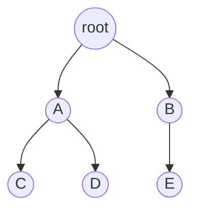
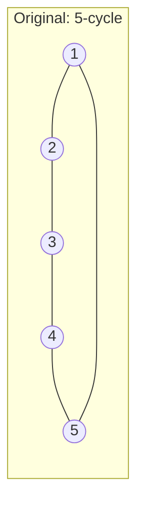
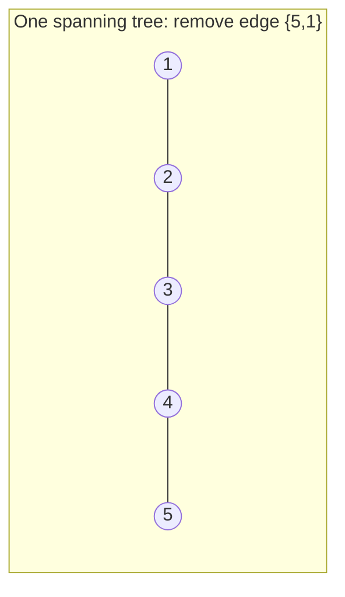

## Learning Objectives

- Define a tree as a connected, acyclic graph, and state at least two other equivalent characterizations of the same structure.
- Prove that a tree on n vertices has exactly n − 1 edges.
- Prove that a tree with at least two vertices has at least two leaves (vertices of degree 1).
- Distinguish a free tree from a rooted tree, and explain the additional vocabulary (parent, child, depth, height) rooting introduces.
- Determine, for a given graph, whether it is a tree by checking the defining properties directly.

## Context & Motivation

A tree is the graph-theoretic name for a shape that shows up constantly once you start looking: a family's genealogy, a company's org chart, the folder structure of a filesystem, the parse structure of an arithmetic expression, the decision structure of a binary search. What all of these share is the specific combination of properties that defines a tree — connected, so every part is reachable from every other part, and acyclic, so there is exactly one way to get from any one part to any other, with no alternate route and no possibility of looping back. That "exactly one path between any two vertices" property, which follows from connectedness plus acyclicity, is really the heart of why trees are so useful: hierarchies, recursive data structures, and unambiguous decision procedures all depend on there being no ambiguity in how you get from a starting point to wherever you're going, and a tree is precisely the structure that guarantees this.

Trees also serve as the single cleanest setting in which the toolbox from earlier topics — induction, the handshake theorem, careful counting — gets applied in a genuinely productive way, because the two central facts about trees (n vertices force exactly n − 1 edges; a tree with ≥ 2 vertices has ≥ 2 leaves) are both provable outright, cleanly, from first principles, using tools already in hand. The ACM/IEEE curricular guidelines for discrete structures treat trees as a load-bearing topic in exactly this sense: not just a data structure to be used later, but a mathematical object whose basic theorems are worth proving carefully once, because those same theorems (the n − 1 edge count especially) get invoked constantly afterward — in analyzing minimum spanning trees, in counting the number of distinct binary trees on n nodes, in bounding the depth of balanced search structures — without being re-derived each time.

## Core Theory

### Definition and equivalent characterizations

A **tree** is a connected, acyclic (undirected, simple) graph. Equivalently — and it is a genuine theorem, not a restatement, that these are all the same class of graphs — a connected graph G on n vertices is a tree if and only if any one of the following holds:

1. G is acyclic (contains no cycle).
2. G has exactly n − 1 edges.
3. G has a unique path between every pair of vertices.
4. G is connected, but removing any single edge disconnects it (every edge is a "bridge").
5. G is acyclic, but adding any single edge between two non-adjacent vertices creates exactly one cycle.

Each of these captures the same underlying idea from a different angle: a tree is a *minimally connected* graph — connected, but with no redundancy at all; remove any edge and it falls apart into two pieces, and there was never more than one way to get anywhere in the first place.

A graph that is a disjoint union of trees (not necessarily connected as a whole) is called a **forest**.

### Theorem: a tree on n vertices has exactly n − 1 edges

**Proof, by induction on n.**

*Base case* (n = 1): a single vertex with no edges is trivially connected (there is nothing to connect) and acyclic, so it is a tree with n − 1 = 0 edges. ✓

*Inductive step:* assume every tree on k vertices has exactly k − 1 edges, for some k ≥ 1 (inductive hypothesis). Let T be a tree on k + 1 vertices. Since T is a tree, by characterization (4) above, every edge is a bridge — but more specifically, a tree with ≥ 2 vertices always has at least one **leaf** (a vertex of degree 1); this fact is proved independently below, so it can be used here. Remove a leaf vertex v (and its single incident edge) from T. The remaining graph T′ has k vertices; it is still connected (removing a degree-1 vertex cannot disconnect the rest, since v had no role in connecting any other two vertices — it was only ever reachable through its single edge) and still acyclic (removing a vertex and edge from an acyclic graph cannot create a cycle). So T′ is a tree on k vertices, and by the inductive hypothesis has exactly k − 1 edges. T itself has exactly one more edge than T′ (the edge removed along with v), so T has (k − 1) + 1 = k edges = (k+1) − 1. This matches the claimed formula for n = k + 1. ∎

This proof leans on the leaf-existence lemma below, so the two results are best understood together — the edge-count theorem's inductive step literally could not proceed without a guaranteed leaf to strip off at each stage.

### Lemma: a tree with at least two vertices has at least two leaves

**Proof.** Let T be a tree with n ≥ 2 vertices, and consider a **longest path** in T — a path v₀, v₁, …, v_k that cannot be extended at either end by including one more vertex (such a path exists because T is finite, so among all paths in T, some one has maximal length). Claim: v₀ and v_k are both leaves.

Suppose, for contradiction, that deg(v₀) ≥ 2. Then v₀ has some neighbor u other than v₁. Two cases: either u is not on the path v₀,…,v_k at all, in which case u, v₀, v₁, …, v_k is a longer path — contradicting that v₀,…,v_k was longest; or u = vᵢ for some i ≥ 2 already on the path, in which case v₀, v₁, …, vᵢ, v₀ (following the path to vᵢ, then the edge back to v₀) forms a cycle — contradicting that T is acyclic. Either way, a contradiction, so deg(v₀) = 1, i.e., v₀ is a leaf. The identical argument applied to the other end shows v_k is a leaf. Since the path has length ≥ 1 (as n ≥ 2 guarantees at least one edge exists, by connectivity), v₀ ≠ v_k, so these are two distinct leaves. ∎

### Rooted trees: additional vocabulary

A **free tree** is a tree with no designated starting vertex — the definitions above. A **rooted tree** designates one vertex as the **root**, which induces a direction on every edge (away from the root) and a family of new vocabulary: for an edge from u to v where u is closer to the root, u is the **parent** of v and v is a **child** of u; two vertices sharing a parent are **siblings**; a vertex with no children is a **leaf** (matching the free-tree definition when it also has degree 1, though a root with exactly one child has degree 1 too and might or might not be called a leaf depending on convention); the **depth** of a vertex is the length of the unique path from the root to it; the **height** of the tree is the maximum depth over all vertices. A **binary tree** further restricts every vertex to at most two children, conventionally distinguished as "left" and "right."

Here root has depth 0, A and B have depth 1, C, D, E have depth 2; the tree's height is 2; C and D are siblings (both children of A); E is a leaf (no children); A has two children and is itself a child of root.

### Spanning trees

Given any connected graph G = (V, E), a **spanning tree** of G is a subgraph that includes every vertex of V, is itself a tree, and uses only edges from E. Every connected graph has at least one spanning tree — repeatedly removing an edge from any cycle in G (which cannot disconnect the graph, since a cycle edge is never a bridge) until no cycle remains yields a connected, acyclic subgraph on all of V, i.e., a spanning tree. A connected graph on n vertices with exactly n − 1 edges is already its own (unique) spanning tree; a connected graph with more than n − 1 edges necessarily contains at least one cycle (else, by the edge-count theorem, it would have exactly n − 1 edges) and therefore has more than one possible spanning tree, obtained by choosing different edges to remove from that redundancy.

## Worked Examples

### Example 1 — verifying the edge-count theorem directly

**Problem:** Confirm that the rooted tree in the Core Theory diagram (root, A, B, C, D, E) has exactly n − 1 edges, and identify its leaves.

**Count.** n = 6 vertices (root, A, B, C, D, E). Edges: root–A, root–B, A–C, A–D, B–E — that's 5 edges. n − 1 = 6 − 1 = 5. ✓ matches.

**Leaves.** A vertex is a leaf if it has no children (equivalently, degree 1 in the free-tree sense, except possibly the root): C (no children), D (no children), E (no children) are leaves; root, A, B all have children and are not leaves. This tree has 3 leaves — consistent with the lemma's guarantee of *at least* 2, not exactly 2; the lemma is a lower bound, not an exact count.

### Example 2 — is this graph a tree?

**Problem:** A graph has vertices {1,2,3,4,5} and edges {1,2}, {2,3}, {3,4}, {4,5}, {5,1}. Is it a tree?

**Check connectivity.** Following the edges: 1–2–3–4–5–1 — every vertex reaches every other, so the graph is connected.

**Check edge count.** n = 5, so a tree would need n − 1 = 4 edges. This graph has 5 edges — one more than a tree on 5 vertices could have.

**Conclusion.** By characterization (2), a connected graph with more than n − 1 edges is not a tree — indeed the edge list traces out exactly one cycle, 1-2-3-4-5-1, a 5-cycle. This graph is connected but not acyclic, so it fails the tree definition; it is, however, a graph whose spanning trees can be obtained by deleting exactly one edge from this cycle (any of the 5 edges), each choice giving a different spanning tree (a path on 5 vertices).

### Example 3 — counting spanning trees informally, and constructing one

**Problem:** For the graph in Example 2 (the 5-cycle), list the distinct spanning trees.

**Reasoning.** As noted, removing any single edge from a cycle leaves a connected, acyclic graph on the same 5 vertices with 5 − 1 = 4 edges — a valid spanning tree. Since the cycle has 5 edges, and removing any one of them gives a structurally different spanning tree (a path missing a different edge), there are exactly 5 distinct spanning trees of this graph — for example, removing edge {5,1} gives the path 1-2-3-4-5 as a spanning tree, and removing edge {2,3} gives the path 3-4-5-1-2 (relabeled starting point, same underlying path shape).

Each of the 5 spanning trees has exactly 4 edges, consistent with the edge-count theorem applied to n = 5.

## Common Misconceptions & Pitfalls

- **"Any connected graph with n − 1 edges is automatically a tree, so I only need to check the edge count."** The edge count alone is not sufficient without connectivity — a graph on n vertices with n − 1 edges could instead be disconnected and contain a cycle in one component (e.g., a 3-cycle as one component plus isolated extra vertices elsewhere can still total n − 1 edges for some n). The correct equivalence requires *both* connected *and* (exactly n − 1 edges, or acyclic) — any single one of the five characterizations listed in Core Theory holds only in combination with connectivity as the standing assumption, not as a free-standing test alone.
- **"A tree can have exactly one leaf."** The lemma proves at least two leaves whenever n ≥ 2 — a "tree" with only one leaf and n ≥ 2 vertices does not exist; the smallest possible case, n = 2 (a single edge), has exactly two leaves (both endpoints have degree 1), matching the lemma exactly rather than contradicting it.
- **"The root of a rooted tree is special in the underlying graph structure, not just in how it's drawn."** As a free tree, the same set of vertices and edges is a tree regardless of which vertex is called the root — rooting is an additional choice layered on top of the graph, not a structural property of it. The same free tree can be rooted at any of its vertices, producing different parent/child/depth assignments each time, all describing the identical underlying tree.
- **"A spanning tree is unique for any connected graph."** Only true when the graph itself has exactly n − 1 edges (i.e., is already a tree). As Example 3 shows, a connected graph with cycles generally has multiple distinct spanning trees, one for each way of removing enough edges to eliminate every cycle while staying connected.
- **"Height and depth mean the same thing."** Depth is a per-vertex quantity (distance from the root to that specific vertex); height is a whole-tree quantity (the maximum depth over all vertices) — conflating the two leads to statements like "the depth of this tree is 3" where "height" was actually meant.

## Summary

A tree is a connected, acyclic graph, and this single definition is provably equivalent to several other characterizations — exactly n − 1 edges (for n vertices), a unique path between every pair of vertices, or minimality of connectivity (every edge a bridge). The n − 1 edge-count theorem and the guarantee of at least two leaves in any tree with n ≥ 2 vertices are both proved by induction and a longest-path argument respectively, and the two results are mutually supporting — the induction removes a leaf at each step, relying on the leaf-existence lemma to guarantee one is always available. Rooting a tree at a chosen vertex layers additional vocabulary (parent, child, depth, height) on top of the same underlying structure without changing the tree itself. A spanning tree of a connected graph G extracts a tree using all of G's vertices and a subset of its edges, and is unique only when G was already a tree; otherwise, every cycle in G offers a choice of edge to remove, yielding potentially many distinct spanning trees, each still obeying the n − 1 edge-count theorem.

## Documentation Links

- [ACM/IEEE CS2013 Curriculum Guidelines](https://www.acm.org/binaries/content/assets/education/cs2013_web_final.pdf) — doc
- [ACM/IEEE Curricular Mapping — Discrete Structures](https://curricula.cs.luc.edu/12-discrete-structures/content.html) — doc
