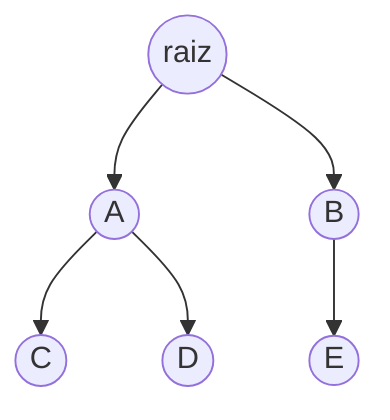
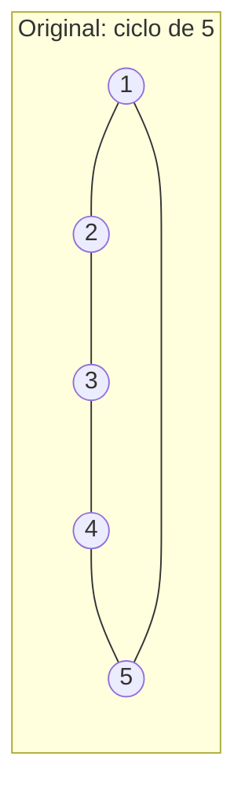
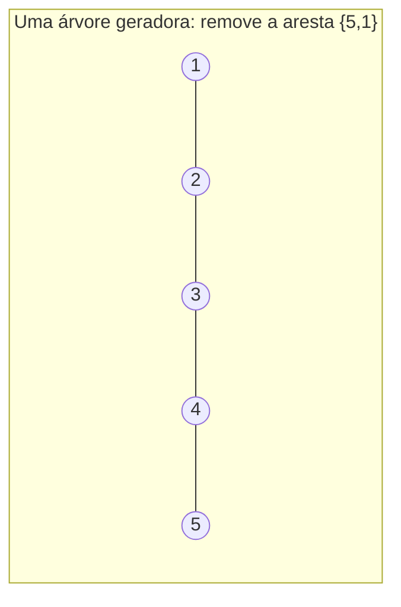

## Objetivos de Aprendizagem

- Definir uma árvore como um grafo conexo e acíclico, e declarar pelo menos duas outras caracterizações equivalentes da mesma estrutura.
- Provar que uma árvore em n vértices tem exatamente n − 1 arestas.
- Provar que uma árvore com pelo menos dois vértices tem pelo menos duas folhas (vértices de grau 1).
- Distinguir uma árvore livre de uma árvore enraizada, e explicar o vocabulário adicional (pai, filho, profundidade, altura) que enraizar introduz.
- Determinar, para um grafo dado, se é uma árvore checando as propriedades definidoras diretamente.

## Contexto e Motivação

Uma árvore é o nome, em teoria dos grafos, para uma forma que aparece constantemente assim que você começa a procurar: a genealogia de uma família, o organograma de uma empresa, a estrutura de pastas de um sistema de arquivos, a estrutura de análise sintática de uma expressão aritmética, a estrutura de decisão de uma busca binária. O que todos esses compartilham é a combinação específica de propriedades que define uma árvore: conexa, então toda parte é alcançável a partir de toda outra parte, e acíclica, então existe exatamente uma forma de ir de uma parte qualquer para outra qualquer, sem rota alternativa e sem possibilidade de voltar em ciclo. Essa propriedade de "exatamente um caminho entre quaisquer dois vértices", que decorre de conexidade mais aciclicidade, é de fato o coração de por que árvores são tão úteis: hierarquias, estruturas de dados recursivas e procedimentos de decisão sem ambiguidade todos dependem de não haver ambiguidade em como você vai de um ponto de partida até onde quer que esteja indo, e uma árvore é precisamente a estrutura que garante isso.

Árvores também servem como o cenário mais limpo em que o ferramental dos tópicos anteriores (indução, o teorema do aperto de mãos, contagem cuidadosa) é aplicado de forma genuinamente produtiva, porque os dois fatos centrais sobre árvores (n vértices forçam exatamente n − 1 arestas; uma árvore com ≥ 2 vértices tem ≥ 2 folhas) são ambos prováveis diretamente, de forma limpa, a partir de princípios básicos, usando ferramentas já em mãos. As diretrizes curriculares ACM/IEEE para estruturas discretas tratam árvores como um tópico estrutural exatamente nesse sentido: não só uma estrutura de dados a ser usada depois, mas um objeto matemático cujos teoremas básicos valem a pena provar cuidadosamente uma vez, porque esses mesmos teoremas (a contagem de n − 1 arestas especialmente) são invocados constantemente depois, ao analisar árvores geradoras mínimas, ao contar o número de árvores binárias distintas em n nós, ao limitar a profundidade de estruturas de busca balanceadas, sem serem rederivados a cada vez.

## Teoria Central

### Definição e caracterizações equivalentes

Uma **árvore** é um grafo conexo, acíclico (não dirigido, simples). Equivalentemente (e é um teorema genuíno, não uma reformulação, que essas são todas a mesma classe de grafos), um grafo conexo G em n vértices é uma árvore se e somente se qualquer uma das seguintes vale:

1. G é acíclico (não contém ciclo).
2. G tem exatamente n − 1 arestas.
3. G tem um caminho único entre todo par de vértices.
4. G é conexo, mas remover qualquer aresta única o desconecta (toda aresta é uma "ponte").
5. G é acíclico, mas adicionar qualquer aresta única entre dois vértices não adjacentes cria exatamente um ciclo.

Cada uma dessas captura a mesma ideia subjacente de um ângulo diferente: uma árvore é um grafo **minimamente conexo**, conexo, mas sem redundância alguma; remova qualquer aresta e ela se despedaça em duas partes, e nunca houve mais de uma forma de ir a lugar nenhum antes disso.

Um grafo que é uma união disjunta de árvores (não necessariamente conexo como um todo) se chama uma **floresta**.

### Teorema: uma árvore em n vértices tem exatamente n − 1 arestas

**Prova, por indução sobre n.**

*Caso base* (n = 1): um único vértice sem arestas é trivialmente conexo (não há nada para conectar) e acíclico, então é uma árvore com n − 1 = 0 arestas. ✓

*Passo indutivo:* assuma que toda árvore em k vértices tem exatamente k − 1 arestas, para algum k ≥ 1 (hipótese indutiva). Seja T uma árvore em k + 1 vértices. Como T é uma árvore, pela caracterização (4) acima, toda aresta é uma ponte, mas mais especificamente, uma árvore com ≥ 2 vértices sempre tem pelo menos uma **folha** (um vértice de grau 1); esse fato é provado independentemente abaixo, então pode ser usado aqui. Remova um vértice folha v (e sua única aresta incidente) de T. O grafo restante T′ tem k vértices; ainda é conexo (remover um vértice de grau 1 não pode desconectar o resto, já que v não tinha papel algum em conectar quaisquer outros dois vértices; ele só era alcançável através de sua única aresta) e ainda é acíclico (remover um vértice e uma aresta de um grafo acíclico não pode criar um ciclo). Então T′ é uma árvore em k vértices, e pela hipótese indutiva tem exatamente k − 1 arestas. T em si tem exatamente mais uma aresta que T′ (a aresta removida junto com v), então T tem (k − 1) + 1 = k arestas = (k+1) − 1. Isso corresponde à fórmula declarada para n = k + 1. ∎

Essa prova se apoia no lema de existência de folha abaixo, então os dois resultados são melhor entendidos juntos; o passo indutivo do teorema de contagem de arestas literalmente não poderia prosseguir sem uma folha garantida para remover em cada etapa.

### Lema: uma árvore com pelo menos dois vértices tem pelo menos duas folhas

**Prova.** Seja T uma árvore com n ≥ 2 vértices, e considere um **caminho mais longo** em T, um caminho v₀, v₁, …, v_k que não pode ser estendido em nenhuma das pontas incluindo mais um vértice (tal caminho existe porque T é finito, então entre todos os caminhos em T, algum tem comprimento máximo). Afirmação: v₀ e v_k são ambos folhas.

Suponha, por contradição, que deg(v₀) ≥ 2. Então v₀ tem algum vizinho u diferente de v₁. Dois casos: ou u não está no caminho v₀,…,v_k de forma alguma, nesse caso u, v₀, v₁, …, v_k é um caminho mais longo, contradizendo que v₀,…,v_k era o mais longo; ou u = vᵢ para algum i ≥ 2 já no caminho, nesse caso v₀, v₁, …, vᵢ, v₀ (seguindo o caminho até vᵢ, depois a aresta de volta para v₀) forma um ciclo, contradizendo que T é acíclico. De qualquer jeito, uma contradição, então deg(v₀) = 1, ou seja, v₀ é uma folha. O argumento idêntico aplicado à outra ponta mostra que v_k é uma folha. Como o caminho tem comprimento ≥ 1 (já que n ≥ 2 garante que pelo menos uma aresta existe, por conexidade), v₀ ≠ v_k, então essas são duas folhas distintas. ∎

### Árvores enraizadas: vocabulário adicional

Uma **árvore livre** é uma árvore sem vértice de partida designado, as definições acima. Uma **árvore enraizada** designa um vértice como a **raiz**, o que induz uma direção em toda aresta (afastando-se da raiz) e uma família de vocabulário novo: para uma aresta de u para v onde u está mais perto da raiz, u é o **pai** de v e v é um **filho** de u; dois vértices que compartilham um pai são **irmãos**; um vértice sem filhos é uma **folha** (correspondendo à definição de árvore livre quando também tem grau 1, embora uma raiz com exatamente um filho também tenha grau 1 e possa ou não ser chamada de folha dependendo da convenção); a **profundidade** de um vértice é o comprimento do caminho único da raiz até ele; a **altura** da árvore é a profundidade máxima entre todos os vértices. Uma **árvore binária** restringe ainda mais todo vértice a no máximo dois filhos, convencionalmente distinguidos como "esquerdo" e "direito".

Aqui raiz tem profundidade 0, A e B têm profundidade 1, C, D, E têm profundidade 2; a altura da árvore é 2; C e D são irmãos (ambos filhos de A); E é uma folha (sem filhos); A tem dois filhos e é ela mesma filha de raiz.

### Árvores geradoras

Dado qualquer grafo conexo G = (V, E), uma **árvore geradora** de G é um subgrafo que inclui todo vértice de V, é ela mesma uma árvore, e usa só arestas de E. Todo grafo conexo tem pelo menos uma árvore geradora: remover repetidamente uma aresta de qualquer ciclo em G (o que não pode desconectar o grafo, já que uma aresta de ciclo nunca é uma ponte) até que nenhum ciclo reste produz um subgrafo conexo e acíclico em todo V, ou seja, uma árvore geradora. Um grafo conexo em n vértices com exatamente n − 1 arestas já é sua própria (única) árvore geradora; um grafo conexo com mais de n − 1 arestas necessariamente contém pelo menos um ciclo (senão, pelo teorema de contagem de arestas, teria exatamente n − 1 arestas) e portanto tem mais de uma árvore geradora possível, obtida escolhendo arestas diferentes para remover daquela redundância.

## Exemplos Resolvidos

### Exemplo 1: verificando o teorema de contagem de arestas diretamente

**Problema:** confirme que a árvore enraizada no diagrama da Teoria Central (raiz, A, B, C, D, E) tem exatamente n − 1 arestas, e identifique suas folhas.

**Contagem.** n = 6 vértices (raiz, A, B, C, D, E). Arestas: raiz-A, raiz-B, A-C, A-D, B-E, isso são 5 arestas. n − 1 = 6 − 1 = 5. ✓ corresponde.

**Folhas.** Um vértice é uma folha se não tem filhos (equivalentemente, grau 1 no sentido de árvore livre, exceto possivelmente a raiz): C (sem filhos), D (sem filhos), E (sem filhos) são folhas; raiz, A, B todos têm filhos e não são folhas. Esta árvore tem 3 folhas, consistente com a garantia do lema de *pelo menos* 2, não exatamente 2; o lema é um limite inferior, não uma contagem exata.

### Exemplo 2: este grafo é uma árvore?

**Problema:** um grafo tem vértices {1,2,3,4,5} e arestas {1,2}, {2,3}, {3,4}, {4,5}, {5,1}. É uma árvore?

**Checando conexidade.** Seguindo as arestas: 1-2-3-4-5-1, todo vértice alcança todo outro, então o grafo é conexo.

**Checando contagem de arestas.** n = 5, então uma árvore precisaria de n − 1 = 4 arestas. Este grafo tem 5 arestas, uma a mais do que uma árvore em 5 vértices poderia ter.

**Conclusão.** Pela caracterização (2), um grafo conexo com mais de n − 1 arestas não é uma árvore; de fato a lista de arestas traça exatamente um ciclo, 1-2-3-4-5-1, um ciclo de 5. Este grafo é conexo mas não acíclico, então falha a definição de árvore; é, no entanto, um grafo cujas árvores geradoras podem ser obtidas deletando exatamente uma aresta deste ciclo (qualquer uma das 5 arestas), cada escolha dando uma árvore geradora diferente (um caminho em 5 vértices).

### Exemplo 3: contando árvores geradoras informalmente, e construindo uma

**Problema:** para o grafo do Exemplo 2 (o ciclo de 5), liste as árvores geradoras distintas.

**Raciocínio.** Como notado, remover qualquer aresta única de um ciclo deixa um grafo conexo e acíclico nos mesmos 5 vértices com 5 − 1 = 4 arestas, uma árvore geradora válida. Como o ciclo tem 5 arestas, e remover qualquer uma delas dá uma árvore geradora estruturalmente diferente (um caminho faltando uma aresta diferente), existem exatamente 5 árvores geradoras distintas deste grafo; por exemplo, remover a aresta {5,1} dá o caminho 1-2-3-4-5 como árvore geradora, e remover a aresta {2,3} dá o caminho 3-4-5-1-2 (ponto de partida renomeado, mesma forma de caminho subjacente).

Cada uma das 5 árvores geradoras tem exatamente 4 arestas, consistente com o teorema de contagem de arestas aplicado a n = 5.

## Equívocos Comuns e Armadilhas

- **"Qualquer grafo conexo com n − 1 arestas é automaticamente uma árvore, então só preciso checar a contagem de arestas."** A contagem de arestas sozinha não é suficiente sem conexidade; um grafo em n vértices com n − 1 arestas poderia em vez disso ser desconexo e conter um ciclo num componente (por exemplo, um ciclo de 3 como um componente mais vértices extras isolados em outro lugar ainda pode totalizar n − 1 arestas para algum n). A equivalência correta exige *tanto* conexo *quanto* (exatamente n − 1 arestas, ou acíclico); qualquer uma das cinco caracterizações listadas na Teoria Central vale só em combinação com conexidade como suposição de base, não como um teste isolado sozinho.
- **"Uma árvore pode ter exatamente uma folha."** O lema prova pelo menos duas folhas sempre que n ≥ 2; uma "árvore" com só uma folha e n ≥ 2 vértices não existe; o menor caso possível, n = 2 (uma única aresta), tem exatamente duas folhas (as duas extremidades têm grau 1), correspondendo exatamente ao lema em vez de contradizê-lo.
- **"A raiz de uma árvore enraizada é especial na estrutura do grafo subjacente, não só em como é desenhada."** Como árvore livre, o mesmo conjunto de vértices e arestas é uma árvore independentemente de qual vértice é chamado de raiz; enraizar é uma escolha adicional sobreposta ao grafo, não uma propriedade estrutural dele. A mesma árvore livre pode ser enraizada em qualquer um de seus vértices, produzindo atribuições diferentes de pai/filho/profundidade cada vez, todas descrevendo a mesma árvore subjacente idêntica.
- **"Uma árvore geradora é única para qualquer grafo conexo."** Só verdadeiro quando o próprio grafo tem exatamente n − 1 arestas (isto é, já é uma árvore). Como o Exemplo 3 mostra, um grafo conexo com ciclos geralmente tem múltiplas árvores geradoras distintas, uma para cada forma de remover arestas suficientes para eliminar todo ciclo enquanto permanece conexo.
- **"Altura e profundidade significam a mesma coisa."** Profundidade é uma quantidade por vértice (distância da raiz até aquele vértice específico); altura é uma quantidade da árvore inteira (a profundidade máxima entre todos os vértices); confundir as duas leva a afirmações como "a profundidade desta árvore é 3" onde "altura" era de fato o que se queria dizer.

## Resumo

Uma árvore é um grafo conexo e acíclico, e essa única definição é provavelmente equivalente a várias outras caracterizações (exatamente n − 1 arestas, para n vértices; um caminho único entre todo par de vértices; ou minimalidade de conexidade, toda aresta uma ponte). O teorema de contagem de n − 1 arestas e a garantia de pelo menos duas folhas em qualquer árvore com n ≥ 2 vértices são ambos provados por indução e por um argumento de caminho mais longo respectivamente, e os dois resultados se sustentam mutuamente; a indução remove uma folha a cada passo, apoiando-se no lema de existência de folha para garantir que uma sempre esteja disponível. Enraizar uma árvore num vértice escolhido sobrepõe vocabulário adicional (pai, filho, profundidade, altura) à mesma estrutura subjacente sem mudar a árvore em si. Uma árvore geradora de um grafo conexo G extrai uma árvore usando todos os vértices de G e um subconjunto de suas arestas, e é única só quando G já era uma árvore; caso contrário, todo ciclo em G oferece uma escolha de aresta a remover, produzindo potencialmente muitas árvores geradoras distintas, cada uma ainda obedecendo ao teorema de contagem de n − 1 arestas.

## Documentation Links

- [ACM/IEEE CS2013 Curriculum Guidelines](https://www.acm.org/binaries/content/assets/education/cs2013_web_final.pdf) — doc
- [ACM/IEEE Curricular Mapping — Discrete Structures](https://curricula.cs.luc.edu/12-discrete-structures/content.html) — doc
