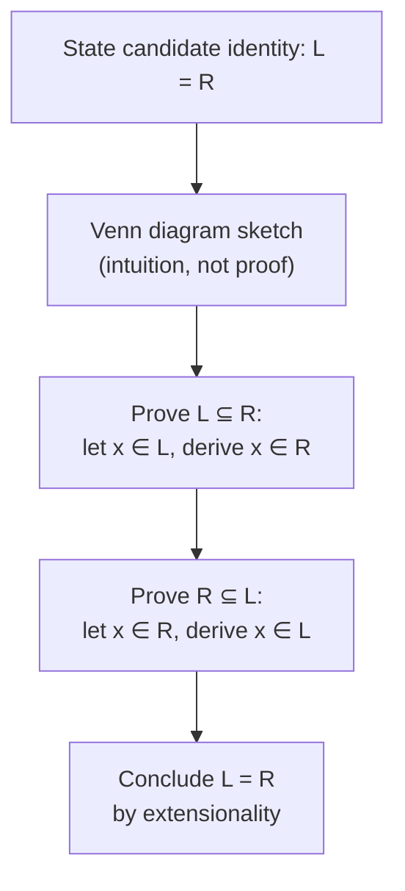

## Learning Objectives

- Read a Venn diagram's regions as corresponding to every possible combination of membership across the sets shown, and use one to conjecture a candidate set identity.
- Explain precisely why a Venn diagram, however accurate for the sets it depicts, does not by itself constitute a proof of a general set identity.
- Prove a set identity rigorously via the double-inclusion (mutual subset) technique, tracing an arbitrary element through both directions of implication.
- Verify a candidate set identity using a membership table, and relate its structure directly to a propositional-logic truth table.
- State and prove De Morgan's laws for sets, and identify why Venn diagrams stop being a practical tool once four or more sets are involved.

## Context & Motivation

A three-circle Venn diagram is one of the most immediately persuasive pictures in all of mathematics: shade the right regions, and an identity like `A ∩ (B ∪ C) = (A ∩ B) ∪ (A ∩ C)` looks self-evidently true — the shaded area on the left visually matches the shaded area on the right. That persuasive power is exactly why Venn diagrams are worth mastering as a discovery and communication tool, and exactly why they are *not* accepted, in this discipline or in any rigorous mathematical text, as a substitute for a proof. A picture drawn for three specific, generically-positioned sets cannot certify that the identity holds for *every* possible A, B, and C — including degenerate cases where sets coincide, are empty, or are subsets of one another, none of which a single generic-looking diagram necessarily represents correctly. MIT's Mathematics for Computer Science and Stanford's CS103 both use Venn diagrams heavily as *intuition pumps* for exactly this reason, while insisting that every identity actually asserted in a proof gets a real double-inclusion argument to back it up.

There is also a hard practical ceiling to what Venn diagrams can do at all: three overlapping circles neatly carve the plane into all `2³ = 8` combinations of membership (in A, in B, in C, and every combination of being outside each), which is exactly why three-set Venn diagrams look so clean. Four sets already break this — no arrangement of four circles can produce all `2⁴ = 16` regions with simple circular overlaps, which is why four-set Venn diagrams are conventionally drawn with ellipses in an asymmetric, considerably less intuitive arrangement, and why the picture-based approach is essentially abandoned by the time a fifth set is added. Rigorous element-chasing proofs, by contrast, scale to any number of sets without any loss of clarity, which is the real reason this discipline treats the diagram as a stepping stone toward the proof technique, not as a destination in itself.

## Core Theory

### Reading a Venn diagram: regions as membership combinations

A Venn diagram for sets `A`, `B`, `C` (drawn inside a rectangle representing the universal set `U`) partitions the plane into regions, each corresponding to exactly one combination of "in" or "out" across the three sets — the region inside all three circles is `A ∩ B ∩ C`; the region inside `A` only is `A ∩ Bᶜ ∩ Cᶜ`; the region outside all three is `Aᶜ ∩ Bᶜ ∩ Cᶜ`, and so on for all eight combinations. Shading the region(s) corresponding to a set expression makes that expression visible directly, and comparing the shaded regions produced by the two sides of a candidate identity is exactly how a mathematician *discovers* which identities are worth trying to prove — the diagram is an excellent hypothesis-generating tool, and a genuinely useful one for building intuition before committing to the more effortful rigorous proof.

### Why a diagram alone does not prove an identity

A specific Venn diagram is drawn with three circles in some generic overlapping position, implicitly assuming every combination of the three sets is nonempty and none is a subset of another. A general identity, by contrast, is a claim about *every* possible A, B, C — including cases where, say, `A ∩ B = ∅`, or `A ⊆ C`, which a single generically-drawn diagram does not necessarily represent, and which the diagram gives no mechanism for checking systematically. The diagram also gives no way to handle a claim about sets defined abstractly (by a predicate, rather than as a small drawn region), which is precisely the form most set identities take once they stop being toy examples. The fix is the same double-inclusion technique introduced for subset proofs in *Sets, Subsets, and Set Operations*: prove the identity by showing each side is a subset of the other, via an argument that holds for an arbitrary element and arbitrary sets, with no appeal to a picture at all.

### Membership tables: the set-theoretic analogue of a truth table

A **membership table** lists every combination of "in" (1) or "out" (0) for an element `x` across the sets involved, and computes the resulting membership in each side of a candidate identity — structurally identical to a propositional truth table, because "is x in A ∪ B" is, underneath the notation, exactly the propositional question "is (x ∈ A) OR (x ∈ B) true."

| A | B | C | B ∪ C | A ∩ (B ∪ C) | A ∩ B | A ∩ C | (A∩B) ∪ (A∩C) |
|---|---|---|-------|-------------|-------|-------|----------------|
| 1 | 1 | 1 | 1 | 1 | 1 | 1 | 1 |
| 1 | 1 | 0 | 1 | 1 | 1 | 0 | 1 |
| 1 | 0 | 1 | 1 | 1 | 0 | 1 | 1 |
| 1 | 0 | 0 | 0 | 0 | 0 | 0 | 0 |
| 0 | 1 | 1 | 1 | 0 | 0 | 0 | 0 |
| 0 | 1 | 0 | 1 | 0 | 0 | 0 | 0 |
| 0 | 0 | 1 | 1 | 0 | 0 | 0 | 0 |
| 0 | 0 | 0 | 0 | 0 | 0 | 0 | 0 |

The last two columns agree on all 8 rows — an exhaustive check that `A ∩ (B ∪ C) = (A ∩ B) ∪ (A ∩ C)` for every combination of membership, confirming (with the same exhaustive-but-scalable-only-so-far caveat as truth tables) exactly what the double-inclusion proof below establishes in general.

### The standard set identities

| Law | Form |
|---|---|
| Commutative | `A ∪ B = B ∪ A`, `A ∩ B = B ∩ A` |
| Associative | `(A∪B)∪C = A∪(B∪C)`, similarly for `∩` |
| Distributive | `A∩(B∪C) = (A∩B)∪(A∩C)`, `A∪(B∩C) = (A∪B)∩(A∪C)` |
| De Morgan's | `(A∪B)ᶜ = Aᶜ∩Bᶜ`, `(A∩B)ᶜ = Aᶜ∪Bᶜ` |
| Double complement | `(Aᶜ)ᶜ = A` |
| Identity | `A ∪ ∅ = A`, `A ∩ U = A` |
| Complement laws | `A ∪ Aᶜ = U`, `A ∩ Aᶜ = ∅` |

Every one of these is the direct set-theoretic mirror of a propositional equivalence law from *Logical Equivalence and Tautologies* — commutativity, associativity, distributivity, and De Morgan's all appear in both tables with the identical structure, because `∪`, `∩`, and complement are literally `∨`, `∧`, and `¬` applied to membership predicates, as established in *Sets, Subsets, and Set Operations*.

### De Morgan's laws for sets, proved

`(A ∪ B)ᶜ = Aᶜ ∩ Bᶜ`. *(⊆)* Let `x ∈ (A ∪ B)ᶜ`. Then `x ∉ A ∪ B`, so `x` is in neither `A` nor `B` (if it were in either, it would be in the union) — that is, `x ∈ Aᶜ` and `x ∈ Bᶜ`, so `x ∈ Aᶜ ∩ Bᶜ`. *(⊇)* Let `x ∈ Aᶜ ∩ Bᶜ`. Then `x ∉ A` and `x ∉ B`, so `x` is in neither, hence `x ∉ A ∪ B`, so `x ∈ (A ∪ B)ᶜ`. Both directions hold, so the sets are equal. Notice this proof is line-for-line the set-theoretic translation of the propositional proof that `¬(p ∨ q) ≡ ¬p ∧ ¬q` — membership in a union is "or," and the complement negates it, which is exactly De Morgan's law for propositions wearing set notation.

## Worked Examples

### Example 1 — the distributive law, from picture to rigorous proof

**Problem:** prove `A ∩ (B ∪ C) = (A ∩ B) ∪ (A ∩ C)` rigorously, after using the Venn diagram and membership table above only as intuition.

*(⊆)* Let `x ∈ A ∩ (B ∪ C)`. By definition of intersection, `x ∈ A` and `x ∈ B ∪ C`. By definition of union, `x ∈ B ∪ C` means `x ∈ B` or `x ∈ C` (or both). *Case 1:* `x ∈ B`. Combined with `x ∈ A`, this gives `x ∈ A ∩ B`, so `x ∈ (A∩B) ∪ (A∩C)`. *Case 2:* `x ∈ C`. Combined with `x ∈ A`, this gives `x ∈ A ∩ C`, so again `x ∈ (A∩B) ∪ (A∩C)`. Either case gives the result, so `A ∩ (B∪C) ⊆ (A∩B) ∪ (A∩C)`.

*(⊇)* Let `x ∈ (A∩B) ∪ (A∩C)`. *Case 1:* `x ∈ A ∩ B`, so `x ∈ A` and `x ∈ B`; since `x ∈ B`, also `x ∈ B ∪ C`, so `x ∈ A ∩ (B∪C)`. *Case 2:* `x ∈ A ∩ C`, so `x ∈ A` and `x ∈ C`; since `x ∈ C`, also `x ∈ B ∪ C`, so again `x ∈ A ∩ (B∪C)`. Either case gives the result, so `(A∩B) ∪ (A∩C) ⊆ A ∩ (B∪C)`.

Both directions hold, so the sets are equal. Notice the proof needed a case split at exactly the point where the diagram showed two shaded sub-regions merging into one — the picture correctly predicted *where* the argument would branch, even though it could not, by itself, establish the result for arbitrary A, B, C.

### Example 2 — proving De Morgan's second law by direct translation

**Problem:** prove `(A ∩ B)ᶜ = Aᶜ ∪ Bᶜ`.

*(⊆)* Let `x ∈ (A ∩ B)ᶜ`. Then `x ∉ A ∩ B`, meaning it is *not* the case that `x ∈ A` and `x ∈ B` both hold — so at least one of `x ∉ A` or `x ∉ B` holds (this is exactly the propositional fact `¬(p ∧ q) ≡ ¬p ∨ ¬q` applied to `p: x∈A`, `q: x∈B`). Either disjunct gives `x ∈ Aᶜ ∪ Bᶜ`.

*(⊇)* Let `x ∈ Aᶜ ∪ Bᶜ`. Then `x ∈ Aᶜ` or `x ∈ Bᶜ`, i.e., `x ∉ A` or `x ∉ B`. Either way, it cannot be that both `x ∈ A` and `x ∈ B` hold simultaneously, so `x ∉ A ∩ B`, i.e., `x ∈ (A ∩ B)ᶜ`.

Both directions hold; the sets are equal. This proof is worth comparing line-by-line against the propositional De Morgan's proof from *Logical Equivalence and Tautologies* — the set-theoretic argument does nothing more than restate the propositional one with `∈`-statements standing in for propositional variables.

### Example 3 — a set-difference identity, and where the corresponding diagram becomes unreliable

**Problem:** prove `A \ (B ∩ C) = (A \ B) ∪ (A \ C)`.

*(⊆)* Let `x ∈ A \ (B∩C)`. Then `x ∈ A` and `x ∉ B ∩ C`, so it's not the case that `x` is in both `B` and `C` — at least one of `x ∉ B` or `x ∉ C` holds. If `x ∉ B`: combined with `x ∈ A`, this gives `x ∈ A \ B`, so `x ∈ (A\B) ∪ (A\C)`. If `x ∉ C`: combined with `x ∈ A`, this gives `x ∈ A \ C`, so again `x ∈ (A\B) ∪ (A\C)`.

*(⊇)* Let `x ∈ (A\B) ∪ (A\C)`. If `x ∈ A \ B`: then `x ∈ A` and `x ∉ B`, so certainly `x ∉ B ∩ C` (failing to be in `B` alone is enough), giving `x ∈ A \ (B∩C)`. If `x ∈ A \ C`: symmetric argument, `x ∉ C` alone is enough to exclude `x` from `B ∩ C`, again giving `x ∈ A \ (B∩C)`.

Both directions hold; the sets are equal. A three-circle Venn diagram for this identity is already visually busier than the distributive-law diagram in Example 1, because difference regions require tracking exclusion from two sets at once — a preview of why, once a fourth set is introduced into any identity, sketching a reliable diagram stops being a practical first step at all, and the double-inclusion proof becomes the only dependable route.

## Common Misconceptions & Pitfalls

- **Treating "the picture looks right for these sets" as a completed proof.** A Venn diagram is drawn for one generic-looking configuration; it says nothing certain about degenerate cases (some set empty, one set contained in another, two sets equal) that the same identity must also hold for. Only a double-inclusion argument, valid for arbitrary sets, closes that gap.
- **Shading the wrong region by miscounting overlaps.** A frequent hand-diagram error is shading `A ∩ B` as "everything inside circle A that touches circle B" rather than precisely the lens-shaped region inside *both* circles simultaneously — double-checking against the formal membership definition (as in the table above) catches this in a way eyeballing a hand-drawn diagram does not.
- **Assuming Venn diagrams generalize painlessly to four or more sets.** Three circles neatly produce all `2³ = 8` regions; four circles cannot produce all `2⁴ = 16` regions with simple circular overlaps at all, forcing an asymmetric ellipse arrangement that is considerably harder to read correctly — beyond three or four sets, diagrams stop being a practical verification tool, while double-inclusion proofs scale to any number of sets with no added conceptual difficulty.
- **Proving only one direction of a double-inclusion argument and treating that as the full result.** Example 1 through 3 each require *both* `⊆` directions; a proof that stops after showing `L ⊆ R` has only shown `L` is no bigger than `R`, not that they're equal — `R` could still contain extra elements not in `L`.
- **Re-deriving each set identity from raw membership definitions instead of recognizing it as a direct translation of an already-proved propositional law.** Every identity in the table above already has a propositional-logic counterpart proved in *Logical Equivalence and Tautologies*; recognizing the correspondence (∪↔∨, ∩↔∧, complement↔¬) turns a fresh derivation into a two-line "this is that identity, restated" observation.

## Summary

A Venn diagram is a genuinely valuable tool for discovering and communicating a candidate set identity — its regions correspond exactly to every combination of membership across the sets shown — but it is never, by itself, a proof, because it depicts one generic configuration rather than certifying the claim for every possible choice of sets, including degenerate ones. Rigorous set-identity proofs use the double-inclusion technique inherited from the subset-proof method in *Sets, Subsets, and Set Operations*: show each side is a subset of the other via an argument valid for an arbitrary element, then conclude equality by extensionality. Membership tables give an exhaustive, truth-table-like check structurally identical to propositional truth tables, because every set operation is a propositional connective applied to membership predicates — which is also why De Morgan's laws, distributivity, commutativity, and associativity all carry over from propositional logic to sets with the identical shape. Venn diagrams work cleanly for two or three sets but break down as a practical technique at four or more, which is exactly the point at which the rigorous, diagram-free proof method becomes not just more rigorous but the only workable one.

## Documentation Links

- [ACM/IEEE CS2013 Curriculum Guidelines](https://www.acm.org/binaries/content/assets/education/cs2013_web_final.pdf) — doc
- [ACM/IEEE Curricular Mapping — Discrete Structures](https://curricula.cs.luc.edu/12-discrete-structures/content.html) — doc
