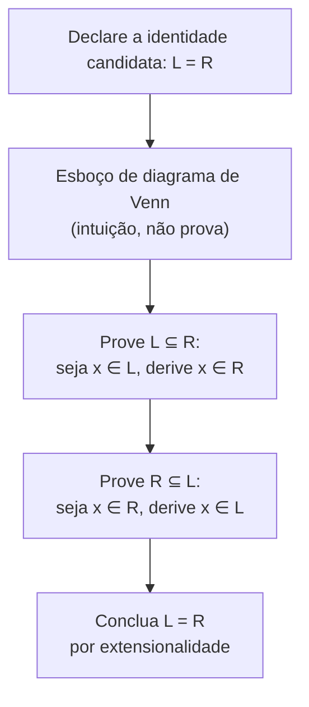

## Objetivos de Aprendizagem

- Ler as regiões de um diagrama de Venn como correspondendo a toda combinação possível de pertinência entre os conjuntos mostrados, e usar um deles para conjecturar uma identidade candidata de conjuntos.
- Explicar precisamente por que um diagrama de Venn, por mais preciso que seja para os conjuntos que retrata, não constitui por si só uma prova de uma identidade geral de conjuntos.
- Provar uma identidade de conjuntos rigorosamente via a técnica de dupla inclusão (subconjunto mútuo), rastreando um elemento arbitrário pelas duas direções de implicação.
- Verificar uma identidade candidata de conjuntos usando uma tabela de pertinência, e relacionar sua estrutura diretamente a uma tabela-verdade de lógica proposicional.
- Declarar e provar as leis de De Morgan para conjuntos, e identificar por que diagramas de Venn deixam de ser uma ferramenta prática quando quatro ou mais conjuntos estão envolvidos.

## Contexto e Motivação

Um diagrama de Venn de três círculos é uma das imagens mais imediatamente persuasivas de toda a matemática: sombreie as regiões certas, e uma identidade como `A ∩ (B ∪ C) = (A ∩ B) ∪ (A ∩ C)` parece evidentemente verdadeira por si só, a área sombreada à esquerda bate visualmente com a área sombreada à direita. Esse poder persuasivo é exatamente por que diagramas de Venn valem a pena dominar como ferramenta de descoberta e comunicação, e exatamente por que eles *não* são aceitos, nesta disciplina ou em qualquer texto matemático rigoroso, como substituto de uma prova. Uma figura desenhada para três conjuntos específicos e posicionados de forma genérica não pode certificar que a identidade vale para *todo* A, B e C possíveis, incluindo casos degenerados onde conjuntos coincidem, são vazios, ou são subconjuntos um do outro, nenhum dos quais um único diagrama de aparência genérica necessariamente representa corretamente. Tanto o Mathematics for Computer Science do MIT quanto o CS103 de Stanford usam diagramas de Venn intensamente como *bombas de intuição* exatamente por essa razão, ao mesmo tempo em que insistem que toda identidade de fato afirmada numa prova recebe um argumento real de dupla inclusão para sustentá-la.

Também existe um teto prático rígido para o que diagramas de Venn conseguem fazer. Três círculos sobrepostos recortam o plano de forma limpa em todas as `2³ = 8` combinações de pertinência (em A, em B, em C, e toda combinação de estar fora de cada um), o que é exatamente por que diagramas de Venn de três conjuntos parecem tão limpos. Quatro conjuntos já quebram isso: nenhum arranjo de quatro círculos consegue produzir todas as `2⁴ = 16` regiões com sobreposições circulares simples, o que é por que diagramas de Venn de quatro conjuntos são convencionalmente desenhados com elipses num arranjo assimétrico e consideravelmente menos intuitivo, e por que a abordagem baseada em figura é essencialmente abandonada quando um quinto conjunto é adicionado. Provas rigorosas de perseguição de elemento, em contraste, escalam para qualquer número de conjuntos sem nenhuma perda de clareza, que é a razão real de esta disciplina tratar o diagrama como um degrau em direção à técnica de prova, não como um destino em si.

## Teoria Central

### Lendo um diagrama de Venn: regiões como combinações de pertinência

Um diagrama de Venn para conjuntos `A`, `B`, `C` (desenhado dentro de um retângulo representando o conjunto universo `U`) particiona o plano em regiões, cada uma correspondendo a exatamente uma combinação de "dentro" ou "fora" através dos três conjuntos: a região dentro dos três círculos é `A ∩ B ∩ C`; a região dentro só de `A` é `A ∩ Bᶜ ∩ Cᶜ`; a região fora dos três é `Aᶜ ∩ Bᶜ ∩ Cᶜ`, e assim por diante para as oito combinações. Sombrear a região (ou regiões) correspondendo a uma expressão de conjunto torna essa expressão visível diretamente, e comparar as regiões sombreadas produzidas pelos dois lados de uma identidade candidata é exatamente como um matemático *descobre* quais identidades valem a pena tentar provar; o diagrama é uma excelente ferramenta geradora de hipóteses, e genuinamente útil para construir intuição antes de se comprometer com a prova rigorosa, mais trabalhosa.

### Por que um diagrama sozinho não prova uma identidade

Um diagrama de Venn específico é desenhado com três círculos numa posição genérica de sobreposição, assumindo implicitamente que toda combinação dos três conjuntos é não vazia e que nenhum é subconjunto de outro. Uma identidade geral, em contraste, é uma afirmação sobre *todo* A, B, C possíveis, incluindo casos onde, digamos, `A ∩ B = ∅`, ou `A ⊆ C`, que um único diagrama desenhado genericamente não necessariamente representa, e para o qual o diagrama não dá mecanismo nenhum de checagem sistemática. O diagrama também não dá forma de lidar com uma afirmação sobre conjuntos definidos abstratamente (por um predicado, em vez de como uma pequena região desenhada), que é precisamente a forma que a maioria das identidades de conjuntos assume quando deixam de ser exemplos de brinquedo. O conserto é a mesma técnica de dupla inclusão introduzida para provas de subconjunto em *Conjuntos, Subconjuntos e Operações de Conjuntos*: provar a identidade mostrando que cada lado é subconjunto do outro, via um argumento que vale para um elemento arbitrário e conjuntos arbitrários, sem apelar para uma figura de forma alguma.

### Tabelas de pertinência: o análogo em teoria dos conjuntos de uma tabela-verdade

Uma **tabela de pertinência** lista toda combinação de "dentro" (1) ou "fora" (0) para um elemento `x` através dos conjuntos envolvidos, e computa a pertinência resultante em cada lado de uma identidade candidata, estruturalmente idêntica a uma tabela-verdade proposicional, porque "x está em A ∪ B" é, por baixo da notação, exatamente a pergunta proposicional "(x ∈ A) OU (x ∈ B) é verdadeiro."

| A | B | C | B ∪ C | A ∩ (B ∪ C) | A ∩ B | A ∩ C | (A∩B) ∪ (A∩C) |
|---|---|---|-------|-------------|-------|-------|----------------|
| 1 | 1 | 1 | 1 | 1 | 1 | 1 | 1 |
| 1 | 1 | 0 | 1 | 1 | 1 | 0 | 1 |
| 1 | 0 | 1 | 1 | 1 | 0 | 1 | 1 |
| 1 | 0 | 0 | 0 | 0 | 0 | 0 | 0 |
| 0 | 1 | 1 | 1 | 0 | 0 | 0 | 0 |
| 0 | 1 | 0 | 1 | 0 | 0 | 0 | 0 |
| 0 | 0 | 1 | 1 | 0 | 0 | 0 | 0 |
| 0 | 0 | 0 | 0 | 0 | 0 | 0 | 0 |

As duas últimas colunas concordam nas 8 linhas: uma checagem exaustiva de que `A ∩ (B ∪ C) = (A ∩ B) ∪ (A ∩ C)` para toda combinação de pertinência, confirmando (com a mesma ressalva de "exaustivo mas escalável só até certo ponto" das tabelas-verdade) exatamente o que a prova por dupla inclusão abaixo estabelece em geral.

### As identidades padrão de conjuntos

| Lei | Forma |
|---|---|
| Comutativa | `A ∪ B = B ∪ A`, `A ∩ B = B ∩ A` |
| Associativa | `(A∪B)∪C = A∪(B∪C)`, similarmente para `∩` |
| Distributiva | `A∩(B∪C) = (A∩B)∪(A∩C)`, `A∪(B∩C) = (A∪B)∩(A∪C)` |
| De Morgan | `(A∪B)ᶜ = Aᶜ∩Bᶜ`, `(A∩B)ᶜ = Aᶜ∪Bᶜ` |
| Duplo complemento | `(Aᶜ)ᶜ = A` |
| Identidade | `A ∪ ∅ = A`, `A ∩ U = A` |
| Leis do complemento | `A ∪ Aᶜ = U`, `A ∩ Aᶜ = ∅` |

Cada uma dessas é o espelho direto, em teoria dos conjuntos, de uma lei de equivalência proposicional de *Equivalência Lógica e Tautologias*: comutatividade, associatividade, distributividade e De Morgan aparecem nas duas tabelas com a estrutura idêntica, porque `∪`, `∩` e complemento são literalmente `∨`, `∧` e `¬` aplicados a predicados de pertinência, como estabelecido em *Conjuntos, Subconjuntos e Operações de Conjuntos*.

### As leis de De Morgan para conjuntos, provadas

`(A ∪ B)ᶜ = Aᶜ ∩ Bᶜ`. *(⊆)* Seja `x ∈ (A ∪ B)ᶜ`. Então `x ∉ A ∪ B`, então `x` não está nem em `A` nem em `B` (se estivesse em qualquer um dos dois, estaria na união), isto é, `x ∈ Aᶜ` e `x ∈ Bᶜ`, então `x ∈ Aᶜ ∩ Bᶜ`. *(⊇)* Seja `x ∈ Aᶜ ∩ Bᶜ`. Então `x ∉ A` e `x ∉ B`, então `x` não está em nenhum dos dois, logo `x ∉ A ∪ B`, então `x ∈ (A ∪ B)ᶜ`. As duas direções valem, então os conjuntos são iguais. Note que essa prova é, linha por linha, a tradução em teoria dos conjuntos da prova proposicional de que `¬(p ∨ q) ≡ ¬p ∧ ¬q`: pertinência numa união é "ou", e o complemento a nega, que é exatamente a lei de De Morgan para proposições vestindo notação de conjuntos.

## Exemplos Resolvidos

### Exemplo 1: a lei distributiva, da figura à prova rigorosa

**Problema:** prove `A ∩ (B ∪ C) = (A ∩ B) ∪ (A ∩ C)` rigorosamente, depois de usar o diagrama de Venn e a tabela de pertinência acima só como intuição.

*(⊆)* Seja `x ∈ A ∩ (B ∪ C)`. Pela definição de interseção, `x ∈ A` e `x ∈ B ∪ C`. Pela definição de união, `x ∈ B ∪ C` significa `x ∈ B` ou `x ∈ C` (ou ambos). *Caso 1:* `x ∈ B`. Combinado com `x ∈ A`, isso dá `x ∈ A ∩ B`, então `x ∈ (A∩B) ∪ (A∩C)`. *Caso 2:* `x ∈ C`. Combinado com `x ∈ A`, isso dá `x ∈ A ∩ C`, então de novo `x ∈ (A∩B) ∪ (A∩C)`. Qualquer um dos casos dá o resultado, então `A ∩ (B∪C) ⊆ (A∩B) ∪ (A∩C)`.

*(⊇)* Seja `x ∈ (A∩B) ∪ (A∩C)`. *Caso 1:* `x ∈ A ∩ B`, então `x ∈ A` e `x ∈ B`; como `x ∈ B`, também `x ∈ B ∪ C`, então `x ∈ A ∩ (B∪C)`. *Caso 2:* `x ∈ A ∩ C`, então `x ∈ A` e `x ∈ C`; como `x ∈ C`, também `x ∈ B ∪ C`, então de novo `x ∈ A ∩ (B∪C)`. Qualquer um dos casos dá o resultado, então `(A∩B) ∪ (A∩C) ⊆ A ∩ (B∪C)`.

As duas direções valem, então os conjuntos são iguais. Note que a prova precisou de uma divisão em casos exatamente no ponto onde o diagrama mostrava duas sub-regiões sombreadas se fundindo numa só; a figura corretamente previu *onde* o argumento se ramificaria, mesmo não conseguindo, sozinha, estabelecer o resultado para A, B, C arbitrários.

### Exemplo 2: provando a segunda lei de De Morgan por tradução direta

**Problema:** prove `(A ∩ B)ᶜ = Aᶜ ∪ Bᶜ`.

*(⊆)* Seja `x ∈ (A ∩ B)ᶜ`. Então `x ∉ A ∩ B`, significando que *não* é o caso de `x ∈ A` e `x ∈ B` valerem os dois, então pelo menos um de `x ∉ A` ou `x ∉ B` vale (isso é exatamente o fato proposicional `¬(p ∧ q) ≡ ¬p ∨ ¬q` aplicado a `p: x∈A`, `q: x∈B`). Qualquer um dos disjuntos dá `x ∈ Aᶜ ∪ Bᶜ`.

*(⊇)* Seja `x ∈ Aᶜ ∪ Bᶜ`. Então `x ∈ Aᶜ` ou `x ∈ Bᶜ`, ou seja, `x ∉ A` ou `x ∉ B`. De qualquer forma, não pode ser que `x ∈ A` e `x ∈ B` valham os dois simultaneamente, então `x ∉ A ∩ B`, isto é, `x ∈ (A ∩ B)ᶜ`.

As duas direções valem; os conjuntos são iguais. Vale a pena comparar essa prova linha por linha com a prova proposicional de De Morgan de *Equivalência Lógica e Tautologias*: o argumento em teoria dos conjuntos não faz nada além de reafirmar o proposicional com afirmações-`∈` no lugar de variáveis proposicionais.

### Exemplo 3: uma identidade de diferença de conjuntos, e onde o diagrama correspondente se torna pouco confiável

**Problema:** prove `A \ (B ∩ C) = (A \ B) ∪ (A \ C)`.

*(⊆)* Seja `x ∈ A \ (B∩C)`. Então `x ∈ A` e `x ∉ B ∩ C`, então não é o caso de `x` estar em ambos `B` e `C`; pelo menos um de `x ∉ B` ou `x ∉ C` vale. Se `x ∉ B`: combinado com `x ∈ A`, isso dá `x ∈ A \ B`, então `x ∈ (A\B) ∪ (A\C)`. Se `x ∉ C`: combinado com `x ∈ A`, isso dá `x ∈ A \ C`, então de novo `x ∈ (A\B) ∪ (A\C)`.

*(⊇)* Seja `x ∈ (A\B) ∪ (A\C)`. Se `x ∈ A \ B`: então `x ∈ A` e `x ∉ B`, então certamente `x ∉ B ∩ C` (falhar em estar em `B` sozinho já basta), dando `x ∈ A \ (B∩C)`. Se `x ∈ A \ C`: argumento simétrico, `x ∉ C` sozinho já basta para excluir `x` de `B ∩ C`, de novo dando `x ∈ A \ (B∩C)`.

As duas direções valem; os conjuntos são iguais. Um diagrama de Venn de três círculos para essa identidade já é visualmente mais carregado que o diagrama da lei distributiva do Exemplo 1, porque regiões de diferença exigem rastrear exclusão de dois conjuntos ao mesmo tempo, uma prévia de por que, uma vez que um quarto conjunto é introduzido em qualquer identidade, esboçar um diagrama confiável deixa de ser um primeiro passo prático de qualquer forma, e a prova por dupla inclusão se torna a única rota confiável.

## Equívocos Comuns e Armadilhas

- **Tratar "a figura parece certa para esses conjuntos" como uma prova completa.** Um diagrama de Venn é desenhado para uma configuração de aparência genérica; ele não diz nada de certo sobre casos degenerados (algum conjunto vazio, um conjunto contido em outro, dois conjuntos iguais) para os quais a mesma identidade também precisa valer. Só um argumento de dupla inclusão, válido para conjuntos arbitrários, fecha essa lacuna.
- **Sombrear a região errada por contar mal as sobreposições.** Um erro frequente ao desenhar à mão é sombrear `A ∩ B` como "tudo dentro do círculo A que toca o círculo B" em vez de precisamente a região em forma de lente dentro dos *dois* círculos simultaneamente; conferir contra a definição formal de pertinência (como na tabela acima) pega isso de um jeito que olhar para um diagrama desenhado à mão não pega.
- **Assumir que diagramas de Venn generalizam sem problemas para quatro ou mais conjuntos.** Três círculos produzem de forma limpa todas as `2³ = 8` regiões; quatro círculos não conseguem produzir todas as `2⁴ = 16` regiões com sobreposições circulares simples de forma alguma, forçando um arranjo assimétrico de elipses consideravelmente mais difícil de ler corretamente; além de três ou quatro conjuntos, diagramas deixam de ser uma ferramenta prática de verificação, enquanto provas por dupla inclusão escalam para qualquer número de conjuntos sem dificuldade conceitual adicional.
- **Provar só uma direção de um argumento de dupla inclusão e tratar isso como o resultado completo.** Os Exemplos 1 a 3 exigem cada um *ambas* as direções de `⊆`; uma prova que para depois de mostrar `L ⊆ R` só mostrou que `L` não é maior que `R`, não que são iguais; `R` ainda poderia conter elementos extras que não estão em `L`.
- **Rederivar cada identidade de conjuntos a partir de definições brutas de pertinência em vez de reconhecê-la como tradução direta de uma lei proposicional já provada.** Toda identidade na tabela acima já tem uma contraparte em lógica proposicional provada em *Equivalência Lógica e Tautologias*; reconhecer a correspondência (∪↔∨, ∩↔∧, complemento↔¬) transforma uma derivação nova numa observação de duas linhas: "isso é aquela identidade, reafirmada".

## Resumo

Um diagrama de Venn é uma ferramenta genuinamente valiosa para descobrir e comunicar uma identidade candidata de conjuntos (suas regiões correspondem exatamente a toda combinação de pertinência entre os conjuntos mostrados), mas nunca é, por si só, uma prova, porque retrata uma configuração genérica em vez de certificar a afirmação para toda escolha possível de conjuntos, incluindo os degenerados. Provas rigorosas de identidade de conjuntos usam a técnica de dupla inclusão herdada do método de prova de subconjunto em *Conjuntos, Subconjuntos e Operações de Conjuntos*: mostrar que cada lado é subconjunto do outro via um argumento válido para um elemento arbitrário, e então concluir igualdade por extensionalidade. Tabelas de pertinência dão uma checagem exaustiva, tipo tabela-verdade, estruturalmente idêntica a tabelas-verdade proposicionais, porque toda operação de conjunto é um conectivo proposicional aplicado a predicados de pertinência, que é também por que as leis de De Morgan, distributividade, comutatividade e associatividade todas se transferem da lógica proposicional para conjuntos com a forma idêntica. Diagramas de Venn funcionam bem para dois ou três conjuntos mas quebram como técnica prática em quatro ou mais, que é exatamente o ponto em que o método de prova rigoroso e sem diagrama se torna não só mais rigoroso mas o único que de fato funciona.

## Documentation Links

- [ACM/IEEE CS2013 Curriculum Guidelines](https://www.acm.org/binaries/content/assets/education/cs2013_web_final.pdf) — doc
- [ACM/IEEE Curricular Mapping — Discrete Structures](https://curricula.cs.luc.edu/12-discrete-structures/content.html) — doc
