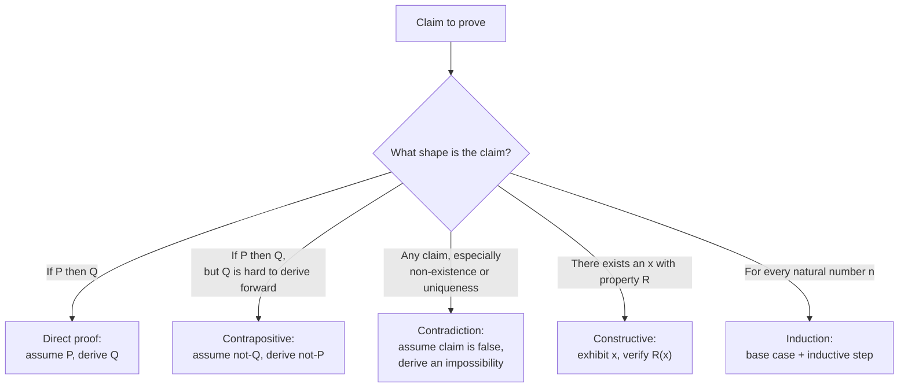

## Learning Objectives

- Explain what makes an argument a mathematical proof, as distinct from a persuasive explanation, an example, or an appeal to authority.
- Identify the logical skeleton (hypotheses, claim, chain of justified steps) inside an informal piece of mathematical writing.
- Distinguish a proof from strong-but-inconclusive evidence, such as a pattern that holds for every case checked so far.
- Compare the standards of rigor expected in a mathematical proof against those of an everyday convincing argument.
- Construct a short, valid proof of a simple universal claim about integers, stating explicitly which hypothesis licenses which step.

## Context & Motivation

Every working programmer already trusts certain claims without re-deriving them: that sorting a list of `n` items with a correct comparison sort takes at most `O(n log n)` comparisons, that a hash table lookup is `O(1)` on average, that a particular recursive function terminates. Somewhere behind each of those claims sits a proof — a demonstration that the claim is not merely true in the cases anyone has tried, but true in *every* case the claim covers, for reasons that can be checked step by step by another person, with no room left for "it just seems to work." Computer science leans on proof for exactly the reason it leans on code review: a program that passes every test you happened to write can still be wrong on an input you didn't think of, and a mathematical claim that holds for every case you happened to check can still be false on a case you didn't check. Proof is the discipline that closes that gap completely, for every case, not just the ones tried.

This is not a pedantic distinction. Mathematics is full of claims that look true for a very long stretch of small cases and then fail. The polynomial `n² + n + 41` produces a prime number for every integer `n` from `0` to `39` — forty consecutive successes — and then produces `41² `, which is not prime, at `n = 40`. Euler conjectured that no three fourth powers sum to a fourth power, based on a mountain of unsuccessful attempts to find a counterexample; a counterexample was eventually found, but only after decades and only because someone eventually proved it existed rather than continuing to search by hand. In each case, pattern and plausibility pointed one way and the truth turned out to be more subtle. A proof is what stands between "this appears to always work" and "this is guaranteed to always work" — and in a field like computer science, where a single edge case can crash a system or open a security hole, that gap is the whole game.

MIT's 6.042J, *Mathematics for Computer Science*, opens with almost exactly this framing: computer science is unusual among engineering disciplines in that its objects — algorithms, data structures, protocols — are precise enough to be reasoned about with full mathematical rigor, and increasingly, correctness claims about them are expected to be backed by exactly that kind of reasoning rather than by testing alone. A proof of an algorithm's correctness, a proof that a protocol can't be forced into a bad state, a proof that a data structure maintains an invariant across every operation that touches it — these are not decorative mathematics bolted onto engineering; they are the strongest kind of engineering guarantee available, precisely because they cover every case rather than the cases someone thought to test. Learning to read and write proofs is learning to reason at that same level of certainty.

## Core Theory

### What a proof actually is

A **mathematical proof** is a finite sequence of statements, each of which is either a previously established fact (an axiom, a definition, or a theorem already proved) or follows from earlier statements in the sequence by a valid rule of logical inference, ending in the statement to be established (the **claim**, or **theorem**). Nothing in that sequence is permitted to rest on intuition, on an appeal to a pattern observed in examples, or on an appeal to the claim's plausibility. Every step must be *justified* — traceable back, in principle, to definitions and previously accepted results by nothing but logical necessity. This is what "rigor" means in this context: not excessive formality for its own sake, but the property that a skeptical, careful reader who accepts the starting definitions has no way to reject any individual step, and therefore no way to reject the conclusion.

Formally, a proof of a statement `P` (often itself of the shape "for every x in some domain, Q(x) holds," written ∀x Q(x)) is built from the **hypotheses** — the assumptions the proof is allowed to use, drawn from the statement itself, prior definitions, and prior theorems — through a chain of implications, each justified by a rule of inference (modus ponens: from `A` and `A → B`, conclude `B`; universal instantiation: from ∀x Q(x), conclude Q(c) for a specific c; and others), until `P` itself has been derived. The chain can be short — a single obvious step — or extremely long, but its validity does not depend on its length: a hundred-page proof is no more or less rigorous than a two-line one, provided every step in each is equally justified.

### Proof versus evidence: the crucial distinction

A pattern that has been checked and holds in every case examined is **evidence** for a universal claim, not a **proof** of it, unless the checking itself covers every case there is (which is only possible when the domain is finite and small enough to check exhaustively — this is called *proof by exhaustion*, and it is a legitimate proof technique precisely because it does cover every case). The moment the domain is infinite — "every integer," "every graph," "every sorting algorithm" — no finite amount of checking can ever amount to a proof, no matter how many cases are tried, because there is always another case left unchecked. This is the single most important thing to internalize about what a proof is *for*: it is the technique that lets a finite argument establish a claim about an infinite domain, something no amount of example-checking can ever do on its own.

The `n² + n + 41` example above is the canonical illustration: forty straight successes is overwhelming-looking evidence, and it is still not a proof, and it is in fact false as a universal claim. Contrast this with a genuine proof by exhaustion: "every integer between 1 and 20 that is divisible by both 4 and 6 is divisible by 12" can legitimately be proved by checking all twenty cases directly, because the domain (integers 1 through 20) is finite and the check is genuinely exhaustive — nothing is left uncovered. The difference between the two examples is not the amount of checking; it's whether the domain checked is the *entire* domain the claim is about.

### Direct, indirect, and constructive proof, at a glance

Different claims call for different proof strategies, several of which have dedicated treatments elsewhere in this course (direct proof, contraposition, contradiction, induction). At the level of "what is a proof" it is enough to see that they share the same underlying standard — every step justified, no gaps — while differing in *shape*:

- A **direct proof** of "if P then Q" assumes P and derives Q through a forward chain of implications.
- An **indirect proof** establishes "if P then Q" by proving the logically equivalent contrapositive, "if not Q then not P," instead — useful exactly when reasoning forward from P is harder than reasoning backward from ¬Q.
- A **proof by contradiction** assumes the *negation* of the claim, derives a logical impossibility from that assumption, and concludes the claim must therefore be true.
- A **constructive proof** of an existence claim ("there exists an x such that...") exhibits a specific x and verifies it works; a **non-constructive proof** of the same claim establishes that such an x must exist without ever producing one — for instance, by contradiction, or by a counting argument (the pigeonhole principle) showing that no assignment avoiding it is possible.

### What proof is not: common but invalid moves

A statement is not proved by restating it in different words, by an example (no matter how suggestive), by an appeal to a diagram alone (a picture can *motivate* a proof but is not itself one, unless every step the picture suggests is separately justified), by an appeal to authority ("a textbook says so" is a reason to look up *that* proof, not a proof in itself), or by assuming the very thing being proved partway through the argument (**circular reasoning**, sometimes called *begging the question*). Each of these can feel convincing, and each of them fails the same test: a careful, skeptical reader who does not already believe the claim has a legitimate way to say "that step doesn't follow."

## Worked Examples

### Example 1 — a direct proof, with every step made explicit

**Claim:** for every integer n, if n is even, then n² is even.

*Proof.* Let n be an arbitrary integer, and suppose n is even. By the definition of "even," this means there exists an integer k such that n = 2k. Then:

n² = (2k)² = 4k² = 2(2k²)

Since 2k² is an integer (the integers are closed under multiplication), n² has the form 2·(some integer), which is exactly the definition of "even." Since n was an arbitrary even integer, this holds for every even integer, establishing the claim. ∎

Every step here traces back to something already accepted: the definition of "even" (used twice — once to unpack the hypothesis, once to recognize the conclusion), ordinary algebra, and the closure of the integers under multiplication. Nothing was assumed beyond the stated hypothesis, and nothing was asserted without a reason a skeptical reader could check.

### Example 2 — evidence is not proof, made concrete

**Claim under test:** "for every positive integer n, n² − n + 41 is prime."

Checking small cases: n = 1 gives 41 (prime); n = 2 gives 43 (prime); n = 3 gives 47 (prime); continuing this way, every value from n = 1 through n = 40 produces a prime — forty consecutive confirmations, which is a great deal of evidence by ordinary standards.

But at n = 41: 41² − 41 + 41 = 41², which is 41 × 41 — not prime, since it has 41 as a proper factor. The claim is false, despite forty straight successes. The lesson is procedural as much as mathematical: checking cases, however many, never proves a ∀n claim over an infinite domain, and this example is worth remembering precisely because the failure is so late and so easy to miss if the habit is "check a few cases and stop."

### Example 3 — a proof by exhaustion, where checking cases genuinely is a valid proof

**Claim:** every integer n with 1 ≤ n ≤ 15 that is divisible by both 3 and 5 is divisible by 15.

*Proof.* The domain here — integers from 1 to 15 — is finite, so every case can be checked directly. The only multiples of 3 in this range are 3, 6, 9, 12, 15; of these, only 15 is also a multiple of 5. Checking the one remaining value: 15 is indeed divisible by 15. Since every value in the finite domain satisfying the hypothesis has been checked and satisfies the conclusion, the claim holds for the entire domain. ∎

This looks superficially like Example 2's flawed reasoning — "check some cases" — but the crucial difference is that the domain (1 through 15) is *entirely* finite and *entirely* covered by the check, whereas Example 2's domain was all positive integers, an infinite set no finite check can exhaust. Proof by exhaustion is legitimate exactly when, and only when, the exhaustion is total.

## Common Misconceptions & Pitfalls

- **"I checked several cases and it always worked, so it's proved."** As Example 2 shows concretely, this reasoning fails for any infinite domain no matter how many cases are checked — n² + n + 41 stays prime for forty straight integers and then fails. Evidence accumulated from examples is a reason to *attempt* a proof, never a substitute for one, unless the domain checked is provably the entire domain (proof by exhaustion).
- **"A convincing diagram is a proof."** A diagram can illustrate why a claim is plausible or suggest the shape a proof should take, but a diagram alone typically hides assumptions (that the picture generalizes, that no special case looks different) that a rigorous proof has to state and justify explicitly.
- **"If I can't find a counterexample, the claim must be true."** Failing to find a counterexample after a reasonable search is weak evidence at best; it is not a proof, and history is full of claims (Euler's sum-of-powers conjecture among them) that resisted counterexamples for a long time before one was found.
- **"Restating the claim in other words, more confidently, counts as proving it."** This is circular reasoning in a mild disguise — if the "proof" at some point uses (even implicitly) the very fact it is trying to establish, it has proved nothing, regardless of how many words surround that step.
- **"A proof by exhaustion over a few cases and a genuine ∀n proof over an infinite set are the same kind of argument, just at different scales."** They are not: Example 3's proof is airtight because 1–15 is the *entire* domain of the claim; no finite prefix of "every positive integer" is ever the entire domain of a claim about all positive integers, so the same style of argument that works for Example 3 cannot be stretched to cover Example 2's claim.

## Summary

A mathematical proof is a finite, fully justified chain of statements — each one a definition, an established fact, or a valid logical consequence of earlier statements — that establishes a claim with certainty over its *entire* stated domain, not merely over the cases someone happened to check. This is what separates proof from evidence: evidence accumulated from examples can make a universal claim over an infinite domain look overwhelmingly likely and still leave it false, as n² + n + 41 demonstrates concretely, whereas proof by exhaustion is legitimate precisely because and only because it covers a domain that is genuinely finite and genuinely fully checked. Different claims call for different proof shapes — direct, contrapositive, contradiction, constructive, inductive — but all of them share the same non-negotiable standard: every step traceable back to definitions and prior results by logical necessity alone, with no step resting on intuition, authority, diagrams alone, or the claim itself. That standard is exactly why computer science treats proof as a first-class engineering tool: it is the only technique available that can close the gap between "works on every test I wrote" and "guaranteed to work on every input there is."

## Documentation Links

- [MIT 6.042J — Syllabus (OCW)](https://ocw.mit.edu/courses/6-042j-mathematics-for-computer-science-fall-2010/pages/syllabus/) — doc
- [Lehman, Leighton & Meyer — Mathematics for Computer Science (full text)](https://people.csail.mit.edu/meyer/mcs.pdf) — doc
