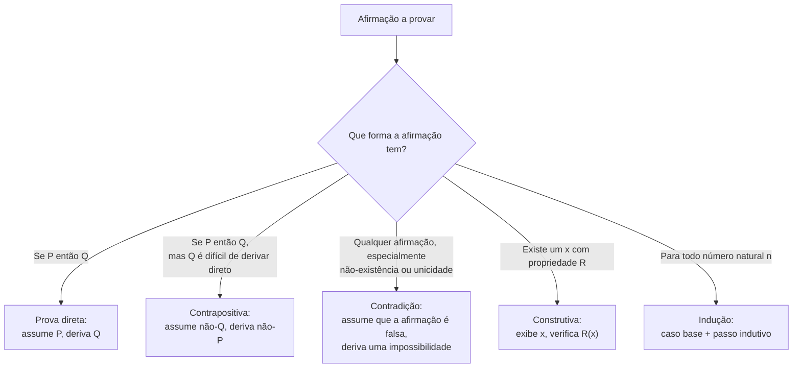

## Objetivos de Aprendizagem

- Explicar o que faz um argumento ser uma prova matemática, em contraste com uma explicação persuasiva, um exemplo ou um apelo à autoridade.
- Identificar o esqueleto lógico (hipóteses, afirmação, cadeia de passos justificados) dentro de um texto matemático informal.
- Distinguir uma prova de evidência forte, mas inconclusiva, como um padrão que vale em todo caso checado até agora.
- Comparar o padrão de rigor esperado numa prova matemática com o de um argumento convincente do dia a dia.
- Construir uma prova curta e válida de uma afirmação universal simples sobre inteiros, declarando explicitamente qual hipótese licencia qual passo.

## Contexto e Motivação

Todo programador em atividade já confia em certas afirmações sem rederivá-las: que ordenar uma lista de `n` itens com um comparador correto leva no máximo `O(n log n)` comparações, que uma busca em tabela hash é `O(1)` em média, que uma função recursiva específica termina. Por trás de cada uma dessas afirmações existe uma prova: uma demonstração de que a afirmação não é apenas verdadeira nos casos que alguém tentou, mas verdadeira em *todo* caso que ela cobre, por razões que podem ser checadas passo a passo por outra pessoa, sem deixar espaço para um "simplesmente parece funcionar". Ciência da Computação se apoia em prova exatamente pela mesma razão que se apoia em revisão de código: um programa que passa em todo teste que você escreveu ainda pode estar errado numa entrada que você não considerou, e uma afirmação matemática que vale em todo caso que você checou ainda pode ser falsa num caso que você não checou. Prova é a disciplina que fecha essa lacuna por completo, para todo caso, não só os testados.

Essa não é uma distinção pedante. A matemática está cheia de afirmações que parecem verdadeiras por um longo trecho de casos pequenos e depois falham. O polinômio `n² + n + 41` produz um número primo para todo inteiro `n` de `0` a `39` (quarenta sucessos consecutivos) e então produz `41²`, que não é primo, em `n = 40`. Euler conjecturou que nenhuma soma de três quartas potências resulta numa quarta potência, baseado numa montanha de tentativas frustradas de achar um contraexemplo; um contraexemplo acabou sendo encontrado, mas só depois de décadas, e só porque alguém finalmente provou que ele existia em vez de continuar procurando à mão. Em cada caso, padrão e plausibilidade apontavam para um lado e a verdade acabou sendo mais sutil. Uma prova é o que separa "isto parece sempre funcionar" de "isto está garantido a sempre funcionar", e num campo como Ciência da Computação, onde um único caso extremo pode derrubar um sistema ou abrir uma brecha de segurança, essa lacuna é o jogo inteiro.

O 6.042J do MIT, *Mathematics for Computer Science*, abre com quase exatamente esse enquadramento: Ciência da Computação é incomum entre as disciplinas de engenharia porque seus objetos (algoritmos, estruturas de dados, protocolos) são precisos o bastante para serem raciocinados com rigor matemático completo, e cada vez mais se espera que afirmações de corretude sobre eles sejam sustentadas exatamente por esse tipo de raciocínio, não só por teste. Uma prova da corretude de um algoritmo, uma prova de que um protocolo não pode ser forçado a um estado ruim, uma prova de que uma estrutura de dados mantém um invariante através de toda operação que a toca: nada disso é matemática decorativa colada em cima da engenharia; é o tipo mais forte de garantia de engenharia disponível, precisamente porque cobre todo caso, não só os casos que alguém pensou em testar. Aprender a ler e escrever provas é aprender a raciocinar nesse mesmo nível de certeza.

## Teoria Central

### O que uma prova realmente é

Uma **prova matemática** é uma sequência finita de afirmações, cada uma sendo um fato já estabelecido (um axioma, uma definição, ou um teorema já provado) ou decorrendo de afirmações anteriores na sequência por uma regra válida de inferência lógica, terminando na afirmação a ser estabelecida (a **afirmação**, ou **teorema**). Nada nessa sequência tem permissão para se apoiar em intuição, num apelo a um padrão observado em exemplos, ou num apelo à plausibilidade da afirmação. Todo passo precisa ser *justificado*: rastreável, em princípio, até definições e resultados já aceitos, por nada além de necessidade lógica. É isso que "rigor" significa neste contexto: não formalidade excessiva por si só, mas a propriedade de que um leitor cético e cuidadoso que aceita as definições de partida não tem como rejeitar nenhum passo individual, e portanto não tem como rejeitar a conclusão.

Formalmente, uma prova de uma afirmação `P` (muitas vezes ela mesma da forma "para todo x em algum domínio, Q(x) vale", escrita ∀x Q(x)) é construída a partir das **hipóteses** (as suposições que a prova tem permissão de usar, tiradas da própria afirmação, de definições prévias e de teoremas prévios) através de uma cadeia de implicações, cada uma justificada por uma regra de inferência (modus ponens: de `A` e `A → B`, conclui-se `B`; instanciação universal: de ∀x Q(x), conclui-se Q(c) para um c específico; e outras), até que `P` em si tenha sido derivado. A cadeia pode ser curta (um único passo óbvio) ou extremamente longa, mas sua validade não depende do comprimento: uma prova de cem páginas não é mais nem menos rigorosa que uma de duas linhas, desde que todo passo em cada uma seja igualmente justificado.

### Prova versus evidência: a distinção crucial

Um padrão que foi checado e vale em todo caso examinado é **evidência** para uma afirmação universal, não uma **prova** dela, a menos que a própria checagem cubra todo caso que existe (o que só é possível quando o domínio é finito e pequeno o suficiente para checar exaustivamente; isso se chama *prova por exaustão*, e é uma técnica de prova legítima precisamente porque cobre todo caso). No instante em que o domínio é infinito ("todo inteiro", "todo grafo", "todo algoritmo de ordenação"), nenhuma quantidade finita de checagem jamais equivale a uma prova, não importa quantos casos sejam testados, porque sempre sobra outro caso não checado. Esta é a coisa mais importante a internalizar sobre para que serve uma prova: é a técnica que permite que um argumento finito estabeleça uma afirmação sobre um domínio infinito, algo que nenhuma quantidade de checagem de exemplos jamais consegue fazer sozinha.

O exemplo `n² + n + 41` acima é a ilustração canônica: quarenta sucessos seguidos é evidência de aparência esmagadora, e ainda assim não é uma prova, e de fato é falso como afirmação universal. Contraste isso com uma prova por exaustão genuína: "todo inteiro entre 1 e 20 que é divisível tanto por 4 quanto por 6 é divisível por 12" pode ser legitimamente provado checando os vinte casos diretamente, porque o domínio (inteiros de 1 a 20) é finito e a checagem é genuinamente exaustiva, nada fica descoberto. A diferença entre os dois exemplos não é a quantidade de checagem; é se o domínio checado é o domínio *inteiro* sobre o qual a afirmação fala.

### Prova direta, indireta e construtiva, num relance

Afirmações diferentes pedem estratégias de prova diferentes, várias das quais têm tratamento dedicado em outro ponto deste curso (prova direta, contraposição, contradição, indução). No nível de "o que é uma prova" basta ver que elas compartilham o mesmo padrão subjacente (todo passo justificado, sem lacunas) enquanto diferem em *forma*:

- Uma **prova direta** de "se P então Q" assume P e deriva Q através de uma cadeia direta de implicações.
- Uma **prova indireta** estabelece "se P então Q" provando a contrapositiva logicamente equivalente, "se não Q então não P", em vez disso, útil exatamente quando raciocinar para frente a partir de P é mais difícil que raciocinar para trás a partir de ¬Q.
- Uma **prova por contradição** assume a *negação* da afirmação, deriva uma impossibilidade lógica a partir dessa suposição, e conclui que a afirmação deve portanto ser verdadeira.
- Uma **prova construtiva** de uma afirmação de existência ("existe um x tal que...") exibe um x específico e verifica que ele funciona; uma **prova não construtiva** da mesma afirmação estabelece que tal x precisa existir sem nunca produzir um, por exemplo, por contradição, ou por um argumento de contagem (o princípio da casa dos pombos) mostrando que nenhuma atribuição que o evite é possível.

### O que uma prova não é: movimentos comuns, porém inválidos

Uma afirmação não é provada reformulando-a com outras palavras, por um exemplo (por mais sugestivo que seja), por um apelo a um diagrama sozinho (uma figura pode *motivar* uma prova mas não é ela mesma uma, a menos que todo passo que a figura sugere seja separadamente justificado), por um apelo à autoridade ("um livro-texto diz isso" é uma razão para procurar *aquela* prova, não uma prova em si), ou assumindo a própria coisa que está sendo provada no meio do argumento (**raciocínio circular**, às vezes chamado de *petição de princípio*). Cada um desses pode parecer convincente, e cada um deles falha no mesmo teste: um leitor cuidadoso e cético que ainda não acredita na afirmação tem uma forma legítima de dizer "esse passo não decorre".

## Exemplos Resolvidos

### Exemplo 1: uma prova direta, com todo passo explicitado

**Afirmação:** para todo inteiro n, se n é par, então n² é par.

*Prova.* Seja n um inteiro arbitrário, e suponha que n é par. Pela definição de "par", isso significa que existe um inteiro k tal que n = 2k. Então:

n² = (2k)² = 4k² = 2(2k²)

Como 2k² é um inteiro (os inteiros são fechados sob multiplicação), n² tem a forma 2·(algum inteiro), que é exatamente a definição de "par". Como n era um inteiro par arbitrário, isso vale para todo inteiro par, estabelecendo a afirmação. ∎

Todo passo aqui remonta a algo já aceito: a definição de "par" (usada duas vezes, uma para desempacotar a hipótese, outra para reconhecer a conclusão), álgebra comum, e o fechamento dos inteiros sob multiplicação. Nada foi assumido além da hipótese declarada, e nada foi afirmado sem uma razão que um leitor cético pudesse checar.

### Exemplo 2: evidência não é prova, de forma concreta

**Afirmação sob teste:** "para todo inteiro positivo n, n² − n + 41 é primo."

Checando casos pequenos: n = 1 dá 41 (primo); n = 2 dá 43 (primo); n = 3 dá 47 (primo); continuando assim, todo valor de n = 1 até n = 40 produz um primo, quarenta confirmações consecutivas, o que é uma quantidade e tanto de evidência pelos padrões comuns.

Mas em n = 41: 41² − 41 + 41 = 41², que é 41 × 41, não primo, já que tem 41 como fator próprio. A afirmação é falsa, apesar de quarenta sucessos seguidos. A lição é tanto procedimental quanto matemática: checar casos, por mais numerosos que sejam, nunca prova uma afirmação ∀n sobre um domínio infinito, e este exemplo vale a pena lembrar precisamente porque a falha acontece tão tarde e é tão fácil de perder se o hábito for "checar alguns casos e parar".

### Exemplo 3: uma prova por exaustão, onde checar casos genuinamente é uma prova válida

**Afirmação:** todo inteiro n com 1 ≤ n ≤ 15 que é divisível tanto por 3 quanto por 5 é divisível por 15.

*Prova.* O domínio aqui (inteiros de 1 a 15) é finito, então todo caso pode ser checado diretamente. Os únicos múltiplos de 3 nessa faixa são 3, 6, 9, 12, 15; destes, só 15 também é múltiplo de 5. Checando o único valor restante: 15 é de fato divisível por 15. Como todo valor no domínio finito que satisfaz a hipótese foi checado e satisfaz a conclusão, a afirmação vale para o domínio inteiro. ∎

Isso se parece superficialmente com o raciocínio falho do Exemplo 2 ("checar alguns casos"), mas a diferença crucial é que o domínio (1 a 15) é *inteiramente* finito e *inteiramente* coberto pela checagem, enquanto o domínio do Exemplo 2 era todos os inteiros positivos, um conjunto infinito que nenhuma checagem finita consegue exaurir. Prova por exaustão é legítima exatamente quando, e só quando, a exaustão é total.

## Equívocos Comuns e Armadilhas

- **"Checei vários casos e sempre funcionou, então está provado."** Como o Exemplo 2 mostra concretamente, esse raciocínio falha para qualquer domínio infinito não importa quantos casos sejam checados: n² + n + 41 permanece primo por quarenta inteiros seguidos e então falha. Evidência acumulada a partir de exemplos é uma razão para *tentar* uma prova, nunca um substituto para uma, a menos que o domínio checado seja provadamente o domínio inteiro (prova por exaustão).
- **"Um diagrama convincente é uma prova."** Um diagrama pode ilustrar por que uma afirmação é plausível ou sugerir a forma que uma prova deveria ter, mas um diagrama sozinho tipicamente esconde suposições (que a figura generaliza, que nenhum caso especial parece diferente) que uma prova rigorosa precisa declarar e justificar explicitamente.
- **"Se eu não conseguir achar um contraexemplo, a afirmação deve ser verdadeira."** Falhar em achar um contraexemplo depois de uma busca razoável é evidência fraca na melhor das hipóteses; não é uma prova, e a história está cheia de afirmações (a conjectura de Euler sobre soma de potências entre elas) que resistiram a contraexemplos por muito tempo antes de um ser encontrado.
- **"Reformular a afirmação com outras palavras, com mais confiança, conta como prová-la."** Isso é raciocínio circular disfarçado de leve: se a "prova" em algum ponto usa (mesmo implicitamente) o próprio fato que está tentando estabelecer, ela não provou nada, não importa quantas palavras cerquem esse passo.
- **"Uma prova por exaustão sobre poucos casos e uma prova genuína de ∀n sobre um conjunto infinito são o mesmo tipo de argumento, só em escalas diferentes."** Não são: a prova do Exemplo 3 é inatacável porque 1 a 15 é o domínio *inteiro* da afirmação; nenhum prefixo finito de "todo inteiro positivo" é jamais o domínio inteiro de uma afirmação sobre todos os inteiros positivos, então o mesmo estilo de argumento que funciona para o Exemplo 3 não pode ser esticado para cobrir a afirmação do Exemplo 2.

## Resumo

Uma prova matemática é uma cadeia finita e totalmente justificada de afirmações (cada uma sendo uma definição, um fato estabelecido, ou uma consequência lógica válida de afirmações anteriores) que estabelece uma afirmação com certeza sobre todo o seu domínio declarado, não apenas sobre os casos que alguém checou. Isso é o que separa prova de evidência: evidência acumulada a partir de exemplos pode fazer uma afirmação universal sobre um domínio infinito parecer esmagadoramente provável e ainda assim ser falsa, como n² + n + 41 demonstra concretamente, enquanto prova por exaustão é legítima precisamente porque, e apenas porque, cobre um domínio genuinamente finito e genuinamente checado por completo. Afirmações diferentes pedem formas de prova diferentes (direta, contrapositiva, contradição, construtiva, indutiva), mas todas compartilham o mesmo padrão inegociável: todo passo rastreável até definições e resultados anteriores por necessidade lógica pura, sem nenhum passo se apoiar em intuição, autoridade, diagramas sozinhos, ou na própria afirmação. Esse padrão é exatamente por que Ciência da Computação trata prova como uma ferramenta de engenharia de primeira classe: é a única técnica disponível capaz de fechar a lacuna entre "funciona em todo teste que escrevi" e "garantido a funcionar em toda entrada que existe".

## Documentation Links

- [MIT 6.042J — Syllabus (OCW)](https://ocw.mit.edu/courses/6-042j-mathematics-for-computer-science-fall-2010/pages/syllabus/) — doc
- [Lehman, Leighton & Meyer — Mathematics for Computer Science (full text)](https://people.csail.mit.edu/meyer/mcs.pdf) — doc
