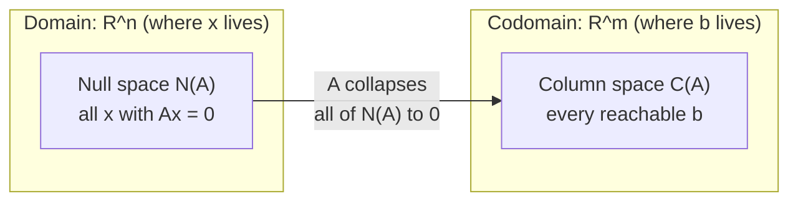

## Learning Objectives

- Define the column space of a matrix A as the span of its columns, and explain why Ax = b has a solution exactly when b lies in the column space of A.
- Define the null space of A as the set of all x with Ax = 0, and compute it for a small matrix by solving the corresponding homogeneous system.
- Explain, in terms of the null space, precisely why a matrix with a nontrivial null space cannot be invertible.
- Determine a basis for the column space and a basis for the null space of a given small matrix.
- Distinguish what column space and null space each say about a matrix — one about which outputs are reachable, the other about which inputs collapse to zero.

## Context & Motivation

Every matrix A defines a function: feed it a vector x, and it returns Ax. Two natural questions about any function are "what outputs can it actually produce?" and "which distinct inputs, if any, does it map to the exact same output?" For a matrix, these two questions have names — the column space answers the first, the null space answers the second — and both turn out to be subspaces in their own right, meaning the machinery of independence, span, basis, and dimension built up for linear-independence-basis-and-dimension applies to them directly.

The column space is really just the column picture of Ax = b, reframed as a question about b rather than about x. That earlier concept observed that Ax = b is a linear combination of A's columns, weighted by the entries of x; the set of every b reachable this way — every linear combination of A's columns — is exactly its span, now given the name **column space**. This reframing turns "does this system have a solution?" into a genuinely geometric question: is b inside a particular subspace or not, a question that can in principle be settled without ever running elimination on the specific b at hand.

The null space asks the complementary question: given that A might not be one-to-one (multiple different x's landing on the same Ax), which inputs specifically get erased to zero? This directly determines whether A can be undone. The identity-matrix-and-inverses concept established that A⁻¹ exists only when A can be reversed uniquely — but if some nonzero x satisfies Ax = 0, then A maps both x and the zero vector to the same output (0), and no inverse operation can decide which of the two inputs to send 0 back to. A nontrivial null space is thus not just a curiosity about a matrix's behavior — it is *the* mechanism by which invertibility fails, stated in a form that will resurface, sharpened into a single number, in the rank and rank-nullity discussion that follows this concept.

## Core Theory

### Column space

For an m×n matrix A with columns a₁, a₂, …, aₙ (each in ℝᵐ), the **column space** of A, written C(A) or col(A), is the span of those columns:

C(A) = { c₁a₁ + c₂a₂ + … + cₙaₙ : c₁, …, cₙ ∈ ℝ }

C(A) is a subspace of ℝᵐ — the space the columns actually live in — and by definition it is exactly the set of vectors b for which Ax = b has *some* solution, since Ax is precisely the linear combination of A's columns weighted by x's entries. So:

Ax = b is solvable ⟺ b ∈ C(A)

A basis for C(A) can be built directly from A's columns: keep a column only if it is not a linear combination of the columns already kept (a **pivot column**, in the language elimination uses), discarding the rest as redundant. The number of columns that survive this process is the dimension of C(A) — a quantity important enough to earn its own name, rank, in the next concept.

### Null space

The **null space** of an m×n matrix A, written N(A) or null(A), is the set of all vectors x in ℝⁿ satisfying Ax = 0:

N(A) = { x ∈ ℝⁿ : Ax = 0 }

N(A) is a subspace of ℝⁿ — the space x lives in, not the space b lives in, an important distinction from C(A). It always contains at least the zero vector (A0 = 0 trivially for any A), so N(A) is never empty; the interesting question is always whether it contains anything *else*. A null space containing only the zero vector is called **trivial**.

Geometrically, N(A) is the set of "directions" A destroys — every x on it gets flattened to the origin by the transformation A represents, regardless of how far from the origin x itself starts. Computing N(A) means solving the homogeneous system Ax = 0 by elimination, then reading a basis for the solution set directly off the free variables: each free variable, set to 1 with the others set to 0, produces one basis vector for N(A) (called, in this context, a **special solution**).

### Null space and invertibility

Suppose N(A) is nontrivial — some x ≠ 0 satisfies Ax = 0. Then A also satisfies A0 = 0, so both x and 0 map to the same output. A matrix that sends two different inputs to the same output cannot have an inverse: an inverse A⁻¹ would need to satisfy A⁻¹(0) = x and A⁻¹(0) = 0 simultaneously, which is impossible for a single well-defined function. So:

N(A) nontrivial ⟹ A is singular (not invertible)

Contrapositively, A invertible ⟹ N(A) = {0} only. For a square matrix, this turns out to be an *if and only if*: a square matrix is invertible exactly when its null space is trivial — one more item on the growing list of equivalent ways to characterize invertibility that this discipline accumulates concept by concept.

### Solvability and uniqueness, side by side

Column space and null space together give a complete answer to "what does Ax = b look like?" for any specific b:

- If b ∉ C(A), there is no solution at all.
- If b ∈ C(A), a solution x₀ exists, and the *complete* solution set is x₀ plus any vector from N(A) — that is, every solution has the form x₀ + n for some n ∈ N(A) — because A(x₀ + n) = Ax₀ + An = b + 0 = b for any n ∈ N(A), and conversely any two solutions x₀, x₁ satisfy A(x₁ − x₀) = 0, so their difference lies in N(A).
- The solution is unique exactly when N(A) = {0}, since otherwise infinitely many vectors n ∈ N(A) could be added to x₀ without changing Ax₀.

## Worked Examples

### Example 1 — column space of a simple matrix

**Problem:** Find the column space of A = [[1, 2], [2, 4], [3, 6]] (columns (1,2,3) and (2,4,6)).

**Observe the relationship between columns.** The second column (2,4,6) = 2·(1,2,3), exactly twice the first. So the second column contributes nothing the first doesn't already cover.

**Conclusion.** C(A) is the span of just (1,2,3) alone — a line through the origin in ℝ³, of dimension 1, even though A has 2 columns. Only vectors of the form t(1,2,3) for some scalar t are in C(A); for instance, b = (2,4,6) is in C(A) (t = 2), but b = (1,0,0) is not, since no scalar multiple of (1,2,3) has a zero in its second coordinate unless it's the zero vector itself.

### Example 2 — computing a null space

**Problem:** Find the null space of A = [[1, 2, 3], [2, 4, 6]].

**Set up Ax = 0.** This gives the single independent equation x₁ + 2x₂ + 3x₃ = 0 (the second row is exactly 2 times the first, so it adds no new constraint).

**Identify free variables.** With one equation and three unknowns, x₂ and x₃ are free; x₁ = −2x₂ − 3x₃ is determined by them.

**Special solutions.** Set x₂ = 1, x₃ = 0: x₁ = −2, giving (−2, 1, 0). Set x₂ = 0, x₃ = 1: x₁ = −3, giving (−3, 0, 1). Check: A(−2,1,0) = (1(−2)+2(1)+3(0), 2(−2)+4(1)+6(0)) = (0, 0). ✓ Similarly for (−3,0,1).

**Conclusion.** N(A) = { s(−2,1,0) + t(−3,0,1) : s, t ∈ ℝ }, a plane through the origin in ℝ³, of dimension 2. Since N(A) is nontrivial, A is singular — consistent with A having only 1 independent row (dimension of C(A) turns out to be 1 here too, by the same reasoning as Example 1 applied to A's rows).

### Example 3 — connecting both spaces to solvability

**Problem:** For A = [[1, 2], [2, 4]], determine whether Ax = (3, 6) has a solution, whether it's unique, and describe the full solution set if one exists.

**Column space check.** C(A) is spanned by (1,2) alone, since column 2 = (2,4) = 2·(1,2). Is (3,6) in C(A)? Yes: (3,6) = 3·(1,2). So a solution exists.

**Find one solution.** x = (3, 0) works: A(3,0) = (1·3+2·0, 2·3+4·0) = (3,6). ✓

**Null space.** Ax = 0 gives x₁ + 2x₂ = 0 (the second equation is redundant, being 2× the first), so x₁ = −2x₂, free variable x₂. N(A) = { t(−2, 1) : t ∈ ℝ }, nontrivial — so A is singular and the solution is *not* unique.

**Full solution set.** Every solution has the form (3, 0) + t(−2, 1) for t ∈ ℝ. Check t = 1: (3,0) + (−2,1) = (1, 1); A(1,1) = (1+2, 2+4) = (3,6). ✓ Confirms the solution set is an entire line, not a single point, exactly because N(A) is a nontrivial line rather than just {0}.

## Common Misconceptions & Pitfalls

- **"The column space and the null space live in the same space, so they can be compared directly as subsets of one another."** They generally do not even share a dimension for the underlying space: for an m×n matrix, C(A) ⊆ ℝᵐ (built from the columns, which have m entries) while N(A) ⊆ ℝⁿ (built from vectors x, which have n entries). For a non-square matrix these are different spaces entirely, and even for a square matrix, being "the same size" doesn't make them the same subspace.
- **"If Ax = 0 has only the trivial solution for some specific attempted x-values, the null space is trivial."** Only checking a few candidate x's proves nothing; N(A) is either exactly {0} or infinite (any nontrivial subspace has infinitely many vectors, since it's closed under scaling). The only way to confirm N(A) = {0} is to solve Ax = 0 completely via elimination and confirm no free variables remain.
- **"A matrix with a wide null space (high dimension) also has a large column space."** These are not directly proportional at a glance — Example 2's matrix has a 2-dimensional null space but only a 1-dimensional column space, out of 3 columns. The precise relationship between these two dimensions is the subject of the rank-nullity theorem in the next concept, and it is a genuine constraint, not a coincidence, but it is not "bigger null space implies bigger column space."
- **"b ∈ C(A) can be checked just by looking at whether b resembles the columns of A."** Resemblance is not the test — membership in a span requires actually solving for coefficients, as in Example 1, where (2,4,6) is in C(A) but (1,0,0) is not, despite both being simple-looking vectors in ℝ³.

## Summary

The column space C(A) is the span of A's columns — exactly the set of vectors b for which Ax = b has a solution — while the null space N(A) is the set of inputs x that A collapses entirely to zero. Both are subspaces, C(A) sitting inside the codomain ℝᵐ and N(A) inside the domain ℝⁿ. A nontrivial null space means two different inputs produce the same output, which is precisely why it forces A to be singular; for a square matrix, a trivial null space is both necessary and sufficient for invertibility. Together, the two spaces fully characterize the solution behavior of Ax = b: solvability depends on whether b ∈ C(A), and uniqueness (when a solution exists) depends on whether N(A) is trivial, with the complete solution set, when nonempty, always taking the form of one particular solution plus all of N(A).

## Documentation Links

- [MIT 18.06SC — Syllabus (OCW)](https://www.ocw.mit.edu/courses/18-06sc-linear-algebra-fall-2011/pages/syllabus) — doc
- [MIT 18.06 — Course Home (OCW)](https://ocw.mit.edu/courses/18-06-linear-algebra-spring-2010/) — doc
