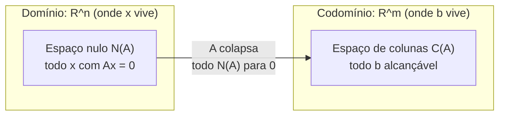

## Objetivos de Aprendizagem

- Definir o espaço de colunas de uma matriz A como o span de suas colunas, e explicar por que Ax = b tem solução exatamente quando b está no espaço de colunas de A.
- Definir o espaço nulo de A como o conjunto de todo x com Ax = 0, e calculá-lo para uma matriz pequena resolvendo o sistema homogêneo correspondente.
- Explicar, em termos do espaço nulo, precisamente por que uma matriz com espaço nulo não trivial não pode ser invertível.
- Determinar uma base para o espaço de colunas e uma base para o espaço nulo de uma dada matriz pequena.
- Distinguir o que o espaço de colunas e o espaço nulo dizem cada um sobre uma matriz, um sobre quais saídas são alcançáveis, o outro sobre quais entradas colapsam para zero.

## Contexto e Motivação

Toda matriz A define uma função: alimente-a com um vetor x, e ela retorna Ax. Duas perguntas naturais sobre qualquer função são "quais saídas ela pode de fato produzir?" e "quais entradas distintas, se houver, ela mapeia para a exata mesma saída?" Para uma matriz, essas duas perguntas têm nomes, o espaço de colunas responde à primeira, o espaço nulo responde à segunda, e ambos acabam sendo subespaços por direito próprio, significando que o maquinário de independência, span, base, e dimensão construído para independência linear, base e dimensão se aplica a eles diretamente.

O espaço de colunas é realmente apenas a imagem por colunas de Ax = b, reformulada como uma pergunta sobre b em vez de sobre x. Aquele conceito anterior observou que Ax = b é uma combinação linear das colunas de A, ponderada pelas entradas de x; o conjunto de todo b alcançável dessa forma, toda combinação linear das colunas de A, é exatamente seu span, agora dado o nome de **espaço de colunas**. Essa reformulação transforma "este sistema tem solução?" em uma pergunta genuinamente geométrica: b está dentro de um subespaço particular ou não, uma pergunta que em princípio pode ser resolvida sem nunca rodar eliminação no b específico em mãos.

O espaço nulo faz a pergunta complementar: dado que A pode não ser injetora (múltiplos x diferentes caindo no mesmo Ax), quais entradas especificamente são apagadas para zero? Isso determina diretamente se A pode ser desfeita. O conceito de matriz identidade e inversas estabeleceu que A⁻¹ existe apenas quando A pode ser revertida de forma única, mas se algum x não nulo satisfaz Ax = 0, então A mapeia tanto x quanto o vetor zero para a mesma saída (0), e nenhuma operação inversa pode decidir para qual das duas entradas enviar 0 de volta. Um espaço nulo não trivial não é portanto apenas uma curiosidade sobre o comportamento de uma matriz, é *o* mecanismo pelo qual a invertibilidade falha, enunciado em uma forma que vai ressurgir, afiada em um único número, na discussão de posto (rank) e o teorema do posto-nulidade que segue este conceito.

## Teoria Central

### Espaço de colunas

Para uma matriz A m×n com colunas a₁, a₂, …, aₙ (cada uma em ℝᵐ), o **espaço de colunas** de A, escrito C(A) ou col(A), é o span dessas colunas:

C(A) = { c₁a₁ + c₂a₂ + … + cₙaₙ : c₁, …, cₙ ∈ ℝ }

C(A) é um subespaço de ℝᵐ, o espaço onde as colunas de fato vivem, e por definição é exatamente o conjunto de vetores b para os quais Ax = b tem *alguma* solução, já que Ax é precisamente a combinação linear das colunas de A ponderada pelas entradas de x. Então:

Ax = b é solucionável ⟺ b ∈ C(A)

Uma base para C(A) pode ser construída diretamente a partir das colunas de A: mantenha uma coluna apenas se ela não for uma combinação linear das colunas já mantidas (uma **coluna pivô**, na linguagem que a eliminação usa), descartando o resto como redundante. O número de colunas que sobrevivem a esse processo é a dimensão de C(A), uma quantidade importante o suficiente para merecer seu próprio nome, posto (rank), no próximo conceito.

### Espaço nulo

O **espaço nulo** de uma matriz A m×n, escrito N(A) ou null(A), é o conjunto de todos os vetores x em ℝⁿ satisfazendo Ax = 0:

N(A) = { x ∈ ℝⁿ : Ax = 0 }

N(A) é um subespaço de ℝⁿ, o espaço onde x vive, não o espaço onde b vive, uma distinção importante em relação a C(A). Sempre contém pelo menos o vetor zero (A0 = 0 trivialmente para qualquer A), então N(A) nunca está vazio; a pergunta interessante é sempre se contém mais *alguma outra coisa*. Um espaço nulo contendo apenas o vetor zero é chamado de **trivial**.

Geometricamente, N(A) é o conjunto de "direções" que A destrói, todo x nele é achatado na origem pela transformação que A representa, independentemente de quão longe da origem o próprio x comece. Calcular N(A) significa resolver o sistema homogêneo Ax = 0 por eliminação, depois ler uma base para o conjunto solução diretamente das variáveis livres: cada variável livre, definida como 1 com as outras definidas como 0, produz um vetor base para N(A) (chamado, neste contexto, de **solução especial**).

### Espaço nulo e invertibilidade

Suponha que N(A) seja não trivial, algum x ≠ 0 satisfaz Ax = 0. Então A também satisfaz A0 = 0, então tanto x quanto 0 mapeiam para a mesma saída. Uma matriz que envia duas entradas diferentes para a mesma saída não pode ter uma inversa: uma inversa A⁻¹ precisaria satisfazer A⁻¹(0) = x e A⁻¹(0) = 0 simultaneamente, o que é impossível para uma única função bem definida. Então:

N(A) não trivial ⟹ A é singular (não invertível)

Por contraposição, A invertível ⟹ N(A) = {0} apenas. Para uma matriz quadrada, isso acaba sendo um *se e somente se*: uma matriz quadrada é invertível exatamente quando seu espaço nulo é trivial, mais um item na lista crescente de formas equivalentes de caracterizar invertibilidade que esta disciplina acumula conceito por conceito.

### Solubilidade e unicidade, lado a lado

O espaço de colunas e o espaço nulo juntos dão uma resposta completa a "como é Ax = b?" para qualquer b específico:

- Se b ∉ C(A), não há solução alguma.
- Se b ∈ C(A), uma solução x₀ existe, e o conjunto solução *completo* é x₀ mais qualquer vetor de N(A), ou seja, toda solução tem a forma x₀ + n para algum n ∈ N(A), porque A(x₀ + n) = Ax₀ + An = b + 0 = b para qualquer n ∈ N(A), e reciprocamente quaisquer duas soluções x₀, x₁ satisfazem A(x₁ − x₀) = 0, então sua diferença está em N(A).
- A solução é única exatamente quando N(A) = {0}, já que caso contrário infinitos vetores n ∈ N(A) poderiam ser somados a x₀ sem mudar Ax₀.

## Exemplos Resolvidos

### Exemplo 1 — espaço de colunas de uma matriz simples

**Problema:** Encontre o espaço de colunas de A = [[1, 2], [2, 4], [3, 6]] (colunas (1,2,3) e (2,4,6)).

**Observe a relação entre as colunas.** A segunda coluna (2,4,6) = 2·(1,2,3), exatamente o dobro da primeira. Então a segunda coluna não contribui com nada que a primeira já não cubra.

**Conclusão.** C(A) é o span de apenas (1,2,3) sozinho, uma reta pela origem em ℝ³, de dimensão 1, mesmo que A tenha 2 colunas. Apenas vetores da forma t(1,2,3) para algum escalar t estão em C(A); por exemplo, b = (2,4,6) está em C(A) (t = 2), mas b = (1,0,0) não está, já que nenhum múltiplo escalar de (1,2,3) tem zero em sua segunda coordenada a menos que seja o próprio vetor zero.

### Exemplo 2 — calculando um espaço nulo

**Problema:** Encontre o espaço nulo de A = [[1, 2, 3], [2, 4, 6]].

**Monte Ax = 0.** Isso dá a única equação independente x₁ + 2x₂ + 3x₃ = 0 (a segunda linha é exatamente 2 vezes a primeira, então não adiciona nenhuma restrição nova).

**Identifique as variáveis livres.** Com uma equação e três incógnitas, x₂ e x₃ são livres; x₁ = −2x₂ − 3x₃ é determinado por elas.

**Soluções especiais.** Defina x₂ = 1, x₃ = 0: x₁ = −2, dando (−2, 1, 0). Defina x₂ = 0, x₃ = 1: x₁ = −3, dando (−3, 0, 1). Verifique: A(−2,1,0) = (1(−2)+2(1)+3(0), 2(−2)+4(1)+6(0)) = (0, 0). ✓ Similarmente para (−3,0,1).

**Conclusão.** N(A) = { s(−2,1,0) + t(−3,0,1) : s, t ∈ ℝ }, um plano pela origem em ℝ³, de dimensão 2. Como N(A) é não trivial, A é singular, consistente com A ter apenas 1 linha independente (a dimensão de C(A) acaba sendo 1 aqui também, pelo mesmo raciocínio do Exemplo 1 aplicado às linhas de A).

### Exemplo 3 — conectando ambos os espaços à solubilidade

**Problema:** Para A = [[1, 2], [2, 4]], determine se Ax = (3, 6) tem solução, se é única, e descreva o conjunto solução completo se existir um.

**Verificação do espaço de colunas.** C(A) é gerado por (1,2) sozinho, já que a coluna 2 = (2,4) = 2·(1,2). (3,6) está em C(A)? Sim: (3,6) = 3·(1,2). Então uma solução existe.

**Encontre uma solução.** x = (3, 0) funciona: A(3,0) = (1·3+2·0, 2·3+4·0) = (3,6). ✓

**Espaço nulo.** Ax = 0 dá x₁ + 2x₂ = 0 (a segunda equação é redundante, sendo 2× a primeira), então x₁ = −2x₂, variável livre x₂. N(A) = { t(−2, 1) : t ∈ ℝ }, não trivial, então A é singular e a solução *não* é única.

**Conjunto solução completo.** Toda solução tem a forma (3, 0) + t(−2, 1) para t ∈ ℝ. Verifique t = 1: (3,0) + (−2,1) = (1, 1); A(1,1) = (1+2, 2+4) = (3,6). ✓ Confirma que o conjunto solução é uma reta inteira, não um único ponto, exatamente porque N(A) é uma reta não trivial em vez de apenas {0}.

## Equívocos Comuns e Armadilhas

- **"O espaço de colunas e o espaço nulo vivem no mesmo espaço, então podem ser comparados diretamente como subconjuntos um do outro."** Geralmente eles nem sequer compartilham uma dimensão para o espaço subjacente: para uma matriz m×n, C(A) ⊆ ℝᵐ (construído a partir das colunas, que têm m entradas) enquanto N(A) ⊆ ℝⁿ (construído a partir de vetores x, que têm n entradas). Para uma matriz não quadrada esses são espaços inteiramente diferentes, e mesmo para uma matriz quadrada, ser "do mesmo tamanho" não os torna o mesmo subespaço.
- **"Se Ax = 0 tem apenas a solução trivial para alguns valores específicos de x tentados, o espaço nulo é trivial."** Verificar apenas alguns candidatos de x não prova nada; N(A) é ou exatamente {0} ou infinito (qualquer subespaço não trivial tem infinitos vetores, já que é fechado sob escalonamento). A única forma de confirmar N(A) = {0} é resolver Ax = 0 completamente via eliminação e confirmar que nenhuma variável livre resta.
- **"Uma matriz com um espaço nulo amplo (dimensão alta) também tem um espaço de colunas grande."** Esses não são diretamente proporcionais à primeira vista, a matriz do Exemplo 2 tem um espaço nulo de dimensão 2 mas apenas um espaço de colunas de dimensão 1, de 3 colunas. A relação precisa entre essas duas dimensões é o assunto do teorema do posto-nulidade no próximo conceito, e é uma restrição genuína, não uma coincidência, mas não é "espaço nulo maior implica espaço de colunas maior."
- **"b ∈ C(A) pode ser verificado apenas olhando se b se parece com as colunas de A."** Semelhança não é o teste, pertencimento a um span exige de fato resolver para coeficientes, como no Exemplo 1, onde (2,4,6) está em C(A) mas (1,0,0) não está, apesar de ambos serem vetores de aparência simples em ℝ³.

## Resumo

O espaço de colunas C(A) é o span das colunas de A, exatamente o conjunto de vetores b para os quais Ax = b tem solução, enquanto o espaço nulo N(A) é o conjunto de entradas x que A colapsa inteiramente para zero. Ambos são subespaços, C(A) situado dentro do codomínio ℝᵐ e N(A) dentro do domínio ℝⁿ. Um espaço nulo não trivial significa que duas entradas diferentes produzem a mesma saída, o que é precisamente por que ele força A a ser singular; para uma matriz quadrada, um espaço nulo trivial é tanto necessário quanto suficiente para invertibilidade. Juntos, os dois espaços caracterizam completamente o comportamento de solução de Ax = b: solubilidade depende de se b ∈ C(A), e unicidade (quando uma solução existe) depende de se N(A) é trivial, com o conjunto solução completo, quando não vazio, sempre assumindo a forma de uma solução particular mais todo N(A).

## Documentation Links

- [MIT 18.06SC — Syllabus (OCW)](https://www.ocw.mit.edu/courses/18-06sc-linear-algebra-fall-2011/pages/syllabus) — doc
- [MIT 18.06 — Course Home (OCW)](https://ocw.mit.edu/courses/18-06-linear-algebra-spring-2010/) — doc
