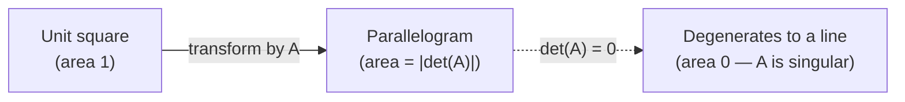

## Learning Objectives

- Define the determinant as a single real number computed from a square matrix, and state the 2×2 formula explicitly.
- State the connection between a zero determinant and singularity, and explain why this makes the determinant a quick invertibility test.
- Explain the determinant's geometric meaning as an area (2×2) or volume (3×3) scaling factor of the linear transformation the matrix represents.
- Compute the determinant of a concrete 2×2 matrix and interpret the sign and magnitude of the result.
- Recognize that cofactor expansion and Cramer's rule exist for computing determinants of larger matrices, without needing to carry out either by hand.

## Context & Motivation

Every square matrix has a single real number attached to it — its **determinant** — that answers, immediately and without running any elimination, the single most important yes-or-no question this discipline keeps returning to: is this matrix invertible? The identity-matrix-and-inverses concept established that some matrices simply cannot be undone (singular matrices), and the column-space-and-null-space concept explained the mechanism (a nontrivial null space). The determinant packages the *test* for this into one computable number: zero means singular, nonzero means invertible, full stop.

It's worth being upfront about how much weight this concept carries in this particular course, because that's a deliberate choice rather than an oversight. Modern applied treatments of linear algebra — MIT's 18.065 (Matrix Methods) among them — increasingly de-emphasize the determinant relative to a classical, more computation-heavy treatment, precisely because for anything beyond a 3×3 or 4×4 matrix, computing a determinant by hand (via cofactor expansion) is expensive and rarely how invertibility gets checked in practice; numerical software checks rank or attempts elimination directly instead. At the same time, the ACM/IEEE CS2013 curriculum guidelines still list determinants as core material, because the *concept* — a single number capturing both an invertibility test and a geometric scaling factor — remains genuinely useful to understand even when the computational machinery for large matrices is rarely exercised by hand. This concept follows that balance: the definition, the two properties that matter most, and the 2×2 formula worked concretely, without a deep dive into cofactor expansion for larger matrices.

The geometric meaning is what makes the determinant more than just an algebraic test. A matrix, understood as a linear transformation (per the matrices-as-linear-transformations concept), takes a unit square (in 2D) or a unit cube (in 3D) and stretches, rotates, or flattens it into some other shape. The determinant is exactly the factor by which that transformation scales area or volume — a beautifully concrete meaning behind what would otherwise look like an arbitrary arithmetic formula.

## Core Theory

### Definition: the determinant as a single number

For a square matrix A, the **determinant**, written det(A) or |A|, is a single real number computed from A's entries. It is defined for every square matrix (1×1, 2×2, 3×3, and beyond), and it is *not* defined for a non-square matrix — the determinant is intrinsically tied to the case where the domain and codomain of the transformation A represents have the same dimension, which is exactly the square case.

For a 2×2 matrix A = [[a, b], [c, d]], the determinant has an explicit, easily memorized formula:

det(A) = ad − bc

This is the only computational formula this concept treats in depth. Larger matrices (3×3 and up) have their own methods for computing a determinant — **cofactor expansion**, which recursively breaks an n×n determinant down into a sum of (n−1)×(n−1) determinants, and **Cramer's rule**, which uses determinants to solve Ax = b directly — but both are computationally expensive for anything beyond small, hand-worked cases, and neither is developed further here; it's enough to know they exist and what problem they solve.

### Property 1: det(A) = 0 exactly when A is singular

The determinant's most important property, and the reason it's worth computing at all, is:

det(A) = 0 ⟺ A is singular (not invertible)

Equivalently, det(A) ≠ 0 ⟺ A is invertible. This gives a one-number test for invertibility, directly connecting back to the identity-matrix-and-inverses concept: rather than attempting elimination and watching for a row of zeros, or checking whether the null space is trivial, computing a single determinant settles the question outright for small matrices. For the 2×2 formula, this means A = [[a,b],[c,d]] is invertible exactly when ad ≠ bc — a condition worth recognizing on sight for small examples.

### Property 2: geometric meaning as an area/volume scaling factor

For a 2×2 matrix A, |det(A)| is the factor by which A scales area: the unit square (with corners at (0,0), (1,0), (0,1), (1,1)) has area 1, and its image under the transformation A — a parallelogram with corners at A applied to each of those points — has area exactly |det(A)|. For a 3×3 matrix, the analogous statement holds for volume: the unit cube maps to a parallelepiped of volume |det(A)|.

The *sign* of det(A) carries additional information: a positive determinant means the transformation preserves orientation (a counterclockwise-labeled shape stays counterclockwise), while a negative determinant means it flips orientation (like a reflection). A determinant of exactly zero means the transformation flattens the plane (or space) down into something of strictly lower dimension — a line, or a point — which is exactly why a zero determinant coincides with singularity: a matrix that flattens 2D area down to zero is a matrix that cannot be undone, since the flattening step throws away information no inverse could recover.



## Worked Examples

### Example 1 — computing a 2×2 determinant and testing invertibility

**Problem:** Compute det(A) for A = [[3, 1], [2, 4]], and state whether A is invertible.

**Apply the formula.** det(A) = ad − bc = (3)(4) − (1)(2) = 12 − 2 = 10.

**Conclusion.** det(A) = 10 ≠ 0, so A is invertible. This matches what elimination would show directly (subtracting (2/3)×row 1 from row 2 leaves a nonzero pivot in the second row), but the determinant reaches the same conclusion in one line of arithmetic, with no elimination needed at all.

### Example 2 — a singular matrix, confirmed by its zero determinant

**Problem:** Is B = [[2, 4], [1, 2]] invertible?

**Apply the formula.** det(B) = (2)(2) − (4)(1) = 4 − 4 = 0.

**Conclusion.** det(B) = 0, so B is singular — confirmed independently by observing that row 2 = (1/2)×row 1, meaning the rows are dependent and elimination would produce a zero row. Geometrically, B's columns (2,1) and (4,2) are parallel (the second is exactly twice the first), so the "parallelogram" they'd form has collapsed to a line segment of zero area — exactly matching det(B) = 0.

### Example 3 — determinant and area, made concrete

**Problem:** A = [[2, 0], [0, 3]] transforms the unit square. Compute det(A) and confirm it matches the area of the transformed shape directly.

**Apply the formula.** Here a = 2, b = 0, c = 0, d = 3, so det(A) = ad − bc = (2)(3) − (0)(0) = 6.

**Confirm geometrically.** A stretches the x-direction by a factor of 2 (since A·(1,0) = (2,0)) and the y-direction by a factor of 3 (since A·(0,1) = (0,3)). The unit square, of area 1, becomes a 2-by-3 rectangle, of area 2 × 3 = 6 — exactly matching det(A) = 6, confirming the scaling-factor interpretation directly for this simple stretching case.

```python
import numpy as np

A = np.array([[2, 0], [0, 3]])
print(np.linalg.det(A))  # 6.0, matching the hand computation
```

## Common Misconceptions & Pitfalls

- **"A larger determinant always means a 'bigger' or 'more important' matrix."** The determinant is a scaling factor for area/volume, not a general-purpose size metric — a matrix with entries all equal to 1000 could still have determinant zero (if singular), while a matrix with small entries can have a large determinant if its transformation stretches space significantly. Magnitude of entries and magnitude of the determinant are not directly comparable.
- **"det(A) = 0 means A is the zero matrix."** These are very different conditions. Example 2's B = [[2,4],[1,2]] has det(B) = 0 but is nowhere near the zero matrix — it simply has dependent rows/columns, collapsing area to zero without any entry being zero itself.
- **"A negative determinant means something has gone wrong in the computation."** A negative determinant is a perfectly valid, meaningful result — it indicates the transformation reverses orientation (like a reflection), not an arithmetic error. Only the sign changes; |det(A)| is still the correct area/volume scaling magnitude.
- **"Computing determinants by cofactor expansion is how invertibility gets checked in practice for real, large matrices."** For anything beyond hand-worked small examples, this is not how it's done computationally — numerical software checks rank or runs elimination directly, because cofactor expansion becomes prohibitively expensive as matrix size grows. This concept's light treatment of larger-matrix methods reflects that same practical reality, not an incomplete treatment.

## Summary

The determinant is a single real number, defined only for square matrices, that serves two purposes worth remembering well beyond any specific computation: det(A) = 0 exactly when A is singular, making it a one-number invertibility test, and |det(A)| measures the factor by which A scales area (2×2) or volume (3×3), with its sign indicating whether orientation is preserved or reversed. The 2×2 formula, det(A) = ad − bc, is worth knowing outright; cofactor expansion and Cramer's rule extend the idea to larger matrices but are computationally expensive and are only briefly noted here, consistent with this discipline's deliberate choice to de-emphasize hand computation of large determinants in favor of the conceptual payoff — a single number tying invertibility directly to geometry.

## Documentation Links

- [MIT 18.06 — Course Home (OCW)](https://ocw.mit.edu/courses/18-06-linear-algebra-spring-2010/) — doc
- [ACM/IEEE CS2013 — Full Curriculum Guidelines](https://www.acm.org/binaries/content/assets/education/cs2013_web_final.pdf) — doc
