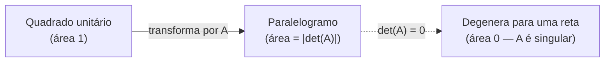

## Objetivos de Aprendizagem

- Definir o determinante como um único número real calculado a partir de uma matriz quadrada, e enunciar explicitamente a fórmula 2×2.
- Enunciar a conexão entre um determinante zero e singularidade, e explicar por que isso torna o determinante um teste rápido de invertibilidade.
- Explicar o significado geométrico do determinante como um fator de escala de área (2×2) ou volume (3×3) da transformação linear que a matriz representa.
- Calcular o determinante de uma matriz 2×2 concreta e interpretar o sinal e a magnitude do resultado.
- Reconhecer que expansão por cofatores e a regra de Cramer existem para calcular determinantes de matrizes maiores, sem precisar executar nenhuma das duas à mão.

## Contexto e Motivação

Toda matriz quadrada tem um único número real associado a ela, seu **determinante**, que responde, imediatamente e sem rodar nenhuma eliminação, à pergunta de sim-ou-não mais importante à qual esta disciplina continua voltando: essa matriz é invertível? O conceito de matriz identidade e inversas estabeleceu que algumas matrizes simplesmente não podem ser desfeitas (matrizes singulares), e o conceito de espaço de colunas e espaço nulo explicou o mecanismo (um espaço nulo não trivial). O determinante empacota o *teste* para isso em um único número computável: zero significa singular, não zero significa invertível, ponto final.

Vale a pena ser direto sobre quanto peso este conceito carrega neste curso em particular, porque é uma escolha deliberada em vez de uma omissão. Tratamentos aplicados modernos de álgebra linear, o 18.065 do MIT (Matrix Methods) entre eles, cada vez mais desenfatizam o determinante em relação a um tratamento clássico e mais pesado em cálculo, precisamente porque para qualquer coisa além de uma matriz 3×3 ou 4×4, calcular um determinante à mão (via expansão por cofatores) é caro e raramente como a invertibilidade é verificada na prática; software numérico verifica posto (rank) ou tenta eliminação diretamente em vez disso. Ao mesmo tempo, as diretrizes curriculares ACM/IEEE CS2013 ainda listam determinantes como material central, porque o *conceito*, um único número capturando tanto um teste de invertibilidade quanto um fator de escala geométrico, permanece genuinamente útil de entender mesmo quando o maquinário computacional para matrizes grandes é raramente exercitado à mão. Este conceito segue esse equilíbrio: a definição, as duas propriedades que mais importam, e a fórmula 2×2 trabalhada concretamente, sem um mergulho profundo na expansão por cofatores para matrizes maiores.

O significado geométrico é o que torna o determinante mais do que apenas um teste algébrico. Uma matriz, entendida como uma transformação linear (pelo conceito de matrizes como transformações lineares), pega um quadrado unitário (em 2D) ou um cubo unitário (em 3D) e o estica, gira, ou achata em alguma outra forma. O determinante é exatamente o fator pelo qual aquela transformação escala área ou volume, um significado lindamente concreto por trás do que de outra forma pareceria uma fórmula aritmética arbitrária.

## Teoria Central

### Definição: o determinante como um único número

Para uma matriz quadrada A, o **determinante**, escrito det(A) ou |A|, é um único número real calculado a partir das entradas de A. É definido para toda matriz quadrada (1×1, 2×2, 3×3, e além), e *não* é definido para uma matriz não quadrada, o determinante está intrinsecamente ligado ao caso em que o domínio e o codomínio da transformação que A representa têm a mesma dimensão, que é exatamente o caso quadrado.

Para uma matriz 2×2 A = [[a, b], [c, d]], o determinante tem uma fórmula explícita e facilmente memorizável:

det(A) = ad − bc

Esta é a única fórmula computacional que este conceito trata em profundidade. Matrizes maiores (3×3 e acima) têm seus próprios métodos para calcular um determinante, a **expansão por cofatores**, que quebra recursivamente um determinante n×n em uma soma de determinantes (n−1)×(n−1), e a **regra de Cramer**, que usa determinantes para resolver Ax = b diretamente, mas ambos são computacionalmente caros para qualquer coisa além de casos pequenos trabalhados à mão, e nenhum é desenvolvido mais aqui; basta saber que existem e qual problema resolvem.

### Propriedade 1: det(A) = 0 exatamente quando A é singular

A propriedade mais importante do determinante, e a razão pela qual vale a pena calculá-lo em absoluto, é:

det(A) = 0 ⟺ A é singular (não invertível)

Equivalentemente, det(A) ≠ 0 ⟺ A é invertível. Isso dá um teste de um único número para invertibilidade, conectando-se diretamente de volta ao conceito de matriz identidade e inversas: em vez de tentar eliminação e observar por uma linha de zeros, ou verificar se o espaço nulo é trivial, calcular um único determinante resolve a questão definitivamente para matrizes pequenas. Para a fórmula 2×2, isso significa que A = [[a,b],[c,d]] é invertível exatamente quando ad ≠ bc, uma condição que vale a pena reconhecer à primeira vista para exemplos pequenos.

### Propriedade 2: significado geométrico como um fator de escala de área/volume

Para uma matriz 2×2 A, |det(A)| é o fator pelo qual A escala área: o quadrado unitário (com cantos em (0,0), (1,0), (0,1), (1,1)) tem área 1, e sua imagem sob a transformação A, um paralelogramo com cantos em A aplicado a cada um desses pontos, tem área exatamente |det(A)|. Para uma matriz 3×3, a afirmação análoga vale para volume: o cubo unitário mapeia para um paralelepípedo de volume |det(A)|.

O *sinal* de det(A) carrega informação adicional: um determinante positivo significa que a transformação preserva orientação (uma forma rotulada no sentido anti-horário permanece anti-horária), enquanto um determinante negativo significa que ela inverte a orientação (como uma reflexão). Um determinante de exatamente zero significa que a transformação achata o plano (ou espaço) em algo de dimensão estritamente menor, uma reta, ou um ponto, o que é exatamente por que um determinante zero coincide com singularidade: uma matriz que achata área 2D até zero é uma matriz que não pode ser desfeita, já que o passo de achatamento descarta informação que nenhuma inversa poderia recuperar.



## Exemplos Resolvidos

### Exemplo 1 — calculando um determinante 2×2 e testando invertibilidade

**Problema:** Calcule det(A) para A = [[3, 1], [2, 4]], e enuncie se A é invertível.

**Aplique a fórmula.** det(A) = ad − bc = (3)(4) − (1)(2) = 12 − 2 = 10.

**Conclusão.** det(A) = 10 ≠ 0, então A é invertível. Isso corresponde ao que eliminação mostraria diretamente (subtrair (2/3)×linha 1 da linha 2 deixa um pivô não nulo na segunda linha), mas o determinante chega à mesma conclusão em uma linha de aritmética, sem nenhuma eliminação necessária.

### Exemplo 2 — uma matriz singular, confirmada por seu determinante zero

**Problema:** B = [[2, 4], [1, 2]] é invertível?

**Aplique a fórmula.** det(B) = (2)(2) − (4)(1) = 4 − 4 = 0.

**Conclusão.** det(B) = 0, então B é singular, confirmado independentemente observando que linha 2 = (1/2)×linha 1, significando que as linhas são dependentes e eliminação produziria uma linha zero. Geometricamente, as colunas de B, (2,1) e (4,2), são paralelas (a segunda é exatamente o dobro da primeira), então o "paralelogramo" que formariam colapsou em um segmento de reta de área zero, exatamente correspondendo a det(B) = 0.

### Exemplo 3 — determinante e área, tornados concretos

**Problema:** A = [[2, 0], [0, 3]] transforma o quadrado unitário. Calcule det(A) e confirme que corresponde à área da forma transformada diretamente.

**Aplique a fórmula.** Aqui a = 2, b = 0, c = 0, d = 3, então det(A) = ad − bc = (2)(3) − (0)(0) = 6.

**Confirme geometricamente.** A estica a direção x por um fator de 2 (já que A·(1,0) = (2,0)) e a direção y por um fator de 3 (já que A·(0,1) = (0,3)). O quadrado unitário, de área 1, se torna um retângulo 2 por 3, de área 2 × 3 = 6, correspondendo exatamente a det(A) = 6, confirmando a interpretação de fator de escala diretamente para este caso simples de esticamento.

```python
import numpy as np

A = np.array([[2, 0], [0, 3]])
print(np.linalg.det(A))  # 6.0, corresponde ao cálculo manual
```

## Equívocos Comuns e Armadilhas

- **"Um determinante maior sempre significa uma matriz 'maior' ou 'mais importante'."** O determinante é um fator de escala para área/volume, não uma métrica de tamanho de propósito geral, uma matriz com entradas todas iguais a 1000 ainda poderia ter determinante zero (se singular), enquanto uma matriz com entradas pequenas pode ter um determinante grande se sua transformação estica o espaço significativamente. Magnitude das entradas e magnitude do determinante não são diretamente comparáveis.
- **"det(A) = 0 significa que A é a matriz zero."** Essas são condições muito diferentes. O B = [[2,4],[1,2]] do Exemplo 2 tem det(B) = 0 mas está longe de ser a matriz zero, ele simplesmente tem linhas/colunas dependentes, colapsando área para zero sem que nenhuma entrada seja zero em si.
- **"Um determinante negativo significa que algo deu errado no cálculo."** Um determinante negativo é um resultado perfeitamente válido e significativo, ele indica que a transformação inverte orientação (como uma reflexão), não um erro aritmético. Apenas o sinal muda; |det(A)| ainda é a magnitude correta de escala de área/volume.
- **"Calcular determinantes por expansão de cofatores é como a invertibilidade é verificada na prática para matrizes grandes reais."** Para qualquer coisa além de exemplos pequenos trabalhados à mão, não é assim que é feito computacionalmente, software numérico verifica posto (rank) ou roda eliminação diretamente, porque a expansão por cofatores se torna proibitivamente cara conforme o tamanho da matriz cresce. O tratamento leve deste conceito de métodos para matrizes maiores reflete essa mesma realidade prática, não um tratamento incompleto.

## Resumo

O determinante é um único número real, definido apenas para matrizes quadradas, que serve a dois propósitos que valem a pena lembrar bem além de qualquer cálculo específico: det(A) = 0 exatamente quando A é singular, tornando-o um teste de invertibilidade de um único número, e |det(A)| mede o fator pelo qual A escala área (2×2) ou volume (3×3), com seu sinal indicando se a orientação é preservada ou invertida. A fórmula 2×2, det(A) = ad − bc, vale a pena saber de cor; expansão por cofatores e a regra de Cramer estendem a ideia para matrizes maiores mas são computacionalmente caras e são apenas brevemente notadas aqui, consistente com a escolha deliberada desta disciplina de desenfatizar o cálculo manual de determinantes grandes em favor do retorno conceitual, um único número ligando invertibilidade diretamente à geometria.

## Documentation Links

- [MIT 18.06 — Course Home (OCW)](https://ocw.mit.edu/courses/18-06-linear-algebra-spring-2010/) — doc
- [ACM/IEEE CS2013 — Full Curriculum Guidelines](https://www.acm.org/binaries/content/assets/education/cs2013_web_final.pdf) — doc
