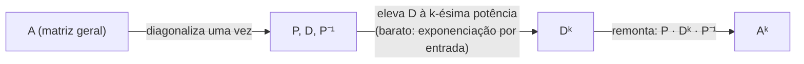

## Objetivos de Aprendizagem

- Enunciar a diagonalização A = PDP⁻¹, e identificar precisamente o que P e D contêm em termos dos autovetores e autovalores de A.
- Explicar por que Dⁿ é trivial de calcular para uma matriz diagonal D, e derivar Aⁿ = PDⁿP⁻¹ a partir de A = PDP⁻¹.
- Diagonalizar uma matriz 2×2 à mão, montando P a partir de seus autovetores e D a partir de seus autovalores.
- Calcular uma potência alta de uma matriz 2×2 (por exemplo, A¹⁰) via diagonalização, e contrastar o esforço com multiplicação direta repetida.
- Reconhecer quando uma matriz falha em ser diagonalizável (poucos autovetores independentes) como uma limitação dessa técnica.

## Contexto e Motivação

O conceito anterior estabeleceu que um autovetor v de uma matriz A é uma direção que A deixa em paz exceto por escalá-la por λ. Diagonalização é o que acontece quando você pega essa ideia e a leva o mais longe que pode ir: se A tem autovetores independentes *suficientes*, especificamente, n deles para uma matriz n×n, você pode usá-los para construir um sistema de coordenadas inteiramente novo no qual a ação de A se torna tão simples quanto possivelmente poderia ser. Nesse sistema de coordenadas de autovetores, A não gira, cisalha, ou mistura componentes juntos de forma alguma; ela apenas escala cada coordenada independentemente pelo seu próprio autovalor. Isso é exatamente o que uma **matriz diagonal** faz, e diagonalização é a afirmação precisa de que A, vista através da lente certa, *é* uma matriz diagonal.

Isso seria um fato elegante por si só, mas ganha seu lugar nesta disciplina por causa de um retorno genuinamente prático: calcular uma potência alta de uma matriz geral, A¹⁰⁰, digamos, por multiplicação direta repetida é caro (cada multiplicação de matriz para uma matriz n×n custa aproximadamente n³ operações, então multiplicar A por si mesma 99 vezes é enormemente desperdiçador, sem falar de quão tedioso seria à mão). Mas uma vez que A é diagonalizada, calcular qualquer potência de A colapsa para calcular potências de uma matriz *diagonal*, que é quase embaraçosamente barato, você apenas eleva cada número na diagonal àquela potência, independentemente, com zero termos cruzados para rastrear. Esse único truque, diagonalize uma vez, depois toda potência é quase grátis, é o mecanismo por baixo de simular transformações repetidas (aplicar o mesmo passo linear repetidamente, como em um sistema dinâmico discreto), e é exatamente o motor computacional por trás da análise de cadeias de Markov dois conceitos à frente, onde "o que acontece depois de muitos, muitos passos" é precisamente uma pergunta sobre uma potência alta de uma matriz.

## Teoria Central

### A diagonalização A = PDP⁻¹

Suponha que uma matriz n×n A tem n autovetores linearmente independentes v⁽¹⁾, v⁽²⁾, …, v⁽ⁿ⁾, com autovalores correspondentes λ₁, λ₂, …, λₙ (não necessariamente distintos). Construa duas matrizes a partir desses dados:

- **P**, cujas colunas são os autovetores, em ordem: P = [v⁽¹⁾ v⁽²⁾ ⋯ v⁽ⁿ⁾].
- **D**, a matriz diagonal com os autovalores correspondentes ao longo da diagonal, na mesma ordem: D = diag(λ₁, λ₂, …, λₙ), significando Dᵢᵢ = λᵢ e toda entrada fora da diagonal é 0.

Então A satisfaz:

A = PDP⁻¹

Como as colunas de P são linearmente independentes por suposição, P é invertível (esta é exatamente a conexão do conceito anterior entre colunas independentes e uma matriz invertível), então P⁻¹ existe e essa equação é bem formada. Isso é chamado de **diagonalizar** A, e uma matriz para a qual tal P e D existem é chamada de **diagonalizável**.

**Por que isso vale.** Cada equação de autovetor Av⁽ⁱ⁾ = λᵢv⁽ⁱ⁾ pode ser escrita para todo i de uma vez como uma única equação matricial: AP = PD (multiplicar A em cada coluna de P reproduz exatamente aquela coluna escalada pelo seu próprio λᵢ, que é exatamente o que multiplicar P pela matriz diagonal D à direita faz, a estrutura diagonal de D é precisamente o que torna "escale a coluna i por λᵢ" a interpretação correta de PD). Como P é invertível, multiplique ambos os lados à direita por P⁻¹:

AP = PD ⟹ A = PDP⁻¹

Equivalentemente, e igualmente útil, P⁻¹AP = D, isso se lê como "mude coordenadas por P⁻¹, depois aplique A, depois mude de volta com a inversa de P⁻¹, que é P", mais precisamente: P⁻¹AP = D diz que quando a ação de A é reexpressa no sistema de coordenadas cujos eixos são os autovetores (isso é o que multiplicar por P e P⁻¹ realiza), A se comporta exatamente como a matriz diagonal D, escala pura e independente ao longo de cada novo eixo, sem mistura entre eles.

### O retorno: Aⁿ = PDⁿP⁻¹

Esta é toda a razão pela qual diagonalização importa computacionalmente. Começando de A = PDP⁻¹, calcule A²:

A² = (PDP⁻¹)(PDP⁻¹) = PD(P⁻¹P)DP⁻¹ = PD·I·DP⁻¹ = PD²P⁻¹

O P⁻¹P do meio colapsa para a identidade, deixando os dois D's adjacentes um ao outro. O mesmo cancelamento acontece em todo passo de um produto mais longo, então para qualquer inteiro positivo k:

Aᵏ = PDᵏP⁻¹

Isso vale porque todo par P⁻¹P no meio do produto expandido Aᵏ = (PDP⁻¹)(PDP⁻¹)⋯(PDP⁻¹) colapsa para a identidade, deixando apenas P no extremo esquerdo, P⁻¹ no extremo direito, e k cópias de D multiplicadas juntas no meio.

E Dᵏ, para uma matriz diagonal D = diag(λ₁, …, λₙ), é essencialmente grátis de calcular:

Dᵏ = diag(λ₁ᵏ, λ₂ᵏ, …, λₙᵏ)

Isso é porque multiplicar matrizes diagonais juntas multiplica entradas diagonais correspondentes com zero termos cruzados (entradas fora da diagonal permanecem exatamente zero em cada passo), então elevar D à k-ésima potência nada mais é do que elevar cada um de seus n números diagonais à k-ésima potência independentemente, n exponenciações escalares independentes, versus as (k−1) multiplicações completas de matriz n×n, cada uma custando aproximadamente n³ operações, que o cálculo direto de Aᵏ de outra forma exigiria.

### Quando a diagonalização falha

Diagonalização exige n autovetores *linearmente independentes* para uma matriz n×n, não meramente n autovalores (contados com multiplicidade, sempre há n, pelo grau do polinômio característico), mas n autovetores independentes para de fato construir uma P invertível. Um autovalor repetido pode falhar em produzir autovetores independentes suficientes para gerar o espaço completo, seu autoespaço pode ter dimensão menor do que sua multiplicidade no polinômio característico sugere. Uma matriz com esse defeito **não é diagonalizável** (tecnicamente, uma matriz "defeituosa"); potências dela devem ser calculadas por outros meios (uma decomposição mais avançada fora do escopo desta disciplina trata desse caso). Toda matriz simétrica, no entanto, o assunto do próximo conceito, é sempre garantida diagonalizável, com uma P especialmente bem comportada, que é uma razão pela qual matrizes simétricas são separadas para tratamento especial.

## Exemplos Resolvidos

### Exemplo 1 — diagonalizando uma matriz 2×2

**Problema:** Diagonalize A = [[4, 1], [2, 3]] (a mesma matriz do Exemplo 1 do conceito anterior).

**Passo 1 — recorde os dados de autovalor/autovetor.** Do conceito anterior: autovalor λ₁ = 5 com autovetor v⁽¹⁾ = (1, 1), e λ₂ = 2 com autovetor v⁽²⁾ = (1, −2).

**Passo 2 — monte P e D.**

P = [[1, 1], [1, −2]]  D = [[5, 0], [0, 2]]

**Passo 3 — calcule P⁻¹.** Para uma matriz 2×2 [[a, b], [c, d]], a inversa é (1/(ad−bc))·[[d, −b], [−c, a]]. Aqui det(P) = (1)(−2) − (1)(1) = −3, então:

P⁻¹ = (1/−3)·[[−2, −1], [−1, 1]] = [[2/3, 1/3], [1/3, −1/3]]

**Passo 4 — verifique A = PDP⁻¹ verificando P⁻¹AP = D (uma verificação equivalente, frequentemente mais fácil).**

AP = [[4, 1], [2, 3]]·[[1, 1], [1, −2]] = [[4·1+1·1, 4·1+1·(−2)], [2·1+3·1, 2·1+3·(−2)]] = [[5, 2], [5, −4]]

P⁻¹(AP) = [[2/3, 1/3], [1/3, −1/3]]·[[5, 2], [5, −4]] = [[(2/3)(5)+(1/3)(5), (2/3)(2)+(1/3)(−4)], [(1/3)(5)+(−1/3)(5), (1/3)(2)+(−1/3)(−4)]]

= [[10/3+5/3, 4/3−4/3], [5/3−5/3, 2/3+4/3]] = [[5, 0], [0, 2]] = D ✓

A diagonalização confere: A = PDP⁻¹ com o P e D acima.

### Exemplo 2 — calculando A¹⁰, o caminho difícil esboçado e o caminho fácil feito completamente

**Problema:** Calcule A¹⁰ para A = [[4, 1], [2, 3]] do Exemplo 1.

**O caminho difícil, esboçado.** Cálculo direto exigiria formar A² = A·A, depois A⁴ = A²·A², depois A⁸ = A⁴·A⁴, depois A¹⁰ = A⁸·A² — mesmo usando elevação ao quadrado repetida para reduzir o número de multiplicações, isso ainda são quatro multiplicações completas de matriz 2×2, cada uma entrada por entrada, com números crescendo maiores e mais confusos a cada passo (as entradas de A² já são combinações de dois dígitos; por A⁸ a aritmética é incontrolável à mão, e para uma matriz maior ou uma potência muito mais alta, esse custo cresce rapidamente).

**O caminho fácil, via diagonalização.** Do Exemplo 1, A = PDP⁻¹ com D = [[5, 0], [0, 2]]. Então:

A¹⁰ = PD¹⁰P⁻¹, onde D¹⁰ = [[5¹⁰, 0], [0, 2¹⁰]] = [[9765625, 0], [0, 1024]]

Agora calcule PD¹⁰P⁻¹:

PD¹⁰ = [[1, 1], [1, −2]]·[[9765625, 0], [0, 1024]] = [[9765625, 1024], [9765625, −2048]]

(PD¹⁰)P⁻¹ = [[9765625, 1024], [9765625, −2048]]·[[2/3, 1/3], [1/3, −1/3]]

Linha 1: (9765625·2/3 + 1024·1/3, 9765625·1/3 + 1024·(−1/3)) = ((19531250+1024)/3, (9765625−1024)/3) = (19532274/3, 9764601/3) = (6510758, 3254867)

Linha 2: (9765625·2/3 + (−2048)·1/3, 9765625·1/3 + (−2048)·(−1/3)) = ((19531250−2048)/3, (9765625+2048)/3) = (19529202/3, 9767673/3) = (6509734, 3255891)

Então A¹⁰ = [[6510758, 3254867], [6509734, 3255891]]. A aritmética aqui ainda é não trivial simplesmente porque os números envolvidos são grandes (5¹⁰ é um número de sete dígitos), mas a *estrutura* do cálculo permaneceu simples o tempo todo: duas exponenciações de números únicos (5¹⁰ e 2¹⁰), e duas multiplicações de matriz comuns, nada como a cadeia crescente de produtos completos de matriz por matriz que a abordagem direta exige, e criticamente, esse mesmo procedimento exato calcula A¹⁰⁰ ou A¹⁰⁰⁰ sem nenhuma multiplicação de matriz adicional, apenas expoentes maiores dentro de D, que não custam nada extra para calcular.

### Exemplo 3 — uma matriz que falha em diagonalizar

**Problema:** Tente diagonalizar N = [[3, 1], [0, 3]], e explique o que dá errado.

**Autovalores.** N − λI = [[3−λ, 1], [0, 3−λ]], det = (3−λ)² = 0, então λ = 3 com multiplicidade 2, um autovalor repetido, como no Exemplo 2 do conceito anterior, mas dessa vez com uma matriz muito diferente ao redor.

**Autovetores.** Resolva (N − 3I)v = 0: N − 3I = [[0, 1], [0, 0]]. A primeira linha dá v₂ = 0 diretamente (0·v₁ + 1·v₂ = 0); v₁ não é restrito. Então todo autovetor tem a forma (v₁, 0), uma única reta, não um plano completo de direções independentes. Ao contrário do Exemplo 2 do conceito anterior (onde B = 3I dava *todo* vetor em ℝ² como um autovetor), aqui o autoespaço para λ = 3 tem apenas uma dimensão, mesmo que λ = 3 tenha multiplicidade algébrica 2.

**Conclusão.** N tem apenas uma direção de autovetor independente, não duas, não há forma de construir uma matriz 2×2 invertível P a partir dos autovetores de N, já que ambas as colunas teriam que ser múltiplos escalares de (1, 0), tornando P singular. N **não é diagonalizável**. Este é exatamente o modo de falha sinalizado na Teoria Central: um autovalor repetido cujo autoespaço fica aquém de sua multiplicidade.

## Equívocos Comuns e Armadilhas

- **"Toda matriz quadrada pode ser diagonalizada."** O Exemplo 3 é um contraexemplo direto: N = [[3, 1], [0, 3]] tem um conjunto completo de autovalores (dois, contando multiplicidade) mas não um conjunto completo de autovetores independentes, então nenhuma P invertível existe. Diagonalizabilidade é uma condição extra genuína, não automática.
- **"D em A = PDP⁻¹ pode listar os autovalores em qualquer ordem, independentemente de como as colunas de P estão ordenadas."** A ordem deve corresponder exatamente: a i-ésima entrada diagonal de D deve ser o autovalor pertencente à i-ésima coluna de P. Trocar a ordem em D sem trocar correspondentemente as colunas de P produz um produto de matriz que não é igual a A de forma alguma.
- **"Já que Aⁿ = PDⁿP⁻¹ é 'a mesma fórmula' para todo n, você só precisa calcular P e P⁻¹ uma vez e pode reutilizá-los para qualquer potência."** Isso é na verdade verdadeiro e é todo o ponto, mas é fácil rederivar acidentalmente P e P⁻¹ para cada novo expoente por hábito. Diagonalizar A é um custo único; toda potência subsequente só exige recalcular Dⁿ (barato) e uma multiplicação PDⁿP⁻¹ (não grátis, mas muito mais barata que n−1 multiplicações de matriz completas encadeadas).
- **"P⁻¹AP = D e A = PDP⁻¹ são dois fatos diferentes, derivados independentemente."** São algebricamente a mesma afirmação, multiplique P⁻¹AP = D à esquerda por P e à direita por P⁻¹ para recuperar A = PDP⁻¹ diretamente; não há necessidade de rederivar um do zero dado o outro.

## Resumo

Quando uma matriz n×n A tem n autovetores linearmente independentes, ela se fatora como A = PDP⁻¹, onde D é a matriz diagonal dos autovalores de A e as colunas de P são os autovetores correspondentes, na ordem correspondente. O valor real dessa fatoração é computacional: como P⁻¹P cancela em todo passo interno de um produto, Aᵏ = PDᵏP⁻¹ para qualquer potência k, e Dᵏ, a potência de uma matriz diagonal, é simplesmente cada entrada diagonal elevada à k-ésima potência independentemente, sem nenhuma multiplicação de matriz exigida de forma alguma. Isso transforma a tarefa de outra forma cara e propensa a erro de calcular uma potência alta de A diretamente em uma diagonalização única seguida de exponenciação escalar barata e duas multiplicações de matriz, independentemente de quão grande seja o expoente. Nem toda matriz diagonaliza, um autovalor repetido pode produzir um autoespaço menor que sua multiplicidade, deixando poucos autovetores independentes para construir uma P invertível, mas matrizes simétricas, cobertas a seguir, sempre diagonalizam, e fazem isso de uma forma especialmente limpa.

## Documentation Links

- [MIT 18.06 — Course Home (OCW)](https://ocw.mit.edu/courses/18-06-linear-algebra-spring-2010/) — doc
- [MIT 18.06SC — Syllabus (OCW)](https://www.ocw.mit.edu/courses/18-06sc-linear-algebra-fall-2011/pages/syllabus) — doc
