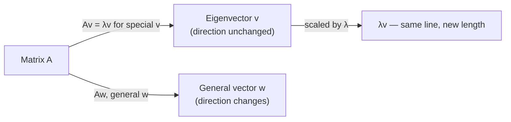

## Learning Objectives

- Define an eigenvector and eigenvalue of a square matrix A via the equation Av = λv, and explain in geometric terms what makes such a v special.
- Derive the characteristic equation det(A − λI) = 0 from Av = λv, and explain why this reduction is necessary to find λ without already knowing v.
- Compute the eigenvalues of a 2×2 matrix by solving its characteristic polynomial.
- Compute the eigenvectors corresponding to each eigenvalue by solving (A − λI)v = 0.
- Verify a claimed eigenpair (λ, v) directly, by substituting back into Av = λv rather than trusting the derivation alone.

## Context & Motivation

Every matrix A represents a linear transformation — earlier in this discipline, that transformation was described as something that can rotate, stretch, shrink, or reflect vectors, generally scrambling their direction along with their length. But for almost every matrix, there exist a handful of special directions that the transformation does not scramble at all: vectors that A only stretches or shrinks, sending them right back out along the same line they started on, never rotated off of it. These special directions are the **eigenvectors** of A, and the factor by which each one is stretched or shrunk is its **eigenvalue**. This is not a minor curiosity — it is arguably the single most consequential idea in applied linear algebra, because once you know a matrix's eigenvectors, you know exactly how it behaves in the directions that matter most, and — as the next two concepts in this discipline show directly — you can use that knowledge to compute otherwise painfully expensive things (like the 100th power of a matrix) almost for free.

The name itself is a fossil of this idea's history: "eigen" is German for "own" or "characteristic," so an eigenvector is, literally, one of A's "own vectors" — a direction intrinsic to the transformation itself, not to any particular choice of coordinates. This is why eigenvalues and eigenvectors show up under the same name across wildly different fields: they describe the natural vibration modes of a physical system, the principal axes of a rotating rigid body, the stable population structure of a demographic model, the long-run behavior of a Markov chain (covered later in this discipline), and the directions of maximum variance in a dataset (the basis of Principal Component Analysis, previewed when this discipline reaches symmetric matrices). In every one of these settings, the underlying question is the same: given a linear transformation, which directions does it merely scale, and by how much? Eigenvalues and eigenvectors are the precise mathematical answer.

This concept builds directly on two ideas already established: **matrices as linear transformations** (so that "Av" has a concrete geometric meaning — a picture of where A sends v) and **determinants** (so that det(A − λI) = 0, the key computational tool below, has a determinant already meaningfully defined for it). Everything from here through the rest of this discipline's "Eigenvalues" topic — diagonalization, powers of a matrix, the special behavior of symmetric matrices, and Markov chains — is built on the definition given here.

## Core Theory

### Definition: eigenvalues and eigenvectors

Given a square n×n matrix A, a nonzero vector v ∈ ℝⁿ is an **eigenvector** of A if there exists a scalar λ such that

Av = λv

The scalar λ is the **eigenvalue** associated with v. In words: multiplying v by A produces the same result as simply scaling v by the number λ — no rotation, no change of direction, just a stretch (if |λ| > 1), a shrink (if |λ| < 1), a flip (if λ < 0), or no change at all (if λ = 1).

Two things about this definition are easy to misplace and worth stating explicitly up front. First, v must be **nonzero** — the zero vector trivially satisfies A0 = λ0 for every λ, so allowing v = 0 would make the definition vacuous; it carries no information about A. Second, an eigenvalue λ can be zero even though its eigenvector cannot be — λ = 0 simply means Av = 0, i.e., v lies in A's null space (a concept from earlier in this discipline). A zero eigenvalue is a perfectly legitimate eigenvalue; it just signals that A collapses that particular direction to nothing.

Geometrically: picture A as a transformation of the plane (or of ℝⁿ generally). Most vectors, hit with A, come out pointing in some new, unrelated direction. An eigenvector is one of the rare exceptions — its image Av lands back on the same line through the origin that v itself lies on, merely rescaled by λ.

### Finding eigenvalues: the characteristic equation

The definition Av = λv is not, by itself, something you can solve directly for λ and v simultaneously — it has two unknowns tangled together (the scalar λ and the vector v), and v appears on both sides. The standard move is to rewrite the equation so that v's presence becomes a null-space question, which can be answered without first knowing v.

Starting from Av = λv, move everything to one side:

Av − λv = 0
(A − λI)v = 0

(Here I is the identity matrix, inserted so that λv can be rewritten as λIv — matching the matrix-vector form of Av — and the two terms combined into a single matrix (A − λI) acting on v.) This equation says that v is a nonzero vector in the null space of the matrix (A − λI). But a matrix has a nonzero null space — some nonzero vector it collapses to zero — precisely when it is **singular**, i.e., precisely when its determinant is zero (this is exactly the connection to the determinant concept earlier in this discipline: det = 0 signals singularity, and singularity is exactly what "a nonzero solution v exists" requires here). So:

(A − λI)v = 0 has a nonzero solution v ⟺ det(A − λI) = 0

This equation, det(A − λI) = 0, is the **characteristic equation** of A, and its left-hand side, expanded out, is a polynomial in λ called the **characteristic polynomial**. For an n×n matrix, this polynomial has degree n, so it has (counting complex roots and multiplicity) exactly n eigenvalues — though for a general matrix some may coincide, and some may be complex numbers rather than real ones (a subtlety resolved favorably for symmetric matrices, covered two concepts ahead).

The procedure, then, is two stages in sequence:

1. Solve det(A − λI) = 0 for λ — this finds the eigenvalues first, without yet touching any eigenvector.
2. For each eigenvalue λ found, substitute it back into (A − λI)v = 0 and solve this (now perfectly ordinary) linear system for v — finding the eigenvector(s) belonging to that particular λ.

This order is not optional: eigenvalues must be found first, because the eigenvector equation (A − λI)v = 0 depends on already knowing λ.

### The eigenspace: eigenvectors are never unique

If v is an eigenvector of A with eigenvalue λ, then so is cv for any nonzero scalar c — because A(cv) = c(Av) = c(λv) = λ(cv), so cv satisfies the same eigenvector equation with the identical eigenvalue. This means eigenvectors are never reported as a single unique vector; they are only ever determined up to scalar multiple, and the full set of vectors satisfying (A − λI)v = 0 for a fixed λ (together with the zero vector) forms a subspace called the **eigenspace** of λ. When solving by hand, it is standard practice to report the simplest representative of that eigenspace — smallest whole-number entries, for instance — with the understanding that any nonzero scalar multiple is an equally valid answer.

## Worked Examples

### Example 1 — finding both eigenvalues and eigenvectors of a 2×2 matrix by hand

**Problem:** Find all eigenvalues and their corresponding eigenvectors for

A = [[4, 1], [2, 3]]

**Step 1 — form A − λI.**

A − λI = [[4 − λ, 1], [2, 3 − λ]]

**Step 2 — set the determinant to zero (characteristic equation).** For a 2×2 matrix [[a, b], [c, d]], det = ad − bc, so:

det(A − λI) = (4 − λ)(3 − λ) − (1)(2) = 0

Expand (4 − λ)(3 − λ) = 12 − 4λ − 3λ + λ² = λ² − 7λ + 12. So:

λ² − 7λ + 12 − 2 = 0
λ² − 7λ + 10 = 0

**Step 3 — solve the characteristic polynomial.** Factor: λ² − 7λ + 10 = (λ − 5)(λ − 2) = 0, giving λ₁ = 5 and λ₂ = 2. These are A's two eigenvalues.

**Step 4 — find the eigenvector for λ₁ = 5.** Substitute into (A − λI)v = 0:

A − 5I = [[4 − 5, 1], [2, 3 − 5]] = [[−1, 1], [2, −2]]

Solve [[−1, 1], [2, −2]]·[v₁, v₂] = [0, 0]. The first row gives −v₁ + v₂ = 0, i.e., v₂ = v₁ (the second row, 2v₁ − 2v₂ = 0, gives the same equation, confirming the system is dependent as expected — this always happens, since det(A − λI) = 0 was engineered exactly to make the rows dependent). Choosing v₁ = 1 gives eigenvector v⁽¹⁾ = (1, 1).

**Step 5 — find the eigenvector for λ₂ = 2.**

A − 2I = [[4 − 2, 1], [2, 3 − 2]] = [[2, 1], [2, 1]]

Solve [[2, 1], [2, 1]]·[v₁, v₂] = [0, 0]. The first row gives 2v₁ + v₂ = 0, i.e., v₂ = −2v₁. Choosing v₁ = 1 gives eigenvector v⁽²⁾ = (1, −2).

**Step 6 — verify both eigenpairs directly**, rather than trusting the algebra alone. Check Av⁽¹⁾ = λ₁v⁽¹⁾:

A·(1, 1) = (4·1 + 1·1, 2·1 + 3·1) = (5, 5) = 5·(1, 1) ✓

Check Av⁽²⁾ = λ₂v⁽²⁾:

A·(1, −2) = (4·1 + 1·(−2), 2·1 + 3·(−2)) = (2, −4) = 2·(1, −2) ✓

Both check out exactly. A has eigenvalues 5 and 2, with eigenvectors (1, 1) and (1, −2) respectively (each defined up to scalar multiple).

### Example 2 — a matrix with a repeated eigenvalue

**Problem:** Find the eigenvalues of B = [[3, 0], [0, 3]].

**Characteristic equation.** B − λI = [[3 − λ, 0], [0, 3 − λ]], so det(B − λI) = (3 − λ)² = 0, giving λ = 3 as a **repeated root** (multiplicity 2) — there is only one distinct eigenvalue, occurring twice.

**Eigenvectors.** Substituting λ = 3: B − 3I = [[0, 0], [0, 0]], the zero matrix. Every nonzero vector v satisfies (B − 3I)v = 0 trivially, so *every* nonzero vector in ℝ² is an eigenvector of B with eigenvalue 3. This makes sense directly from B itself: B = 3I, so Bv = 3v for literally every v — B is "uniform scaling by 3," which scales every direction identically, so every direction qualifies as an eigenvector.

### Example 3 — an eigenvalue of zero

**Problem:** Find the eigenvalues and eigenvectors of C = [[2, 4], [1, 2]].

**Characteristic equation.** det(C − λI) = (2 − λ)(2 − λ) − (4)(1) = λ² − 4λ + 4 − 4 = λ² − 4λ = λ(λ − 4) = 0, giving λ₁ = 0 and λ₂ = 4.

**Eigenvector for λ₁ = 0.** Solve Cv = 0 directly (this is exactly the null-space computation from earlier in this discipline): [[2, 4], [1, 2]]·[v₁, v₂] = [0, 0] gives 2v₁ + 4v₂ = 0, i.e., v₁ = −2v₂. Choosing v₂ = 1 gives v⁽¹⁾ = (−2, 1). Check: C·(−2, 1) = (2·(−2) + 4·1, 1·(−2) + 2·1) = (0, 0) = 0·(−2, 1) ✓ — this eigenvector is exactly a basis vector for C's null space, confirming that a zero eigenvalue is nothing more than "an eigenvector that gets sent to zero."

**Eigenvector for λ₂ = 4.** C − 4I = [[−2, 4], [1, −2]]. First row: −2v₁ + 4v₂ = 0, i.e., v₁ = 2v₂. Choosing v₂ = 1 gives v⁽²⁾ = (2, 1). Check: C·(2, 1) = (2·2 + 4·1, 1·2 + 2·1) = (8, 4) = 4·(2, 1) ✓.

## Common Misconceptions & Pitfalls

- **"An eigenvector is any vector v for which Av looks like v."** It must satisfy Av = λv for *some* scalar λ, but that scalar is not required to be 1 — it can be any real (or complex) number, including 0 or a negative number that flips v's direction entirely. Requiring Av to literally equal v (i.e., only checking λ = 1) misses every eigenvector whose eigenvalue isn't 1.
- **"Eigenvectors are unique — there's exactly one eigenvector per eigenvalue."** As shown above, if v is an eigenvector for λ, so is every nonzero scalar multiple cv — an entire line (or higher-dimensional eigenspace) of eigenvectors shares the same eigenvalue. What's reported by convention is one representative, not "the" eigenvector.
- **"You can find the eigenvector first, then figure out its eigenvalue from that."** In practice the characteristic equation must be solved for λ first — (A − λI)v = 0 is not solvable for v as an ordinary linear system until λ is a known number, because with λ left symbolic, the matrix A − λI has unknown entries and no fixed null space to compute.
- **"A repeated eigenvalue always comes with a whole extra dimension of independent eigenvectors, like Example 2."** Example 2 was special because B was already a scalar multiple of the identity. In general, a repeated eigenvalue can have a *deficient* eigenspace — fewer independent eigenvectors than its multiplicity would suggest — a subtlety that matters directly for diagonalization, covered next.
- **"det(A − λI) = 0 is solved by first computing det(A) and then subtracting λ."** The determinant must be computed from the matrix A − λI as a whole, entry by entry, *then* set to zero and expanded as a polynomial in λ — det(A) − λ is not a valid shortcut and generally isn't even close to the correct expression.

## Summary

An eigenvector v of a matrix A is a nonzero direction that A only stretches or shrinks — never rotates away from — and its eigenvalue λ is the exact scaling factor, captured in the single equation Av = λv. Because this equation can't be solved directly for both unknowns at once, it's rewritten as (A − λI)v = 0, which has a nonzero solution v exactly when A − λI is singular — that is, exactly when det(A − λI) = 0, the characteristic equation. Solving this polynomial equation gives the eigenvalues first; substituting each one back into (A − λI)v = 0 as an ordinary linear system then gives its eigenvector(s), always determined only up to a nonzero scalar multiple. This machinery — find λ from a determinant condition, then find v from a resulting linear system — is the computational backbone for everything the rest of this discipline's eigenvalue topic builds: diagonalizing a matrix, computing its powers efficiently, and understanding the long-run behavior of Markov chains.

## Documentation Links

- [MIT 18.06 — Course Home (OCW)](https://ocw.mit.edu/courses/18-06-linear-algebra-spring-2010/) — doc
- [Stanford CS229 — Linear Algebra Review and Reference](https://cs229.stanford.edu/section/cs229-linalg.pdf) — doc
