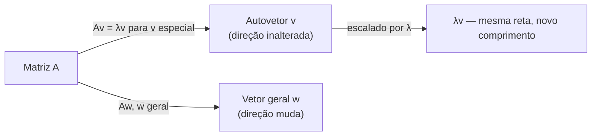

## Objetivos de Aprendizagem

- Definir um autovetor e autovalor de uma matriz quadrada A via a equação Av = λv, e explicar em termos geométricos o que torna tal v especial.
- Derivar a equação característica det(A − λI) = 0 a partir de Av = λv, e explicar por que essa redução é necessária para encontrar λ sem já saber v.
- Calcular os autovalores de uma matriz 2×2 resolvendo seu polinômio característico.
- Calcular os autovetores correspondentes a cada autovalor resolvendo (A − λI)v = 0.
- Verificar um par autovalor-autovetor alegado (λ, v) diretamente, substituindo de volta em Av = λv em vez de confiar apenas na derivação.

## Contexto e Motivação

Toda matriz A representa uma transformação linear, anteriormente nesta disciplina, essa transformação foi descrita como algo que pode girar, esticar, encolher, ou refletir vetores, geralmente embaralhando sua direção junto com seu comprimento. Mas para quase toda matriz, existe um punhado de direções especiais que a transformação não embaralha de forma alguma: vetores que A apenas estica ou encolhe, enviando-os de volta ao longo da mesma reta em que começaram, nunca girados para fora dela. Essas direções especiais são os **autovetores** de A, e o fator pelo qual cada uma é esticada ou encolhida é seu **autovalor**. Isso não é uma curiosidade menor, é indiscutivelmente a ideia mais consequente da álgebra linear aplicada, porque uma vez que você conhece os autovetores de uma matriz, você sabe exatamente como ela se comporta nas direções que mais importam, e, como os próximos dois conceitos desta disciplina mostram diretamente, você pode usar esse conhecimento para calcular coisas de outra forma dolorosamente caras (como a 100ª potência de uma matriz) quase de graça.

O próprio nome é um fóssil da história dessa ideia: "eigen" é alemão para "próprio" ou "característico," então um autovetor é, literalmente, um dos "vetores próprios" de A, uma direção intrínseca à própria transformação, não a qualquer escolha particular de coordenadas. É por isso que autovalores e autovetores aparecem sob o mesmo nome em campos completamente diferentes: eles descrevem os modos naturais de vibração de um sistema físico, os eixos principais de um corpo rígido girando, a estrutura populacional estável de um modelo demográfico, o comportamento de longo prazo de uma cadeia de Markov (coberta mais adiante nesta disciplina), e as direções de máxima variância em um conjunto de dados (a base da Análise de Componentes Principais, prevista quando esta disciplina chegar a matrizes simétricas). Em cada uma dessas situações, a pergunta subjacente é a mesma: dada uma transformação linear, quais direções ela meramente escala, e por quanto? Autovalores e autovetores são a resposta matemática precisa.

Este conceito constrói diretamente sobre duas ideias já estabelecidas: **matrizes como transformações lineares** (para que "Av" tenha um significado geométrico concreto, uma imagem de onde A envia v) e **determinantes** (para que det(A − λI) = 0, a ferramenta computacional chave abaixo, tenha um determinante já significativamente definido para ele). Tudo daqui até o resto do tópico "Autovalores" desta disciplina, diagonalização, potências de uma matriz, o comportamento especial de matrizes simétricas, e cadeias de Markov, é construído sobre a definição dada aqui.

## Teoria Central

### Definição: autovalores e autovetores

Dada uma matriz quadrada n×n A, um vetor não nulo v ∈ ℝⁿ é um **autovetor** de A se existe um escalar λ tal que

Av = λv

O escalar λ é o **autovalor** associado a v. Em palavras: multiplicar v por A produz o mesmo resultado que simplesmente escalar v pelo número λ, sem rotação, sem mudança de direção, apenas um esticamento (se |λ| > 1), um encolhimento (se |λ| < 1), uma inversão (se λ < 0), ou nenhuma mudança de forma alguma (se λ = 1).

Duas coisas sobre essa definição são fáceis de esquecer e vale a pena enunciar explicitamente desde já. Primeiro, v deve ser **não nulo**, o vetor zero satisfaz trivialmente A0 = λ0 para todo λ, então permitir v = 0 tornaria a definição vazia; não carrega nenhuma informação sobre A. Segundo, um autovalor λ pode ser zero mesmo que seu autovetor não possa, λ = 0 simplesmente significa Av = 0, ou seja, v está no espaço nulo de A (um conceito de anteriormente nesta disciplina). Um autovalor zero é um autovalor perfeitamente legítimo; apenas sinaliza que A colapsa aquela direção específica para nada.

Geometricamente: imagine A como uma transformação do plano (ou de ℝⁿ em geral). A maioria dos vetores, atingidos por A, saem apontando em alguma nova direção não relacionada. Um autovetor é uma das raras exceções, sua imagem Av cai de volta na mesma reta pela origem em que o próprio v está, meramente reescalado por λ.

### Encontrando autovalores: a equação característica

A definição Av = λv não é, por si só, algo que você pode resolver diretamente para λ e v simultaneamente, ela tem duas incógnitas emaranhadas juntas (o escalar λ e o vetor v), e v aparece em ambos os lados. O movimento padrão é reescrever a equação de modo que a presença de v se torne uma pergunta de espaço nulo, que pode ser respondida sem primeiro saber v.

Começando de Av = λv, mova tudo para um lado:

Av − λv = 0
(A − λI)v = 0

(Aqui I é a matriz identidade, inserida para que λv possa ser reescrito como λIv, correspondendo à forma matriz-vetor de Av, e os dois termos combinados em uma única matriz (A − λI) agindo sobre v.) Essa equação diz que v é um vetor não nulo no espaço nulo da matriz (A − λI). Mas uma matriz tem um espaço nulo não nulo, algum vetor não nulo que ela colapsa para zero, precisamente quando ela é **singular**, ou seja, precisamente quando seu determinante é zero (esta é exatamente a conexão com o conceito de determinantes anteriormente nesta disciplina: det = 0 sinaliza singularidade, e singularidade é exatamente o que "uma solução não nula v existe" exige aqui). Então:

(A − λI)v = 0 tem uma solução não nula v ⟺ det(A − λI) = 0

Essa equação, det(A − λI) = 0, é a **equação característica** de A, e seu lado esquerdo, expandido, é um polinômio em λ chamado de **polinômio característico**. Para uma matriz n×n, esse polinômio tem grau n, então tem (contando raízes complexas e multiplicidade) exatamente n autovalores, embora para uma matriz geral alguns possam coincidir, e alguns possam ser números complexos em vez de reais (uma sutileza resolvida favoravelmente para matrizes simétricas, coberta dois conceitos à frente).

O procedimento, então, é dois estágios em sequência:

1. Resolva det(A − λI) = 0 para λ, isso encontra os autovalores primeiro, sem ainda tocar em nenhum autovetor.
2. Para cada autovalor λ encontrado, substitua-o de volta em (A − λI)v = 0 e resolva esse sistema linear (agora perfeitamente comum) para v, encontrando o(s) autovetor(es) pertencente(s) àquele λ específico.

Essa ordem não é opcional: os autovalores devem ser encontrados primeiro, porque a equação do autovetor (A − λI)v = 0 depende de já saber λ.

### O autoespaço: autovetores nunca são únicos

Se v é um autovetor de A com autovalor λ, então cv também é, para qualquer escalar não nulo c, porque A(cv) = c(Av) = c(λv) = λ(cv), então cv satisfaz a mesma equação de autovetor com o autovalor idêntico. Isso significa que autovetores nunca são relatados como um único vetor exclusivo; eles são apenas determinados até um múltiplo escalar, e o conjunto completo de vetores satisfazendo (A − λI)v = 0 para um λ fixo (junto com o vetor zero) forma um subespaço chamado de **autoespaço** de λ. Ao resolver à mão, é prática padrão relatar o representante mais simples desse autoespaço, entradas de número inteiro menor, por exemplo, com o entendimento de que qualquer múltiplo escalar não nulo é uma resposta igualmente válida.

## Exemplos Resolvidos

### Exemplo 1 — encontrando autovalores e autovetores de uma matriz 2×2 à mão

**Problema:** Encontre todos os autovalores e seus autovetores correspondentes para

A = [[4, 1], [2, 3]]

**Passo 1 — forme A − λI.**

A − λI = [[4 − λ, 1], [2, 3 − λ]]

**Passo 2 — iguale o determinante a zero (equação característica).** Para uma matriz 2×2 [[a, b], [c, d]], det = ad − bc, então:

det(A − λI) = (4 − λ)(3 − λ) − (1)(2) = 0

Expanda (4 − λ)(3 − λ) = 12 − 4λ − 3λ + λ² = λ² − 7λ + 12. Então:

λ² − 7λ + 12 − 2 = 0
λ² − 7λ + 10 = 0

**Passo 3 — resolva o polinômio característico.** Fatore: λ² − 7λ + 10 = (λ − 5)(λ − 2) = 0, dando λ₁ = 5 e λ₂ = 2. Esses são os dois autovalores de A.

**Passo 4 — encontre o autovetor para λ₁ = 5.** Substitua em (A − λI)v = 0:

A − 5I = [[4 − 5, 1], [2, 3 − 5]] = [[−1, 1], [2, −2]]

Resolva [[−1, 1], [2, −2]]·[v₁, v₂] = [0, 0]. A primeira linha dá −v₁ + v₂ = 0, ou seja, v₂ = v₁ (a segunda linha, 2v₁ − 2v₂ = 0, dá a mesma equação, confirmando que o sistema é dependente como esperado, isso sempre acontece, já que det(A − λI) = 0 foi projetado exatamente para tornar as linhas dependentes). Escolhendo v₁ = 1 dá o autovetor v⁽¹⁾ = (1, 1).

**Passo 5 — encontre o autovetor para λ₂ = 2.**

A − 2I = [[4 − 2, 1], [2, 3 − 2]] = [[2, 1], [2, 1]]

Resolva [[2, 1], [2, 1]]·[v₁, v₂] = [0, 0]. A primeira linha dá 2v₁ + v₂ = 0, ou seja, v₂ = −2v₁. Escolhendo v₁ = 1 dá o autovetor v⁽²⁾ = (1, −2).

**Passo 6 — verifique ambos os pares de autovalor-autovetor diretamente**, em vez de confiar apenas na álgebra. Verifique Av⁽¹⁾ = λ₁v⁽¹⁾:

A·(1, 1) = (4·1 + 1·1, 2·1 + 3·1) = (5, 5) = 5·(1, 1) ✓

Verifique Av⁽²⁾ = λ₂v⁽²⁾:

A·(1, −2) = (4·1 + 1·(−2), 2·1 + 3·(−2)) = (2, −4) = 2·(1, −2) ✓

Ambos conferem exatamente. A tem autovalores 5 e 2, com autovetores (1, 1) e (1, −2) respectivamente (cada um definido até um múltiplo escalar).

### Exemplo 2 — uma matriz com um autovalor repetido

**Problema:** Encontre os autovalores de B = [[3, 0], [0, 3]].

**Equação característica.** B − λI = [[3 − λ, 0], [0, 3 − λ]], então det(B − λI) = (3 − λ)² = 0, dando λ = 3 como uma **raiz repetida** (multiplicidade 2), há apenas um autovalor distinto, ocorrendo duas vezes.

**Autovetores.** Substituindo λ = 3: B − 3I = [[0, 0], [0, 0]], a matriz zero. Todo vetor não nulo v satisfaz (B − 3I)v = 0 trivialmente, então *todo* vetor não nulo em ℝ² é um autovetor de B com autovalor 3. Isso faz sentido diretamente a partir do próprio B: B = 3I, então Bv = 3v para literalmente todo v, B é "escala uniforme por 3," que escala toda direção identicamente, então toda direção se qualifica como um autovetor.

### Exemplo 3 — um autovalor de zero

**Problema:** Encontre os autovalores e autovetores de C = [[2, 4], [1, 2]].

**Equação característica.** det(C − λI) = (2 − λ)(2 − λ) − (4)(1) = λ² − 4λ + 4 − 4 = λ² − 4λ = λ(λ − 4) = 0, dando λ₁ = 0 e λ₂ = 4.

**Autovetor para λ₁ = 0.** Resolva Cv = 0 diretamente (isso é exatamente o cálculo de espaço nulo de anteriormente nesta disciplina): [[2, 4], [1, 2]]·[v₁, v₂] = [0, 0] dá 2v₁ + 4v₂ = 0, ou seja, v₁ = −2v₂. Escolhendo v₂ = 1 dá v⁽¹⁾ = (−2, 1). Verifique: C·(−2, 1) = (2·(−2) + 4·1, 1·(−2) + 2·1) = (0, 0) = 0·(−2, 1) ✓, esse autovetor é exatamente um vetor base para o espaço nulo de C, confirmando que um autovalor zero nada mais é do que "um autovetor que é enviado para zero."

**Autovetor para λ₂ = 4.** C − 4I = [[−2, 4], [1, −2]]. Primeira linha: −2v₁ + 4v₂ = 0, ou seja, v₁ = 2v₂. Escolhendo v₂ = 1 dá v⁽²⁾ = (2, 1). Verifique: C·(2, 1) = (2·2 + 4·1, 1·2 + 2·1) = (8, 4) = 4·(2, 1) ✓.

## Equívocos Comuns e Armadilhas

- **"Um autovetor é qualquer vetor v para o qual Av se parece com v."** Ele deve satisfazer Av = λv para *algum* escalar λ, mas esse escalar não é exigido ser 1, pode ser qualquer número real (ou complexo), incluindo 0 ou um número negativo que inverte a direção de v inteiramente. Exigir que Av literalmente seja igual a v (ou seja, verificar apenas λ = 1) perde todo autovetor cujo autovalor não é 1.
- **"Autovetores são únicos, há exatamente um autovetor por autovalor."** Como mostrado acima, se v é um autovetor para λ, todo múltiplo escalar não nulo cv também é, uma reta inteira (ou autoespaço de dimensão maior) de autovetores compartilha o mesmo autovalor. O que é relatado por convenção é um representante, não "o" autovetor.
- **"Você pode encontrar o autovetor primeiro, depois descobrir seu autovalor a partir disso."** Na prática a equação característica deve ser resolvida para λ primeiro, (A − λI)v = 0 não é solucionável para v como um sistema linear comum até que λ seja um número conhecido, porque com λ deixado simbólico, a matriz A − λI tem entradas desconhecidas e nenhum espaço nulo fixo para calcular.
- **"Um autovalor repetido sempre vem com uma dimensão extra inteira de autovetores independentes, como o Exemplo 2."** O Exemplo 2 foi especial porque B já era um múltiplo escalar da identidade. Em geral, um autovalor repetido pode ter um autoespaço *deficiente*, menos autovetores independentes do que sua multiplicidade sugeriria, uma sutileza que importa diretamente para diagonalização, coberta a seguir.
- **"det(A − λI) = 0 é resolvido calculando primeiro det(A) e depois subtraindo λ."** O determinante deve ser calculado a partir da matriz A − λI como um todo, entrada por entrada, *depois* igualado a zero e expandido como um polinômio em λ, det(A) − λ não é um atalho válido e geralmente nem sequer está perto da expressão correta.

## Resumo

Um autovetor v de uma matriz A é uma direção não nula que A apenas estica ou encolhe, nunca gira para longe dela, e seu autovalor λ é o fator de escala exato, capturado na única equação Av = λv. Como essa equação não pode ser resolvida diretamente para ambas as incógnitas de uma vez, ela é reescrita como (A − λI)v = 0, que tem uma solução não nula v exatamente quando A − λI é singular, ou seja, exatamente quando det(A − λI) = 0, a equação característica. Resolver essa equação polinomial dá os autovalores primeiro; substituir cada um de volta em (A − λI)v = 0 como um sistema linear comum então dá seu(s) autovetor(es), sempre determinado(s) apenas até um múltiplo escalar não nulo. Esse maquinário, encontre λ a partir de uma condição de determinante, depois encontre v a partir de um sistema linear resultante, é a espinha dorsal computacional para tudo que o resto do tópico de autovalores desta disciplina constrói: diagonalizar uma matriz, calcular suas potências eficientemente, e entender o comportamento de longo prazo de cadeias de Markov.

## Documentation Links

- [MIT 18.06 — Course Home (OCW)](https://ocw.mit.edu/courses/18-06-linear-algebra-spring-2010/) — doc
- [Stanford CS229 — Linear Algebra Review and Reference](https://cs229.stanford.edu/section/cs229-linalg.pdf) — doc
