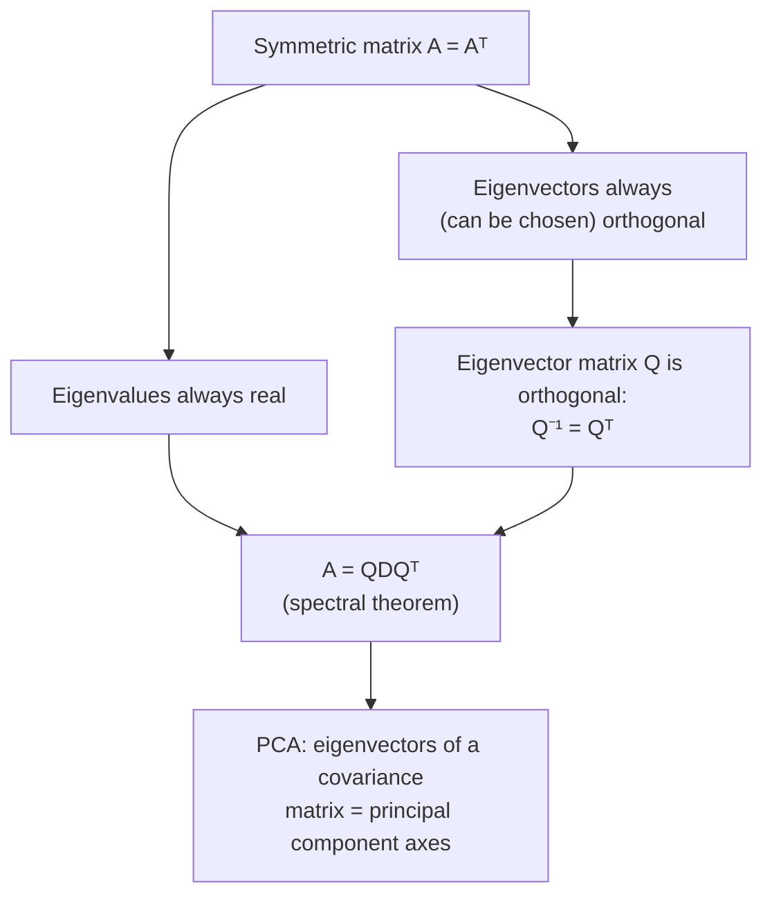

## Learning Objectives

- State the two guarantees a symmetric matrix (A = Aᵀ) gives about its eigenvalues and eigenvectors that a general matrix does not.
- Give an intuitive justification (not a full proof) for why a symmetric matrix's eigenvalues must be real.
- Explain why a symmetric matrix's eigenvectors, when they correspond to distinct eigenvalues, are automatically orthogonal to each other.
- Write the special diagonalization A = QDQᵀ for a symmetric matrix, and explain how it differs from the general A = PDP⁻¹ from the previous concept.
- Describe, at a high level, why this guarantee is the load-bearing fact behind Principal Component Analysis (PCA).

## Context & Motivation

The previous concept ended on a cautionary note: not every matrix is diagonalizable, and even among those that are, the eigenvector matrix P is, in general, just some invertible matrix — computing its inverse P⁻¹ is itself real work, with no particular structure to lean on. Symmetric matrices (A = Aᵀ, introduced earlier in this discipline alongside the transpose) are the striking exception to both problems at once. A symmetric matrix is *always* diagonalizable — no exceptions, no defective eigenspaces to worry about — and better still, its eigenvectors can always be chosen to be mutually orthogonal, which means the eigenvector matrix Q can always be chosen to be an **orthogonal matrix** (introduced two concepts before this one), whose inverse is nothing more than its own transpose: Q⁻¹ = Qᵀ. That single fact eliminates the most expensive step of diagonalization entirely — there is no matrix inversion left to compute, only a transpose, which is free.

This is not a narrow technical curiosity; it is one of the most consequential facts in applied linear algebra, precisely because symmetric matrices are everywhere in practice. A covariance matrix — the matrix of pairwise variances and covariances among a dataset's features — is always symmetric by construction (the covariance between feature i and feature j is, definitionally, the same number as the covariance between feature j and feature i). **Principal Component Analysis (PCA)**, a widely used technique for finding the directions of greatest variance in high-dimensional data, works by diagonalizing exactly this kind of matrix: it computes the covariance matrix of a dataset, then finds its eigenvectors, which turn out to be the axes of greatest-to-least spread in the data (the "principal components"), and its eigenvalues, which measure how much variance lies along each axis. None of this works cleanly without the guarantee proved (informally) here — that a symmetric matrix's eigenvalues are real numbers you can actually rank by size, and its eigenvectors are orthogonal directions you can use as a genuine new coordinate system. Without both guarantees, "the direction of greatest variance" wouldn't even be a coherent question to ask.

## Core Theory

### The theorem: real eigenvalues, orthogonal eigenvectors

**Theorem.** If A is a real, symmetric n×n matrix (A = Aᵀ), then:

1. Every eigenvalue of A is a real number (never a non-real complex number).
2. Eigenvectors of A corresponding to *different* eigenvalues are automatically orthogonal to each other.
3. A has a full set of n orthogonal (in fact, orthonormal, once scaled to unit length) eigenvectors, regardless of whether any eigenvalue repeats — so A is always diagonalizable.

This is a genuinely strong result: recall from the previous concept that a general matrix can fail to be diagonalizable at all (a repeated eigenvalue can come up short on independent eigenvectors), and even when it does diagonalize, nothing guarantees its eigenvectors point in mutually perpendicular directions. Symmetric matrices sidestep both failure modes entirely, purely as a consequence of the single condition A = Aᵀ.

### Why the eigenvalues are real: an intuitive justification

A full proof of real eigenvalues requires working with complex vectors and complex conjugates, which sits outside this discipline's scope — but the core idea can be seen without the heaviest machinery. Suppose, for contradiction, λ is a genuinely complex eigenvalue of A (with nonzero imaginary part) and v its (necessarily complex-valued) eigenvector, so Av = λv. Taking the complex conjugate of both sides and using that A's entries are real (so conjugating A does nothing to it) gives A v̄ = λ̄ v̄ — meaning λ̄ (the conjugate of λ) is also an eigenvalue, with eigenvector v̄. Now consider the quantity v̄ᵀAv, computed two ways using A = Aᵀ. On one hand, v̄ᵀAv = v̄ᵀ(λv) = λ(v̄ᵀv). On the other hand, using symmetry, v̄ᵀAv = (Av̄)ᵀv would need care with conjugates, but the essential punchline — worked out fully in a linear algebra course that develops complex inner products — is that symmetry forces λ and λ̄ to multiply out consistently only if λ = λ̄, which is exactly the statement that λ has no imaginary part, i.e., λ is real. The intuition worth keeping, even without chasing every algebraic step: symmetry (A = Aᵀ) is a strong enough constraint on how A treats a vector and its conjugate together that it rules out any leftover imaginary component surviving in λ.

A cleaner, complementary intuition: a symmetric matrix's quadratic form vᵀAv (a scalar built from A and a vector v) is always a real number for a real vector v, and it can be shown that this quantity governs how A stretches v along its own direction — with no antisymmetric, rotation-inducing part, unlike a general matrix, which can mix a genuine rotation into its action. Complex eigenvalues arise algebraically precisely from rotation-like behavior (a 90° rotation matrix, for instance — not symmetric — has eigenvalues ±i, pure imaginary numbers, reflecting that it has no real direction it merely scales; every direction gets rotated). A symmetric matrix, having no such rotational component, has nothing left to produce a non-real eigenvalue.

### Why eigenvectors of distinct eigenvalues are orthogonal

This half of the theorem has a clean, short proof. Suppose v₁ and v₂ are eigenvectors of a symmetric A with distinct eigenvalues λ₁ ≠ λ₂: Av₁ = λ₁v₁ and Av₂ = λ₂v₂. Consider the dot product v₁·(Av₂), computed two ways.

First, directly substituting Av₂ = λ₂v₂: v₁·(Av₂) = v₁·(λ₂v₂) = λ₂(v₁·v₂).

Second, using symmetry (A = Aᵀ) to move A across the dot product — a general fact for any matrix is that x·(Ay) = (Aᵀx)·y, so for symmetric A specifically, x·(Ay) = (Ax)·y — apply this with x = v₁, y = v₂:

v₁·(Av₂) = (Av₁)·v₂ = (λ₁v₁)·v₂ = λ₁(v₁·v₂)

Both expressions equal v₁·(Av₂), so:

λ₂(v₁·v₂) = λ₁(v₁·v₂)
(λ₂ − λ₁)(v₁·v₂) = 0

Since λ₁ ≠ λ₂ by assumption, (λ₂ − λ₁) ≠ 0, which forces v₁·v₂ = 0 — exactly the statement that v₁ and v₂ are orthogonal. This is a clean, complete argument (unlike the real-eigenvalue case, it needs no complex-number machinery), and it is the direct reason symmetric matrices are so well-behaved: orthogonality between eigenvectors isn't an extra property to verify separately — it falls straight out of A = Aᵀ whenever the eigenvalues themselves differ. (When an eigenvalue repeats, its eigenspace can still be given an orthogonal basis by construction — this needs a bit more work than the two-line argument above, but the guarantee holds regardless.)

### The special diagonalization: A = QDQᵀ

Because a symmetric matrix's eigenvectors can always be chosen orthonormal (orthogonal to each other and individually scaled to unit length), the matrix Q built from them — columns equal to the (unit-length) eigenvectors — is exactly an **orthogonal matrix**, satisfying Q⁻¹ = Qᵀ (the defining property from two concepts earlier in this discipline). Substituting this into the general diagonalization A = PDP⁻¹ from the previous concept, with P renamed Q to flag this special structure:

A = QDQᵀ

This is a genuinely elegant special case: the general formula required computing P⁻¹, an operation with real cost for an arbitrary invertible matrix; here, that inverse is replaced by a transpose — free, mechanical, no elimination or cofactor computation required at all. This is sometimes called the **spectral theorem** for symmetric matrices, and it is the exact fact PCA leans on: a covariance matrix's eigendecomposition, computed this way, hands back both a ranked list of variances (D's diagonal, the eigenvalues) and a ready-made orthonormal coordinate system aligned with the data's true axes of spread (Q's columns, the eigenvectors) — with no separate orthogonalization step needed, because symmetry already guaranteed it.

## Worked Examples

### Example 1 — verifying real eigenvalues and orthogonal eigenvectors directly

**Problem:** Let A = [[2, 1], [1, 2]] (symmetric: A = Aᵀ, since the off-diagonal entries match). Find its eigenvalues and eigenvectors, and confirm both guarantees of the theorem hold.

**Eigenvalues.** A − λI = [[2−λ, 1], [1, 2−λ]], det = (2−λ)² − 1 = 0. Expand: 4 − 4λ + λ² − 1 = λ² − 4λ + 3 = (λ−3)(λ−1) = 0, giving λ₁ = 3, λ₂ = 1 — both real numbers, as guaranteed.

**Eigenvector for λ₁ = 3.** A − 3I = [[−1, 1], [1, −1]]. First row: −v₁ + v₂ = 0, so v₂ = v₁. Take v⁽¹⁾ = (1, 1).

**Eigenvector for λ₂ = 1.** A − I = [[1, 1], [1, 1]]. First row: v₁ + v₂ = 0, so v₂ = −v₁. Take v⁽²⁾ = (1, −1).

**Confirming orthogonality.** v⁽¹⁾·v⁽²⁾ = (1)(1) + (1)(−1) = 1 − 1 = 0 — exactly orthogonal, precisely as the theorem guarantees for eigenvectors of distinct eigenvalues, with no extra work required to arrange it.

**Building Q.** Normalize each eigenvector to unit length: ‖v⁽¹⁾‖ = √(1²+1²) = √2, so q⁽¹⁾ = (1/√2, 1/√2); similarly q⁽²⁾ = (1/√2, −1/√2). Then Q = [[1/√2, 1/√2], [1/√2, −1/√2]], and one can check directly that QᵀQ = I (its columns are unit length and orthogonal), confirming Q is indeed an orthogonal matrix, so A = QDQᵀ with D = [[3, 0], [0, 1]].

### Example 2 — a non-symmetric matrix loses both guarantees

**Problem:** Contrast Example 1 with R = [[0, −1], [1, 0]] (a 90° rotation matrix — deliberately not symmetric: Rᵀ = [[0, 1], [−1, 0]] ≠ R).

**Eigenvalues.** R − λI = [[−λ, −1], [1, −λ]], det = λ² − (−1)(1) = λ² + 1 = 0, giving λ = ±i — non-real, complex eigenvalues, as flagged in Core Theory. This is exactly the "pure rotation" case: a 90° rotation has no real direction it merely stretches or shrinks, so it makes sense that no real eigenvalue exists at all.

**Conclusion.** R fails both guarantees the theorem would have offered if it were symmetric — but that's expected, since R isn't symmetric to begin with. This example exists purely to sharpen the contrast: the real-eigenvalue, orthogonal-eigenvector guarantee is a special reward for symmetry, not a property every matrix enjoys.

### Example 3 — a repeated eigenvalue in a symmetric matrix still yields an orthogonal basis

**Problem:** Let S = [[5, 0, 0], [0, 3, 4], [0, 4, −3]] — symmetric, with a 3×3 structure where the top-left entry is already isolated from the rest. (This matrix is chosen so the block structure keeps the arithmetic tractable.) Verify that λ = 5 is an eigenvalue, and find its eigenvector.

**Checking λ = 5.** S − 5I = [[0, 0, 0], [0, −2, 4], [0, 4, −8]]. The vector (1, 0, 0) satisfies (S−5I)(1,0,0) = (0, 0, 0) ✓, so λ = 5 is indeed an eigenvalue with eigenvector (1, 0, 0).

**The remaining 2×2 block.** The bottom-right 2×2 block [[3, 4], [4, −3]] is itself symmetric, and governs how S acts on any vector of the form (0, a, b) — decoupled entirely from the first coordinate, exactly because the off-block entries are zero. Its own eigenvalues solve (3−λ)(−3−λ) − 16 = λ² − 9 − 16 = λ² − 25 = 0, giving λ = ±5. So S actually has eigenvalues 5, 5, −5 — a repeated eigenvalue at 5.

**The point of this example.** Even with a repeated eigenvalue, S — being symmetric — still yields two independent, and orthogonal, eigenvectors for λ = 5 (one is (1,0,0); the other comes from the block's own eigenvector for its λ=5 solution, extended with a 0 in the first coordinate, and it is automatically orthogonal to (1,0,0) since its first coordinate is zero). This is precisely guarantee 3 from the theorem: a symmetric matrix's eigenspaces never come up short, unlike the defective non-symmetric example from the previous concept.

## Common Misconceptions & Pitfalls

- **"Any matrix with real number entries automatically has real eigenvalues."** Example 2's R = [[0, −1], [1, 0]] is a real-entried matrix with purely imaginary eigenvalues ±i. Real entries alone guarantee nothing about the eigenvalues; it is specifically *symmetry* (A = Aᵀ) that forces real eigenvalues.
- **"Eigenvectors of a symmetric matrix are orthogonal no matter what, even for the same eigenvalue."** The clean two-line proof in Core Theory only applies directly when λ₁ ≠ λ₂. Two eigenvectors sharing the *same* eigenvalue are not automatically orthogonal as picked — but the theorem's guarantee 3 still holds: an orthogonal basis can always be chosen within that shared eigenspace (as in Example 3), it just isn't automatic for an arbitrary pair of eigenvectors picked without care.
- **"A = QDQᵀ is just A = PDP⁻¹ with different letters."** The letters differ for a real reason: Q is guaranteed orthogonal (Q⁻¹ = Qᵀ) specifically because A is symmetric, which is what makes the transpose Qᵀ usable in place of a general inverse P⁻¹ — computing Qᵀ costs nothing, while computing a general P⁻¹ requires real work (elimination, or a cofactor-based formula). Writing "PDP⁻¹" for a symmetric matrix isn't wrong, but it obscures this genuinely cheaper structure.
- **"PCA requires understanding eigenvalues of a non-symmetric matrix."** PCA operates specifically on a covariance matrix, which is symmetric by construction (covariance between feature i and j equals covariance between j and i). This is exactly why PCA can rely on real eigenvalues (rankable as "amount of variance," which wouldn't even make sense as a complex number) and orthogonal eigenvectors (usable as a genuine coordinate system) without any extra machinery.

## Summary

A symmetric matrix (A = Aᵀ) enjoys two guarantees a general matrix does not: its eigenvalues are always real numbers, and its eigenvectors — at least those belonging to distinct eigenvalues — are automatically orthogonal, with an orthogonal basis always achievable even inside a repeated eigenvalue's eigenspace. Together these guarantee that every symmetric matrix is diagonalizable, and diagonalizes in an especially clean form, A = QDQᵀ, where Q is an orthogonal matrix (so Q⁻¹ = Qᵀ costs nothing to compute) and D holds the real eigenvalues. This is not merely a tidy theoretical corner: covariance matrices are symmetric by construction, and Principal Component Analysis leans directly on this exact guarantee — real eigenvalues to rank as variances, orthogonal eigenvectors to serve as a genuine coordinate system — to find the true axes of spread in a dataset.

## Documentation Links

- [Stanford CS229 — Linear Algebra Review and Reference](https://cs229.stanford.edu/section/cs229-linalg.pdf) — doc
- [MIT 18.065 — Syllabus (OCW)](https://ocw.mit.edu/courses/18-065-matrix-methods-in-data-analysis-signal-processing-and-machine-learning-spring-2018/pages/syllabus/) — doc
