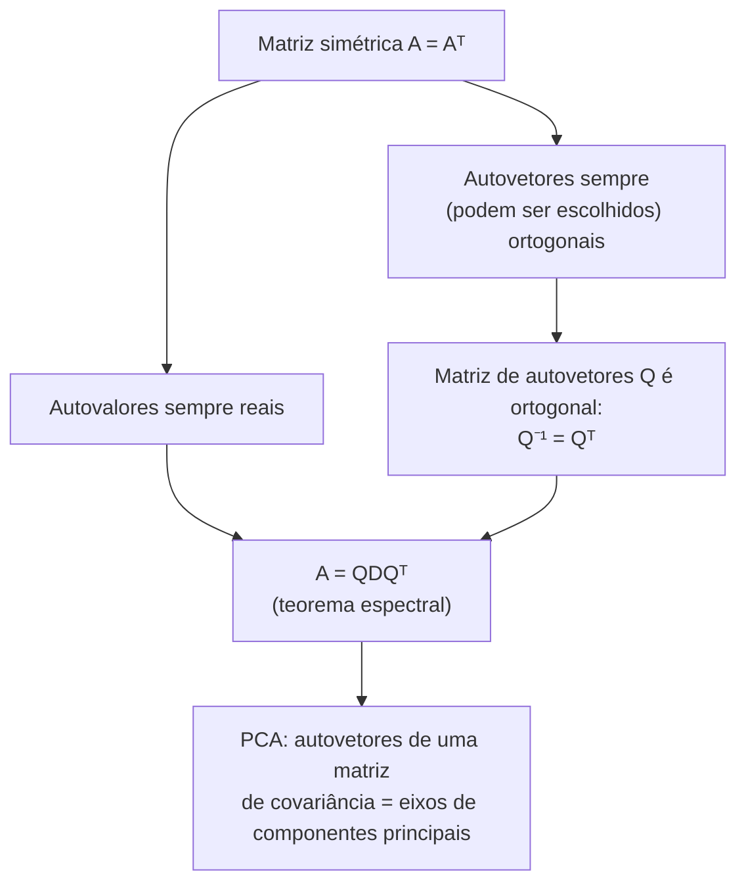

## Objetivos de Aprendizagem

- Enunciar as duas garantias que uma matriz simétrica (A = Aᵀ) dá sobre seus autovalores e autovetores que uma matriz geral não dá.
- Dar uma justificativa intuitiva (não uma prova completa) para por que os autovalores de uma matriz simétrica devem ser reais.
- Explicar por que os autovetores de uma matriz simétrica, quando correspondem a autovalores distintos, são automaticamente ortogonais entre si.
- Escrever a diagonalização especial A = QDQᵀ para uma matriz simétrica, e explicar como ela difere da A = PDP⁻¹ geral do conceito anterior.
- Descrever, em alto nível, por que essa garantia é o fato estrutural por trás da Análise de Componentes Principais (PCA).

## Contexto e Motivação

O conceito anterior terminou com uma nota de cautela: nem toda matriz é diagonalizável, e mesmo entre as que são, a matriz de autovetores P é, em geral, apenas alguma matriz invertível, calcular sua inversa P⁻¹ é em si um trabalho real, sem nenhuma estrutura particular para se apoiar. Matrizes simétricas (A = Aᵀ, introduzidas anteriormente nesta disciplina junto com a transposta) são a exceção marcante para ambos os problemas de uma vez. Uma matriz simétrica é *sempre* diagonalizável, sem exceções, sem autoespaços deficientes com que se preocupar, e melhor ainda, seus autovetores sempre podem ser escolhidos mutuamente ortogonais, o que significa que a matriz de autovetores Q sempre pode ser escolhida como uma **matriz ortogonal** (introduzida dois conceitos antes deste), cuja inversa nada mais é do que sua própria transposta: Q⁻¹ = Qᵀ. Esse único fato elimina inteiramente o passo mais caro da diagonalização, não resta nenhuma inversão de matriz para calcular, apenas uma transposta, que é grátis.

Isso não é uma curiosidade técnica restrita; é um dos fatos mais consequentes da álgebra linear aplicada, precisamente porque matrizes simétricas estão em toda parte na prática. Uma matriz de covariância, a matriz de variâncias e covariâncias par a par entre as características de um conjunto de dados, é sempre simétrica por construção (a covariância entre a característica i e a característica j é, por definição, o mesmo número que a covariância entre a característica j e a característica i). A **Análise de Componentes Principais (PCA)**, uma técnica amplamente usada para encontrar as direções de maior variância em dados de alta dimensão, funciona diagonalizando exatamente esse tipo de matriz: ela calcula a matriz de covariância de um conjunto de dados, depois encontra seus autovetores, que acabam sendo os eixos de maior para menor dispersão nos dados (os "componentes principais"), e seus autovalores, que medem quanta variância está ao longo de cada eixo. Nada disso funciona de forma limpa sem a garantia provada (informalmente) aqui, que os autovalores de uma matriz simétrica são números reais que você pode de fato ordenar por tamanho, e seus autovetores são direções ortogonais que você pode usar como um sistema de coordenadas genuinamente novo. Sem ambas as garantias, "a direção de maior variância" nem sequer seria uma pergunta coerente de fazer.

## Teoria Central

### O teorema: autovalores reais, autovetores ortogonais

**Teorema.** Se A é uma matriz real, simétrica, n×n (A = Aᵀ), então:

1. Todo autovalor de A é um número real (nunca um número complexo não real).
2. Autovetores de A correspondendo a autovalores *diferentes* são automaticamente ortogonais entre si.
3. A tem um conjunto completo de n autovetores ortogonais (de fato, ortonormais, uma vez escalados para comprimento unitário), independentemente de algum autovalor se repetir, então A é sempre diagonalizável.

Este é um resultado genuinamente forte: recorde do conceito anterior que uma matriz geral pode falhar em ser diagonalizável de forma alguma (um autovalor repetido pode ficar aquém de autovetores independentes), e mesmo quando diagonaliza, nada garante que seus autovetores apontam em direções mutuamente perpendiculares. Matrizes simétricas evitam ambos os modos de falha inteiramente, puramente como consequência da única condição A = Aᵀ.

### Por que os autovalores são reais: uma justificativa intuitiva

Uma prova completa de autovalores reais exige trabalhar com vetores complexos e conjugados complexos, o que fica fora do escopo desta disciplina, mas a ideia central pode ser vista sem o maquinário mais pesado. Suponha, por contradição, que λ é um autovalor genuinamente complexo de A (com parte imaginária não nula) e v seu autovetor (necessariamente com valores complexos), então Av = λv. Tomando o conjugado complexo de ambos os lados e usando que as entradas de A são reais (então conjugar A não faz nada com ela) dá A v̄ = λ̄ v̄, significando que λ̄ (o conjugado de λ) também é um autovalor, com autovetor v̄. Agora considere a quantidade v̄ᵀAv, calculada de duas formas usando A = Aᵀ. Por um lado, v̄ᵀAv = v̄ᵀ(λv) = λ(v̄ᵀv). Por outro lado, usando simetria, v̄ᵀAv = (Av̄)ᵀv precisaria de cuidado com conjugados, mas a conclusão essencial, trabalhada completamente em um curso de álgebra linear que desenvolve produtos internos complexos, é que a simetria força λ e λ̄ a se multiplicarem consistentemente apenas se λ = λ̄, que é exatamente a afirmação de que λ não tem parte imaginária, ou seja, λ é real. A intuição que vale a pena reter, mesmo sem perseguir cada passo algébrico: simetria (A = Aᵀ) é uma restrição forte o suficiente sobre como A trata um vetor e seu conjugado juntos que descarta qualquer componente imaginário remanescente sobrevivendo em λ.

Uma intuição mais limpa e complementar: a forma quadrática vᵀAv de uma matriz simétrica (um escalar construído a partir de A e um vetor v) é sempre um número real para um vetor real v, e pode-se mostrar que essa quantidade governa como A estica v ao longo de sua própria direção, sem nenhuma parte antissimétrica indutora de rotação, ao contrário de uma matriz geral, que pode misturar uma rotação genuína em sua ação. Autovalores complexos surgem algebricamente precisamente de comportamento tipo rotação (uma matriz de rotação de 90°, por exemplo, não simétrica, tem autovalores ±i, números puramente imaginários, refletindo que ela não tem nenhuma direção real que meramente escale; toda direção é girada). Uma matriz simétrica, não tendo tal componente rotacional, não tem nada restante para produzir um autovalor não real.

### Por que autovetores de autovalores distintos são ortogonais

Esta metade do teorema tem uma prova limpa e curta. Suponha que v₁ e v₂ são autovetores de uma A simétrica com autovalores distintos λ₁ ≠ λ₂: Av₁ = λ₁v₁ e Av₂ = λ₂v₂. Considere o produto escalar v₁·(Av₂), calculado de duas formas.

Primeiro, substituindo diretamente Av₂ = λ₂v₂: v₁·(Av₂) = v₁·(λ₂v₂) = λ₂(v₁·v₂).

Segundo, usando simetria (A = Aᵀ) para mover A através do produto escalar, um fato geral para qualquer matriz é que x·(Ay) = (Aᵀx)·y, então para A simétrica especificamente, x·(Ay) = (Ax)·y, aplique isso com x = v₁, y = v₂:

v₁·(Av₂) = (Av₁)·v₂ = (λ₁v₁)·v₂ = λ₁(v₁·v₂)

Ambas as expressões são iguais a v₁·(Av₂), então:

λ₂(v₁·v₂) = λ₁(v₁·v₂)
(λ₂ − λ₁)(v₁·v₂) = 0

Como λ₁ ≠ λ₂ por suposição, (λ₂ − λ₁) ≠ 0, o que força v₁·v₂ = 0, exatamente a afirmação de que v₁ e v₂ são ortogonais. Este é um argumento limpo e completo (ao contrário do caso de autovalor real, não precisa de maquinário de número complexo), e é a razão direta pela qual matrizes simétricas são tão bem comportadas: ortogonalidade entre autovetores não é uma propriedade extra a verificar separadamente, ela cai diretamente de A = Aᵀ sempre que os próprios autovalores diferem. (Quando um autovalor se repete, seu autoespaço ainda pode receber uma base ortogonal por construção, isso precisa de um pouco mais de trabalho do que o argumento de duas linhas acima, mas a garantia vale independentemente.)

### A diagonalização especial: A = QDQᵀ

Como os autovetores de uma matriz simétrica sempre podem ser escolhidos ortonormais (ortogonais entre si e individualmente escalados para comprimento unitário), a matriz Q construída a partir deles, colunas iguais aos autovetores (de comprimento unitário), é exatamente uma **matriz ortogonal**, satisfazendo Q⁻¹ = Qᵀ (a propriedade definidora de dois conceitos antes deste nesta disciplina). Substituindo isso na diagonalização geral A = PDP⁻¹ do conceito anterior, com P renomeado para Q para sinalizar essa estrutura especial:

A = QDQᵀ

Este é um caso especial genuinamente elegante: a fórmula geral exigia calcular P⁻¹, uma operação com custo real para uma matriz invertível arbitrária; aqui, essa inversa é substituída por uma transposta, grátis, mecânica, sem eliminação ou cálculo de cofator exigido de forma alguma. Isso às vezes é chamado de **teorema espectral** para matrizes simétricas, e é exatamente o fato em que PCA se apoia: a autodecomposição de uma matriz de covariância, calculada dessa forma, devolve tanto uma lista ordenada de variâncias (a diagonal de D, os autovalores) quanto um sistema de coordenadas ortonormal já pronto alinhado com os eixos verdadeiros de dispersão dos dados (as colunas de Q, os autovetores), sem nenhum passo separado de ortogonalização necessário, porque a simetria já a garantiu.

## Exemplos Resolvidos

### Exemplo 1 — verificando autovalores reais e autovetores ortogonais diretamente

**Problema:** Seja A = [[2, 1], [1, 2]] (simétrica: A = Aᵀ, já que as entradas fora da diagonal correspondem). Encontre seus autovalores e autovetores, e confirme que ambas as garantias do teorema valem.

**Autovalores.** A − λI = [[2−λ, 1], [1, 2−λ]], det = (2−λ)² − 1 = 0. Expanda: 4 − 4λ + λ² − 1 = λ² − 4λ + 3 = (λ−3)(λ−1) = 0, dando λ₁ = 3, λ₂ = 1, ambos números reais, como garantido.

**Autovetor para λ₁ = 3.** A − 3I = [[−1, 1], [1, −1]]. Primeira linha: −v₁ + v₂ = 0, então v₂ = v₁. Tome v⁽¹⁾ = (1, 1).

**Autovetor para λ₂ = 1.** A − I = [[1, 1], [1, 1]]. Primeira linha: v₁ + v₂ = 0, então v₂ = −v₁. Tome v⁽²⁾ = (1, −1).

**Confirmando ortogonalidade.** v⁽¹⁾·v⁽²⁾ = (1)(1) + (1)(−1) = 1 − 1 = 0, exatamente ortogonal, precisamente como o teorema garante para autovetores de autovalores distintos, sem nenhum trabalho extra exigido para arranjar isso.

**Construindo Q.** Normalize cada autovetor para comprimento unitário: ‖v⁽¹⁾‖ = √(1²+1²) = √2, então q⁽¹⁾ = (1/√2, 1/√2); similarmente q⁽²⁾ = (1/√2, −1/√2). Então Q = [[1/√2, 1/√2], [1/√2, −1/√2]], e pode-se verificar diretamente que QᵀQ = I (suas colunas têm comprimento unitário e são ortogonais), confirmando que Q é de fato uma matriz ortogonal, então A = QDQᵀ com D = [[3, 0], [0, 1]].

### Exemplo 2 — uma matriz não simétrica perde ambas as garantias

**Problema:** Contraste o Exemplo 1 com R = [[0, −1], [1, 0]] (uma matriz de rotação de 90°, deliberadamente não simétrica: Rᵀ = [[0, 1], [−1, 0]] ≠ R).

**Autovalores.** R − λI = [[−λ, −1], [1, −λ]], det = λ² − (−1)(1) = λ² + 1 = 0, dando λ = ±i, autovalores complexos não reais, como sinalizado na Teoria Central. Este é exatamente o caso de "rotação pura": uma rotação de 90° não tem nenhuma direção real que meramente estica ou encolhe, então faz sentido que nenhum autovalor real exista de forma alguma.

**Conclusão.** R falha em ambas as garantias que o teorema teria oferecido se fosse simétrica, mas isso é esperado, já que R não é simétrica de início. Este exemplo existe puramente para afiar o contraste: a garantia de autovalor real e autovetor ortogonal é uma recompensa especial para simetria, não uma propriedade que toda matriz desfruta.

### Exemplo 3 — um autovalor repetido em uma matriz simétrica ainda produz uma base ortogonal

**Problema:** Seja S = [[5, 0, 0], [0, 3, 4], [0, 4, −3]], simétrica, com uma estrutura 3×3 onde a entrada superior esquerda já está isolada do resto. (Essa matriz é escolhida para que a estrutura em blocos mantenha a aritmética tratável.) Verifique que λ = 5 é um autovalor, e encontre seu autovetor.

**Verificando λ = 5.** S − 5I = [[0, 0, 0], [0, −2, 4], [0, 4, −8]]. O vetor (1, 0, 0) satisfaz (S−5I)(1,0,0) = (0, 0, 0) ✓, então λ = 5 é de fato um autovalor com autovetor (1, 0, 0).

**O bloco 2×2 restante.** O bloco 2×2 inferior direito [[3, 4], [4, −3]] é ele mesmo simétrico, e governa como S age sobre qualquer vetor da forma (0, a, b), inteiramente desacoplado da primeira coordenada, exatamente porque as entradas fora do bloco são zero. Seus próprios autovalores resolvem (3−λ)(−3−λ) − 16 = λ² − 9 − 16 = λ² − 25 = 0, dando λ = ±5. Então S de fato tem autovalores 5, 5, −5, um autovalor repetido em 5.

**O ponto deste exemplo.** Mesmo com um autovalor repetido, S, sendo simétrica, ainda produz dois autovetores independentes, e ortogonais, para λ = 5 (um é (1,0,0); o outro vem do próprio autovetor do bloco para sua solução λ=5, estendido com um 0 na primeira coordenada, e é automaticamente ortogonal a (1,0,0) já que sua primeira coordenada é zero). Esta é precisamente a garantia 3 do teorema: os autoespaços de uma matriz simétrica nunca ficam aquém, ao contrário do exemplo não simétrico defeituoso do conceito anterior.

## Equívocos Comuns e Armadilhas

- **"Qualquer matriz com entradas de números reais automaticamente tem autovalores reais."** O R = [[0, −1], [1, 0]] do Exemplo 2 é uma matriz de entradas reais com autovalores puramente imaginários ±i. Entradas reais sozinhas não garantem nada sobre os autovalores; é especificamente a *simetria* (A = Aᵀ) que força autovalores reais.
- **"Autovetores de uma matriz simétrica são ortogonais não importa o quê, mesmo para o mesmo autovalor."** A prova limpa de duas linhas na Teoria Central só se aplica diretamente quando λ₁ ≠ λ₂. Dois autovetores compartilhando o *mesmo* autovalor não são automaticamente ortogonais como escolhidos, mas a garantia 3 do teorema ainda vale: uma base ortogonal sempre pode ser escolhida dentro daquele autoespaço compartilhado (como no Exemplo 3), apenas não é automática para um par arbitrário de autovetores escolhidos sem cuidado.
- **"A = QDQᵀ é apenas A = PDP⁻¹ com letras diferentes."** As letras diferem por uma razão real: Q é garantida ortogonal (Q⁻¹ = Qᵀ) especificamente porque A é simétrica, que é o que torna a transposta Qᵀ utilizável no lugar de uma inversa geral P⁻¹, calcular Qᵀ não custa nada, enquanto calcular uma P⁻¹ geral exige trabalho real (eliminação, ou uma fórmula baseada em cofator). Escrever "PDP⁻¹" para uma matriz simétrica não está errado, mas obscurece essa estrutura genuinamente mais barata.
- **"PCA exige entender autovalores de uma matriz não simétrica."** PCA opera especificamente sobre uma matriz de covariância, que é simétrica por construção (covariância entre a característica i e j é igual à covariância entre j e i). Isso é exatamente por que PCA pode confiar em autovalores reais (ordenáveis como "quantidade de variância," o que nem sequer faria sentido como um número complexo) e autovetores ortogonais (utilizáveis como um sistema de coordenadas genuíno) sem nenhum maquinário extra.

## Resumo

Uma matriz simétrica (A = Aᵀ) desfruta de duas garantias que uma matriz geral não tem: seus autovalores são sempre números reais, e seus autovetores, pelo menos aqueles pertencentes a autovalores distintos, são automaticamente ortogonais, com uma base ortogonal sempre alcançável mesmo dentro do autoespaço de um autovalor repetido. Juntas essas garantem que toda matriz simétrica é diagonalizável, e diagonaliza em uma forma especialmente limpa, A = QDQᵀ, onde Q é uma matriz ortogonal (então Q⁻¹ = Qᵀ não custa nada para calcular) e D contém os autovalores reais. Isso não é meramente um canto teórico organizado: matrizes de covariância são simétricas por construção, e a Análise de Componentes Principais se apoia diretamente nessa exata garantia, autovalores reais para ordenar como variâncias, autovetores ortogonais para servir como um sistema de coordenadas genuíno, para encontrar os verdadeiros eixos de dispersão em um conjunto de dados.

## Documentation Links

- [Stanford CS229 — Linear Algebra Review and Reference](https://cs229.stanford.edu/section/cs229-linalg.pdf) — doc
- [MIT 18.065 — Syllabus (OCW)](https://ocw.mit.edu/courses/18-065-matrix-methods-in-data-analysis-signal-processing-and-machine-learning-spring-2018/pages/syllabus/) — doc
