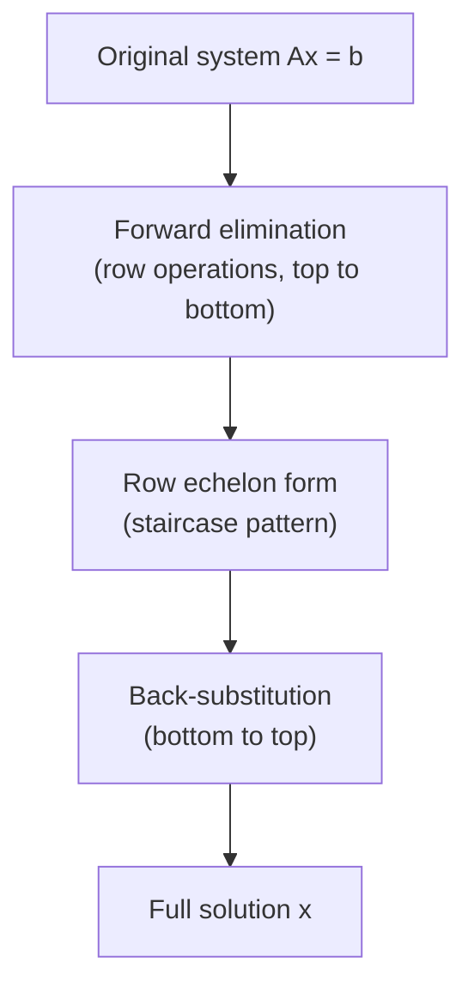

## Learning Objectives

- Execute forward elimination on a system of linear equations (or its augmented matrix) to reach row echelon form, using row operations that preserve the solution set.
- Perform back-substitution on a system in row echelon form to recover the full solution.
- Work a 3×3 system completely by hand, from the original equations through elimination, echelon form, and back-substitution to the final answer.
- Interpret a row that reduces to "0 = nonzero" as proof that the system has no solution.
- Interpret a row that reduces to "0 = 0" as a signal of a free variable and infinitely many solutions, and explain why this differs from the no-solution case.

## Context & Motivation

The previous concept established that solving Ax = b means finding the point where every equation's hyperplane intersects (the row picture), or finding the combination of A's columns that produces b (the column picture) — but neither picture, by itself, hands you an actual procedure for finding that point or that combination once a system grows past two unknowns you can solve by inspection. **Gaussian elimination** is that procedure: a completely mechanical, always-terminating sequence of steps that takes any system of linear equations and either produces the exact solution, reveals there isn't one, or reveals there are infinitely many — with no guesswork, no cleverness, and no dependence on the particular numbers involved.

This is worth taking seriously as more than "a technique for homework problems." Gaussian elimination (or a close numerical relative of it) is what runs, quite literally, underneath every general-purpose linear system solver in existence — from a hand calculation on a 3×3 system to the numerical libraries (LAPACK, and everything built on it, including NumPy's linalg module) that solve systems with millions of unknowns inside scientific computing and machine learning pipelines. The ACM/IEEE CS2013 curriculum guidelines list this algorithm specifically because it is the bridge between the theoretical guarantee that a linear system's solvability is a well-posed, checkable question, and the practical fact that computers need an actual finite sequence of arithmetic steps to answer it.

The core idea is disarmingly simple: take the messy system where every equation involves every unknown, and use legal operations — the kind that don't change the solution set — to systematically remove unknowns from equations, one at a time, until you reach a triangular system where the last equation involves only one unknown, directly readable. From there, work backward, substituting known values up the chain until every unknown is pinned down. This two-phase structure — forward elimination, then back-substitution — is exactly what the rest of this concept develops and drills concretely.

## Core Theory

### Elementary row operations

Gaussian elimination works entirely by applying **elementary row operations** to the system's equations (equivalently, to the rows of its augmented matrix [A | b], the coefficient matrix with the right-hand side appended as an extra column). There are exactly three such operations, and each one is guaranteed not to change the solution set of the system:

1. **Swap** two equations (rows) — reordering equations obviously doesn't change what values satisfy all of them.
2. **Scale** an equation (row) by a nonzero constant — multiplying both sides of a true equation by the same nonzero number preserves exactly which values make it true.
3. **Add a multiple of one equation (row) to another** — if equation A and equation B both hold, then equation A plus any multiple of equation B also holds; this is the workhorse operation used to eliminate a variable from one equation using another.

Because every step of the algorithm below uses only these three operations, the solution set of the system is guaranteed identical from the first line to the last — elimination never invents or loses a solution, it only rewrites the system into a form where the solution is easier to read off.

### Forward elimination to row echelon form

The **forward elimination** phase applies operation 3 (and, when needed, operation 1) repeatedly to systematically zero out coefficients below the "leading" entry of each row, working left to right and top to bottom. The target shape is **row echelon form**: each row's first nonzero entry (its **pivot**) is strictly to the right of the pivot in the row above it, so the pattern of leading zeros strictly increases going down the rows, producing a "staircase" shape overall.

The mechanical procedure, for a system with equations E₁, …, Eₘ:

1. Use E₁'s leading coefficient (its pivot) to eliminate the first variable from every equation below it — for each Eᵢ (i > 1), replace Eᵢ with Eᵢ − (aᵢ₁⁄a₁₁)E₁, which zeros out the first-variable coefficient in Eᵢ.
2. Move to the second equation and repeat: use its (now-established) pivot to eliminate the second variable from every equation below *it*.
3. Continue this pattern down the system — at each stage, only equations below the current one are touched, so earlier eliminations are never undone.

If a pivot position has a zero coefficient at the point it's needed, swap that row with a later row that has a nonzero entry there (operation 1) before continuing — this is why row swaps are part of the toolkit, not just an afterthought.

### Back-substitution

Once the system is in row echelon form, the **last** nonzero row involves only the last unknown (or very few), so it can be solved directly. **Back-substitution** then works upward: substitute the now-known value(s) into the equation above, solve for the next unknown, and repeat until every unknown has been recovered. This is the mirror image of forward elimination — elimination worked top-to-bottom removing variables; back-substitution works bottom-to-top recovering them.



### Reading the outcome: unique, none, or infinite

After elimination, row echelon form reveals the nature of the solution set directly from its rows' shapes, without needing back-substitution to find out which case applies:

- **A pivot in every column (of the coefficient part):** the system has exactly one solution — every unknown gets pinned down by back-substitution, no ambiguity.
- **A row that reads 0 = c for some nonzero c** (every coefficient on the left is zero, but the right-hand side isn't): this is a flat contradiction — no values of the unknowns can make "0 equals a nonzero number" true, so the system has **no solution** at all. Geometrically (row picture), this is the algebraic signature of hyperplanes that simply never all meet at a common point.
- **A row that reads 0 = 0** (both sides genuinely zero — the equation carries no information at all): this row is not a contradiction, but it also isn't a constraint — it signals that one of the original equations was entirely redundant with the others. Whichever variable never gets a pivot as a result becomes a **free variable**, allowed to take any value, and each choice of that free value generates a different valid solution — the system has **infinitely many solutions**, parameterized by the free variable(s).

The contrast between these last two cases is the single most important distinction this concept establishes: both involve an all-zero row of coefficients, but the value that survives on the right-hand side is the entire difference between "impossible" (0 = 5) and "no additional information, infinitely flexible" (0 = 0).

## Worked Examples

### Example 1 — a 3×3 system with a unique solution, worked completely

**Problem:** Solve
x + y + z = 6
2x + 3y + z = 11
x + y + 2z = 8

**Write the augmented matrix** [A | b]:
[1 1 1 | 6]
[2 3 1 | 11]
[1 1 2 | 8]

**Eliminate x from row 2:** row2 → row2 − 2·row1: (2−2, 3−2, 1−2 | 11−12) = (0, 1, −1 | −1).

**Eliminate x from row 3:** row3 → row3 − 1·row1: (1−1, 1−1, 2−1 | 8−6) = (0, 0, 1 | 2).

Updated matrix (already in row echelon form — the staircase of leading zeros is 0, 0, 0 → 1, 0 → 2, no further elimination needed since row 3 already has zeros in the first two columns):
[1 1 1 | 6]
[0 1 −1 | −1]
[0 0 1 | 2]

**Back-substitute, starting from the last row:** row 3 reads z = 2.

**Substitute into row 2:** y − z = −1 → y − 2 = −1 → y = 1.

**Substitute into row 1:** x + y + z = 6 → x + 1 + 2 = 6 → x = 3.

**Solution:** (x, y, z) = (3, 1, 2).

**Verify against all three original equations:** 3+1+2=6 ✓; 2(3)+3(1)+2=6+3+2=11 ✓; 3+1+2(2)=3+1+4=8 ✓. A quick NumPy check confirms it without redoing the hand elimination:

```python
import numpy as np
A = np.array([[1,1,1],[2,3,1],[1,1,2]])
b = np.array([6,11,8])
print(np.linalg.solve(A, b))  # [3. 1. 2.]
```

### Example 2 — a system with no solution

**Problem:** Solve
x + 2y = 3
2x + 4y = 9

**Eliminate x from row 2:** row2 → row2 − 2·row1: (2−2, 4−4 | 9−6) = (0, 0 | 3).

**Resulting row echelon form:**
[1 2 | 3]
[0 0 | 3]

**Interpret the second row:** it reads 0x + 0y = 3, i.e., 0 = 3 — a direct contradiction, since no values of x and y can make zero equal three.

**Conclusion:** the system has **no solution**. This matches the row picture directly: dividing the second original equation by 2 gives x + 2y = 4.5, a line with the same slope as the first equation's line (x + 2y = 3) but a different intercept — two parallel, non-coincident lines that never intersect, exactly the geometric signature of the "0 = nonzero" algebraic outcome.

### Example 3 — a system with infinitely many solutions

**Problem:** Solve
x + y + z = 4
2x + 2y + 2z = 8
x − y = 0

**Eliminate x from row 2:** row2 → row2 − 2·row1: (2−2, 2−2, 2−2 | 8−8) = (0, 0, 0 | 0).

**Eliminate x from row 3:** row3 → row3 − 1·row1: (1−1, −1−1, 0−1 | 0−4) = (0, −2, −1 | −4).

**Reorder for a cleaner staircase** (swap the new row 2 and row 3, since row 2 is now entirely zero and belongs at the bottom):
[1 1 1 | 4]
[0 −2 −1 | −4]
[0 0 0 | 0]

**Interpret the last row:** 0 = 0 — no contradiction, but no new information either. This row came from the second original equation, which was simply 2× the first equation all along (2x+2y+2z=8 is exactly double x+y+z=4) — entirely redundant, contributing nothing once the first equation was already used.

**Identify the free variable:** only two pivots exist (in columns for x and y), so z never receives a pivot — z is the **free variable**, allowed to take any real value.

**Back-substitute in terms of z:** row 2 reads −2y − z = −4, so y = (4 − z)/2 = 2 − z/2. Row 1 reads x + y + z = 4, so x = 4 − y − z = 4 − (2 − z/2) − z = 2 − z/2.

**Solution set:** (x, y, z) = (2 − t/2, 2 − t/2, t) for any t ∈ ℝ — infinitely many solutions, one for every choice of t. Checking t = 0 gives (2, 2, 0): 2+2+0=4 ✓, 2(2)+2(2)+2(0)=8 ✓, 2−2=0 ✓ — a valid solution, and so is every other value of t by the same construction.

## Common Misconceptions & Pitfalls

- **"Row echelon form is itself the final answer."** Row echelon form only sets the stage — it's the triangular shape that makes back-substitution possible, not the solution itself. Stopping after forward elimination and reporting the echelon-form matrix as "the answer" skips the entire second phase (Example 1's z=2, y=1, x=3 all came from back-substitution, not from the echelon matrix alone).
- **"A row of all zeros always means the system has infinitely many solutions."** This is only true when the right-hand side of that row is also zero. A row of "0 = 3" (Example 2) is an all-zero-coefficient row too, but it signals the opposite conclusion — no solution at all, not infinitely many. Always check the right-hand side of a degenerate row before concluding which case applies.
- **"Elimination can change which values solve the system, so you have to double check with the original equations."** The three elementary row operations are specifically chosen because none of them ever changes the solution set — swapping, scaling by a nonzero constant, and adding a multiple of one equation to another all preserve exactly which values satisfy the system. Verifying a final answer against the *original* equations (as both Example 1 and Example 3 do) is good practice for catching arithmetic slips, but it is not compensating for some inherent unreliability in the elimination process itself.
- **"If elimination requires swapping rows, something has gone wrong."** A zero appearing in a needed pivot position is a normal, expected situation, not an error — the fix (swap with a lower row that has a nonzero entry there) is a routine part of the algorithm, explicitly included among the three legal operations for exactly this reason.

## Summary

Gaussian elimination is the systematic, always-terminating algorithm for solving Ax = b: forward elimination uses row operations (swap, scale, add-a-multiple) to reach row echelon form, a triangular staircase shape, and back-substitution then works from the bottom row upward to recover every unknown's value. The shape of the final echelon form tells you immediately which of three outcomes holds — a pivot in every column means a unique solution; a row reading 0 = (nonzero) means no solution exists at all; a row reading 0 = 0 means at least one variable is free, and the system has infinitely many solutions parameterized by that freedom. The three worked examples in this concept show all three outcomes arising from systems that look superficially similar, underscoring that the algorithm itself — not intuition about the specific numbers — is what reliably distinguishes them. This mechanical procedure is exactly what every practical linear-system solver, by hand or by numerical library, ultimately performs underneath.

## Documentation Links

- [MIT 18.06SC — Syllabus (OCW)](https://www.ocw.mit.edu/courses/18-06sc-linear-algebra-fall-2011/pages/syllabus) — doc
- [ACM/IEEE CS2013 — Full Curriculum Guidelines](https://www.acm.org/binaries/content/assets/education/cs2013_web_final.pdf) — doc
