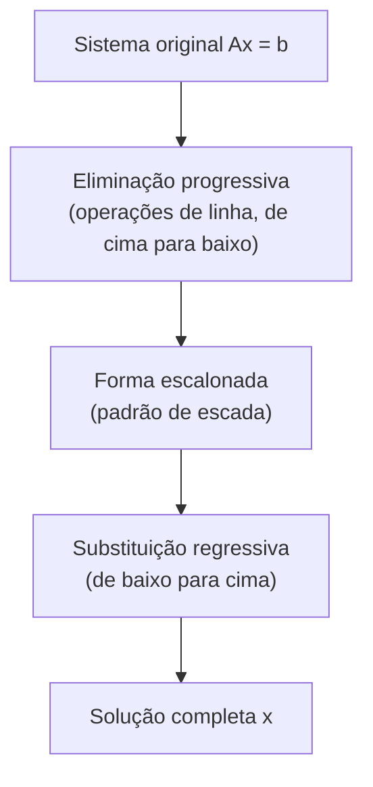

## Objetivos de Aprendizagem

- Executar eliminação progressiva em um sistema de equações lineares (ou sua matriz aumentada) para alcançar a forma escalonada, usando operações de linha que preservam o conjunto solução.
- Realizar substituição regressiva em um sistema em forma escalonada para recuperar a solução completa.
- Resolver um sistema 3×3 completamente à mão, das equações originais passando pela eliminação, forma escalonada, e substituição regressiva até a resposta final.
- Interpretar uma linha que se reduz a "0 = não zero" como prova de que o sistema não tem solução.
- Interpretar uma linha que se reduz a "0 = 0" como um sinal de uma variável livre e infinitas soluções, e explicar por que isso difere do caso sem solução.

## Contexto e Motivação

O conceito anterior estabeleceu que resolver Ax = b significa encontrar o ponto onde o hiperplano de toda equação se intercepta (a imagem por linhas), ou encontrar a combinação das colunas de A que produz b (a imagem por colunas), mas nenhuma das imagens, por si só, entrega um procedimento real para encontrar esse ponto ou essa combinação uma vez que um sistema cresce além de duas incógnitas que você consegue resolver por inspeção. A **eliminação Gaussiana** é esse procedimento: uma sequência de passos completamente mecânica e sempre terminante que recebe qualquer sistema de equações lineares e ou produz a solução exata, revela que não há nenhuma, ou revela que há infinitas, sem nenhum chute, nenhuma esperteza, e nenhuma dependência dos números particulares envolvidos.

Vale a pena levar isso a sério como mais do que "uma técnica para exercícios de casa." A eliminação Gaussiana (ou um parente numérico próximo dela) é o que roda, quase literalmente, por baixo de todo resolvedor de sistema linear de propósito geral que existe, de um cálculo manual em um sistema 3×3 até as bibliotecas numéricas (LAPACK, e tudo construído sobre ela, incluindo o módulo linalg do NumPy) que resolvem sistemas com milhões de incógnitas dentro de pipelines de computação científica e aprendizado de máquina. As diretrizes curriculares ACM/IEEE CS2013 listam esse algoritmo especificamente porque é a ponte entre a garantia teórica de que a solubilidade de um sistema linear é uma pergunta bem posta e verificável, e o fato prático de que computadores precisam de uma sequência finita real de passos aritméticos para respondê-la.

A ideia central é desarmantemente simples: pegue o sistema confuso onde toda equação envolve toda incógnita, e use operações legais (do tipo que não mudam o conjunto solução) para sistematicamente remover incógnitas das equações, uma de cada vez, até alcançar um sistema triangular onde a última equação envolve apenas uma incógnita, diretamente legível. A partir daí, trabalhe para trás, substituindo valores conhecidos subindo a cadeia até que toda incógnita esteja determinada. Essa estrutura de duas fases, eliminação progressiva, depois substituição regressiva, é exatamente o que o resto deste conceito desenvolve e treina concretamente.

## Teoria Central

### Operações elementares de linha

A eliminação Gaussiana funciona inteiramente aplicando **operações elementares de linha** às equações do sistema (equivalentemente, às linhas de sua matriz aumentada [A | b], a matriz de coeficientes com o lado direito anexado como uma coluna extra). Há exatamente três dessas operações, e cada uma é garantida a não mudar o conjunto solução do sistema:

1. **Trocar** duas equações (linhas), reordenar equações obviamente não muda quais valores satisfazem todas elas.
2. **Escalar** uma equação (linha) por uma constante não nula, multiplicar ambos os lados de uma equação verdadeira pelo mesmo número não nulo preserva exatamente quais valores a tornam verdadeira.
3. **Somar um múltiplo de uma equação (linha) a outra**, se a equação A e a equação B ambas valem, então a equação A mais qualquer múltiplo da equação B também vale; esta é a operação cavalo de batalha usada para eliminar uma variável de uma equação usando outra.

Como todo passo do algoritmo abaixo usa apenas essas três operações, o conjunto solução do sistema é garantido idêntico da primeira linha à última, a eliminação nunca inventa ou perde uma solução, apenas reescreve o sistema em uma forma onde a solução é mais fácil de ler.

### Eliminação progressiva até a forma escalonada

A fase de **eliminação progressiva** aplica a operação 3 (e, quando necessário, a operação 1) repetidamente para sistematicamente zerar coeficientes abaixo da entrada "líder" de cada linha, trabalhando da esquerda para a direita e de cima para baixo. O formato alvo é a **forma escalonada**: a primeira entrada não nula de cada linha (seu **pivô**) está estritamente à direita do pivô na linha acima dela, então o padrão de zeros líderes aumenta estritamente descendo as linhas, produzindo um formato de "escada" geral.

O procedimento mecânico, para um sistema com equações E₁, …, Eₘ:

1. Use o coeficiente líder (pivô) de E₁ para eliminar a primeira variável de toda equação abaixo dela, para cada Eᵢ (i > 1), substitua Eᵢ por Eᵢ − (aᵢ₁⁄a₁₁)E₁, o que zera o coeficiente da primeira variável em Eᵢ.
2. Mova para a segunda equação e repita: use seu pivô (agora estabelecido) para eliminar a segunda variável de toda equação abaixo *dela*.
3. Continue esse padrão descendo o sistema, em cada estágio, apenas equações abaixo da atual são tocadas, então eliminações anteriores nunca são desfeitas.

Se uma posição de pivô tem um coeficiente zero no ponto em que é necessária, troque essa linha com uma linha posterior que tenha uma entrada não nula ali (operação 1) antes de continuar, é por isso que trocas de linha fazem parte do kit de ferramentas, não apenas uma reflexão tardia.

### Substituição regressiva

Uma vez que o sistema está em forma escalonada, a **última** linha não nula envolve apenas a última incógnita (ou muito poucas), então pode ser resolvida diretamente. A **substituição regressiva** então trabalha para cima: substitua o(s) valor(es) agora conhecido(s) na equação acima, resolva para a próxima incógnita, e repita até que toda incógnita tenha sido recuperada. Esta é a imagem espelhada da eliminação progressiva, a eliminação trabalhou de cima para baixo removendo variáveis; a substituição regressiva trabalha de baixo para cima recuperando-as.



### Lendo o resultado: único, nenhum, ou infinito

Depois da eliminação, a forma escalonada revela a natureza do conjunto solução diretamente a partir do formato de suas linhas, sem precisar da substituição regressiva para descobrir qual caso se aplica:

- **Um pivô em toda coluna (da parte de coeficientes):** o sistema tem exatamente uma solução, toda incógnita é determinada pela substituição regressiva, sem ambiguidade.
- **Uma linha que se lê 0 = c para algum c não nulo** (todo coeficiente à esquerda é zero, mas o lado direito não é): esta é uma contradição direta, nenhum valor das incógnitas pode fazer "0 é igual a um número não nulo" ser verdadeiro, então o sistema **não tem solução** alguma. Geometricamente (imagem por linhas), esta é a assinatura algébrica de hiperplanos que simplesmente nunca se encontram todos em um ponto comum.
- **Uma linha que se lê 0 = 0** (ambos os lados genuinamente zero, a equação não carrega informação alguma): esta linha não é uma contradição, mas também não é uma restrição, ela sinaliza que uma das equações originais era inteiramente redundante com as outras. Qualquer variável que nunca receba um pivô como resultado se torna uma **variável livre**, permitida assumir qualquer valor, e cada escolha desse valor livre gera uma solução válida diferente, o sistema tem **infinitas soluções**, parametrizadas pela(s) variável(is) livre(s).

O contraste entre esses dois últimos casos é a distinção mais importante que este conceito estabelece: ambos envolvem uma linha de coeficientes toda zero, mas o valor que sobrevive no lado direito é toda a diferença entre "impossível" (0 = 5) e "sem informação adicional, infinitamente flexível" (0 = 0).

## Exemplos Resolvidos

### Exemplo 1 — um sistema 3×3 com solução única, resolvido completamente

**Problema:** Resolva
x + y + z = 6
2x + 3y + z = 11
x + y + 2z = 8

**Escreva a matriz aumentada** [A | b]:
[1 1 1 | 6]
[2 3 1 | 11]
[1 1 2 | 8]

**Elimine x da linha 2:** linha2 → linha2 − 2·linha1: (2−2, 3−2, 1−2 | 11−12) = (0, 1, −1 | −1).

**Elimine x da linha 3:** linha3 → linha3 − 1·linha1: (1−1, 1−1, 2−1 | 8−6) = (0, 0, 1 | 2).

Matriz atualizada (já em forma escalonada, a escada de zeros líderes é 0, 0, 0 → 1, 0 → 2, nenhuma eliminação adicional necessária já que a linha 3 já tem zeros nas primeiras duas colunas):
[1 1 1 | 6]
[0 1 −1 | −1]
[0 0 1 | 2]

**Substitua regressivamente, começando pela última linha:** a linha 3 lê z = 2.

**Substitua na linha 2:** y − z = −1 → y − 2 = −1 → y = 1.

**Substitua na linha 1:** x + y + z = 6 → x + 1 + 2 = 6 → x = 3.

**Solução:** (x, y, z) = (3, 1, 2).

**Verifique contra as três equações originais:** 3+1+2=6 ✓; 2(3)+3(1)+2=6+3+2=11 ✓; 3+1+2(2)=3+1+4=8 ✓. Uma verificação rápida com NumPy confirma sem refazer a eliminação manual:

```python
import numpy as np
A = np.array([[1,1,1],[2,3,1],[1,1,2]])
b = np.array([6,11,8])
print(np.linalg.solve(A, b))  # [3. 1. 2.]
```

### Exemplo 2 — um sistema sem solução

**Problema:** Resolva
x + 2y = 3
2x + 4y = 9

**Elimine x da linha 2:** linha2 → linha2 − 2·linha1: (2−2, 4−4 | 9−6) = (0, 0 | 3).

**Forma escalonada resultante:**
[1 2 | 3]
[0 0 | 3]

**Interprete a segunda linha:** ela lê 0x + 0y = 3, ou seja, 0 = 3, uma contradição direta, já que nenhum valor de x e y pode fazer zero ser igual a três.

**Conclusão:** o sistema **não tem solução**. Isso corresponde diretamente à imagem por linhas: dividir a segunda equação original por 2 dá x + 2y = 4,5, uma reta com a mesma inclinação da reta da primeira equação (x + 2y = 3) mas um intercepto diferente, duas retas paralelas e não coincidentes que nunca se interceptam, exatamente a assinatura geométrica do resultado algébrico "0 = não zero".

### Exemplo 3 — um sistema com infinitas soluções

**Problema:** Resolva
x + y + z = 4
2x + 2y + 2z = 8
x − y = 0

**Elimine x da linha 2:** linha2 → linha2 − 2·linha1: (2−2, 2−2, 2−2 | 8−8) = (0, 0, 0 | 0).

**Elimine x da linha 3:** linha3 → linha3 − 1·linha1: (1−1, −1−1, 0−1 | 0−4) = (0, −2, −1 | −4).

**Reordene para uma escada mais limpa** (troque a nova linha 2 e a linha 3, já que a linha 2 agora está inteiramente zero e pertence ao final):
[1 1 1 | 4]
[0 −2 −1 | −4]
[0 0 0 | 0]

**Interprete a última linha:** 0 = 0, nenhuma contradição, mas também nenhuma informação nova. Essa linha veio da segunda equação original, que era simplesmente 2× a primeira equação o tempo todo (2x+2y+2z=8 é exatamente o dobro de x+y+z=4), inteiramente redundante, não contribuindo com nada uma vez que a primeira equação já foi usada.

**Identifique a variável livre:** apenas dois pivôs existem (nas colunas para x e y), então z nunca recebe um pivô, z é a **variável livre**, permitida assumir qualquer valor real.

**Substitua regressivamente em termos de z:** a linha 2 lê −2y − z = −4, então y = (4 − z)/2 = 2 − z/2. A linha 1 lê x + y + z = 4, então x = 4 − y − z = 4 − (2 − z/2) − z = 2 − z/2.

**Conjunto solução:** (x, y, z) = (2 − t/2, 2 − t/2, t) para qualquer t ∈ ℝ, infinitas soluções, uma para cada escolha de t. Verificando t = 0 dá (2, 2, 0): 2+2+0=4 ✓, 2(2)+2(2)+2(0)=8 ✓, 2−2=0 ✓, uma solução válida, e o mesmo vale para todo outro valor de t pela mesma construção.

## Equívocos Comuns e Armadilhas

- **"A forma escalonada em si é a resposta final."** A forma escalonada apenas prepara o terreno, é o formato triangular que torna a substituição regressiva possível, não a solução em si. Parar depois da eliminação progressiva e relatar a matriz em forma escalonada como "a resposta" pula toda a segunda fase (o z=2, y=1, x=3 do Exemplo 1 todos vieram da substituição regressiva, não da matriz escalonada sozinha).
- **"Uma linha toda de zeros sempre significa que o sistema tem infinitas soluções."** Isso só é verdade quando o lado direito dessa linha também é zero. Uma linha de "0 = 3" (Exemplo 2) também é uma linha de coeficientes toda zero, mas sinaliza a conclusão oposta, nenhuma solução, não infinitas. Sempre verifique o lado direito de uma linha degenerada antes de concluir qual caso se aplica.
- **"A eliminação pode mudar quais valores resolvem o sistema, então você precisa verificar novamente com as equações originais."** As três operações elementares de linha são especificamente escolhidas porque nenhuma delas nunca muda o conjunto solução, trocar, escalar por uma constante não nula, e somar um múltiplo de uma equação a outra todas preservam exatamente quais valores satisfazem o sistema. Verificar uma resposta final contra as equações *originais* (como tanto o Exemplo 1 quanto o Exemplo 3 fazem) é boa prática para pegar deslizes de aritmética, mas não está compensando alguma falta de confiabilidade inerente ao próprio processo de eliminação.
- **"Se a eliminação exige trocar linhas, algo deu errado."** Um zero aparecendo em uma posição de pivô necessária é uma situação normal e esperada, não um erro, o conserto (trocar com uma linha inferior que tenha uma entrada não nula ali) é uma parte rotineira do algoritmo, explicitamente incluída entre as três operações legais exatamente por essa razão.

## Resumo

A eliminação Gaussiana é o algoritmo sistemático e sempre terminante para resolver Ax = b: a eliminação progressiva usa operações de linha (trocar, escalar, somar-um-múltiplo) para alcançar a forma escalonada, um formato de escada triangular, e a substituição regressiva então trabalha da linha inferior para cima recuperando o valor de toda incógnita. O formato da forma escalonada final diz imediatamente qual dos três resultados vale: um pivô em toda coluna significa uma solução única; uma linha lendo 0 = (não zero) significa que nenhuma solução existe; uma linha lendo 0 = 0 significa que pelo menos uma variável é livre, e o sistema tem infinitas soluções parametrizadas por essa liberdade. Os três exemplos resolvidos deste conceito mostram os três resultados surgindo de sistemas que parecem superficialmente similares, ressaltando que o próprio algoritmo, não a intuição sobre os números específicos, é o que os distingue de forma confiável. Este procedimento mecânico é exatamente o que todo resolvedor prático de sistema linear, à mão ou por biblioteca numérica, em última análise executa por baixo.

## Documentation Links

- [MIT 18.06SC — Syllabus (OCW)](https://www.ocw.mit.edu/courses/18-06sc-linear-algebra-fall-2011/pages/syllabus) — doc
- [ACM/IEEE CS2013 — Full Curriculum Guidelines](https://www.acm.org/binaries/content/assets/education/cs2013_web_final.pdf) — doc
