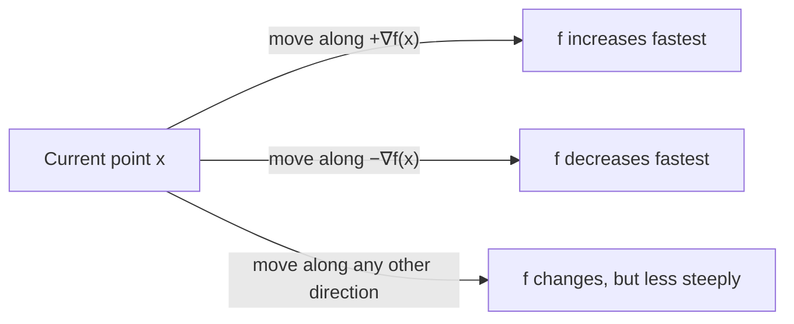

## Learning Objectives

- Describe the gradient ∇f of a function of several variables informally, as the vector collecting "how fast f changes if you nudge each variable a little," without invoking a formal limit-based derivation.
- State the gradient of a linear function f(x) = aᵀx, and explain why it is simply the constant vector a.
- State the gradient of a quadratic form f(x) = xᵀAx (for symmetric A), and connect its structure to the matrix A itself.
- Explain why the gradient points in the direction of steepest increase of f, and why the direction of steepest decrease is its negation.
- Explain why setting ∇f = 0 is the standard way to locate a function's flat points (candidate minima or maxima), and connect this to the single-variable idea of setting a derivative to zero.

## Context & Motivation

Everything in this discipline up to this point has treated a matrix as a static object — a fixed transformation, a fixed set of eigenvalues, a fixed rank. This concept introduces a genuinely different kind of question: given a function f that takes a whole vector x = (x₁, …, xₙ) as input and produces a single number as output, in which direction does x need to move to make f increase as fast as possible? Answering this is the entire basis of **optimization** — training a machine learning model by adjusting its parameters to minimize an error function, tuning a physical system's configuration to minimize energy, or fitting a line to data by minimizing squared error (the very next concept in this discipline). In every one of these settings, the object that tells you which direction to move is called the **gradient**, and it is the direct, natural generalization of a single-variable derivative to a function of several variables at once.

This discipline's scope here is deliberately narrow, following the lead of resources like Stanford's CS229 linear algebra reference, which treats this material explicitly as an extension of linear-algebra *notation* into optimization — not as a calculus course. No formal limit-based definition of a derivative is assumed or developed here; instead, the gradient is introduced directly, informally, as the vector of "sensitivities" of f to each of its input variables, and the two formulas worth memorizing (for a linear function, and for a quadratic form) are simply stated and used, because both have a genuinely clean form that connects directly back to the vectors and matrices already built up throughout this discipline. The payoff arrives immediately in the next concept: least squares, where minimizing a squared-error function by setting its gradient to zero derives one of the most widely used formulas in all of applied mathematics, the normal equations.

## Core Theory

### The gradient, informally

For a function f(x₁, x₂, …, xₙ) that takes n real numbers and returns a single real number, the **partial derivative** of f with respect to xᵢ, written ∂f/∂xᵢ, is (informally) the answer to: "if I nudge xᵢ up by a tiny amount, holding every other variable fixed, how fast does f's output change?" It is exactly the ordinary single-variable derivative of f, treating every variable except xᵢ as a constant.

The **gradient** of f, written ∇f (read "nabla f" or "grad f"), collects all n of these partial derivatives into a single vector:

∇f = (∂f/∂x₁, ∂f/∂x₂, …, ∂f/∂xₙ)

So ∇f is a vector-valued object: at any point x, ∇f(x) is a vector in ℝⁿ, one entry per input variable, each entry answering "how sensitive is f to a small nudge in this one coordinate, right here?" This is the direct, natural extension of "the derivative of a single-variable function" to a function of several variables — instead of one number (the slope), you get one number per input dimension, packaged as a vector.

### Gradient of a linear function

Let a = (a₁, …, aₙ) be a fixed vector, and consider the linear function f(x) = aᵀx = a₁x₁ + a₂x₂ + ⋯ + aₙxₙ (the dot product of a and x, written here in matrix notation). Each partial derivative is immediate: ∂f/∂xᵢ = aᵢ, since f, viewed as a function of xᵢ alone with every other variable fixed, is just aᵢxᵢ plus a constant (the other terms), and the derivative of aᵢxᵢ with respect to xᵢ is simply aᵢ. So:

∇f = a

The gradient of a linear function aᵀx is just the constant vector a itself — it does not depend on x at all, exactly mirroring the single-variable fact that the derivative of a linear function mx + b is the constant slope m, regardless of where you evaluate it.

### Gradient of a quadratic form

Let A be a symmetric n×n matrix (symmetric matters here — see the note below), and consider the **quadratic form** f(x) = xᵀAx = Σᵢ Σⱼ Aᵢⱼxᵢxⱼ. This is the natural several-variable generalization of a single-variable quadratic like f(x) = ax². Its gradient has a clean, worth-memorizing formula:

∇f = 2Ax

**Why the symmetry of A matters, and a sanity check in one dimension.** In the n = 1 case, A is just a single number a, and f(x) = ax², whose ordinary derivative is 2ax — exactly matching ∇f = 2Ax with A = a. This is the entire pattern scaled up: the "2" out front is the same "2" that appears when differentiating x² in single-variable calculus, and A plays the role the single coefficient a played before. (When A is not symmetric, the correct formula is ∇f = (A + Aᵀ)x, which reduces to 2Ax exactly when A = Aᵀ — another place, alongside diagonalization, where symmetry buys a cleaner formula for free. This discipline only uses this formula with symmetric A, so 2Ax is always the form needed here.)

### The gradient points toward steepest increase

The single most important geometric fact about the gradient — the one that makes it useful for optimization — is this: **at any point x, ∇f(x) points in the direction in which f increases fastest**, and its magnitude ‖∇f(x)‖ measures exactly how fast f increases in that direction. Equivalently, −∇f(x) points in the direction of *steepest decrease*.

This is the several-variable analogue of a familiar single-variable picture: the sign of an ordinary derivative tells you whether moving right increases or decreases the function, and its magnitude tells you how steep the change is. The gradient generalizes both pieces of information — direction and steepness — into a single vector, because with more than one input variable, "which way to move" is no longer just a left/right choice; it's a choice of direction in an n-dimensional space, and the gradient names exactly the best one.

### Setting the gradient to zero: finding flat points

In single-variable calculus, a function's minima and maxima are found among the points where its derivative is zero — the flat points, where the function is momentarily neither increasing nor decreasing. The gradient generalizes this search directly: a point x is a **critical point** of f if

∇f(x) = 0

At such a point, f is not increasing in *any* direction (since the gradient — the single vector that would point toward the direction of increase — has vanished entirely, leaving no preferred direction at all). This is exactly the condition used to search for a function's minima and maxima in several variables, and it is the central optimization idea this concept exists to set up: whenever a function needs to be minimized (or maximized), the standard first move is to compute its gradient, set it equal to the zero vector, and solve — turning an optimization problem into a system of equations, exactly the kind of problem this discipline has spent its earlier concepts building tools to solve. This is precisely the move the very next concept, least squares, makes: it minimizes a squared-error function by setting its gradient to zero, and that equation, worked out explicitly, becomes the normal equations.

## Worked Examples

### Example 1 — gradient of a linear function

**Problem:** Let a = (3, −2, 5) and f(x) = aᵀx = 3x₁ − 2x₂ + 5x₃. Find ∇f.

**Solution.** Each partial derivative reads directly off the coefficient of its variable: ∂f/∂x₁ = 3, ∂f/∂x₂ = −2, ∂f/∂x₃ = 5. So:

∇f = (3, −2, 5) = a

This confirms the general rule directly: the gradient of aᵀx is a itself, with no computation needed beyond reading off the coefficients — and notice the gradient here is a constant vector, the same at every point x, exactly as the general formula predicts.

### Example 2 — gradient of a quadratic form

**Problem:** Let A = [[2, 1], [1, 3]] (symmetric) and f(x) = xᵀAx. First, expand f(x) explicitly in terms of x₁, x₂; then find ∇f two ways — by direct partial differentiation of the expanded form, and by the formula ∇f = 2Ax — and confirm they agree.

**Expand f(x) = xᵀAx.** xᵀAx = x₁(2x₁ + 1x₂) + x₂(1x₁ + 3x₂) = 2x₁² + x₁x₂ + x₁x₂ + 3x₂² = 2x₁² + 2x₁x₂ + 3x₂².

**Partial differentiation directly.** ∂f/∂x₁ = 4x₁ + 2x₂ (differentiating 2x₁² gives 4x₁; differentiating 2x₁x₂ with respect to x₁, treating x₂ as constant, gives 2x₂; the 3x₂² term has no x₁ dependence). ∂f/∂x₂ = 2x₁ + 6x₂ (by the symmetric argument). So:

∇f = (4x₁ + 2x₂, 2x₁ + 6x₂)

**Via the formula ∇f = 2Ax.**

Ax = [[2, 1], [1, 3]]·[x₁, x₂] = (2x₁ + x₂, x₁ + 3x₂)

2Ax = (4x₁ + 2x₂, 2x₁ + 6x₂)

Both routes give the identical answer, confirming the formula. This match is exactly the payoff of stating ∇f = 2Ax as a memorized formula in the first place: for any symmetric A, the gradient of xᵀAx can be written down immediately from A, without expanding the quadratic form and differentiating term by term every single time.

### Example 3 — locating a flat point by setting the gradient to zero

**Problem:** Let f(x) = xᵀAx − bᵀx, with A = [[4, 0], [0, 2]] (symmetric) and b = (8, 4). Find the point x at which ∇f = 0.

**Compute the gradient.** The gradient of xᵀAx is 2Ax (Core Theory), and the gradient of −bᵀx is −b (by the linear-function rule, with the constant vector negated). So:

∇f = 2Ax − b

**Set ∇f = 0 and solve.**

2Ax − b = 0
2Ax = b
Ax = b/2

With A = [[4, 0], [0, 2]] and b/2 = (4, 2):

4x₁ = 4 ⟹ x₁ = 1
2x₂ = 2 ⟹ x₂ = 1

So the critical point is x = (1, 1). Because A here has positive diagonal entries and this f is exactly the kind of "bowl-shaped" quadratic that has a single lowest point, x = (1, 1) is in fact the minimum of f — though confirming that a critical point is specifically a minimum (rather than a maximum or a saddle point) in general requires checking more than just ∇f = 0, a refinement outside this concept's scope. What matters here is the mechanical pattern: minimizing a quadratic-plus-linear function reduces, via ∇f = 0, to solving a linear system — exactly the kind of system this discipline has spent many earlier concepts solving directly.

## Common Misconceptions & Pitfalls

- **"The gradient is a single number, like an ordinary derivative."** ∇f is a vector, with one entry per input variable — for a function of n variables, ∇f has n components. Treating it as a single scalar (for instance, trying to compare "the gradient" of two different points as if larger/smaller were the only comparison available) loses the directional information that is the entire point of the object.
- **"∇f = 2Ax works for any matrix A in xᵀAx, symmetric or not."** As noted in Core Theory, the clean formula ∇f = 2Ax specifically requires A = Aᵀ; for a non-symmetric A the correct gradient is (A + Aᵀ)x. This discipline only ever uses this formula with A symmetric (as covariance and normal-equation matrices always are), so the distinction is worth remembering even though it isn't exercised directly here.
- **"∇f = 0 always finds a minimum."** A vanishing gradient only identifies a *candidate* — a critical point where f is momentarily flat in every direction. That point could be a minimum, a maximum, or a saddle point (a flat point that is a minimum in some directions and a maximum in others); distinguishing between these requires additional information (in a full calculus treatment, a second-derivative or curvature test) beyond ∇f = 0 alone.
- **"Since the gradient points toward steepest increase, moving in exactly the opposite direction always immediately decreases f the most, for any step size."** The gradient describes the direction of steepest increase only for an infinitesimally small step, at the specific point where it was computed — it does not promise that moving a large step in the −∇f direction stays optimal, since the gradient itself changes as x moves. This subtlety is exactly why optimization methods based on gradients (gradient descent) take small, iterative steps rather than one large leap.

## Summary

The gradient ∇f of a function f(x₁, …, xₙ) collects its n partial derivatives — one per input variable, each measuring how sensitive f is to a small nudge in that coordinate alone — into a single vector, generalizing the single-variable derivative to several variables at once. Two formulas are worth carrying forward: the gradient of a linear function aᵀx is simply the constant vector a, and the gradient of a quadratic form xᵀAx (for symmetric A) is 2Ax, both derived here informally through direct partial differentiation rather than a formal limit definition. Geometrically, ∇f points in the direction of steepest increase of f at a given point, which is exactly why setting ∇f = 0 is the standard technique for locating a function's flat points — candidate minima and maxima — by turning an optimization question into a system of equations. This exact move, applied to a squared-error function, is what the next concept in this discipline uses to derive the normal equations for least squares.

## Documentation Links

- [Stanford CS229 — Linear Algebra Review and Reference](https://cs229.stanford.edu/section/cs229-linalg.pdf) — doc
- [MIT 18.065 — Syllabus (OCW)](https://ocw.mit.edu/courses/18-065-matrix-methods-in-data-analysis-signal-processing-and-machine-learning-spring-2018/pages/syllabus/) — doc
