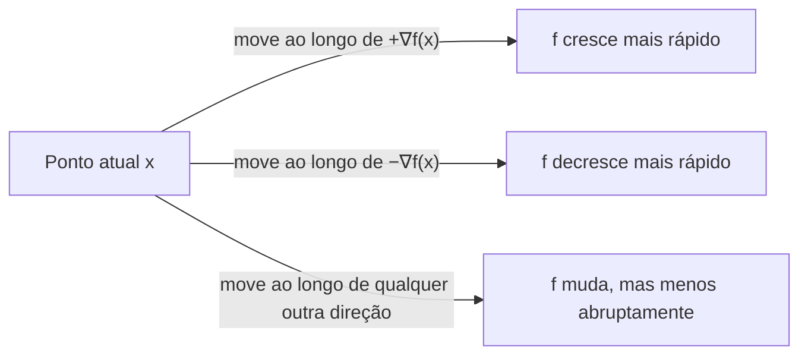

## Objetivos de Aprendizagem

- Descrever o gradiente ∇f de uma função de várias variáveis informalmente, como o vetor que coleta "quão rápido f muda se você mexer em cada variável um pouco," sem invocar uma derivação formal baseada em limites.
- Enunciar o gradiente de uma função linear f(x) = aᵀx, e explicar por que ele é simplesmente o vetor constante a.
- Enunciar o gradiente de uma forma quadrática f(x) = xᵀAx (para A simétrica), e conectar sua estrutura à própria matriz A.
- Explicar por que o gradiente aponta na direção de crescimento mais íngreme de f, e por que a direção de decrescimento mais íngreme é sua negação.
- Explicar por que igualar ∇f = 0 é a forma padrão de localizar os pontos planos de uma função (candidatos a mínimo ou máximo), e conectar isso à ideia de uma única variável de igualar uma derivada a zero.

## Contexto e Motivação

Tudo nesta disciplina até este ponto tratou uma matriz como um objeto estático, uma transformação fixa, um conjunto fixo de autovalores, um posto (rank) fixo. Este conceito introduz um tipo genuinamente diferente de pergunta: dada uma função f que recebe um vetor inteiro x = (x₁, …, xₙ) como entrada e produz um único número como saída, em qual direção x precisa se mover para fazer f crescer o mais rápido possível? Responder isso é toda a base da **otimização**, treinar um modelo de aprendizado de máquina ajustando seus parâmetros para minimizar uma função de erro, ajustar a configuração de um sistema físico para minimizar energia, ou ajustar uma reta a dados minimizando o erro quadrático (o próximo conceito exato desta disciplina). Em cada uma dessas situações, o objeto que diz em qual direção mover é chamado de **gradiente**, e é a generalização direta e natural de uma derivada de uma única variável para uma função de várias variáveis ao mesmo tempo.

O escopo desta disciplina aqui é deliberadamente estreito, seguindo a orientação de recursos como a referência de álgebra linear do CS229 de Stanford, que trata este material explicitamente como uma extensão da *notação* de álgebra linear para otimização, não como um curso de cálculo. Nenhuma definição formal de derivada baseada em limites é assumida ou desenvolvida aqui; em vez disso, o gradiente é introduzido diretamente, informalmente, como o vetor de "sensibilidades" de f a cada uma de suas variáveis de entrada, e as duas fórmulas que valem a pena memorizar (para uma função linear, e para uma forma quadrática) são simplesmente enunciadas e usadas, porque ambas têm uma forma genuinamente limpa que se conecta diretamente de volta aos vetores e matrizes já construídos ao longo desta disciplina. O retorno chega imediatamente no próximo conceito: mínimos quadrados, onde minimizar uma função de erro quadrático igualando seu gradiente a zero deriva uma das fórmulas mais amplamente usadas em toda a matemática aplicada, as equações normais.

## Teoria Central

### O gradiente, informalmente

Para uma função f(x₁, x₂, …, xₙ) que recebe n números reais e retorna um único número real, a **derivada parcial** de f em relação a xᵢ, escrita ∂f/∂xᵢ, é (informalmente) a resposta a: "se eu aumentar xᵢ por uma quantidade minúscula, mantendo toda outra variável fixa, quão rápido a saída de f muda?" É exatamente a derivada comum de uma única variável de f, tratando toda variável exceto xᵢ como uma constante.

O **gradiente** de f, escrito ∇f (lê-se "nabla f" ou "grad f"), coleta todas as n dessas derivadas parciais em um único vetor:

∇f = (∂f/∂x₁, ∂f/∂x₂, …, ∂f/∂xₙ)

Então ∇f é um objeto com valor de vetor: em qualquer ponto x, ∇f(x) é um vetor em ℝⁿ, uma entrada por variável de entrada, cada entrada respondendo "quão sensível é f a um pequeno empurrão nesta única coordenada, aqui mesmo?" Esta é a extensão direta e natural de "a derivada de uma função de uma única variável" para uma função de várias variáveis, em vez de um número (a inclinação), você obtém um número por dimensão de entrada, empacotado como um vetor.

### Gradiente de uma função linear

Seja a = (a₁, …, aₙ) um vetor fixo, e considere a função linear f(x) = aᵀx = a₁x₁ + a₂x₂ + ⋯ + aₙxₙ (o produto escalar de a e x, escrito aqui em notação matricial). Cada derivada parcial é imediata: ∂f/∂xᵢ = aᵢ, já que f, vista como uma função apenas de xᵢ com toda outra variável fixa, é apenas aᵢxᵢ mais uma constante (os outros termos), e a derivada de aᵢxᵢ em relação a xᵢ é simplesmente aᵢ. Então:

∇f = a

O gradiente de uma função linear aᵀx é apenas o vetor constante a em si, ele não depende de x de forma alguma, espelhando exatamente o fato de uma única variável de que a derivada de uma função linear mx + b é a inclinação constante m, independentemente de onde você a avalie.

### Gradiente de uma forma quadrática

Seja A uma matriz simétrica n×n (a simetria importa aqui, veja a nota abaixo), e considere a **forma quadrática** f(x) = xᵀAx = Σᵢ Σⱼ Aᵢⱼxᵢxⱼ. Esta é a generalização natural para várias variáveis de uma quadrática de uma única variável como f(x) = ax². Seu gradiente tem uma fórmula limpa, que vale a pena memorizar:

∇f = 2Ax

**Por que a simetria de A importa, e uma verificação de sanidade em uma dimensão.** No caso n = 1, A é apenas um único número a, e f(x) = ax², cuja derivada comum é 2ax, correspondendo exatamente a ∇f = 2Ax com A = a. Este é todo o padrão em escala maior: o "2" na frente é o mesmo "2" que aparece ao diferenciar x² no cálculo de uma única variável, e A desempenha o papel que o único coeficiente a desempenhava antes. (Quando A não é simétrica, a fórmula correta é ∇f = (A + Aᵀ)x, que se reduz a 2Ax exatamente quando A = Aᵀ, outro lugar, ao lado da diagonalização, onde a simetria compra uma fórmula mais limpa de graça. Esta disciplina só usa essa fórmula com A simétrica, então 2Ax é sempre a forma necessária aqui.)

### O gradiente aponta em direção ao crescimento mais íngreme

O fato geométrico mais importante sobre o gradiente, aquele que o torna útil para otimização, é este: **em qualquer ponto x, ∇f(x) aponta na direção em que f cresce mais rápido**, e sua magnitude ‖∇f(x)‖ mede exatamente quão rápido f cresce nessa direção. Equivalentemente, −∇f(x) aponta na direção do *decrescimento mais íngreme*.

Este é o análogo de várias variáveis de uma imagem familiar de uma única variável: o sinal de uma derivada comum diz se mover para a direita aumenta ou diminui a função, e sua magnitude diz quão íngreme é a mudança. O gradiente generaliza ambas as informações, direção e inclinação, em um único vetor, porque com mais de uma variável de entrada, "para qual lado se mover" não é mais apenas uma escolha esquerda/direita; é uma escolha de direção em um espaço de n dimensões, e o gradiente nomeia exatamente a melhor.

### Igualando o gradiente a zero: encontrando pontos planos

No cálculo de uma única variável, os mínimos e máximos de uma função são encontrados entre os pontos onde sua derivada é zero, os pontos planos, onde a função está momentaneamente nem crescendo nem decrescendo. O gradiente generaliza essa busca diretamente: um ponto x é um **ponto crítico** de f se

∇f(x) = 0

Nesse ponto, f não está crescendo em *nenhuma* direção (já que o gradiente, o único vetor que apontaria na direção de crescimento, desapareceu inteiramente, não deixando nenhuma direção preferida de forma alguma). Esta é exatamente a condição usada para buscar os mínimos e máximos de uma função em várias variáveis, e é a ideia central de otimização que este conceito existe para preparar: sempre que uma função precisa ser minimizada (ou maximizada), o primeiro movimento padrão é calcular seu gradiente, igualá-lo ao vetor zero, e resolver, transformando um problema de otimização em um sistema de equações, exatamente o tipo de problema para o qual esta disciplina passou seus conceitos anteriores construindo ferramentas para resolver. Este é precisamente o movimento que o próximo conceito exato, mínimos quadrados, faz: ele minimiza uma função de erro quadrático igualando seu gradiente a zero, e essa equação, resolvida explicitamente, se torna as equações normais.

## Exemplos Resolvidos

### Exemplo 1 — gradiente de uma função linear

**Problema:** Sejam a = (3, −2, 5) e f(x) = aᵀx = 3x₁ − 2x₂ + 5x₃. Encontre ∇f.

**Solução.** Cada derivada parcial é lida diretamente do coeficiente de sua variável: ∂f/∂x₁ = 3, ∂f/∂x₂ = −2, ∂f/∂x₃ = 5. Então:

∇f = (3, −2, 5) = a

Isso confirma a regra geral diretamente: o gradiente de aᵀx é a em si, sem cálculo necessário além de ler os coeficientes, e note que o gradiente aqui é um vetor constante, o mesmo em todo ponto x, exatamente como a fórmula geral prevê.

### Exemplo 2 — gradiente de uma forma quadrática

**Problema:** Seja A = [[2, 1], [1, 3]] (simétrica) e f(x) = xᵀAx. Primeiro, expanda f(x) explicitamente em termos de x₁, x₂; depois encontre ∇f de duas formas, por diferenciação parcial direta da forma expandida, e pela fórmula ∇f = 2Ax, e confirme que concordam.

**Expanda f(x) = xᵀAx.** xᵀAx = x₁(2x₁ + 1x₂) + x₂(1x₁ + 3x₂) = 2x₁² + x₁x₂ + x₁x₂ + 3x₂² = 2x₁² + 2x₁x₂ + 3x₂².

**Diferenciação parcial direta.** ∂f/∂x₁ = 4x₁ + 2x₂ (diferenciar 2x₁² dá 4x₁; diferenciar 2x₁x₂ em relação a x₁, tratando x₂ como constante, dá 2x₂; o termo 3x₂² não tem dependência de x₁). ∂f/∂x₂ = 2x₁ + 6x₂ (pelo argumento simétrico). Então:

∇f = (4x₁ + 2x₂, 2x₁ + 6x₂)

**Via a fórmula ∇f = 2Ax.**

Ax = [[2, 1], [1, 3]]·[x₁, x₂] = (2x₁ + x₂, x₁ + 3x₂)

2Ax = (4x₁ + 2x₂, 2x₁ + 6x₂)

Ambos os caminhos dão a resposta idêntica, confirmando a fórmula. Essa correspondência é exatamente o retorno de enunciar ∇f = 2Ax como uma fórmula memorizada em primeiro lugar: para qualquer A simétrica, o gradiente de xᵀAx pode ser escrito imediatamente a partir de A, sem expandir a forma quadrática e diferenciar termo por termo toda vez.

### Exemplo 3 — localizando um ponto plano igualando o gradiente a zero

**Problema:** Seja f(x) = xᵀAx − bᵀx, com A = [[4, 0], [0, 2]] (simétrica) e b = (8, 4). Encontre o ponto x no qual ∇f = 0.

**Calcule o gradiente.** O gradiente de xᵀAx é 2Ax (Teoria Central), e o gradiente de −bᵀx é −b (pela regra de função linear, com o vetor constante negado). Então:

∇f = 2Ax − b

**Iguale ∇f = 0 e resolva.**

2Ax − b = 0
2Ax = b
Ax = b/2

Com A = [[4, 0], [0, 2]] e b/2 = (4, 2):

4x₁ = 4 ⟹ x₁ = 1
2x₂ = 2 ⟹ x₂ = 1

Então o ponto crítico é x = (1, 1). Como A aqui tem entradas diagonais positivas e este f é exatamente o tipo de quadrática em "formato de tigela" que tem um único ponto mais baixo, x = (1, 1) é de fato o mínimo de f, embora confirmar que um ponto crítico é especificamente um mínimo (em vez de um máximo ou um ponto de sela) em geral exija verificar mais do que apenas ∇f = 0, um refinamento fora do escopo deste conceito. O que importa aqui é o padrão mecânico: minimizar uma função quadrática-mais-linear se reduz, via ∇f = 0, a resolver um sistema linear, exatamente o tipo de sistema que esta disciplina passou muitos conceitos anteriores resolvendo diretamente.

## Equívocos Comuns e Armadilhas

- **"O gradiente é um único número, como uma derivada comum."** ∇f é um vetor, com uma entrada por variável de entrada, para uma função de n variáveis, ∇f tem n componentes. Tratá-lo como um único escalar (por exemplo, tentar comparar "o gradiente" de dois pontos diferentes como se maior/menor fosse a única comparação disponível) perde a informação direcional que é todo o ponto do objeto.
- **"∇f = 2Ax funciona para qualquer matriz A em xᵀAx, simétrica ou não."** Como observado na Teoria Central, a fórmula limpa ∇f = 2Ax exige especificamente A = Aᵀ; para uma A não simétrica o gradiente correto é (A + Aᵀ)x. Esta disciplina só usa essa fórmula com A simétrica (como as matrizes de covariância e de equações normais sempre são), então a distinção vale a pena lembrar mesmo que não seja exercitada diretamente aqui.
- **"∇f = 0 sempre encontra um mínimo."** Um gradiente que se anula apenas identifica um *candidato*, um ponto crítico onde f está momentaneamente plana em toda direção. Esse ponto poderia ser um mínimo, um máximo, ou um ponto de sela (um ponto plano que é um mínimo em algumas direções e um máximo em outras); distinguir entre esses exige informação adicional (em um tratamento de cálculo completo, um teste de segunda derivada ou curvatura) além de apenas ∇f = 0.
- **"Já que o gradiente aponta em direção ao crescimento mais íngreme, mover-se na direção exatamente oposta sempre diminui f mais imediatamente, para qualquer tamanho de passo."** O gradiente descreve a direção de crescimento mais íngreme apenas para um passo infinitesimalmente pequeno, no ponto específico onde foi calculado, não promete que mover um passo grande na direção −∇f permanece ótimo, já que o próprio gradiente muda conforme x se move. Essa sutileza é exatamente por que métodos de otimização baseados em gradiente (descida de gradiente) dão passos pequenos e iterativos em vez de um único salto grande.

## Resumo

O gradiente ∇f de uma função f(x₁, …, xₙ) coleta suas n derivadas parciais, uma por variável de entrada, cada uma medindo quão sensível f é a um pequeno empurrão naquela coordenada isoladamente, em um único vetor, generalizando a derivada de uma única variável para várias variáveis ao mesmo tempo. Duas fórmulas valem a pena carregar adiante: o gradiente de uma função linear aᵀx é simplesmente o vetor constante a, e o gradiente de uma forma quadrática xᵀAx (para A simétrica) é 2Ax, ambas derivadas aqui informalmente por meio de diferenciação parcial direta em vez de uma definição formal baseada em limites. Geometricamente, ∇f aponta na direção de crescimento mais íngreme de f em um dado ponto, o que é exatamente por que igualar ∇f = 0 é a técnica padrão para localizar os pontos planos de uma função, candidatos a mínimo e máximo, transformando uma pergunta de otimização em um sistema de equações. Este exato movimento, aplicado a uma função de erro quadrático, é o que o próximo conceito desta disciplina usa para derivar as equações normais para mínimos quadrados.

## Documentation Links

- [Stanford CS229 — Linear Algebra Review and Reference](https://cs229.stanford.edu/section/cs229-linalg.pdf) — doc
- [MIT 18.065 — Syllabus (OCW)](https://ocw.mit.edu/courses/18-065-matrix-methods-in-data-analysis-signal-processing-and-machine-learning-spring-2018/pages/syllabus/) — doc
