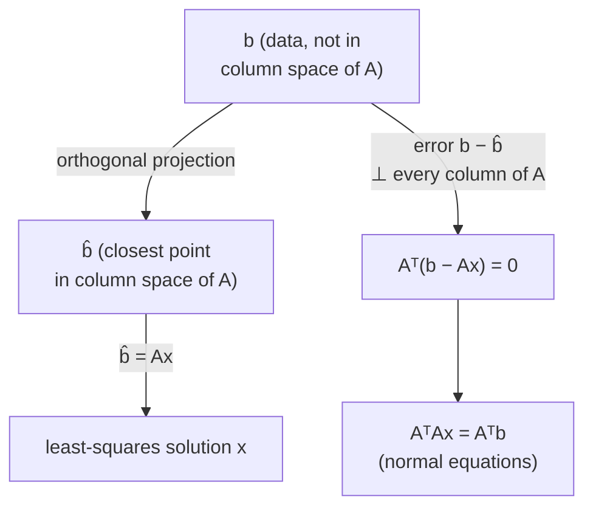

## Learning Objectives

- Explain why fitting a line (or hyperplane) to real data typically produces an inconsistent system Ax = b, with no exact solution.
- Derive the normal equations AᵀAx = Aᵀb via the geometric route: projecting b onto the column space of A to find the closest achievable vector b̂.
- Derive the same normal equations via the calculus route: minimizing ‖Ax − b‖² by setting its gradient to zero.
- Explain why both derivations arrive at the identical equation, and what that convergence reveals about the structure of the problem.
- Solve the normal equations by hand for a small dataset to find a best-fit line.

## Context & Motivation

This concept is the capstone of the whole discipline, in a very literal sense: it is the first place where a system of linear equations, column space and projection, matrix transposes, and gradients — four ideas developed separately across earlier concepts — are all needed together, at once, to solve a single, genuinely useful problem. The problem itself is one every working programmer eventually runs into: given a pile of real-world data (measurements, observations, logged values), find the straight line (or, in higher dimensions, the flat hyperplane) that best fits it. Real data essentially never lies exactly on a line — measurement noise, natural variation, and the sheer fact that there's usually more data than free parameters all guarantee that no line passes through every point exactly. In the language established early in this discipline, this means the system Ax = b encoding "find a line through all these points" is **inconsistent**: b generally does not lie in the column space of A, so no exact solution x exists.

Least squares is the precise, principled answer to what to do next: instead of giving up because no exact solution exists, find the x that gets *as close as possible* — the one minimizing the total squared error between the line's predictions and the actual data. This concept works that idea out via two genuinely different-looking routes that turn out, remarkably, to arrive at the exact same answer. The first is geometric: since b can't be reached exactly, find the closest point to b that *is* reachable — its projection onto A's column space — and solve for the x that produces that projection. The second is calculus-flavored, using the gradient machinery from the previous concept: treat the squared error ‖Ax − b‖² as a function to be minimized, and set its gradient to zero. Both paths lead to the identical equation, called the **normal equations**, and that convergence is not a coincidence — it is the satisfying, unifying payoff this entire discipline has been building toward.

## Core Theory

### The problem: Ax = b has no exact solution

Suppose you have m data points and want to fit a line y = c + mx (using c for intercept and m for slope, following the standard line-fitting notation — distinct from "m" the number of data points, so context disambiguates which is meant) through them. Each data point (xᵢ, yᵢ) contributes one equation: c + m·xᵢ = yᵢ. Collecting all m equations into matrix form:

A = [[1, x₁], [1, x₂], …, [1, xₘ]]   x_vec = (c, m)   b = (y₁, y₂, …, yₘ)

and the system is Ax_vec = b. With m > 2 data points (more equations than the two unknowns c and m), this system is **overdetermined** — generically, there is no (c, m) pair satisfying all m equations exactly, because doing so would require all m points to lie perfectly on one line, which real data essentially never does. In the language of column space and null space from earlier in this discipline: b fails to lie in the (at most 2-dimensional) column space of A, so Ax = b has no solution at all.

### Route 1 — geometric: project b onto the column space of A

Since b cannot be reached exactly, ask a different question: what is the *closest* vector to b that A can actually produce — i.e., the closest vector to b lying in A's column space? Call this closest vector b̂ (read "b-hat"). Because b̂ is the orthogonal projection of b onto the column space of A, the error vector b − b̂ is, by the defining property of an orthogonal projection, perpendicular to every vector in that column space — in particular, perpendicular to every column of A. Writing this perpendicularity condition using the dot product, for each column aⱼ of A: aⱼᵀ(b − b̂) = 0. Collecting this condition for *all* columns of A at once is exactly the matrix statement:

Aᵀ(b − b̂) = 0

Since b̂ = Ax for some x (it lies in A's column space, so it is expressible as some linear combination of A's columns, i.e., A times some vector x — this x is exactly the least-squares solution being sought), substitute:

Aᵀ(b − Ax) = 0
Aᵀb − AᵀAx = 0
AᵀAx = Aᵀb

This is the **normal equations**: a genuine system of equations in x that, unlike the original Ax = b, is guaranteed to have a solution (AᵀA is a square, symmetric matrix, and — provided A's columns are linearly independent, a condition from earlier in this discipline — AᵀA is invertible, so the normal equations solve directly as x = (AᵀA)⁻¹Aᵀb).



### Route 2 — calculus: minimize the squared error directly

A different, equally natural way to frame "the best possible x" is to directly minimize the total squared prediction error:

f(x) = ‖Ax − b‖²

This is a genuine function of the vector x — plug in any candidate x, and f(x) measures the sum of squared differences between the predictions Ax and the actual data b. Expanding it using the dot product (‖v‖² = vᵀv, from the vector-norms concept early in this discipline):

f(x) = (Ax − b)ᵀ(Ax − b) = xᵀAᵀAx − 2bᵀAx + bᵀb

Recognize the first term, xᵀ(AᵀA)x, as a quadratic form in x with (symmetric — this matters, from the previous concept's caveat) matrix AᵀA, and the middle term, −2bᵀAx, as (a constant times) a linear function of x. Applying the two gradient formulas from the previous concept — ∇(xᵀ(AᵀA)x) = 2(AᵀA)x for the quadratic term, and ∇(−2bᵀAx) = −2Aᵀb for the linear term (since bᵀAx = (Aᵀb)ᵀx is linear in x with coefficient vector Aᵀb) — and noting the constant term bᵀb contributes nothing to the gradient:

∇f = 2AᵀAx − 2Aᵀb

Setting ∇f = 0, exactly the optimization principle from the previous concept:

2AᵀAx − 2Aᵀb = 0
AᵀAx = Aᵀb

### The two routes converge — and why that matters

Both derivations — one purely geometric (project onto a column space, use perpendicularity), one purely calculus-flavored (minimize a squared error, set a gradient to zero) — arrive at the exact same equation, AᵀAx = Aᵀb. This is not a coincidence dressed up to look elegant; it reflects a single underlying fact from two angles. Geometrically, "the closest point in a subspace" and, analytically, "the point minimizing squared distance to a target" are two descriptions of the identical object — minimizing ‖Ax − b‖² over all reachable Ax *is*, by definition, finding the closest reachable point to b, which is exactly the orthogonal projection. Seeing the same normal equations fall out of both a projection argument and a calculus argument is the clearest possible confirmation that this discipline's two major threads — column spaces and projections on one hand, gradients and optimization on the other — are two languages describing the same underlying mathematics, not two unrelated toolkits that happen to share a name.

## Worked Examples

### Example 1 — fitting a best-fit line to four data points by hand

**Problem:** Fit a line y = c + mx to the four data points (0, 1), (1, 1), (2, 2), (3, 2), using the normal equations.

**Set up A, x, b.** Each point (xᵢ, yᵢ) contributes a row [1, xᵢ] to A and yᵢ to b:

A = [[1, 0], [1, 1], [1, 2], [1, 3]]   x = (c, m)   b = (1, 1, 2, 2)

**Compute Aᵀ, then AᵀA.**

Aᵀ = [[1, 1, 1, 1], [0, 1, 2, 3]]

AᵀA = [[1+1+1+1, 0+1+2+3], [0+1+2+3, 0+1+4+9]] = [[4, 6], [6, 14]]

**Compute Aᵀb.**

Aᵀb = (1·1+1·1+1·2+1·2, 0·1+1·1+2·2+3·2) = (1+1+2+2, 0+1+4+6) = (6, 11)

**Solve AᵀAx = Aᵀb, i.e., [[4, 6], [6, 14]]·(c, m) = (6, 11).**

From row 1: 4c + 6m = 6, i.e., 2c + 3m = 3.
From row 2: 6c + 14m = 11.

From the first equation, c = (3 − 3m)/2. Substitute into the second: 6·(3 − 3m)/2 + 14m = 11 → 3(3 − 3m) + 14m = 11 → 9 − 9m + 14m = 11 → 5m = 2 → m = 2/5.

Then c = (3 − 3·2/5)/2 = (3 − 6/5)/2 = (9/5)/2 = 9/10.

**Best-fit line.** y = 9/10 + (2/5)x, i.e., y = 0.9 + 0.4x.

**Sanity check against the data.** At x=0: predicted y = 0.9 (actual 1, error 0.1). At x=1: predicted 1.3 (actual 1, error −0.3). At x=2: predicted 1.7 (actual 2, error 0.3). At x=3: predicted 2.1 (actual 2, error −0.1). The errors don't vanish (as expected — the data doesn't lie exactly on any line), but the normal equations guarantee this particular line minimizes the sum of their squares among all possible lines; note the errors also very nearly cancel in sign and rough magnitude, a reflection of the same perpendicularity condition (Aᵀ(b − b̂) = 0) that derived the equations in the first place.

### Example 2 — verifying the projection interpretation numerically

**Problem:** For the fit found in Example 1, compute b̂ = Ax (the projection of b onto A's column space), and confirm Aᵀ(b − b̂) = 0 exactly.

**Compute b̂ = Ax with x = (0.9, 0.4).**

b̂ = (0.9 + 0.4·0, 0.9 + 0.4·1, 0.9 + 0.4·2, 0.9 + 0.4·3) = (0.9, 1.3, 1.7, 2.1)

**Compute the error b − b̂.**

b − b̂ = (1 − 0.9, 1 − 1.3, 2 − 1.7, 2 − 2.1) = (0.1, −0.3, 0.3, −0.1)

**Confirm perpendicularity: Aᵀ(b − b̂) should equal (0, 0).**

Row 1 of Aᵀ is (1,1,1,1): dot with (0.1, −0.3, 0.3, −0.1) = 0.1 − 0.3 + 0.3 − 0.1 = 0 ✓

Row 2 of Aᵀ is (0,1,2,3): dot with (0.1, −0.3, 0.3, −0.1) = 0·0.1 + 1·(−0.3) + 2·0.3 + 3·(−0.1) = −0.3 + 0.6 − 0.3 = 0 ✓

Both dot products vanish exactly, confirming the error vector is indeed orthogonal to both columns of A — exactly the geometric condition (Route 1) that defined b̂ as the projection of b onto A's column space, and exactly what guarantees this x is the minimizer of ‖Ax − b‖² (Route 2), independently confirming both derivations describe the identical solution.

```python
def dot(u, v):
    return sum(a*b for a, b in zip(u, v))

A_cols = [ [1,1,1,1], [0,1,2,3] ]  # column space basis: intercept column, x column
b = [1, 1, 2, 2]
x = [0.9, 0.4]

b_hat = [x[0]*A_cols[0][i] + x[1]*A_cols[1][i] for i in range(4)]
error = [b[i] - b_hat[i] for i in range(4)]

print("b_hat:", b_hat)
print("error:", error)
print("error . column1:", dot(error, A_cols[0]))
print("error . column2:", dot(error, A_cols[1]))
# both dot products print as (numerically) zero, confirming orthogonality
```

## Common Misconceptions & Pitfalls

- **"Least squares finds an exact solution to Ax = b; it's just a fancy name for solving the system."** The entire premise of least squares is that Ax = b has *no* exact solution (b lies outside A's column space) — least squares instead finds the x whose Ax comes closest to b, in the sense of minimizing squared error. If Ax = b did have an exact solution, the normal equations would simply reproduce it, but that is the special case, not the general one this technique is built for.
- **"Since b − b̂ is small in Example 2, the fit is almost exact and the normal equations barely mattered."** The error vector's *size* isn't the point — what makes it the least-squares solution is that it is *orthogonal* to A's column space, i.e., it cannot be reduced any further by nudging x, not that it happens to be numerically small for this particular dataset. A noisier dataset would produce a larger error vector that is still perfectly valid as a least-squares fit, provided it remains orthogonal to A's columns.
- **"The two derivations (projection vs. gradient) are alternative methods that happen to give similar answers."** They give the *identical* equation, AᵀAx = Aᵀb, not merely similar ones — as Core Theory explains, this is because minimizing squared distance to b and finding the closest point in a subspace to b are two descriptions of the same underlying fact, not two independent techniques that coincidentally agree.
- **"AᵀA is always invertible, so the normal equations always have a unique solution."** AᵀA is invertible exactly when A's columns are linearly independent (a condition from earlier in this discipline) — if A has redundant or dependent columns (for instance, fitting with two perfectly correlated predictor variables), AᵀA is singular, and the normal equations have either no solution or infinitely many, requiring additional techniques beyond this concept's scope to resolve.

## Summary

Fitting a line (or hyperplane) to real data almost always produces an inconsistent system Ax = b, because b generally doesn't lie in A's column space. Least squares resolves this by finding the x that comes closest, via two routes that converge on the identical answer: geometrically, project b onto A's column space to get the nearest reachable vector b̂, and use the fact that the resulting error b − b̂ is orthogonal to every column of A to derive AᵀAx = Aᵀb; analytically, minimize the squared error ‖Ax − b‖² directly by computing its gradient (using the quadratic-form and linear-function gradient rules from the previous concept) and setting it to zero, which produces the exact same equation. Both routes were worked out explicitly for a small four-point dataset, landing on the identical best-fit line y = 0.9 + 0.4x, with the resulting error vector verified to be exactly orthogonal to A's columns — the concrete confirmation that projection and gradient-based optimization are two views of one underlying idea, and the fitting close to this discipline's arc from vectors and matrices through column spaces and gradients to one genuinely useful, unifying algorithm.

## Documentation Links

- [Stanford CS229 — Linear Algebra Review and Reference](https://cs229.stanford.edu/section/cs229-linalg.pdf) — doc
- [MIT 18.06 — Course Home (OCW)](https://ocw.mit.edu/courses/18-06-linear-algebra-spring-2010/) — doc
