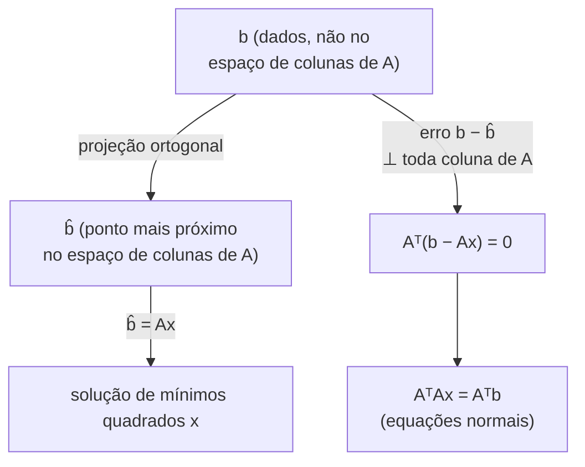

## Objetivos de Aprendizagem

- Explicar por que ajustar uma reta (ou hiperplano) a dados reais tipicamente produz um sistema Ax = b inconsistente, sem solução exata.
- Derivar as equações normais AᵀAx = Aᵀb pela rota geométrica: projetar b no espaço de colunas de A para encontrar o vetor alcançável mais próximo b̂.
- Derivar as mesmas equações normais pela rota do cálculo: minimizar ‖Ax − b‖² igualando seu gradiente a zero.
- Explicar por que ambas as derivações chegam à equação idêntica, e o que essa convergência revela sobre a estrutura do problema.
- Resolver as equações normais à mão para um pequeno conjunto de dados para encontrar uma reta de melhor ajuste.

## Contexto e Motivação

Este conceito é o ápice de toda a disciplina, em um sentido bem literal: é o primeiro lugar onde um sistema de equações lineares, espaço de colunas e projeção, transpostas de matriz, e gradientes, quatro ideias desenvolvidas separadamente em conceitos anteriores, são todas necessárias juntas, ao mesmo tempo, para resolver um único problema genuinamente útil. O problema em si é um que todo programador em atividade eventualmente encontra: dado um monte de dados do mundo real (medições, observações, valores registrados), encontre a reta (ou, em dimensões maiores, o hiperplano) que melhor se ajusta a eles. Dados reais essencialmente nunca estão exatamente sobre uma reta, ruído de medição, variação natural, e o simples fato de que geralmente há mais dados do que parâmetros livres todos garantem que nenhuma reta passa exatamente por todo ponto. Na linguagem estabelecida no início desta disciplina, isso significa que o sistema Ax = b codificando "encontre uma reta por todos esses pontos" é **inconsistente**: b geralmente não está no espaço de colunas de A, então nenhuma solução exata x existe.

Mínimos quadrados é a resposta precisa e fundamentada para o que fazer a seguir: em vez de desistir porque nenhuma solução exata existe, encontre o x que chega *o mais próximo possível*, aquele que minimiza o erro quadrático total entre as previsões da reta e os dados reais. Este conceito trabalha essa ideia por duas rotas de aparência genuinamente diferente que acabam, notavelmente, chegando à exata mesma resposta. A primeira é geométrica: já que b não pode ser alcançado exatamente, encontre o ponto mais próximo de b que *é* alcançável, sua projeção no espaço de colunas de A, e resolva para o x que produz essa projeção. A segunda tem um sabor de cálculo, usando o maquinário de gradiente do conceito anterior: trate o erro quadrático ‖Ax − b‖² como uma função a ser minimizada, e iguale seu gradiente a zero. Ambos os caminhos levam à equação idêntica, chamada de **equações normais**, e essa convergência não é uma coincidência, é o retorno satisfatório e unificador para o qual toda esta disciplina vinha se construindo.

## Teoria Central

### O problema: Ax = b não tem solução exata

Suponha que você tenha m pontos de dados e queira ajustar uma reta y = c + mx (usando c para o intercepto e m para a inclinação, seguindo a notação padrão de ajuste de reta, distinta de "m" o número de pontos de dados, então o contexto desambigua qual é qual) através deles. Cada ponto de dado (xᵢ, yᵢ) contribui uma equação: c + m·xᵢ = yᵢ. Coletando todas as m equações em forma matricial:

A = [[1, x₁], [1, x₂], …, [1, xₘ]]   x_vec = (c, m)   b = (y₁, y₂, …, yₘ)

e o sistema é Ax_vec = b. Com m > 2 pontos de dados (mais equações do que as duas incógnitas c e m), esse sistema é **sobredeterminado**, genericamente, não há par (c, m) satisfazendo todas as m equações exatamente, porque fazer isso exigiria que todos os m pontos estivessem perfeitamente sobre uma reta, o que dados reais essencialmente nunca fazem. Na linguagem do espaço de colunas e espaço nulo de anteriormente nesta disciplina: b não está no espaço de colunas (no máximo de 2 dimensões) de A, então Ax = b não tem solução alguma.

### Rota 1 — geométrica: projete b no espaço de colunas de A

Já que b não pode ser alcançado exatamente, pergunte uma questão diferente: qual é o vetor *mais próximo* de b que A pode de fato produzir, ou seja, o vetor mais próximo de b situado no espaço de colunas de A? Chame esse vetor mais próximo de b̂ (lê-se "b-chapéu"). Como b̂ é a projeção ortogonal de b no espaço de colunas de A, o vetor de erro b − b̂ é, pela propriedade definidora de uma projeção ortogonal, perpendicular a todo vetor naquele espaço de colunas, em particular, perpendicular a toda coluna de A. Escrevendo essa condição de perpendicularidade usando o produto escalar, para cada coluna aⱼ de A: aⱼᵀ(b − b̂) = 0. Coletar essa condição para *todas* as colunas de A de uma vez é exatamente a afirmação matricial:

Aᵀ(b − b̂) = 0

Como b̂ = Ax para algum x (ele está no espaço de colunas de A, então é expressável como alguma combinação linear das colunas de A, ou seja, A vezes algum vetor x, esse x é exatamente a solução de mínimos quadrados sendo buscada), substitua:

Aᵀ(b − Ax) = 0
Aᵀb − AᵀAx = 0
AᵀAx = Aᵀb

Estas são as **equações normais**: um sistema genuíno de equações em x que, ao contrário do Ax = b original, é garantido ter uma solução (AᵀA é uma matriz quadrada e simétrica, e, desde que as colunas de A sejam linearmente independentes, uma condição de anteriormente nesta disciplina, AᵀA é invertível, então as equações normais se resolvem diretamente como x = (AᵀA)⁻¹Aᵀb).



### Rota 2 — cálculo: minimize o erro quadrático diretamente

Uma forma diferente, igualmente natural, de formular "o melhor x possível" é minimizar diretamente o erro de previsão quadrático total:

f(x) = ‖Ax − b‖²

Esta é uma função genuína do vetor x, insira qualquer x candidato, e f(x) mede a soma das diferenças ao quadrado entre as previsões Ax e os dados reais b. Expandindo usando o produto escalar (‖v‖² = vᵀv, do conceito de normas de vetor no início desta disciplina):

f(x) = (Ax − b)ᵀ(Ax − b) = xᵀAᵀAx − 2bᵀAx + bᵀb

Reconheça o primeiro termo, xᵀ(AᵀA)x, como uma forma quadrática em x com matriz (simétrica, isso importa, da ressalva do conceito anterior) AᵀA, e o termo do meio, −2bᵀAx, como (uma constante vezes) uma função linear de x. Aplicando as duas fórmulas de gradiente do conceito anterior, ∇(xᵀ(AᵀA)x) = 2(AᵀA)x para o termo quadrático, e ∇(−2bᵀAx) = −2Aᵀb para o termo linear (já que bᵀAx = (Aᵀb)ᵀx é linear em x com vetor de coeficientes Aᵀb), e notando que o termo constante bᵀb não contribui nada ao gradiente:

∇f = 2AᵀAx − 2Aᵀb

Igualando ∇f = 0, exatamente o princípio de otimização do conceito anterior:

2AᵀAx − 2Aᵀb = 0
AᵀAx = Aᵀb

### As duas rotas convergem, e por que isso importa

Ambas as derivações, uma puramente geométrica (projetar sobre um espaço de colunas, usar perpendicularidade), uma com sabor puramente de cálculo (minimizar um erro quadrático, igualar um gradiente a zero), chegam à exata mesma equação, AᵀAx = Aᵀb. Isso não é uma coincidência disfarçada para parecer elegante; reflete um único fato subjacente de dois ângulos. Geometricamente, "o ponto mais próximo em um subespaço" e, analiticamente, "o ponto que minimiza a distância ao quadrado até um alvo" são duas descrições do objeto idêntico, minimizar ‖Ax − b‖² sobre todo Ax alcançável *é*, por definição, encontrar o ponto alcançável mais próximo de b, que é exatamente a projeção ortogonal. Ver as mesmas equações normais caírem tanto de um argumento de projeção quanto de um argumento de cálculo é a confirmação mais clara possível de que os dois fios principais desta disciplina, espaços de colunas e projeções de um lado, gradientes e otimização do outro, são duas linguagens descrevendo a mesma matemática subjacente, não dois kits de ferramentas não relacionados que acontecem de compartilhar um nome.

## Exemplos Resolvidos

### Exemplo 1 — ajustando uma reta de melhor ajuste a quatro pontos de dados à mão

**Problema:** Ajuste uma reta y = c + mx aos quatro pontos de dados (0, 1), (1, 1), (2, 2), (3, 2), usando as equações normais.

**Monte A, x, b.** Cada ponto (xᵢ, yᵢ) contribui uma linha [1, xᵢ] para A e yᵢ para b:

A = [[1, 0], [1, 1], [1, 2], [1, 3]]   x = (c, m)   b = (1, 1, 2, 2)

**Calcule Aᵀ, depois AᵀA.**

Aᵀ = [[1, 1, 1, 1], [0, 1, 2, 3]]

AᵀA = [[1+1+1+1, 0+1+2+3], [0+1+2+3, 0+1+4+9]] = [[4, 6], [6, 14]]

**Calcule Aᵀb.**

Aᵀb = (1·1+1·1+1·2+1·2, 0·1+1·1+2·2+3·2) = (1+1+2+2, 0+1+4+6) = (6, 11)

**Resolva AᵀAx = Aᵀb, ou seja, [[4, 6], [6, 14]]·(c, m) = (6, 11).**

Da linha 1: 4c + 6m = 6, ou seja, 2c + 3m = 3.
Da linha 2: 6c + 14m = 11.

Da primeira equação, c = (3 − 3m)/2. Substitua na segunda: 6·(3 − 3m)/2 + 14m = 11 → 3(3 − 3m) + 14m = 11 → 9 − 9m + 14m = 11 → 5m = 2 → m = 2/5.

Então c = (3 − 3·2/5)/2 = (3 − 6/5)/2 = (9/5)/2 = 9/10.

**Reta de melhor ajuste.** y = 9/10 + (2/5)x, ou seja, y = 0,9 + 0,4x.

**Verificação de sanidade contra os dados.** Em x=0: y previsto = 0,9 (real 1, erro 0,1). Em x=1: previsto 1,3 (real 1, erro −0,3). Em x=2: previsto 1,7 (real 2, erro 0,3). Em x=3: previsto 2,1 (real 2, erro −0,1). Os erros não desaparecem (como esperado, os dados não estão exatamente sobre nenhuma reta), mas as equações normais garantem que essa reta específica minimiza a soma de seus quadrados entre todas as retas possíveis; note que os erros também quase se cancelam em sinal e magnitude aproximada, um reflexo da mesma condição de perpendicularidade (Aᵀ(b − b̂) = 0) que derivou as equações em primeiro lugar.

### Exemplo 2 — verificando a interpretação de projeção numericamente

**Problema:** Para o ajuste encontrado no Exemplo 1, calcule b̂ = Ax (a projeção de b no espaço de colunas de A), e confirme Aᵀ(b − b̂) = 0 exatamente.

**Calcule b̂ = Ax com x = (0,9, 0,4).**

b̂ = (0,9 + 0,4·0, 0,9 + 0,4·1, 0,9 + 0,4·2, 0,9 + 0,4·3) = (0,9, 1,3, 1,7, 2,1)

**Calcule o erro b − b̂.**

b − b̂ = (1 − 0,9, 1 − 1,3, 2 − 1,7, 2 − 2,1) = (0,1, −0,3, 0,3, −0,1)

**Confirme perpendicularidade: Aᵀ(b − b̂) deveria ser igual a (0, 0).**

A linha 1 de Aᵀ é (1,1,1,1): ponteada com (0,1, −0,3, 0,3, −0,1) = 0,1 − 0,3 + 0,3 − 0,1 = 0 ✓

A linha 2 de Aᵀ é (0,1,2,3): ponteada com (0,1, −0,3, 0,3, −0,1) = 0·0,1 + 1·(−0,3) + 2·0,3 + 3·(−0,1) = −0,3 + 0,6 − 0,3 = 0 ✓

Ambos os produtos escalares desaparecem exatamente, confirmando que o vetor de erro é de fato ortogonal a ambas as colunas de A, exatamente a condição geométrica (Rota 1) que definiu b̂ como a projeção de b no espaço de colunas de A, e exatamente o que garante que esse x é o minimizador de ‖Ax − b‖² (Rota 2), confirmando independentemente que ambas as derivações descrevem a solução idêntica.

```python
def dot(u, v):
    return sum(a*b for a, b in zip(u, v))

A_cols = [ [1,1,1,1], [0,1,2,3] ]  # base do espaço de colunas: coluna do intercepto, coluna de x
b = [1, 1, 2, 2]
x = [0.9, 0.4]

b_hat = [x[0]*A_cols[0][i] + x[1]*A_cols[1][i] for i in range(4)]
error = [b[i] - b_hat[i] for i in range(4)]

print("b_hat:", b_hat)
print("error:", error)
print("error . column1:", dot(error, A_cols[0]))
print("error . column2:", dot(error, A_cols[1]))
# ambos os produtos escalares saem como (numericamente) zero, confirmando ortogonalidade
```

## Equívocos Comuns e Armadilhas

- **"Mínimos quadrados encontra uma solução exata para Ax = b; é só um nome chique para resolver o sistema."** Toda a premissa de mínimos quadrados é que Ax = b *não* tem solução exata (b está fora do espaço de colunas de A), mínimos quadrados em vez disso encontra o x cujo Ax chega mais perto de b, no sentido de minimizar o erro quadrático. Se Ax = b de fato tivesse uma solução exata, as equações normais simplesmente a reproduziriam, mas esse é o caso especial, não o geral para o qual essa técnica é construída.
- **"Já que b − b̂ é pequeno no Exemplo 2, o ajuste é quase exato e as equações normais quase não importaram."** O *tamanho* do vetor de erro não é o ponto, o que o torna a solução de mínimos quadrados é que ele é *ortogonal* ao espaço de colunas de A, ou seja, não pode ser reduzido mais mexendo em x, não que ele aconteça de ser numericamente pequeno para esse conjunto de dados específico. Um conjunto de dados mais ruidoso produziria um vetor de erro maior que ainda seria perfeitamente válido como um ajuste de mínimos quadrados, desde que permaneça ortogonal às colunas de A.
- **"As duas derivações (projeção vs. gradiente) são métodos alternativos que acontecem de dar respostas parecidas."** Elas dão a equação *idêntica*, AᵀAx = Aᵀb, não meramente parecidas, como a Teoria Central explica, isso é porque minimizar a distância ao quadrado até b e encontrar o ponto mais próximo em um subespaço a b são duas descrições do mesmo fato subjacente, não duas técnicas independentes que coincidentemente concordam.
- **"AᵀA é sempre invertível, então as equações normais sempre têm uma solução única."** AᵀA é invertível exatamente quando as colunas de A são linearmente independentes (uma condição de anteriormente nesta disciplina), se A tem colunas redundantes ou dependentes (por exemplo, ajustar com duas variáveis preditoras perfeitamente correlacionadas), AᵀA é singular, e as equações normais têm ou nenhuma solução ou infinitas, exigindo técnicas adicionais fora do escopo deste conceito para resolver.

## Resumo

Ajustar uma reta (ou hiperplano) a dados reais quase sempre produz um sistema inconsistente Ax = b, porque b geralmente não está no espaço de colunas de A. Mínimos quadrados resolve isso encontrando o x que chega mais perto, por duas rotas que convergem para a resposta idêntica: geometricamente, projete b no espaço de colunas de A para obter o vetor alcançável mais próximo b̂, e use o fato de que o erro resultante b − b̂ é ortogonal a toda coluna de A para derivar AᵀAx = Aᵀb; analiticamente, minimize o erro quadrático ‖Ax − b‖² diretamente calculando seu gradiente (usando as regras de gradiente de forma quadrática e função linear do conceito anterior) e igualando-o a zero, o que produz a exata mesma equação. Ambas as rotas foram trabalhadas explicitamente para um pequeno conjunto de dados de quatro pontos, chegando à reta de melhor ajuste idêntica y = 0,9 + 0,4x, com o vetor de erro resultante verificado como exatamente ortogonal às colunas de A, a confirmação concreta de que projeção e otimização baseada em gradiente são duas visões de uma ideia subjacente, e o ajuste conclui o arco desta disciplina de vetores e matrizes através de espaços de colunas e gradientes até um único algoritmo genuinamente útil e unificador.

## Documentation Links

- [Stanford CS229 — Linear Algebra Review and Reference](https://cs229.stanford.edu/section/cs229-linalg.pdf) — doc
- [MIT 18.06 — Course Home (OCW)](https://ocw.mit.edu/courses/18-06-linear-algebra-spring-2010/) — doc
