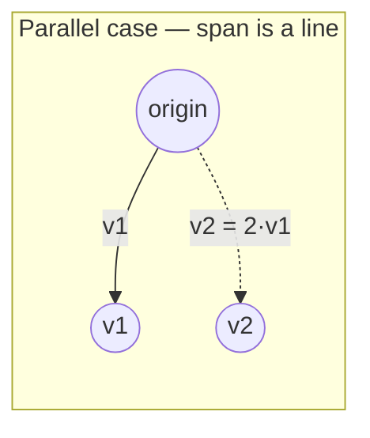
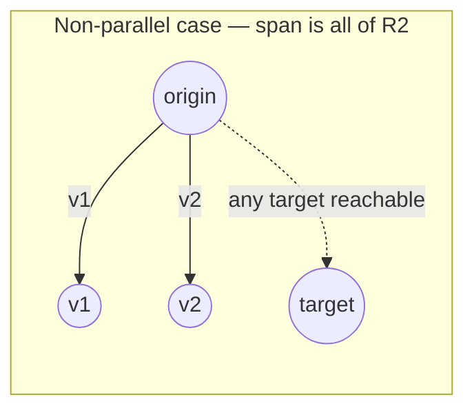

## Learning Objectives

- Compute a linear combination c₁v₁ + c₂v₂ + … + cₖvₖ of a given set of vectors for specified scalar coefficients.
- Define the span of a set of vectors as the set of all their linear combinations, and explain why span is always either a point, a line, a plane, or a higher-dimensional analog through the origin.
- Determine, for two vectors in ℝ², whether their span is a line or all of ℝ², based on whether the vectors are parallel.
- Determine whether a given target vector lies in the span of a given set of vectors by attempting to solve for the combination weights directly.
- Connect the notion of span to the question of which right-hand sides b a system of equations Ax = b can actually produce.

## Context & Motivation

Addition lets you combine two vectors into one; scalar multiplication lets you stretch a single vector. A **linear combination** simply does both at once, for as many vectors as you like: pick some scalars, scale each vector by its own scalar, and add all the results together. This sounds like a small generalization, but it is one of the two or three genuinely load-bearing ideas in this entire discipline, because it reframes a question that seems geometric — "what points can I reach?" — into a question that is directly computable — "for what scalars c₁, …, cₖ does c₁v₁ + … + cₖvₖ equal my target?"

The **span** of a set of vectors is the answer to "what points can I reach?" made precise: it is the set of *every* vector reachable as *some* linear combination of the given vectors, using any real-number scalars whatsoever. Span turns out to be exactly the right lens for understanding systems of linear equations — the next concept in this discipline shows that solving Ax = b is precisely the question of whether b lies in the span of A's columns, and if so, finding the combination weights (the entries of x) that produce it. Understanding span thoroughly here, with concrete, checkable examples, is what makes that later reframing feel inevitable rather than like a trick.

MIT's 18.06 treats span as one of the handful of ideas the entire course orbits around, precisely because it connects the "combine vectors" operations to the geometric shape of the resulting reachable set — a single nonzero vector spans a line through the origin; two non-parallel vectors in ℝ² span the entire plane; three vectors in ℝ³ that don't all lie in a common plane span all of ℝ³. The dimension of the span — how "much room" the linear combinations actually fill — becomes the single most important number attached to a set of vectors in this discipline, quietly setting up the idea of linear independence and rank that later concepts build on.

## Core Theory

### Linear combinations: definition

Given vectors v₁, v₂, …, vₖ in ℝⁿ and scalars c₁, c₂, …, cₖ ∈ ℝ, a **linear combination** of v₁, …, vₖ (with those coefficients) is the vector:

c₁v₁ + c₂v₂ + … + cₖvₖ

Each term cᵢvᵢ is a scalar multiple (from the previous concept), and the whole expression is a sum of those scaled vectors (vector addition, again from the previous concept) — a linear combination introduces no new primitive operation at all; it is purely a *name* for a specific, useful pattern of applying the two operations already defined. Every linear combination of vectors in ℝⁿ is itself a vector in ℝⁿ, since both addition and scalar multiplication stay within ℝⁿ.

Two extreme cases are worth naming explicitly: choosing all cᵢ = 0 always produces the zero vector, regardless of which vᵢ were chosen — the **trivial linear combination**. Choosing exactly one cᵢ = 1 and the rest 0 simply recovers vᵢ itself — so every one of the original vectors is trivially a linear combination of the whole set.

### Span: the set of all reachable combinations

The **span** of a set of vectors {v₁, v₂, …, vₖ} in ℝⁿ, written span{v₁, …, vₖ}, is the set of *all* vectors obtainable as *some* linear combination of v₁, …, vₖ:

span{v₁, …, vₖ} = { c₁v₁ + c₂v₂ + … + cₖvₖ : c₁, c₂, …, cₖ ∈ ℝ }

This is a set of vectors, not a single vector or a number — asking "what is the span of these vectors?" is asking for a description of an entire region of ℝⁿ, not for one answer. Because the zero-coefficient choice is always available, the zero vector 0 belongs to every span, no matter which vectors are being combined — span{v₁, …, vₖ} always contains at least the origin.

**Span of one nonzero vector.** span{v} for a single nonzero v ∈ ℝⁿ is { cv : c ∈ ℝ } — every scalar multiple of v. Geometrically this is the entire line through the origin and through the point v, since scaling v by every real number (positive, negative, zero, fractional) sweeps out exactly that line and nothing else.

**Span of two vectors in ℝ²: the parallel/non-parallel dichotomy.** This is the single most instructive case in this concept, and it splits into exactly two possibilities:

- If v₁ and v₂ are **parallel** (one is a scalar multiple of the other, v₂ = cv₁ for some c), then every linear combination c₁v₁ + c₂v₂ = c₁v₁ + c₂(cv₁) = (c₁ + c₂c)v₁ collapses to just another scalar multiple of v₁ — no matter how c₁, c₂ are chosen, the result never leaves the single line span{v₁} already sweeps out. Adding a second, parallel vector to the set contributes nothing new to the span.
- If v₁ and v₂ are **not parallel** (neither is a scalar multiple of the other), their span is *all of* ℝ² — every point in the plane is reachable as some combination c₁v₁ + c₂v₂. This is a genuine claim worth trusting concretely (Worked Example 1 verifies it directly for a specific target point), and it generalizes: any two non-parallel vectors in ℝ² form a *basis* for the plane (a term developed further in later concepts), meaning they're simultaneously enough to reach everywhere and none of them is redundant.

**General pattern.** In ℝⁿ, the span of a set of vectors is always a "flat" region through the origin — a point (span of the empty set, or of only the zero vector), a line, a plane, or a higher-dimensional analog (a *subspace*, in the vocabulary this discipline builds toward) — never a curved or bounded shape, because linear combinations only ever stretch and add, operations that can't bend a straight structure into a curve or wrap it back on itself.

### Testing whether a target vector lies in a span

Given a target vector b and a set {v₁, …, vₖ}, the question "does b ∈ span{v₁, …, vₖ}?" is exactly the question "do there exist scalars c₁, …, cₖ with c₁v₁ + … + cₖvₖ = b?" Since a vector equation in ℝⁿ unpacks into n scalar equations (one per coordinate, as established in the vectors concept), this is precisely a **system of linear equations** in the unknowns c₁, …, cₖ — the target lies in the span exactly when that system has at least one solution. This is the concrete link this concept sets up for the next: span is the *set of solvable right-hand sides*, and checking membership in a span is literally the same task as solving a linear system.

## Worked Examples

### Example 1 — confirming that two non-parallel vectors span all of ℝ²

**Problem:** Let v₁ = (1, 0) and v₂ = (1, 1). Show that an arbitrary target b = (5, 3) lies in span{v₁, v₂} by finding the coefficients explicitly.

**Set up the vector equation:** c₁(1,0) + c₂(1,1) = (5,3).

**Unpack into scalar equations** (one per coordinate): c₁ + c₂ = 5 (first component), and c₂ = 3 (second component, since the first component of v₁ contributes 0 there and v₂ contributes c₂).

**Solve:** from the second equation, c₂ = 3. Substituting into the first, c₁ + 3 = 5, so c₁ = 2.

**Verify:** 2(1,0) + 3(1,1) = (2,0) + (3,3) = (5,3). ✓ matches b exactly.

**Generalize:** because v₁ and v₂ are not parallel (v₂ is not any scalar multiple of v₁ — their ratios of components, 1:0 versus 1:1, are inconsistent), the same two-equation, two-unknown system c₁ + c₂ = b₁, c₂ = b₂ can be solved for *any* target (b₁, b₂), confirming that span{v₁, v₂} really is all of ℝ² and not merely lucky for this one choice of b.

### Example 2 — parallel vectors span only a line

**Problem:** Let v₁ = (2, 1) and v₂ = (6, 3). Determine span{v₁, v₂}, and check whether b = (5, 3) lies in it.

**Check parallelism first:** v₂ = (6,3) = 3·(2,1) = 3v₁, so v₂ is a scalar multiple of v₁ — the two vectors are parallel.

**Conclusion about the span:** by the Core Theory argument, span{v₁, v₂} collapses to span{v₁} alone — the line through the origin and (2,1), i.e., all points of the form (2t, t) for t ∈ ℝ.

**Check whether b = (5,3) lies on that line:** b would need to satisfy (5,3) = (2t, t) for some t. From the second coordinate, t = 3; substituting into the first coordinate requires 2(3) = 6, but the first coordinate of b is 5, not 6. Since 5 ≠ 6, no such t exists.

**Conclusion:** b = (5,3) is *not* in span{v₁, v₂} — this pair of vectors, despite there being two of them, can only ever reach points on a single line, and (5,3) simply isn't on it. This is the direct payoff of recognizing parallelism early: no amount of algebra searching for c₁, c₂ could ever have found a solution, because the geometry already ruled it out.

### Example 3 — a linear combination in ℝ³ and testing span membership

**Problem:** Let v₁ = (1, 1, 0), v₂ = (0, 1, 1), and b = (2, 4, 2). Determine whether b ∈ span{v₁, v₂}.

**Set up the vector equation:** c₁(1,1,0) + c₂(0,1,1) = (2,4,2), i.e., (c₁, c₁+c₂, c₂) = (2,4,2).

**Unpack into three scalar equations:** c₁ = 2 (first coordinate); c₁ + c₂ = 4 (second coordinate); c₂ = 2 (third coordinate).

**Solve using the two "isolated" equations:** c₁ = 2 and c₂ = 2 directly.

**Check consistency against the third equation:** the middle equation requires c₁ + c₂ = 4; substituting c₁ = 2, c₂ = 2 gives 2 + 2 = 4. ✓ consistent.

**Conclusion:** b ∈ span{v₁, v₂}, with b = 2v₁ + 2v₂. Note this example had *three* scalar equations but only *two* unknowns (c₁, c₂) — an overdetermined-looking system that happened to be consistent. Had the middle equation instead required, say, c₁ + c₂ = 5, the same c₁ = 2, c₂ = 2 forced by the other two equations would give 2 + 2 = 4 ≠ 5, an outright contradiction — proving that particular b would *not* lie in the span. This is exactly the kind of consistency check that systems of equations formalize fully in the next concept.

## Common Misconceptions & Pitfalls

- **"Adding more vectors to a set always makes the span bigger."** Only true if the added vector isn't already reachable as a combination of the others. Example 2 shows two vectors whose span is only a line — exactly the same as the span of either one alone — because the second vector was parallel (redundant) rather than contributing a genuinely new direction.
- **"The span of a set of vectors is the same as the set itself."** The span is (in general) infinite — every scalar multiple and combination — while the original set is just the finite list of vectors you started with. span{(1,0)} contains (1,0) itself, but also (2,0), (−5,0), (0.001,0), and every other point on that entire line; the finite generating set and its (typically infinite) span are very different objects.
- **"If a target vector b 'looks like' it should be reachable, it must be in the span."** Membership in a span is a precise algebraic fact, checked by solving the corresponding scalar equations for consistency (as in Example 3) — not a matter of visual plausibility. A target vector can look "in between" two given vectors and still fail to be in their span if the vectors are parallel (Example 2), or can look "unrelated" and still be reachable once the actual coefficients are solved for.
- **"Span always requires at least two vectors."** span is defined for any set of vectors, including a set with just one vector (spanning a line, as shown) or even the empty set (whose span, by convention, is just {0}, since there are no vectors to combine at all beyond the trivial combination that always exists). The word "span" describes an operation on however many vectors you're given, not a concept that only makes sense starting at two.

## Summary

A linear combination c₁v₁ + … + cₖvₖ is simply the pattern of scaling each of several vectors and adding the results — no new operation beyond the addition and scalar multiplication already established. The span of a set of vectors collects *every* vector reachable this way, and its shape is entirely determined by how much redundancy is present among the given vectors: a single nonzero vector spans a line; two non-parallel vectors in ℝ² span the whole plane, while two parallel vectors still only span that same line, no matter how many parallel vectors are thrown in. Testing whether a specific target vector lies in a span reduces directly to solving a system of scalar equations for the combination weights — a vector equation in ℝⁿ is n coordinate equations at once — and that reduction is exactly the bridge to the next concept, where systems of linear equations Ax = b are understood precisely as asking whether b lies in the span of A's columns.

## Documentation Links

- [MIT 18.06SC — Syllabus (OCW)](https://www.ocw.mit.edu/courses/18-06sc-linear-algebra-fall-2011/pages/syllabus) — doc
- [MIT 18.06 — Course Home (OCW)](https://ocw.mit.edu/courses/18-06-linear-algebra-spring-2010/) — doc
